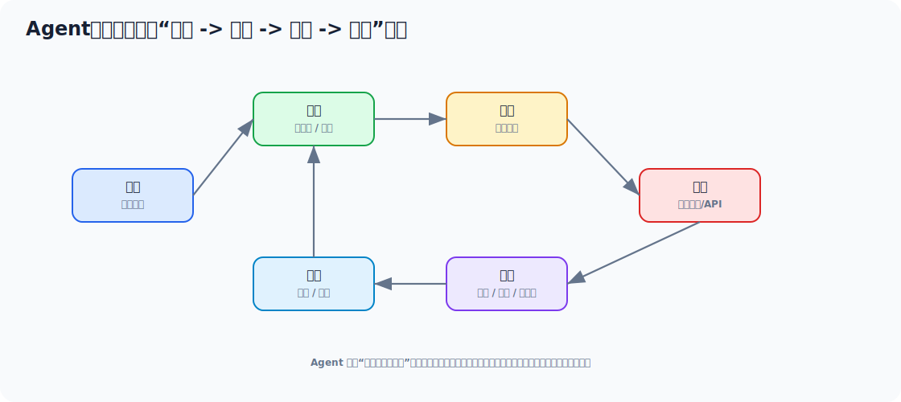

# Agent 从零学习与面试文档

> 面向没有开发过 Agent 的 Java 工程师。目标是把 Agent 和普通聊天机器人区分清楚，理解它的循环机制、工具调用、记忆、规划、权限边界，并能写出一个简单的业务 Agent。



## 目录

- [一、先用一个例子看懂 Agent](#一先用一个例子看懂-agent)
- [二、Agent 到底是什么](#二agent-到底是什么)
- [三、Agent 和普通 AI 聊天的区别](#三agent-和普通-ai-聊天的区别)
- [四、Agent 的核心循环](#四agent-的核心循环)
- [五、工具 Tool 怎么设计](#五工具-tool-怎么设计)
- [六、记忆 Memory 怎么理解](#六记忆-memory-怎么理解)
- [七、规划 Planning 怎么做](#七规划-planning-怎么做)
- [八、Java 里做一个简化 Agent](#八java-里做一个简化-agent)
- [九、Agent 的风险和生产边界](#九agent-的风险和生产边界)
- [十、学习路线和实操任务](#十学习路线和实操任务)
- [十一、面试高频回答模板](#十一面试高频回答模板)

---

## 一、先用一个例子看懂 Agent

用户说：

```text
帮我查一下订单 202605090001 的物流，如果超过 48 小时未发货就创建一个客服工单。
```

普通 AI 聊天可能只能回答一段话。  
Agent 应该能做：

1. 理解目标。
2. 识别需要查询订单。
3. 调用订单工具。
4. 判断是否超过 48 小时。
5. 如果满足条件，调用工单工具。
6. 返回执行结果。

### 1.1 简化伪代码

```java
public class CustomerServiceAgent {

    private final LlmClient llmClient;
    private final OrderTool orderTool;
    private final TicketTool ticketTool;

    public AgentResult run(String userTask) {
        AgentContext context = new AgentContext(userTask);

        for (int i = 0; i < 5; i++) {
            AgentDecision decision = llmClient.decide("""
                    你是客服任务 Agent。
                    你可以使用工具：queryOrder、createTicket。
                    请根据当前上下文决定下一步动作。

                    当前上下文：
                    %s
                    """.formatted(context.toPrompt()));

            if (decision.isFinalAnswer()) {
                return AgentResult.success(decision.finalAnswer());
            }

            ToolResult toolResult = executeTool(decision);
            context.addObservation(toolResult);
        }

        return AgentResult.failed("任务步骤过多，已停止执行");
    }

    private ToolResult executeTool(AgentDecision decision) {
        return switch (decision.toolName()) {
            case "queryOrder" -> orderTool.query(decision.arguments());
            case "createTicket" -> ticketTool.create(decision.arguments());
            default -> throw new IllegalArgumentException("未知工具");
        };
    }
}
```

这个例子说明：Agent 不是单次问答，而是一个循环：

```text
观察上下文 -> 决定下一步 -> 调工具 -> 记录结果 -> 再决定
```

---

## 二、Agent 到底是什么

Agent 可以理解为：

> 以大模型为决策核心，围绕目标自主规划步骤、调用工具、读取反馈并持续推进任务的应用系统。

它通常由这些部分组成：

| 组件 | 作用 |
| --- | --- |
| LLM | 决策和生成 |
| Tools | 外部能力，比如查库、调接口、搜索 |
| Memory | 保存上下文和历史信息 |
| Planner | 拆解任务和决定步骤 |
| Executor | 执行工具调用 |
| Guardrail | 权限、安全、边界控制 |

---

## 三、Agent 和普通 AI 聊天的区别

| 对比 | 普通聊天 | Agent |
| --- | --- | --- |
| 目标 | 回答问题 | 完成任务 |
| 步骤 | 通常一次生成 | 多轮计划和执行 |
| 外部系统 | 可不用 | 经常调用工具 |
| 状态 | 简单上下文 | 任务状态和记忆 |
| 风险 | 输出不准 | 可能执行错误动作 |

一句话：

> Chatbot 更像会聊天的人，Agent 更像能拿工具干活的人。

---

## 四、Agent 的核心循环

### 4.1 Observe

观察：

- 用户目标
- 当前上下文
- 已执行步骤
- 工具结果
- 错误信息

### 4.2 Plan

计划：

- 下一步做什么
- 用哪个工具
- 需要哪些参数

### 4.3 Act

行动：

- 调接口
- 查数据库
- 搜索文档
- 创建任务

### 4.4 Reflect

反思：

- 工具结果是否满足目标
- 是否要继续
- 是否要改计划
- 是否要停止

### 4.5 为什么要限制循环次数

因为模型可能：

- 反复调用工具
- 卡在错误状态
- 成本失控

生产上必须有：

- 最大步骤数
- 最大 token
- 最大耗时
- 工具权限边界

---

## 五、工具 Tool 怎么设计

### 5.1 工具不是随便暴露接口

工具设计要清晰：

- 名称明确
- 参数明确
- 返回结构明确
- 权限明确

### 5.2 好工具示例

```json
{
  "name": "query_order",
  "description": "根据订单号查询订单状态、支付时间、发货时间和物流单号",
  "parameters": {
    "orderNo": "string"
  }
}
```

### 5.3 坏工具示例

```json
{
  "name": "do_anything",
  "description": "执行任何业务操作"
}
```

坏在哪里：

- 权限边界不清
- 参数不清
- 风险不可控

### 5.4 工具返回值要结构化

```java
public record OrderToolResult(
        String orderNo,
        String status,
        LocalDateTime payTime,
        LocalDateTime deliveryTime,
        String logisticsNo
) {}
```

结构化结果比自然语言更适合模型继续决策。

---

## 六、记忆 Memory 怎么理解

### 6.1 短期记忆

当前任务内的上下文：

- 用户目标
- 已调用工具
- 工具结果
- 当前步骤

通常存在内存或请求上下文里。

### 6.2 长期记忆

跨会话保留的信息：

- 用户偏好
- 历史任务
- 项目知识

可以存在：

- 数据库
- Redis
- 向量库

### 6.3 记忆不是越多越好

太多记忆会：

- 污染上下文
- 增加成本
- 引入隐私风险

所以要做：

- 摘要
- 过期
- 权限隔离
- 用户可删除

---

## 七、规划 Planning 怎么做

### 7.1 简单任务可以单步规划

例如：

```text
查订单状态
```

只需要：

```text
调用 query_order -> 生成回答
```

### 7.2 复杂任务需要多步计划

例如：

```text
帮我分析这周订单异常原因，并生成处理建议。
```

可能需要：

1. 查询异常订单
2. 按原因聚合
3. 查询库存和物流异常
4. 生成分析报告

### 7.3 规划不一定完全交给模型

工程上经常用混合方式：

- 固定工作流负责主流程
- 模型负责理解和填参数

这样更可控。

---

## 八、Java 里做一个简化 Agent

### 8.1 定义工具接口

```java
public interface AgentTool {
    String name();
    ToolResult execute(Map<String, Object> args);
}
```

### 8.2 注册工具

```java
@Component
public class ToolRegistry {

    private final Map<String, AgentTool> tools;

    public ToolRegistry(List<AgentTool> toolList) {
        this.tools = toolList.stream()
                .collect(Collectors.toMap(AgentTool::name, Function.identity()));
    }

    public AgentTool get(String name) {
        AgentTool tool = tools.get(name);
        if (tool == null) {
            throw new IllegalArgumentException("未知工具：" + name);
        }
        return tool;
    }
}
```

### 8.3 执行循环

```java
public AgentResult run(String task) {
    AgentContext context = AgentContext.start(task);

    for (int step = 0; step < 6; step++) {
        AgentDecision decision = llmClient.decide(context.toPrompt());
        if (decision.finalAnswer() != null) {
            return AgentResult.success(decision.finalAnswer());
        }

        AgentTool tool = toolRegistry.get(decision.toolName());
        ToolResult result = tool.execute(decision.args());
        context.addStep(decision, result);
    }

    return AgentResult.failed("超过最大执行步数");
}
```

---

## 九、Agent 的风险和生产边界

### 9.1 不能无权限执行

所有工具调用都要校验：

- 当前用户是谁
- 是否有权限
- 是否允许执行该动作

### 9.2 高风险动作要确认

比如：

- 删除
- 退款
- 转账
- 改权限

必须二次确认或人工审批。

### 9.3 要有停止条件

包括：

- 最大步骤
- 最大耗时
- 最大成本
- 连续失败次数

### 9.4 要可追踪

记录：

- 每一步模型决策
- 工具入参
- 工具返回
- 最终输出

否则线上出了问题没法解释。

---

## 十、学习路线和实操任务

### 第 1 步：做工具调用

写 2 个工具：

- `queryOrder`
- `queryLogistics`

### 第 2 步：做决策输出

让模型输出 JSON：

```json
{
  "toolName": "queryOrder",
  "args": {
    "orderNo": "202605090001"
  }
}
```

### 第 3 步：做 Agent 循环

实现：

- 最多 5 步
- 每步记录上下文
- 工具结果进入下一轮 Prompt

### 第 4 步：加权限和审计

实现：

- 用户权限检查
- 工具白名单
- 执行日志

---

## 十一、面试高频回答模板

### 11.1 Agent 是什么

> Agent 是以大模型为决策核心，能围绕目标进行观察、规划、调用工具、接收反馈并继续执行的应用系统。它和普通聊天的区别是，Agent 更强调完成任务，而不只是生成回答。

### 11.2 Agent 有哪些核心组件

> 通常包括 LLM、工具、记忆、规划器、执行器和安全边界。LLM 负责理解和决策，工具负责连接外部系统，记忆保存上下文，安全边界控制权限和风险。

### 11.3 Agent 最大风险是什么

> 最大风险是模型输出不确定但工具执行是真实动作，所以必须限制工具权限、控制执行步数、对高风险操作做确认，并记录完整执行链路。

### 11.4 Agent 和工作流怎么取舍

> 对强流程、强合规的业务，我会优先用固定工作流，模型负责理解意图和填参数；对开放探索型任务，可以给 Agent 更多规划空间。生产系统里通常是工作流和 Agent 结合。

---

## 最后建议

Agent 不要一上来做很复杂。  
你先跑通：

```text
任务 -> 模型决定工具 -> 执行工具 -> 结果进入上下文 -> 模型继续决策
```

再逐步补权限、记忆、审计和停止条件，这样学习曲线最稳。
