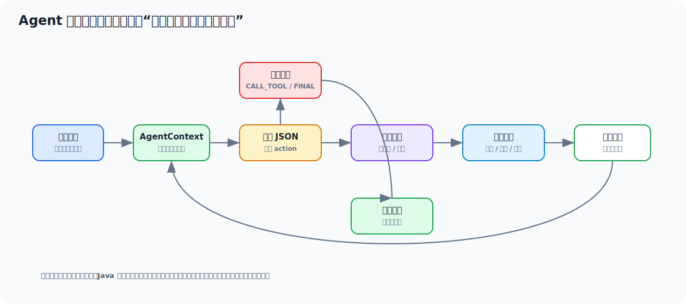
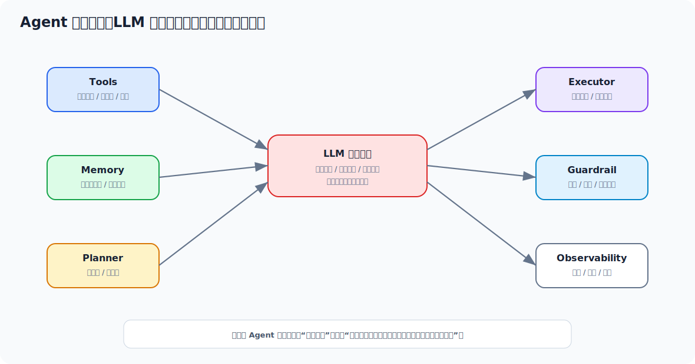
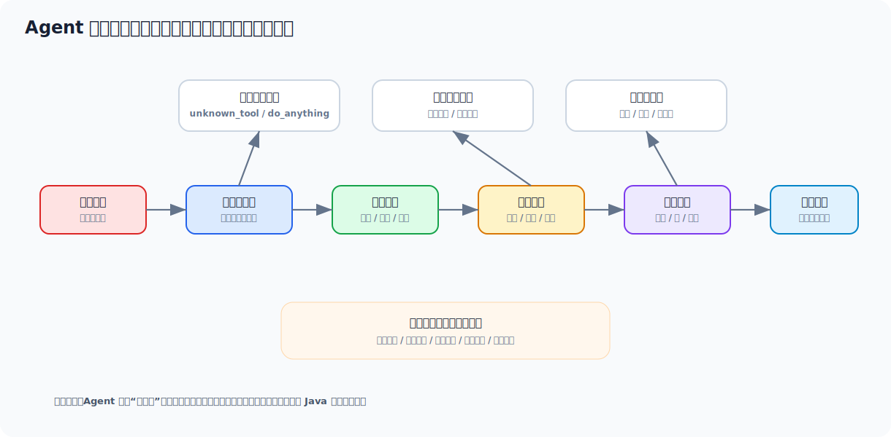
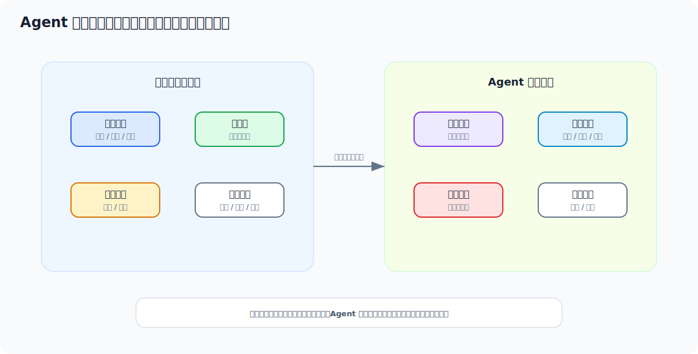

# Agent 从零学习与面试文档

> 面向没有开发过 Agent 的 Java 工程师。目标不是把 Agent 讲成玄学，而是把它拆成你熟悉的后端工程模块：任务目标、模型决策、工具注册、参数校验、循环执行、记忆、审批、安全边界和审计日志。


## 目录

- [一、先用一个例子看懂 Agent](#一先用一个例子看懂-agent)
- [二、Agent 到底是什么](#二agent-到底是什么)
- [三、Agent、Chatbot、RAG、工作流的区别](#三agentchatbotrag工作流的区别)
- [四、Agent 的核心循环](#四agent-的核心循环)
- [五、工具 Tool 怎么设计](#五工具-tool-怎么设计)
- [六、工具调用怎么做安全边界](#六工具调用怎么做安全边界)
- [七、记忆 Memory 怎么理解](#七记忆-memory-怎么理解)
- [八、规划 Planning 怎么做](#八规划-planning-怎么做)
- [九、Java 里做一个简化 Agent](#九java-里做一个简化-agent)
- [十、Agent 的生产风险和治理](#十agent-的生产风险和治理)
- [十一、从 0 到 1 的实操学习路线](#十一从-0-到-1-的实操学习路线)
- [十二、面试高频回答模板](#十二面试高频回答模板)
- [十三、快速速记](#十三快速速记)

---

## 一、先用一个例子看懂 Agent

用户说：

```text
帮我查一下订单 202605090001 的物流，如果超过 48 小时未发货就创建一个客服工单。
```

普通 AI 聊天可能只能回复一段解释。一个 Agent 应该能围绕目标连续做事：

1. 理解用户目标。
2. 识别订单号。
3. 决定先查订单。
4. 调用订单查询工具。
5. 根据订单状态决定是否查物流。
6. 判断是否超过 48 小时。
7. 如果满足条件，调用创建工单工具。
8. 汇总执行结果返回用户。

### 1.1 Agent 和普通问答的本质差异

普通问答更像：

```text
用户问一句 -> 模型答一句
```

Agent 更像：

```text
用户给目标 -> 模型决定下一步 -> 程序执行工具 -> 工具结果进入上下文 -> 模型继续决定 -> 达成目标或停止
```

### 1.2 Agent 执行链路图



### 1.3 这个例子里哪些部分由谁负责

| 环节 | 负责方 | 原因 |
| --- | --- | --- |
| 理解“查物流并可能建工单” | 模型 | 自然语言理解是模型强项 |
| 判断下一步该查订单还是建工单 | 模型 + 程序约束 | 模型做决策，程序限制可选动作 |
| 查询订单和物流 | Java 工具 | 必须访问真实业务系统 |
| 判断用户是否有权限 | Java 服务 | 权限不能交给模型 |
| 创建工单 | Java 工具 + 审批策略 | 写操作要有边界和审计 |
| 汇总执行结果 | 模型 | 模型擅长组织自然语言 |

一句话：Agent 不是“模型自己乱跑”，而是模型在你设计的工具箱和规则里推进任务。

---

## 二、Agent 到底是什么

Agent 可以理解为：

> 以大模型为决策核心，围绕用户目标自主规划步骤、调用工具、读取反馈并持续推进任务的应用系统。

它通常由这些部分组成：



| 组件 | 作用 | Java 工程类比 |
| --- | --- | --- |
| LLM | 理解目标、决定下一步、生成结果 | 决策服务 |
| Tools | 外部能力，比如查库、调接口、搜索、发消息 | Service / Client |
| Memory | 保存当前任务和历史信息 | 请求上下文、Redis、数据库 |
| Planner | 拆解任务、选择步骤 | 编排器 |
| Executor | 执行工具调用 | 调度器 |
| Guardrail | 权限、安全、停止条件、审批 | 拦截器 + 风控 |
| Observability | 记录每一步决策和工具结果 | 日志、链路追踪、审计表 |

### 2.1 Agent 最小闭环

一个最小 Agent 至少要有：

- 一个任务目标。
- 一个可用工具列表。
- 一个让模型输出下一步动作的 Prompt。
- 一个解析模型决策的程序。
- 一个工具执行器。
- 一个最大执行步数。
- 一个最终回答或停止原因。

没有工具调用和多步反馈的“Agent”，很多时候只是换了名字的聊天机器人。

### 2.2 Agent 不等于完全自动化

Agent 的自主性要分级：

| 等级 | 描述 | 适合场景 |
| --- | --- | --- |
| L1 辅助生成 | 只生成建议，不执行动作 | 文案、总结、分析 |
| L2 只读工具 | 可自动查资料、查订单、查日志 | 客服、知识库、运维助手 |
| L3 低风险写操作 | 可创建草稿、普通工单、待办 | 工单助手、办公自动化 |
| L4 高风险写操作 | 涉及退款、删除、转账、权限 | 必须审批，不建议全自动 |

生产上最稳的路线通常是从 L2 开始，不要一上来就让 Agent 自动改数据。

---

## 三、Agent、Chatbot、RAG、工作流的区别

### 3.1 四者对比

| 类型 | 主要目标 | 是否多步 | 是否调用工具 | 是否强流程 | 例子 |
| --- | --- | --- | --- | --- | --- |
| Chatbot | 回答问题 | 通常否 | 可不用 | 否 | 闲聊、解释概念 |
| RAG | 基于资料回答 | 通常一轮 | 检索工具 | 中等 | 企业知识库问答 |
| Workflow | 按固定流程执行 | 是 | 是 | 强 | 审批流、订单流转 |
| Agent | 围绕目标动态推进 | 是 | 经常是 | 可强可弱 | 自动查订单并创建工单 |

### 3.2 怎么选择

| 需求 | 推荐方案 |
| --- | --- |
| 只是让 AI 回答常见问题 | Chatbot |
| 回答必须基于企业文档 | RAG |
| 流程固定、合规要求强 | Workflow |
| 用户目标开放、步骤不固定 | Agent |
| 既要可控又要自然语言入口 | Workflow + Agent 混合 |

### 3.3 一个常见误区

很多团队一听 Agent 就想做“全自动智能员工”。这个方向很诱人，也很容易翻车。

更稳的工程路线是：

```text
先做只读 Agent -> 再做低风险写操作 -> 最后给高风险动作加人工审批
```

---

## 四、Agent 的核心循环

Agent 的核心循环可以拆成 5 个动作：

```text
Observe 观察 -> Plan 计划 -> Act 行动 -> Reflect 反思 -> Finish 完成或停止
```

### 4.1 Observe：观察上下文

观察内容包括：

- 用户目标。
- 当前执行到第几步。
- 已调用过哪些工具。
- 工具返回了什么。
- 是否出现错误。
- 是否接近成本、耗时或步数上限。

### 4.2 Plan：决定下一步

模型需要输出下一步动作。生产上不要让模型只输出自然语言，建议输出结构化 JSON：

```json
{
  "thought": "需要先查询订单状态，确认是否已经发货",
  "action": "CALL_TOOL",
  "toolName": "query_order",
  "arguments": {
    "orderNo": "202605090001"
  }
}
```

如果任务完成，则输出：

```json
{
  "thought": "订单已发货，已经拿到物流单号，可以给用户回复",
  "action": "FINAL_ANSWER",
  "finalAnswer": "订单已于 2026-05-09 18:20 发货，物流单号为 SF123456。"
}
```

### 4.3 Act：执行工具

模型不能直接执行工具。正确链路是：

```text
模型输出工具调用意图 -> Java 解析 JSON -> 校验工具白名单 -> 校验参数 -> 校验权限 -> 执行工具 -> 记录结果
```

### 4.4 Reflect：读取反馈并继续

工具结果要进入下一轮上下文：

```text
第 1 步：
动作：query_order
参数：orderNo=202605090001
结果：status=PAID, deliveryTime=null

第 2 步：
模型看到结果后决定是否 create_ticket
```

### 4.5 Finish：完成或停止

Agent 必须有停止条件：

- 任务完成。
- 达到最大步骤数。
- 达到最大耗时。
- 达到最大成本。
- 连续工具失败。
- 需要人工确认。

没有停止条件的 Agent，像没有刹车的定时任务，迟早会给你整点活。

---

## 五、工具 Tool 怎么设计

### 5.1 工具不是随便暴露接口

一个好工具要清晰：

- 名称明确。
- 描述明确。
- 参数明确。
- 返回结构明确。
- 权限明确。
- 风险等级明确。
- 幂等性明确。

### 5.2 好工具示例

```json
{
  "name": "query_order",
  "description": "根据订单号查询订单状态、支付时间、发货时间和物流单号，只能查询当前用户有权限访问的订单",
  "riskLevel": "READ_ONLY",
  "parameters": {
    "orderNo": {
      "type": "string",
      "description": "12 位数字订单号",
      "required": true
    }
  }
}
```

### 5.3 坏工具示例

```json
{
  "name": "do_anything",
  "description": "执行任何业务操作"
}
```

坏在哪里：

- 权限边界不清。
- 参数不清。
- 返回不清。
- 无法审计。
- 模型容易误用。

### 5.4 Java 工具接口

```java
public interface AgentTool {
    ToolSpec spec();

    ToolResult execute(ToolExecutionContext context, Map<String, Object> args);
}
```

```java
public record ToolSpec(
        String name,
        String description,
        RiskLevel riskLevel,
        Map<String, ToolParameter> parameters
) {}
```

```java
public enum RiskLevel {
    READ_ONLY,
    LOW_RISK_WRITE,
    HIGH_RISK_WRITE
}
```

### 5.5 查询订单工具示例

```java
@Component
public class QueryOrderTool implements AgentTool {

    private final OrderService orderService;

    @Override
    public ToolSpec spec() {
        return new ToolSpec(
                "query_order",
                "根据订单号查询订单状态、支付时间、发货时间和物流单号",
                RiskLevel.READ_ONLY,
                Map.of("orderNo", new ToolParameter("string", "12 位数字订单号", true))
        );
    }

    @Override
    public ToolResult execute(ToolExecutionContext context, Map<String, Object> args) {
        String orderNo = String.valueOf(args.get("orderNo"));
        OrderDTO order = orderService.getByOrderNo(context.userId(), orderNo);
        if (order == null) {
            return ToolResult.failed("未查询到订单，或当前用户无权访问该订单");
        }
        return ToolResult.success(Map.of(
                "orderNo", order.orderNo(),
                "status", order.status(),
                "payTime", String.valueOf(order.payTime()),
                "deliveryTime", String.valueOf(order.deliveryTime()),
                "logisticsNo", String.valueOf(order.logisticsNo())
        ));
    }
}
```

### 5.6 工具返回值要结构化

不要让工具只返回一段自然语言：

```text
订单好像还没发货，物流也没有。
```

更推荐结构化：

```json
{
  "success": true,
  "data": {
    "orderNo": "202605090001",
    "status": "PAID",
    "payTime": "2026-05-09T10:30:00",
    "deliveryTime": null,
    "logisticsNo": null
  }
}
```

结构化结果更容易让模型继续决策，也更方便审计和测试。

---

## 六、工具调用怎么做安全边界

工具调用是 Agent 最容易出事故的地方，因为模型输出是不确定的，但工具执行会影响真实系统。



### 6.1 工具调用前的 5 层校验

| 校验 | 说明 |
| --- | --- |
| 工具白名单 | 模型只能调用注册过的工具 |
| 参数格式 | 订单号、金额、ID、枚举都要校验 |
| 用户权限 | 当前用户是否能访问目标数据 |
| 风险等级 | 写操作是否需要确认或审批 |
| 幂等控制 | 创建工单、发消息等动作避免重复执行 |

### 6.2 Guard 示例

```java
@Component
public class AgentToolGuard {

    public void check(ToolExecutionContext context, AgentDecision decision, AgentTool tool) {
        ToolSpec spec = tool.spec();

        if (!spec.name().equals(decision.toolName())) {
            throw new BusinessException("工具名称不匹配");
        }
        validateRequiredArgs(spec, decision.arguments());
        validateRiskLevel(context, spec);
        validateBizArgs(decision);
    }

    private void validateRequiredArgs(ToolSpec spec, Map<String, Object> args) {
        spec.parameters().forEach((name, parameter) -> {
            if (parameter.required() && !args.containsKey(name)) {
                throw new BusinessException("缺少工具参数：" + name);
            }
        });
    }

    private void validateRiskLevel(ToolExecutionContext context, ToolSpec spec) {
        if (spec.riskLevel() == RiskLevel.HIGH_RISK_WRITE) {
            throw new NeedApprovalException("高风险工具需要人工审批：" + spec.name());
        }
        if (spec.riskLevel() == RiskLevel.LOW_RISK_WRITE && !context.allowWrite()) {
            throw new NeedConfirmException("写操作需要用户确认：" + spec.name());
        }
    }

    private void validateBizArgs(AgentDecision decision) {
        if ("query_order".equals(decision.toolName())) {
            String orderNo = String.valueOf(decision.arguments().get("orderNo"));
            if (!orderNo.matches("\\d{12}")) {
                throw new BusinessException("订单号格式错误");
            }
        }
    }
}
```

### 6.3 高风险动作处理策略

| 动作 | 策略 |
| --- | --- |
| 查询订单 | 自动执行，但必须鉴权 |
| 查询知识库 | 自动执行，但必须做权限过滤 |
| 创建普通工单 | 可自动执行，建议幂等 |
| 发送外部消息 | 用户确认后执行 |
| 退款 | 人工审批 |
| 删除数据 | 不建议 Agent 自动执行 |
| 修改权限 | 走原权限系统和审批流 |

### 6.4 幂等很重要

Agent 可能因为模型重试、网络异常、用户刷新而重复执行。写工具必须有幂等键：

```java
public record ToolExecutionContext(
        String traceId,
        String userId,
        String tenantId,
        boolean allowWrite
) {
    public String idempotentKey(String toolName, Map<String, Object> args) {
        return tenantId + ":" + userId + ":" + toolName + ":" + args.hashCode();
    }
}
```

---

## 七、记忆 Memory 怎么理解

### 7.1 短期记忆

短期记忆是当前任务内的上下文：

- 用户目标。
- 已执行步骤。
- 工具调用结果。
- 错误信息。
- 模型中间决策。

通常存在内存对象、Redis 或数据库任务表里。

### 7.2 长期记忆

长期记忆是跨会话保留的信息：

- 用户偏好。
- 历史任务摘要。
- 常用项目。
- 企业知识。

可以存在：

- MySQL。
- Redis。
- 向量库。
- 对象存储里的摘要文件。

### 7.3 Agent 上下文对象示例

```java
public class AgentContext {

    private final String taskId;
    private final String userTask;
    private final List<AgentStep> steps = new ArrayList<>();

    public static AgentContext start(String taskId, String userTask) {
        return new AgentContext(taskId, userTask);
    }

    public void addStep(AgentDecision decision, ToolResult result) {
        steps.add(new AgentStep(steps.size() + 1, decision, result, LocalDateTime.now()));
    }

    public String toPromptContext() {
        String history = steps.stream()
                .map(step -> """
                        第 %d 步：
                        决策：%s
                        工具结果：%s
                        """.formatted(step.index(), step.decision().summary(), step.result().summary()))
                .collect(Collectors.joining("\n"));

        return """
                用户目标：
                %s

                已执行步骤：
                %s
                """.formatted(userTask, history.isBlank() ? "暂无" : history);
    }
}
```

### 7.4 记忆不是越多越好

太多记忆会带来问题：

- 上下文变长，成本升高。
- 无关信息干扰模型判断。
- 历史错误可能污染当前任务。
- 隐私数据更容易泄露。

建议：

- 当前任务保留完整步骤。
- 历史任务只保留摘要。
- 敏感数据脱敏。
- 记忆设置过期时间。
- 用户可查看和删除长期记忆。

---

## 八、规划 Planning 怎么做

### 8.1 简单任务可以单步规划

例如：

```text
查一下订单状态。
```

计划通常是：

```text
调用 query_order -> 生成回答
```

### 8.2 复杂任务需要多步规划

例如：

```text
帮我分析这周订单异常原因，并生成处理建议。
```

可能需要：

1. 查询异常订单。
2. 按异常原因聚合。
3. 查询库存异常。
4. 查询物流异常。
5. 生成分析报告。

### 8.3 规划不一定完全交给模型

工程上最常见、也最稳的方式是混合模式：

```text
固定工作流控制主路径，模型负责理解意图、填参数、生成总结。
```



### 8.4 什么时候用固定工作流

适合固定工作流的场景：

- 审批流。
- 支付退款。
- 权限变更。
- 订单状态流转。
- 数据删除。
- 合规要求强的流程。

### 8.5 什么时候给 Agent 更多自由

适合 Agent 的场景：

- 查询和总结。
- 多数据源分析。
- 运维排查助手。
- 内部知识助理。
- 代码阅读助手。
- 低风险办公自动化。

---

## 九、Java 里做一个简化 Agent

### 9.1 定义决策结构

```java
public record AgentDecision(
        String thought,
        AgentAction action,
        String toolName,
        Map<String, Object> arguments,
        String finalAnswer
) {
    public boolean isFinalAnswer() {
        return action == AgentAction.FINAL_ANSWER;
    }

    public String summary() {
        return action + ":" + (toolName == null ? finalAnswer : toolName + arguments);
    }
}
```

```java
public enum AgentAction {
    CALL_TOOL,
    FINAL_ANSWER
}
```

### 9.2 注册工具

```java
@Component
public class ToolRegistry {

    private final Map<String, AgentTool> tools;

    public ToolRegistry(List<AgentTool> toolList) {
        this.tools = toolList.stream()
                .collect(Collectors.toUnmodifiableMap(tool -> tool.spec().name(), Function.identity()));
    }

    public AgentTool get(String name) {
        AgentTool tool = tools.get(name);
        if (tool == null) {
            throw new BusinessException("未知工具：" + name);
        }
        return tool;
    }

    public List<ToolSpec> specs() {
        return tools.values().stream().map(AgentTool::spec).toList();
    }
}
```

### 9.3 Agent 决策 Prompt

```text
你是客服任务 Agent。

目标：
根据用户任务，选择下一步动作，直到任务完成。

可用工具：
{tool_specs}

决策规则：
1. 你只能调用可用工具列表中的工具。
2. 每次只能选择一个动作。
3. 如果信息不足，优先调用只读工具查询。
4. 如果任务已完成，输出 FINAL_ANSWER。
5. 不要编造工具结果。
6. 高风险动作只能提出需要确认，不能假装已经执行。

当前上下文：
{agent_context}

输出 JSON，格式只能是以下两种之一：

调用工具：
{
  "thought": "为什么要调用这个工具",
  "action": "CALL_TOOL",
  "toolName": "工具名",
  "arguments": {}
}

最终回答：
{
  "thought": "为什么可以结束",
  "action": "FINAL_ANSWER",
  "finalAnswer": "给用户的回复"
}
```

### 9.4 Agent Runner

```java
@Service
public class CustomerServiceAgentRunner {

    private static final int MAX_STEPS = 6;

    private final LlmClient llmClient;
    private final ToolRegistry toolRegistry;
    private final AgentToolGuard toolGuard;
    private final AgentPromptBuilder promptBuilder;
    private final AgentDecisionParser decisionParser;
    private final AgentAuditService auditService;

    public AgentResult run(ToolExecutionContext executionContext, String userTask) {
        AgentContext agentContext = AgentContext.start(executionContext.traceId(), userTask);

        for (int step = 1; step <= MAX_STEPS; step++) {
            String prompt = promptBuilder.build(toolRegistry.specs(), agentContext);
            LlmResult llmResult = llmClient.chat(LlmChatRequest.builder()
                    .system("你是安全可控的业务 Agent，只能输出指定 JSON。")
                    .user(prompt)
                    .temperature(0.1)
                    .maxOutputTokens(600)
                    .traceId(executionContext.traceId())
                    .build());

            AgentDecision decision = decisionParser.parse(llmResult.content());
            auditService.recordDecision(executionContext, step, prompt, decision, llmResult);

            if (decision.isFinalAnswer()) {
                return AgentResult.success(decision.finalAnswer(), agentContext);
            }

            AgentTool tool = toolRegistry.get(decision.toolName());
            toolGuard.check(executionContext, decision, tool);

            ToolResult toolResult = tool.execute(executionContext, decision.arguments());
            auditService.recordToolResult(executionContext, step, decision, toolResult);
            agentContext.addStep(decision, toolResult);

            if (!toolResult.success() && shouldStopOnFailure(toolResult)) {
                return AgentResult.failed("工具调用失败，已停止执行：" + toolResult.message(), agentContext);
            }
        }

        return AgentResult.failed("任务步骤过多，已停止执行，请转人工处理", agentContext);
    }

    private boolean shouldStopOnFailure(ToolResult toolResult) {
        return toolResult.fatal();
    }
}
```

### 9.5 决策解析器

```java
@Component
public class AgentDecisionParser {

    private final ObjectMapper objectMapper;

    public AgentDecision parse(String content) {
        try {
            String json = extractJson(content);
            AgentDecision decision = objectMapper.readValue(json, AgentDecision.class);
            validate(decision);
            return decision;
        } catch (Exception e) {
            throw new BusinessException("Agent 决策不是合法 JSON", e);
        }
    }

    private void validate(AgentDecision decision) {
        if (decision.action() == null) {
            throw new IllegalArgumentException("缺少 action");
        }
        if (decision.action() == AgentAction.CALL_TOOL && decision.toolName() == null) {
            throw new IllegalArgumentException("调用工具时 toolName 不能为空");
        }
        if (decision.action() == AgentAction.FINAL_ANSWER && decision.finalAnswer() == null) {
            throw new IllegalArgumentException("最终回答不能为空");
        }
    }

    private String extractJson(String content) {
        int start = content.indexOf('{');
        int end = content.lastIndexOf('}');
        if (start < 0 || end <= start) {
            throw new IllegalArgumentException("未找到 JSON");
        }
        return content.substring(start, end + 1);
    }
}
```

### 9.6 这个简化 Agent 还缺什么

真实生产还要补：

- 流式输出。
- 异步任务。
- 人工确认。
- 多租户权限。
- 长任务恢复。
- 工具调用幂等。
- Prompt 版本管理。
- 评测集和回归测试。

---

## 十、Agent 的生产风险和治理

### 10.1 最大风险：模型说错，但工具真执行

Agent 的危险点不在“回答错一句话”，而在“错误调用工具改变了真实系统”。

治理原则：

```text
模型负责建议，程序负责裁决。
模型负责规划，工作流负责高风险动作。
模型负责表达，审计负责追踪。
```

### 10.2 必须有停止条件

至少配置：

- 最大步骤数。
- 最大耗时。
- 最大 token。
- 最大工具调用次数。
- 连续失败次数。
- 高风险动作暂停点。

### 10.3 必须可追踪

审计日志要能回答这些问题：

- 用户原始任务是什么。
- 每一步模型输出了什么决策。
- 每一步调用了哪个工具。
- 工具入参是什么。
- 工具返回是什么。
- 哪一步失败了。
- 最终为什么结束。

### 10.4 必须有评测集

Agent 的测试不能只测一个成功样例。建议准备：

- 正常订单查询。
- 订单不存在。
- 用户无权限。
- 工具超时。
- 模型输出非法工具。
- 模型输出非法 JSON。
- 重复创建工单。
- 高风险退款请求。
- Prompt 注入攻击。

### 10.5 线上排查思路

当用户说“Agent 执行错了”，按这个顺序排查：

1. 用户任务是否表达清楚。
2. Prompt 是否给了错误工具描述。
3. 模型决策 JSON 是否正确。
4. 工具参数是否解析错误。
5. 权限和风控是否漏了。
6. 工具返回是否误导模型。
7. 是否超过步骤或成本限制。

---

## 十一、从 0 到 1 的实操学习路线

### 第 1 天：先做只读工具

目标：

- 写 `queryOrder`。
- 写 `queryLogistics`。
- 工具返回结构化 JSON。
- 工具内部做用户权限校验。

### 第 2 天：让模型输出决策 JSON

目标：

- 写 Agent 决策 Prompt。
- 让模型只输出 `CALL_TOOL` 或 `FINAL_ANSWER`。
- 用 Jackson 解析和校验。

### 第 3 天：实现 Agent 循环

目标：

- 最多执行 5-6 步。
- 每一步记录 AgentContext。
- 工具结果进入下一轮 Prompt。
- 超过步数自动停止。

### 第 4 天：加安全边界

目标：

- 工具白名单。
- 参数校验。
- 用户权限校验。
- 风险等级。
- 写操作二次确认。

### 第 5 天：加审计和排障能力

目标：

- 记录每一步决策。
- 记录工具入参和结果摘要。
- 记录 Prompt 版本、模型名、token、耗时。
- 准备 20 条测试任务。

### 第 6-7 天：做一个可展示的小项目

建议项目：

```text
订单客服 Agent
```

功能清单：

- 用户输入自然语言任务。
- Agent 自动查询订单和物流。
- 满足条件时创建客服工单。
- 写操作前弹出确认。
- 页面展示每一步执行轨迹。
- 支持失败转人工。

这个项目比“能聊天”更能体现你理解 Agent 的工程本质。

---

## 十二、面试高频回答模板

### 12.1 Agent 是什么

> Agent 是以大模型为决策核心，能围绕目标进行观察、规划、调用工具、接收反馈并继续执行的应用系统。它和普通聊天机器人的区别是，Agent 更强调完成任务，而不只是生成回答。

### 12.2 Agent 有哪些核心组件

> 通常包括 LLM、工具、记忆、规划器、执行器、安全边界和可观测性。LLM 负责理解和决策，工具负责连接外部系统，记忆保存任务上下文，安全边界控制权限、审批和停止条件，审计日志用于追踪每一步。

### 12.3 Agent 最大风险是什么

> 最大风险是模型输出不确定，但工具执行会影响真实系统。所以工具调用必须由服务端执行，并且要有工具白名单、参数校验、用户权限、风险等级、幂等控制和审计日志。高风险动作不能全自动执行。

### 12.4 Agent 和工作流怎么取舍

> 强流程、强合规、高风险场景优先用固定工作流，模型负责理解意图、填参数和生成总结。开放探索型、低风险、以查询分析为主的场景可以给 Agent 更多规划空间。生产系统里通常是工作流和 Agent 混合。

### 12.5 Agent 如何做记忆

> 我会把记忆分成短期记忆和长期记忆。短期记忆保存当前任务步骤和工具结果，长期记忆保存用户偏好或历史摘要。记忆不是越多越好，要做摘要、过期、脱敏、权限隔离和用户可删除。

### 12.6 如何测试 Agent

> 我会准备任务评测集，覆盖正常链路、工具失败、权限不足、非法 JSON、非法工具、重复写操作、高风险请求和 Prompt 注入。评测时不仅看最终回答，还要看每一步工具选择、参数、停止条件和审计日志是否正确。

---

## 十三、快速速记

### 13.1 一句话理解

```text
Chatbot 是回答问题，RAG 是带资料回答，Workflow 是按流程执行，Agent 是围绕目标动态调用工具完成任务。
```

### 13.2 Agent 最小工程闭环

```text
用户目标 -> Prompt 决策 -> 解析 JSON -> 工具白名单 -> 参数和权限校验 -> 执行工具 -> 记录结果 -> 下一轮决策 -> 完成或停止
```

### 13.3 学习优先级

1. 先做只读工具。
2. 再做结构化决策。
3. 再做循环执行。
4. 再加权限和审计。
5. 最后考虑长期记忆、多 Agent 协作和复杂规划。

### 13.4 最后建议

Agent 不要一上来做很复杂。你先跑通：

```text
任务 -> 模型决定工具 -> 程序校验 -> 执行工具 -> 结果进入上下文 -> 模型继续决策
```

等这条线稳定后，再逐步补权限、记忆、审批、审计和评测。这样学起来最稳，也最像真实业务落地。
