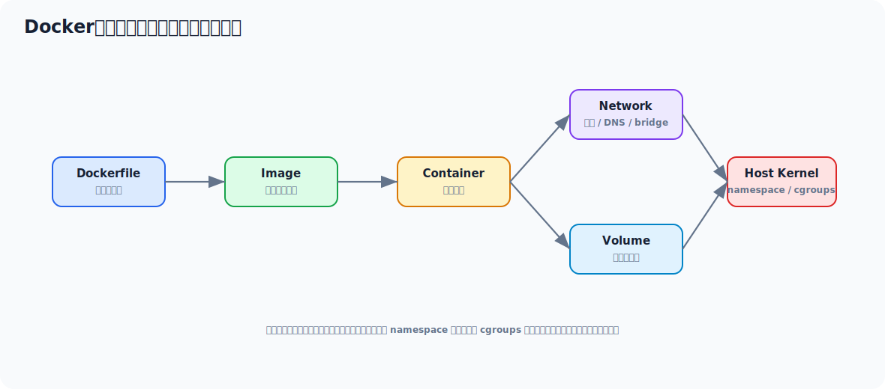

# Docker 从零学习与部署实战文档

> 面向没有系统学过 Docker 的 Java 工程师。目标是让你能理解镜像、容器、数据卷、网络、Dockerfile、Compose，并能把一个 Java 服务、Redis、MySQL、Elasticsearch 这类中间件跑起来。



## 目录

- [一、先用一个例子感受 Docker](#一先用一个例子感受-docker)
- [二、Docker 到底解决什么问题](#二docker-到底解决什么问题)
- [三、镜像、容器、仓库怎么理解](#三镜像容器仓库怎么理解)
- [四、Docker 常用命令](#四docker-常用命令)
- [五、Dockerfile 从零写 Java 服务镜像](#五dockerfile-从零写-java-服务镜像)
- [六、数据卷 Volume](#六数据卷-volume)
- [七、Docker 网络](#七docker-网络)
- [八、Docker Compose](#八docker-compose)
- [九、部署中间件实战](#九部署中间件实战)
- [十、常见问题与排查](#十常见问题与排查)
- [十一、面试高频回答模板](#十一面试高频回答模板)

---

## 一、先用一个例子感受 Docker

如果你本地没有 Redis，用传统方式要：

1. 下载 Redis。
2. 配环境。
3. 改配置。
4. 启动服务。
5. 处理端口、数据目录、日志。

用 Docker 可以直接：

```bash
docker run -d \
  --name redis-dev \
  -p 6379:6379 \
  redis:7.2
```

这条命令做了什么？

1. 如果本地没有 `redis:7.2` 镜像，就从镜像仓库拉取。
2. 用这个镜像创建一个容器。
3. 后台运行。
4. 把宿主机 `6379` 端口映射到容器 `6379`。
5. 容器名叫 `redis-dev`。

验证：

```bash
docker ps
docker exec -it redis-dev redis-cli
```

进入 Redis 后：

```bash
set name codex
get name
```

这就是 Docker 的直观价值：**把运行环境打包成镜像，把服务以容器方式跑起来，减少“我这里能跑你那里不能跑”的问题。**

---

## 二、Docker 到底解决什么问题

Docker 解决的是应用交付和运行环境一致性问题。

传统部署经常遇到：

- JDK 版本不一致
- 系统依赖不一致
- 配置散乱
- 多个中间件装在宿主机上互相影响
- 迁移机器很麻烦

Docker 的思路：

```text
应用 + 运行依赖 + 启动命令 -> 打包成镜像 -> 任意装了 Docker 的机器运行
```

### 2.1 容器不是虚拟机

虚拟机：

- 每个 VM 有完整操作系统
- 更重

容器：

- 共享宿主机内核
- 用 namespace 做隔离
- 用 cgroups 做资源限制
- 更轻量

### 2.2 Docker 对 Java 工程师的价值

1. 快速搭建开发环境。
2. 本地模拟中间件集群。
3. 统一服务打包方式。
4. 配合 CI/CD 部署。
5. 理解云原生和 Kubernetes 的基础。

---

## 三、镜像、容器、仓库怎么理解

### 3.1 镜像 Image

镜像是只读模板。  
你可以理解成：

> 一个包含应用、依赖、文件系统和启动命令的包。

比如：

- `redis:7.2`
- `mysql:8.0`
- `eclipse-temurin:17-jre`

### 3.2 容器 Container

容器是镜像运行起来后的实例。

一个镜像可以启动多个容器：

```bash
docker run --name redis-1 redis:7.2
docker run --name redis-2 redis:7.2
```

### 3.3 仓库 Registry

镜像仓库用来存镜像。

常见：

- Docker Hub
- 公司内部 Harbor
- 云厂商镜像仓库

### 3.4 镜像为什么是分层的

Docker 镜像由多层组成。  
好处：

- 复用层
- 加快构建
- 减少传输

例如 Java 服务镜像可能是：

```text
Linux 基础层
  -> JRE 层
  -> 应用 jar 层
  -> 启动命令层
```

---

## 四、Docker 常用命令

### 4.1 镜像命令

```bash
docker images
docker pull redis:7.2
docker rmi redis:7.2
docker build -t order-service:1.0 .
```

### 4.2 容器命令

```bash
docker ps
docker ps -a
docker stop redis-dev
docker start redis-dev
docker restart redis-dev
docker rm redis-dev
```

### 4.3 日志和进入容器

```bash
docker logs -f redis-dev
docker exec -it redis-dev bash
docker exec -it redis-dev sh
```

有些精简镜像没有 `bash`，用 `sh`。

### 4.4 端口映射

```bash
docker run -d -p 8080:8080 order-service:1.0
```

含义：

```text
宿主机 8080 -> 容器 8080
```

### 4.5 环境变量

```bash
docker run -d \
  -e SPRING_PROFILES_ACTIVE=prod \
  -e JAVA_OPTS="-Xms512m -Xmx512m" \
  order-service:1.0
```

---

## 五、Dockerfile 从零写 Java 服务镜像

假设你已经有：

```text
target/order-service.jar
```

Dockerfile：

```dockerfile
FROM eclipse-temurin:17-jre

WORKDIR /app

COPY target/order-service.jar /app/order-service.jar

ENV JAVA_OPTS="-Xms512m -Xmx512m"
ENV SPRING_PROFILES_ACTIVE="prod"

EXPOSE 8080

ENTRYPOINT ["sh", "-c", "java $JAVA_OPTS -jar /app/order-service.jar --spring.profiles.active=$SPRING_PROFILES_ACTIVE"]
```

构建：

```bash
docker build -t order-service:1.0 .
```

运行：

```bash
docker run -d \
  --name order-service \
  -p 8080:8080 \
  -e SPRING_PROFILES_ACTIVE=prod \
  order-service:1.0
```

查看日志：

```bash
docker logs -f order-service
```

### 5.1 为什么不用完整 JDK

运行 Java 服务只需要 JRE。  
JRE 镜像更小，攻击面更小。

### 5.2 Dockerfile 常见优化

1. 少装无用工具。
2. 固定基础镜像版本。
3. 不把密码写进镜像。
4. 日志输出到 stdout/stderr。
5. 配置用环境变量或挂载文件注入。

---

## 六、数据卷 Volume

容器删除后，容器内部写入层也会丢。  
数据库、中间件必须挂载数据卷。

### 6.1 Redis 持久化挂载示例

```bash
docker run -d \
  --name redis-dev \
  -p 6379:6379 \
  -v /data/redis:/data \
  redis:7.2 \
  redis-server --appendonly yes
```

含义：

```text
宿主机 /data/redis -> 容器 /data
```

### 6.2 什么时候用 volume

需要持久化的都要考虑：

- MySQL 数据目录
- Redis 数据目录
- Elasticsearch data
- Nginx 配置
- 应用外部配置

---

## 七、Docker 网络

### 7.1 默认 bridge 网络

容器默认接入 bridge 网络。  
容器之间如果在同一个自定义 network，可以用容器名互相访问。

### 7.2 创建网络

```bash
docker network create app-net
```

运行 MySQL：

```bash
docker run -d \
  --name mysql \
  --network app-net \
  -e MYSQL_ROOT_PASSWORD=123456 \
  mysql:8.0
```

运行应用：

```bash
docker run -d \
  --name order-service \
  --network app-net \
  -e SPRING_DATASOURCE_URL=jdbc:mysql://mysql:3306/order_db \
  order-service:1.0
```

这里应用里访问 `mysql:3306`，不是 `127.0.0.1:3306`。

### 7.3 容器里的 127.0.0.1 是谁

容器里的 `127.0.0.1` 是容器自己，不是宿主机。  
这是新手最常见坑之一。

---

## 八、Docker Compose

Compose 用来管理多容器应用。

比如一个 Java 服务依赖 MySQL 和 Redis：

```yaml
services:
  mysql:
    image: mysql:8.0
    container_name: mysql-dev
    environment:
      MYSQL_ROOT_PASSWORD: 123456
      MYSQL_DATABASE: order_db
    ports:
      - "3306:3306"
    volumes:
      - ./data/mysql:/var/lib/mysql

  redis:
    image: redis:7.2
    container_name: redis-dev
    ports:
      - "6379:6379"
    command: redis-server --appendonly yes
    volumes:
      - ./data/redis:/data

  order-service:
    image: order-service:1.0
    container_name: order-service
    depends_on:
      - mysql
      - redis
    ports:
      - "8080:8080"
    environment:
      SPRING_DATASOURCE_URL: jdbc:mysql://mysql:3306/order_db
      SPRING_REDIS_HOST: redis
```

启动：

```bash
docker compose up -d
```

查看：

```bash
docker compose ps
docker compose logs -f order-service
```

停止：

```bash
docker compose down
```

---

## 九、部署中间件实战

### 9.1 MySQL

```bash
docker run -d \
  --name mysql8 \
  -p 3306:3306 \
  -e MYSQL_ROOT_PASSWORD=123456 \
  -e MYSQL_DATABASE=demo \
  -v /data/mysql:/var/lib/mysql \
  mysql:8.0
```

### 9.2 Redis

```bash
docker run -d \
  --name redis7 \
  -p 6379:6379 \
  -v /data/redis:/data \
  redis:7.2 redis-server --appendonly yes
```

### 9.3 Nginx

```bash
docker run -d \
  --name nginx \
  -p 80:80 \
  -v /data/nginx/conf.d:/etc/nginx/conf.d \
  -v /data/nginx/html:/usr/share/nginx/html \
  nginx:1.25
```

---

## 十、常见问题与排查

### 10.1 容器启动后立刻退出

查日志：

```bash
docker logs container_name
```

常见原因：

- 启动命令错
- 配置缺失
- 端口冲突
- 权限问题

### 10.2 端口访问不了

查：

```bash
docker ps
ss -lntp
curl localhost:8080
```

重点确认：

- `-p` 是否映射
- 应用是否监听 `0.0.0.0`
- 防火墙是否放行

### 10.3 容器之间访问不了

查：

```bash
docker network ls
docker inspect container_name
```

确认：

- 是否在同一个 network
- 是否用容器名访问
- 是否误用了 `127.0.0.1`

### 10.4 数据丢了

通常是没挂载 volume。  
数据库类服务一定要挂载宿主机目录或 Docker volume。

---

## 十一、面试高频回答模板

### 11.1 Docker 和虚拟机区别

> 虚拟机包含完整操作系统，隔离更重；Docker 容器共享宿主机内核，通过 namespace 做隔离，通过 cgroups 做资源限制，所以更轻量、启动更快，更适合应用交付。

### 11.2 镜像和容器区别

> 镜像是只读模板，容器是镜像运行起来后的实例。同一个镜像可以启动多个容器，容器有自己的可写层、网络和运行状态。

### 11.3 Docker 数据怎么持久化

> 通过 volume 或 bind mount 把宿主机目录挂载到容器内。数据库、中间件的数据目录不能只放在容器写入层，否则容器删除后数据会丢。

### 11.4 Compose 解决什么问题

> Compose 用来编排多容器应用，把镜像、端口、环境变量、网络、数据卷和依赖关系写成 YAML，一条命令启动整个开发或测试环境。

---

## 最后建议

Docker 入门不要先背命令大全。  
你按这个顺序练：

```text
run 一个 Redis
  -> 写一个 Java Dockerfile
  -> 用 volume 持久化 MySQL
  -> 用 network 让容器互通
  -> 用 Compose 启动一套环境
```

这条线跑通，你就能真正开始用 Docker 做部署和本地中间件实验。
