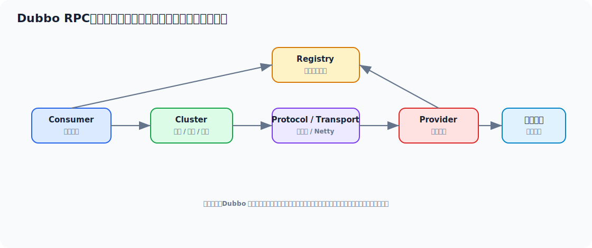

# Dubbo 面试实用学习文档

> 适合 3-5 年 Java 工程师面试冲刺。目标不是只会 `@DubboReference` 和 `@DubboService`，而是能把 RPC 调用链、注册发现、动态代理、负载均衡、容错、序列化、线程模型和服务治理讲清楚。



## 先看一个直观示例：订单服务远程调用用户服务

Dubbo 最直观的作用是：**让 Java 服务之间像调用本地接口一样调用远程服务，同时提供注册发现、负载均衡、超时、重试和服务治理能力**。

先定义一个公共 API：

```java
public interface UserQueryFacade {
    UserDTO getById(Long userId);
}
```

用户服务提供实现：

```java
@DubboService(version = "1.0.0", group = "user")
public class UserQueryFacadeImpl implements UserQueryFacade {

    private final UserMapper userMapper;

    @Override
    public UserDTO getById(Long userId) {
        User user = userMapper.selectById(userId);
        if (user == null) {
            return null;
        }
        return new UserDTO(user.getId(), user.getName(), user.getLevel());
    }
}
```

订单服务引用远程接口：

```java
@Service
public class OrderAppService {

    @DubboReference(
            version = "1.0.0",
            group = "user",
            timeout = 1500,
            retries = 0,
            check = false
    )
    private UserQueryFacade userQueryFacade;

    public OrderPreviewVO preview(Long userId, Long skuId) {
        UserDTO user = userQueryFacade.getById(userId);
        if (user == null) {
            throw new BusinessException("用户不存在");
        }
        return new OrderPreviewVO(user.name(), skuId);
    }
}
```

配置注册中心：

```yaml
dubbo:
  application:
    name: order-service
  registry:
    address: zookeeper://127.0.0.1:2181
  protocol:
    name: dubbo
    port: 20880
  consumer:
    timeout: 1500
    retries: 0
```

这个例子里 Dubbo 做了这些事：

1. Provider 把 `UserQueryFacade` 注册到注册中心。
2. Consumer 从注册中心订阅可用 Provider 地址。
3. `@DubboReference` 注入的是代理对象。
4. 调用接口时，代理会完成序列化、网络发送、负载均衡和结果反序列化。
5. 写类或敏感接口通常不建议盲目重试，所以示例里 `retries = 0`。

## 目录

- [一、Dubbo 面试主线](#一dubbo-面试主线)
- [二、Dubbo 到底解决什么问题](#二dubbo-到底解决什么问题)
- [三、Dubbo 核心架构](#三dubbo-核心架构)
- [四、一次 RPC 调用发生了什么](#四一次-rpc-调用发生了什么)
- [五、注册发现、路由与负载均衡](#五注册发现路由与负载均衡)
- [六、集群容错与重试策略](#六集群容错与重试策略)
- [七、序列化、协议与线程模型](#七序列化协议与线程模型)
- [八、高级用法与服务治理](#八高级用法与服务治理)
- [九、常见线上问题与排查](#九常见线上问题与排查)
- [十、面试高频回答模板](#十面试高频回答模板)

---

## 一、Dubbo 面试主线

常见追问链路：

```text
为什么用 Dubbo
  -> RPC 和 HTTP 有什么区别
  -> Dubbo 调用链怎么走
  -> 服务怎么注册发现
  -> 负载均衡和容错怎么做
  -> 超时重试有什么风险
  -> 序列化和协议怎么选
  -> 泛化调用、灰度、分组、版本怎么用
  -> 调用慢、线程池满、服务找不到怎么排查
```

Dubbo 面试要避免只背组件名，核心是讲清：  
**接口调用如何变成一次跨进程网络调用。**

---

## 二、Dubbo 到底解决什么问题

Dubbo 是高性能 Java RPC 框架，主要解决：

1. 接口级远程调用
2. 服务注册与发现
3. 负载均衡
4. 集群容错
5. 服务治理
6. 高性能序列化和网络通信

### 2.1 Dubbo 和 HTTP/Feign 的区别

| 对比项 | Dubbo | HTTP/Feign |
| --- | --- | --- |
| 定位 | RPC 框架 | HTTP 客户端封装 |
| 接口形式 | Java 接口调用体验强 | REST/HTTP 风格 |
| 协议 | Dubbo 等二进制协议 | HTTP |
| 性能 | 通常更偏高性能内部调用 | 通用性强 |
| 治理能力 | RPC 治理能力丰富 | 依赖 Spring Cloud 生态 |

不要简单说“Dubbo 一定比 HTTP 快”。更准确是：

> Dubbo 更适合内部服务间的接口级高性能调用，HTTP 更通用、跨语言和开放 API 友好。选型看系统边界、治理体系和团队生态。

---

## 三、Dubbo 核心架构

核心角色：

| 角色 | 职责 |
| --- | --- |
| Provider | 暴露服务 |
| Consumer | 调用服务 |
| Registry | 注册发现 |
| Monitor | 统计监控 |
| Container | 服务运行容器 |

核心抽象：

- Proxy：动态代理
- Invoker：可执行调用体
- Protocol：协议暴露与引用
- Cluster：集群容错
- Directory：服务列表目录
- Router：路由过滤
- LoadBalance：负载均衡
- Filter：调用过滤器链

面试里能说出 `Invoker` 很加分。  
它是 Dubbo 调用模型里的核心抽象，可以理解成“一个可执行的远程调用对象”。

---

## 四、一次 RPC 调用发生了什么

### 4.1 高层链路

```text
Consumer 调接口
  -> 动态代理拦截
  -> Cluster 选择可用 Invoker
  -> Router 过滤
  -> LoadBalance 选 Provider
  -> Filter 链
  -> 序列化
  -> 网络发送
  -> Provider 反序列化
  -> 调用真实实现
  -> 返回结果
```

### 4.2 为什么接口能像本地一样调用

因为 Consumer 注入的不是远程对象本体，而是代理对象。  
代理对象把方法名、参数类型、参数值等封装成 RPC 请求，再通过网络发给 Provider。

### 4.3 Filter 链能做什么

常见：

- 日志
- 鉴权
- Trace
- 限流
- 上下文透传

这和 Spring AOP 有相似思想，但落在 RPC 调用链上。

---

## 五、注册发现、路由与负载均衡

### 5.1 注册发现过程

Provider 启动：

1. 暴露本地服务
2. 向注册中心注册地址

Consumer 启动：

1. 订阅服务地址
2. 本地缓存 Provider 列表
3. 地址变化时收到推送或重新拉取

### 5.2 路由 Router

路由解决：

- 哪些 Provider 可以参与调用

常见场景：

- 灰度
- 标签路由
- 机房路由
- 黑白名单

### 5.3 负载均衡 LoadBalance

常见策略：

- Random
- RoundRobin
- LeastActive
- ConsistentHash

### 5.4 一致性哈希适合什么

适合：

- 同一个 key 尽量打到同一个 Provider

但要注意：

- 节点变更仍会影响部分路由
- 热 key 仍可能打爆单个节点

---

## 六、集群容错与重试策略

### 6.1 常见容错策略

| 策略 | 含义 | 场景 |
| --- | --- | --- |
| Failover | 失败自动重试其他节点 | 读接口 |
| Failfast | 失败立即报错 | 非幂等写 |
| Failsafe | 失败吞掉异常 | 日志、通知 |
| Failback | 失败后台重试 | 异步补偿 |
| Forking | 并行调用多个，取最快 | 低延迟高成本 |
| Broadcast | 广播调用所有节点 | 配置刷新 |

### 6.2 为什么重试很危险

如果是写接口：

- 重试可能造成重复扣款、重复下单

所以：

- 查询类接口可以谨慎重试
- 写类接口优先 Failfast，并做好幂等

### 6.3 超时怎么设计

不要全局一个大超时。

建议：

- 按接口类型设置
- 读写区分
- 和下游 SLA 对齐
- 结合熔断限流

### 6.4 面试里怎么讲得高级

> Dubbo 的容错不是为了掩盖错误，而是为了让调用方在分布式不确定性下有明确策略。读接口可以 Failover，写接口要谨慎重试，非幂等写更适合 Failfast。

---

## 七、序列化、协议与线程模型

### 7.1 序列化关注什么

1. 性能
2. 兼容性
3. 跨语言
4. 安全性
5. 对象演进

### 7.2 协议关注什么

协议影响：

- 性能
- 连接模型
- 编解码
- 生态兼容

### 7.3 线程模型为什么重要

RPC 框架里线程模型会影响：

- IO 线程是否被业务阻塞
- 业务线程池是否打满
- 请求排队和拒绝策略

不要在 IO 线程里做重业务，这是网络框架通用底线。

### 7.4 Provider 线程池满会怎样

表现：

- 调用超时
- 请求排队
- 拒绝异常
- 上游重试放大

排查时要看：

- Provider 线程池活跃数
- 队列长度
- 接口耗时
- 下游依赖耗时

---

## 八、高级用法与服务治理

### 8.1 分组 Group

适合：

- 同一接口多套实现
- 不同业务域隔离

### 8.2 版本 Version

适合：

- 接口升级
- 新老版本并行
- 灰度迁移

### 8.3 泛化调用

不依赖具体接口类也能调用远程服务。

常见场景：

- 网关
- 测试平台
- 运维平台

### 8.4 隐式参数透传

适合：

- traceId
- 用户上下文
- 灰度标记

注意：

- 不要滥用上下文传业务大对象

### 8.5 服务治理重点

成熟 Dubbo 使用通常要治理：

- 超时
- 重试
- 限流
- 熔断
- 灰度
- 权重
- 路由
- 版本

---

## 九、常见线上问题与排查

### 9.1 No provider

看：

1. Provider 是否启动
2. 是否注册到注册中心
3. group/version/interface 是否一致
4. 消费者订阅是否正常
5. 路由规则是否过滤掉

### 9.2 调用超时

看：

1. Provider 方法耗时
2. 网络延迟
3. 线程池是否满
4. 下游依赖是否慢
5. 超时时间是否过短

### 9.3 调用量不均

看：

1. 负载均衡策略
2. 权重配置
3. Provider 性能差异
4. 一致性哈希导致热点

### 9.4 重试放大

表现：

- 下游已经慢了，上游继续重试
- 流量被放大
- 故障扩散

治理：

- 控制重试次数
- 写接口禁用盲目重试
- 配合熔断限流

---

## 十、面试高频回答模板

### 10.1 Dubbo 一次调用怎么走

> Consumer 注入的是代理对象，方法调用会被代理拦截，转成 Dubbo 的 Invocation，再经过 Cluster、Router、LoadBalance、Filter 链，最后通过协议和网络发送到 Provider，Provider 反序列化后调用真实实现并返回结果。

### 10.2 Dubbo 和 Feign 区别

> Dubbo 是 RPC 框架，更偏内部服务间接口级高性能调用，治理能力集中在 RPC 体系内；Feign 是声明式 HTTP 客户端，更偏 REST/HTTP 生态。二者选型要看跨语言、协议、治理体系和团队技术栈。

### 10.3 Dubbo 重试怎么设计

> 查询类幂等接口可以适当重试，非幂等写接口要非常谨慎，通常更适合 Failfast，并通过业务幂等保证安全。重试如果不控制，会放大下游故障。

### 10.4 注册中心在 Dubbo 里做什么

> Provider 启动后向注册中心注册服务地址，Consumer 订阅服务地址并本地缓存。调用时不是每次都问注册中心，而是基于本地服务列表进行路由和负载均衡。

### 10.5 Dubbo 高级用法有哪些

> 常见包括 group/version 做多实现和版本治理，tag/router 做灰度路由，泛化调用支撑网关或测试平台，Filter 做 trace、鉴权和上下文透传。

---

## 最后建议

Dubbo 的核心不是注解，而是这条线：

> 代理如何生成，服务如何发现，调用如何路由，失败如何容错，网络和线程模型如何影响稳定性。

你把这条线讲顺，Dubbo 面试会很稳。
