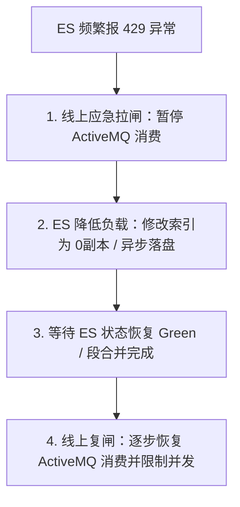

# Elasticsearch 线上拒绝异常（HTTP 429）应急处理指南

当线上 ES 集群因并发请求过高、磁盘 I/O 堵死或 JVM 频繁 Full GC，导致写入响应变慢并频繁抛出 `HTTP 429 (Too Many Requests / rejected)` 异常，且**无法立即发布新代码**时，应立即按照本指南进行线上紧急消峰与限流处理。

---

## 应急核心策略：拉闸断流（消费端挂起） + ES 降噪

线上应急处理的黄金法则：**先保护集群（切断流量源头），再给集群降载（修改动态配置），最后逐步恢复。**



---

## 第一阶段：紧急拉闸（切断消息消费流量）

不要直接关闭主业务服务，而是**挂起异步消息消费通道**，让数据安全地堆积在 ActiveMQ 队列中，以保护 ES 节点。

### 方法 A：通过 ActiveMQ 网页控制台暂停监听（推荐）
1.  登录 ActiveMQ 管理后台（默认端口 `8161`）。
2.  进入 **Queues** 标签页，找到同步队列：`airag.practice.es.sync.queue`。
3.  在操作栏（Operations）中，点击该队列对应的 **Pause** 按钮。
    *   **效果**：ActiveMQ 停止向 Java 客户端推送此队列的消息。消息将安全地堆积在队列中，不会丢失。Java 客户端写 MySQL 的主业务照常进行，ES 的写入流量瞬间降为 0。

### 方法 B：通过 JMX 动态停止 Spring 监听容器（无需重启）
如果无法访问 MQ 网页，可在 Java 运维端（如通过 Spring Boot Actuator 或 Jconsole）控制 `JmsListenerEndpointRegistry` 挂起监听：
```java
// 在运维控制器中注入此 Bean 并调用 stop 即可动态挂起
@Autowired
private JmsListenerEndpointRegistry jmsListenerEndpointRegistry;

public void pauseConsumer() {
    MessageListenerContainer container = 
        jmsListenerEndpointRegistry.getListenerContainer("org.springframework.jms.JmsListenerContainerFactory#0");
    if (container != null && container.isRunning()) {
        container.stop(); // 热挂起消费
    }
}
```

---

## 第二阶段：ES 集群动态降载（紧急调优）

切断流量后，立即登录 Kibana 开发者工具或通过 curl 向 ES 发送动态配置命令，极大降低磁盘 I/O 和段合并压力：

### 1. 副本数调零（立刻生效，成倍减轻磁盘压力）
将正在写入的索引副本数临时调为 0：
```json
PUT /practice_knowledge_chunks/_settings
{
  "index.number_of_replicas": 0
}
```

### 2. 调大/关闭 Refresh 间隔（减少分片生成与段合并）
默认 1 秒一次的 refresh 会生成大量 Segment 小段文件，逼迫磁盘疯狂进行 Merge 操作，这是 I/O 堵死的主因。将其调大为 60 秒或直接关闭（设置 `-1`）：
```json
PUT /practice_knowledge_chunks/_settings
{
  "index.refresh_interval": "60s"
}
```

### 3. Translog 改为异步刷盘（降低磁盘 fsync 写入频率）
默认每个写入请求都要执行物理刷盘。改成每 5 秒异步刷盘一次：
```json
PUT /practice_knowledge_chunks/_settings
{
  "index.translog.durability": "async",
  "index.translog.sync_interval": "5s"
}
```

---

## 第三阶段：等待集群自愈与观察

通过以下命令监控系统指标，确认其回落至安全区间：

1.  **观察线程池挂起状态**：
    ```bash
    GET /_cat/thread_pool/write?v&h=node_name,active,queue,rejected
    ```
    *   确认 `queue` 逐步归零，`rejected` 停止增长。
2.  **观察 JVM GC 与 CPU 状态**：
    *   在 Linux 上运行 `top`，确保 CPU 使用率从 90%+ 逐步滑落至 20% 以下。
    *   确保 ES 不再打印 `JVM spent X ms executing GC` 的慢日志，说明 Heap 空间已被 G1 回收干净。
3.  **观察磁盘 I/O 状态**：
    *   运行 `iostat -x 1`，确认磁盘的 `%util` 低于 30%，`await` 延迟小于 10ms。说明挂起期间，ES 已经默默完成了所有的段合并（Merge）工作。

---

## 第四阶段：复闸（逐步放开消费）

当 ES 各项指标恢复正常后，重新开启流量：

1.  **恢复副本与落盘策略**：
    先恢复副本数为 1（ES 会在后台同步数据）：
    ```json
    PUT /practice_knowledge_chunks/_settings
    {
      "index.number_of_replicas": 1,
      "index.refresh_interval": "1s",
      "index.translog.durability": "request"
    }
    ```
2.  **启动消费**：
    在 ActiveMQ 控制台点击 **Resume** 按钮，或者在 Spring 端调用 `container.start()`。
3.  **线上对账**：
    *   等待堆积的 MQ 消息消费完毕。
    *   如果堆积期间有部分早期消息过期或报错，项目中的 **[EsSyncReconciliationScheduler](file:///e:/workSpace/idea/JeecgBoot/jeecg-boot/jeecg-boot-module/jeecg-boot-module-airag/src/main/java/org/jeecg/modules/airag/practice/sync/scheduler/EsSyncReconciliationScheduler.java)** 定时对账任务在凌晨启动后，会自动对比 MySQL 与 ES，补齐所有遗漏的向量数据。
