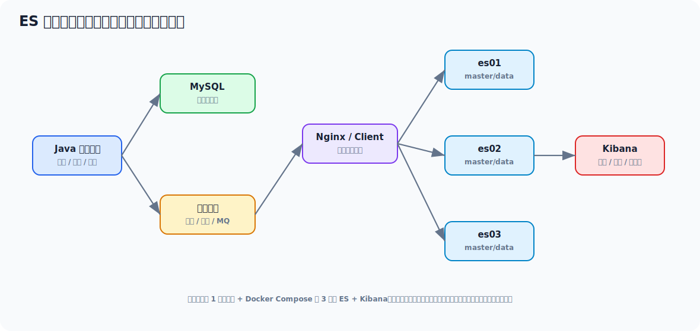

# Elasticsearch 本地虚拟机生产模拟部署实操文档

> 这份文档模拟一个已上线大项目的搜索服务架构，在本地虚拟机上用 Docker Compose 部署 3 节点 Elasticsearch + Kibana，并完成索引设计、别名切换、数据写入、查询验证、快照备份、故障演练和排查。你可以按步骤一点点敲。



## 目录

- [一、模拟的大项目架构](#一模拟的大项目架构)
- [二、你的本地虚拟机准备](#二你的本地虚拟机准备)
- [三、安装 Docker 和 Compose](#三安装-docker-和-compose)
- [四、准备目录和系统参数](#四准备目录和系统参数)
- [五、编写 docker-compose.yml](#五编写-docker-composeyml)
- [六、启动 3 节点 ES + Kibana](#六启动-3-节点-es--kibana)
- [七、验证集群状态](#七验证集群状态)
- [八、创建生产风格索引模板和别名](#八创建生产风格索引模板和别名)
- [九、写入商品数据并查询](#九写入商品数据并查询)
- [十、模拟 MySQL 到 ES 的同步链路](#十模拟-mysql-到-es-的同步链路)
- [十一、Kibana 基础使用](#十一kibana-基础使用)
- [十二、快照备份与恢复演练](#十二快照备份与恢复演练)
- [十三、故障演练](#十三故障演练)
- [十四、常见问题排查](#十四常见问题排查)
- [十五、面试怎么讲这套部署](#十五面试怎么讲这套部署)

---

## 一、模拟的大项目架构

我们模拟一个电商/低代码平台常见的搜索架构：

```text
Java 业务服务
  -> MySQL 保存事实数据
  -> MQ / Binlog / 定时任务同步搜索视图
  -> Elasticsearch 存商品、订单、日志索引
  -> Kibana 做查询、调试、可视化
```

本地虚拟机中部署：

| 组件 | 数量 | 作用 |
| --- | --- | --- |
| Elasticsearch | 3 节点 | 模拟生产集群 |
| Kibana | 1 个 | 查询和管理 |
| Docker Compose | 1 套 | 编排服务 |

为什么是 3 节点？

- 能模拟 master 选举
- 能模拟副本分配
- 能演练节点宕机
- 比单节点更接近生产

这不是完整生产方案，但足够你本地学习：

- 集群启动
- 分片副本
- 索引模板
- alias
- 查询 DSL
- 故障恢复

---

## 二、你的本地虚拟机准备

推荐配置：

| 配置 | 建议 |
| --- | --- |
| CPU | 4 核以上 |
| 内存 | 8GB 以上，至少 6GB |
| 磁盘 | 40GB 以上 |
| 系统 | Ubuntu 22.04 / Rocky Linux 9 / CentOS 7+ |

如果你内存只有 4GB，可以改成单节点练习，但三节点会比较吃紧。

查看系统：

```bash
uname -a
cat /etc/os-release
free -h
df -h
```

---

## 三、安装 Docker 和 Compose

### 3.1 Ubuntu 安装

```bash
sudo apt update
sudo apt install -y ca-certificates curl gnupg
sudo install -m 0755 -d /etc/apt/keyrings
curl -fsSL https://download.docker.com/linux/ubuntu/gpg | sudo gpg --dearmor -o /etc/apt/keyrings/docker.gpg
sudo chmod a+r /etc/apt/keyrings/docker.gpg

echo \
  "deb [arch=$(dpkg --print-architecture) signed-by=/etc/apt/keyrings/docker.gpg] https://download.docker.com/linux/ubuntu \
  $(. /etc/os-release && echo "$VERSION_CODENAME") stable" | \
  sudo tee /etc/apt/sources.list.d/docker.list > /dev/null

sudo apt update
sudo apt install -y docker-ce docker-ce-cli containerd.io docker-buildx-plugin docker-compose-plugin
```

验证：

```bash
docker version
docker compose version
```

### 3.2 如果网络慢

你可以使用国内镜像源或手动下载 Docker 安装包。  
如果是公司网络，先确认能不能访问 Docker Hub。

---

## 四、准备目录和系统参数

### 4.1 创建目录

```bash
sudo mkdir -p /data/es-lab/es01/data
sudo mkdir -p /data/es-lab/es02/data
sudo mkdir -p /data/es-lab/es03/data
sudo mkdir -p /data/es-lab/kibana/data
sudo mkdir -p /data/es-lab/snapshots
sudo mkdir -p /opt/es-lab
```

授权：

```bash
sudo chmod -R 777 /data/es-lab
sudo chown -R $USER:$USER /opt/es-lab
```

本地学习用 `777` 图省事，生产不能这么粗暴，要按运行用户精确授权。

### 4.2 设置 vm.max_map_count

ES 需要较大的虚拟内存映射数量：

```bash
sudo sysctl -w vm.max_map_count=262144
```

持久化：

```bash
echo "vm.max_map_count=262144" | sudo tee /etc/sysctl.d/99-elasticsearch.conf
sudo sysctl --system
```

验证：

```bash
sysctl vm.max_map_count
```

### 4.3 调整文件句柄

查看：

```bash
ulimit -n
```

如果过低，可以临时：

```bash
ulimit -n 65535
```

生产上需要配 `/etc/security/limits.conf` 和 systemd 限制。

---

## 五、编写 docker-compose.yml

进入工作目录：

```bash
cd /opt/es-lab
```

创建 `.env`：

```bash
cat > .env <<'EOF'
STACK_VERSION=8.12.2
CLUSTER_NAME=es-prod-sim
ES_JAVA_OPTS=-Xms1g -Xmx1g
ELASTIC_PASSWORD=Elastic@123456
KIBANA_PASSWORD=Kibana@123456
EOF
```

创建 `docker-compose.yml`：

```bash
cat > docker-compose.yml <<'EOF'
services:
  es01:
    image: docker.elastic.co/elasticsearch/elasticsearch:${STACK_VERSION}
    container_name: es01
    environment:
      - node.name=es01
      - cluster.name=${CLUSTER_NAME}
      - discovery.seed_hosts=es02,es03
      - cluster.initial_master_nodes=es01,es02,es03
      - bootstrap.memory_lock=true
      - xpack.security.enabled=true
      - xpack.security.http.ssl.enabled=false
      - xpack.security.transport.ssl.enabled=false
      - ELASTIC_PASSWORD=${ELASTIC_PASSWORD}
      - ES_JAVA_OPTS=${ES_JAVA_OPTS}
      - path.repo=/usr/share/elasticsearch/snapshots
    ulimits:
      memlock:
        soft: -1
        hard: -1
      nofile:
        soft: 65535
        hard: 65535
    volumes:
      - /data/es-lab/es01/data:/usr/share/elasticsearch/data
      - /data/es-lab/snapshots:/usr/share/elasticsearch/snapshots
    ports:
      - "9200:9200"
    networks:
      - es-net

  es02:
    image: docker.elastic.co/elasticsearch/elasticsearch:${STACK_VERSION}
    container_name: es02
    environment:
      - node.name=es02
      - cluster.name=${CLUSTER_NAME}
      - discovery.seed_hosts=es01,es03
      - cluster.initial_master_nodes=es01,es02,es03
      - bootstrap.memory_lock=true
      - xpack.security.enabled=true
      - xpack.security.http.ssl.enabled=false
      - xpack.security.transport.ssl.enabled=false
      - ELASTIC_PASSWORD=${ELASTIC_PASSWORD}
      - ES_JAVA_OPTS=${ES_JAVA_OPTS}
      - path.repo=/usr/share/elasticsearch/snapshots
    ulimits:
      memlock:
        soft: -1
        hard: -1
      nofile:
        soft: 65535
        hard: 65535
    volumes:
      - /data/es-lab/es02/data:/usr/share/elasticsearch/data
      - /data/es-lab/snapshots:/usr/share/elasticsearch/snapshots
    ports:
      - "9201:9200"
    networks:
      - es-net

  es03:
    image: docker.elastic.co/elasticsearch/elasticsearch:${STACK_VERSION}
    container_name: es03
    environment:
      - node.name=es03
      - cluster.name=${CLUSTER_NAME}
      - discovery.seed_hosts=es01,es02
      - cluster.initial_master_nodes=es01,es02,es03
      - bootstrap.memory_lock=true
      - xpack.security.enabled=true
      - xpack.security.http.ssl.enabled=false
      - xpack.security.transport.ssl.enabled=false
      - ELASTIC_PASSWORD=${ELASTIC_PASSWORD}
      - ES_JAVA_OPTS=${ES_JAVA_OPTS}
      - path.repo=/usr/share/elasticsearch/snapshots
    ulimits:
      memlock:
        soft: -1
        hard: -1
      nofile:
        soft: 65535
        hard: 65535
    volumes:
      - /data/es-lab/es03/data:/usr/share/elasticsearch/data
      - /data/es-lab/snapshots:/usr/share/elasticsearch/snapshots
    ports:
      - "9202:9200"
    networks:
      - es-net

  kibana:
    image: docker.elastic.co/kibana/kibana:${STACK_VERSION}
    container_name: kibana
    depends_on:
      - es01
    environment:
      - SERVER_NAME=kibana
      - ELASTICSEARCH_HOSTS=http://es01:9200
      - ELASTICSEARCH_USERNAME=kibana_system
      - ELASTICSEARCH_PASSWORD=${KIBANA_PASSWORD}
    volumes:
      - /data/es-lab/kibana/data:/usr/share/kibana/data
    ports:
      - "5601:5601"
    networks:
      - es-net

networks:
  es-net:
    driver: bridge
EOF
```

### 5.1 这里为什么关闭 SSL

ES 8 默认安全能力更严格。  
本地学习为了降低复杂度，这里关闭 HTTP/Transport SSL，但保留账号密码。

生产环境不要照搬关闭安全配置。

---

## 六、启动 3 节点 ES + Kibana

先启动 ES：

```bash
docker compose up -d es01 es02 es03
```

看日志：

```bash
docker logs -f es01
```

等看到节点启动完成后，设置 Kibana 系统用户密码：

```bash
curl -u elastic:Elastic@123456 \
  -X POST "http://localhost:9200/_security/user/kibana_system/_password" \
  -H "Content-Type: application/json" \
  -d '{"password":"Kibana@123456"}'
```

再启动 Kibana：

```bash
docker compose up -d kibana
```

查看：

```bash
docker compose ps
```

浏览器访问：

```text
http://虚拟机IP:5601
```

登录：

```text
用户名：elastic
密码：Elastic@123456
```

---

## 七、验证集群状态

### 7.1 查看基础信息

```bash
curl -u elastic:Elastic@123456 http://localhost:9200
```

### 7.2 查看健康状态

```bash
curl -u elastic:Elastic@123456 "http://localhost:9200/_cluster/health?pretty"
```

期望：

```json
{
  "status": "green",
  "number_of_nodes": 3
}
```

### 7.3 查看节点

```bash
curl -u elastic:Elastic@123456 "http://localhost:9200/_cat/nodes?v"
```

### 7.4 查看分片

```bash
curl -u elastic:Elastic@123456 "http://localhost:9200/_cat/shards?v"
```

---

## 八、创建生产风格索引模板和别名

生产里通常不直接让业务写死具体索引名，而是使用别名。

比如：

```text
product_search_write -> product_search_v1
product_search_read  -> product_search_v1
```

以后重建索引时：

```text
product_search_v2
切换 alias
```

业务代码不需要改。

### 8.1 创建索引

```bash
curl -u elastic:Elastic@123456 \
  -X PUT "http://localhost:9200/product_search_v1" \
  -H "Content-Type: application/json" \
  -d '{
    "settings": {
      "number_of_shards": 3,
      "number_of_replicas": 1,
      "refresh_interval": "1s"
    },
    "mappings": {
      "properties": {
        "id": { "type": "keyword" },
        "title": {
          "type": "text",
          "fields": {
            "keyword": { "type": "keyword" }
          }
        },
        "brand": { "type": "keyword" },
        "categoryId": { "type": "keyword" },
        "price": { "type": "integer" },
        "status": { "type": "keyword" },
        "createdAt": { "type": "date" }
      }
    }
  }'
```

### 8.2 创建读写别名

```bash
curl -u elastic:Elastic@123456 \
  -X POST "http://localhost:9200/_aliases" \
  -H "Content-Type: application/json" \
  -d '{
    "actions": [
      { "add": { "index": "product_search_v1", "alias": "product_search_read" } },
      { "add": { "index": "product_search_v1", "alias": "product_search_write", "is_write_index": true } }
    ]
  }'
```

查看：

```bash
curl -u elastic:Elastic@123456 "http://localhost:9200/_cat/aliases?v"
```

---

## 九、写入商品数据并查询

### 9.1 单条写入

```bash
curl -u elastic:Elastic@123456 \
  -X POST "http://localhost:9200/product_search_write/_doc/10001" \
  -H "Content-Type: application/json" \
  -d '{
    "id": "10001",
    "title": "Java Redis Spring Cloud Elasticsearch 面试手册",
    "brand": "tech-book",
    "categoryId": "book",
    "price": 9900,
    "status": "ON_SALE",
    "createdAt": "2026-05-09T10:00:00"
  }'
```

### 9.2 批量写入

```bash
cat > products.ndjson <<'EOF'
{ "index": { "_index": "product_search_write", "_id": "10002" } }
{ "id": "10002", "title": "Docker Linux 部署实战", "brand": "tech-book", "categoryId": "book", "price": 7900, "status": "ON_SALE", "createdAt": "2026-05-09T11:00:00" }
{ "index": { "_index": "product_search_write", "_id": "10003" } }
{ "id": "10003", "title": "RocketMQ 分布式消息系统", "brand": "tech-book", "categoryId": "book", "price": 8900, "status": "ON_SALE", "createdAt": "2026-05-09T12:00:00" }
EOF

curl -u elastic:Elastic@123456 \
  -X POST "http://localhost:9200/_bulk" \
  -H "Content-Type: application/x-ndjson" \
  --data-binary @products.ndjson
```

### 9.3 查询

```bash
curl -u elastic:Elastic@123456 \
  -X POST "http://localhost:9200/product_search_read/_search?pretty" \
  -H "Content-Type: application/json" \
  -d '{
    "query": {
      "bool": {
        "must": [
          { "match": { "title": "Java Redis" } }
        ],
        "filter": [
          { "term": { "status": "ON_SALE" } },
          { "range": { "price": { "gte": 5000, "lte": 12000 } } }
        ]
      }
    },
    "aggs": {
      "brand_count": {
        "terms": { "field": "brand" }
      }
    }
  }'
```

---

## 十、模拟 MySQL 到 ES 的同步链路

真实生产里，通常不是用户请求直接手写 ES，而是：

```text
MySQL 商品表
  -> Binlog / MQ / 定时任务
  -> 构建搜索文档
  -> 写入 ES
```

### 10.1 为什么不直接拿 ES 当主库

因为 ES 不适合作为强事务事实库。  
正确姿势：

- MySQL 保存事实数据
- ES 保存查询视图

### 10.2 同步失败怎么处理

需要：

1. 重试队列
2. 死信记录
3. 定时对账
4. 手动重建索引能力

### 10.3 Java 同步伪代码

```java
@Component
public class ProductSearchSyncConsumer {

    private final ProductMapper productMapper;
    private final ElasticsearchClient elasticsearchClient;

    public void onProductChanged(ProductChangedEvent event) {
        Product product = productMapper.selectById(event.productId());
        ProductSearchDocument doc = ProductSearchDocument.from(product);

        elasticsearchClient.index(i -> i
                .index("product_search_write")
                .id(doc.id())
                .document(doc)
        );
    }
}
```

---

## 十一、Kibana 基础使用

进入：

```text
http://虚拟机IP:5601
```

常用位置：

- Dev Tools：执行 DSL
- Stack Management：看索引、用户、快照
- Discover：查数据

在 Dev Tools 里执行：

```json
GET _cluster/health
GET _cat/nodes?v
GET product_search_read/_search
```

---

## 十二、快照备份与恢复演练

### 12.1 注册快照仓库

```bash
curl -u elastic:Elastic@123456 \
  -X PUT "http://localhost:9200/_snapshot/local_backup" \
  -H "Content-Type: application/json" \
  -d '{
    "type": "fs",
    "settings": {
      "location": "/usr/share/elasticsearch/snapshots"
    }
  }'
```

### 12.2 创建快照

```bash
curl -u elastic:Elastic@123456 \
  -X PUT "http://localhost:9200/_snapshot/local_backup/snapshot_001?wait_for_completion=true"
```

### 12.3 查看快照

```bash
curl -u elastic:Elastic@123456 \
  "http://localhost:9200/_snapshot/local_backup/_all?pretty"
```

### 12.4 恢复思路

如果要恢复某个索引：

1. 关闭或删除目标索引。
2. 调 restore API。
3. 检查集群 health。
4. 检查别名和数据。

本地演练恢复前要小心，不要误删你还要用的数据。

---

## 十三、故障演练

### 13.1 停掉一个节点

```bash
docker stop es02
```

观察：

```bash
curl -u elastic:Elastic@123456 "http://localhost:9200/_cluster/health?pretty"
curl -u elastic:Elastic@123456 "http://localhost:9200/_cat/nodes?v"
curl -u elastic:Elastic@123456 "http://localhost:9200/_cat/shards?v"
```

你应该看到：

- 节点数变少
- 可能短暂 yellow
- 如果副本足够，主分片仍可用

恢复：

```bash
docker start es02
```

### 13.2 模拟磁盘压力

查看磁盘：

```bash
df -h
du -sh /data/es-lab/*
```

ES 对磁盘水位很敏感，生产中磁盘高水位会影响分片分配甚至写入。

### 13.3 模拟查询慢

深分页查询：

```bash
curl -u elastic:Elastic@123456 \
  -X POST "http://localhost:9200/product_search_read/_search?pretty" \
  -H "Content-Type: application/json" \
  -d '{
    "from": 10000,
    "size": 20,
    "query": { "match_all": {} }
  }'
```

这个例子数据少不一定慢，但你要理解生产里深分页会让每个分片取大量候选数据再合并。

---

## 十四、常见问题排查

### 14.1 启动报 vm.max_map_count 太低

处理：

```bash
sudo sysctl -w vm.max_map_count=262144
echo "vm.max_map_count=262144" | sudo tee /etc/sysctl.d/99-elasticsearch.conf
sudo sysctl --system
```

### 14.2 Kibana 登录不了

查：

```bash
docker logs -f kibana
docker logs -f es01
```

确认：

- `kibana_system` 密码是否设置
- Kibana 配置是否和 `.env` 一致
- ES 是否健康

### 14.3 集群 yellow

常见原因：

- 副本无法分配
- 节点数不足
- 磁盘水位限制

查看：

```bash
curl -u elastic:Elastic@123456 "http://localhost:9200/_cluster/allocation/explain?pretty"
```

### 14.4 容器启动失败

查：

```bash
docker logs es01
docker inspect es01
```

常见原因：

- 数据目录权限不对
- 内存不足
- 系统参数不足
- 端口被占用

### 14.5 Java 连接 ES 失败

确认：

1. ES 端口是否通
2. 用户密码是否对
3. 是否使用了 HTTP 还是 HTTPS
4. 客户端版本是否兼容

命令：

```bash
curl -u elastic:Elastic@123456 http://虚拟机IP:9200
```

---

## 十五、面试怎么讲这套部署

你可以这样表达：

> 我本地用 Docker Compose 模拟过一个三节点 Elasticsearch 集群，包含 3 个 master/data 节点和 Kibana。部署前需要调整 `vm.max_map_count`、文件句柄和数据目录权限。索引层面我会用具体版本索引加读写别名，比如 `product_search_v1` 配 `product_search_read/write`，这样重建索引时可以通过 alias 平滑切换。数据同步上，MySQL 作为事实库，ES 作为搜索视图，通过 MQ 或 binlog 做最终一致。排查方面会看 cluster health、cat nodes、cat shards、allocation explain、慢查询和磁盘水位。

高频追问可以继续补：

### 15.1 为什么要 3 节点

> 3 节点能模拟 master 选举和副本恢复，单节点只能练 API，不能理解 ES 集群高可用。

### 15.2 为什么要别名

> 别名能把业务访问名和真实索引版本解耦，重建索引时新建 `v2`，数据同步完成后切换 alias，业务代码无需改。

### 15.3 为什么 ES 只做搜索视图

> ES 是近实时搜索引擎，不适合作为强事务事实库。生产里一般 MySQL 保存事实数据，ES 保存面向查询的冗余视图。

### 15.4 ES 部署最容易出什么问题

> 本地最常见是系统参数不足、目录权限、内存不够、Kibana 账号密码、HTTP/HTTPS 配置混淆。生产还要重点关注磁盘水位、分片数量、JVM heap、慢查询和集群状态。

---

## 最后建议

你按这份文档实操时，建议不要跳步骤：

```text
先起集群
  -> 再看 health/nodes/shards
  -> 再建索引和别名
  -> 再写入查询
  -> 再做快照
  -> 最后停节点做故障演练
```

这样你不是只会“装 ES”，而是真正把大项目里 ES 的部署、使用和治理链路跑了一遍。
