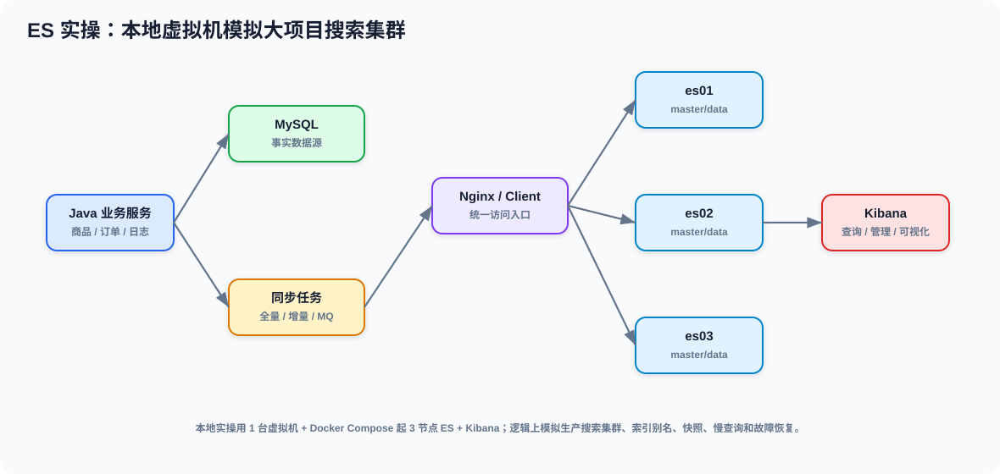

# Elasticsearch 本地虚拟机生产模拟部署实操文档

> 这份文档模拟一个已上线大项目的搜索服务架构，在本地 CentOS 7 虚拟机上用 Docker Compose 部署 3 节点 Elasticsearch 8.17.0 集群，并完成索引设计、别名切换、数据写入、向量搜索（dense_vector + kNN）、查询验证、快照备份、故障演练和排查。你可以按步骤一点点敲。



## 目录

- [一、模拟的大项目架构](#一模拟的大项目架构)
- [二、你的本地虚拟机准备](#二你的本地虚拟机准备)
- [三、安装 Docker 和 Compose](#三安装-docker-和-compose)
- [四、准备目录和系统参数](#四准备目录和系统参数)
- [五、编写 docker-compose.yml](#五编写-docker-composeyml)
- [六、启动 3 节点 ES + Kibana](#六启动-3-节点-es--kibana)
- [七、验证集群状态](#七验证集群状态)
- [八、创建生产风格索引模板和别名](#八创建生产风格索引模板和别名)
- [九、写入商品数据并查询](#九写入商品数据并查询)
- [十、向量搜索索引与 kNN 查询](#十向量搜索索引与-knn-查询)
- [十一、模拟 MySQL 到 ES 的同步链路](#十一模拟-mysql-到-es-的同步链路)
- [十二、Kibana 基础使用（可选）](#十二kibana-基础使用可选)
- [十三、快照备份与恢复演练](#十三快照备份与恢复演练)
- [十四、故障演练](#十四故障演练)
- [十五、常见问题排查](#十五常见问题排查)
- [十六、面试怎么讲这套部署](#十六面试怎么讲这套部署)

---

## 一、模拟的大项目架构

我们模拟一个电商/低代码平台常见的搜索架构：

```text
Java 业务服务
  -> MySQL 保存事实数据
  -> MQ / Binlog / 定时任务同步搜索视图
  -> Elasticsearch 存商品、订单、日志、向量索引
  -> Kibana 做查询、调试、可视化（可选）
```

本地虚拟机中部署：

| 组件 | 数量 | 作用 |
| --- | --- | --- |
| Elasticsearch 8.17.0 | 3 节点 | 模拟生产集群（含向量搜索） |
| Docker Compose | 1 套 | 编排服务 |
| Kibana | 可选 | 后续按需加 |

为什么是 3 节点？

- 能模拟 master 选举
- 能模拟副本分配
- 能演练节点宕机
- 比单节点更接近生产

这不是完整生产方案，但足够你本地学习：

- 集群启动
- 分片副本
- 索引模板
- alias
- 查询 DSL
- 故障恢复

---

## 二、你的本地虚拟机准备

实际环境：

| 配置 | 实际值 |
| --- | --- |
| 宿主机 | Windows 11 Pro, AMD Ryzen |
| 虚拟化 | VMware Workstation |
| 虚拟机系统 | CentOS 7 |
| 磁盘 | 50GB（LVM 已扩容） |
| Docker | 已安装 |
| ES 镜像 | docker.elastic.co/elasticsearch/elasticsearch:8.17.0（已拉取） |

推荐最低配置：

| 配置 | 建议 |
| --- | --- |
| CPU | 4 核以上 |
| 内存 | 6GB 以上（3 节点各 512MB JVM + 系统开销） |
| 磁盘 | 40GB 以上 |
| 系统 | CentOS 7+ / Ubuntu 22.04 / Rocky Linux 9 |

如果内存只有 4GB，每节点 JVM 改成 `-Xms256m -Xmx256m`，或者退回到单节点练习。

查看系统：

```bash
uname -a
cat /etc/os-release
free -h
df -h
docker images | grep elasticsearch
```

---

## 三、安装 Docker 和 Compose

### 3.1 CentOS 7 安装

```bash
# 卸载旧版 Docker（如果有）
sudo yum remove -y docker docker-common docker-selinux docker-engine

# 安装依赖
sudo yum install -y yum-utils device-mapper-persistent-data lvm2

# 添加 Docker 官方仓库
sudo yum-config-manager --add-repo https://download.docker.com/linux/centos/docker-ce.repo

# 安装 Docker CE
sudo yum install -y docker-ce docker-ce-cli containerd.io docker-buildx-plugin docker-compose-plugin

# 启动并设为开机自启
sudo systemctl start docker
sudo systemctl enable docker

# 让当前用户免 sudo 运行 docker（可选，需重新登录生效）
sudo usermod -aG docker $USER
```

验证：

```bash
docker version
docker compose version
```

如果 yum 源慢，可以用阿里云镜像：

```bash
sudo yum-config-manager --add-repo https://mirrors.aliyun.com/docker-ce/linux/centos/docker-ce.repo
```

### 3.2 Ubuntu 安装

```bash
sudo apt update
sudo apt install -y ca-certificates curl gnupg
sudo install -m 0755 -d /etc/apt/keyrings
curl -fsSL https://download.docker.com/linux/ubuntu/gpg | sudo gpg --dearmor -o /etc/apt/keyrings/docker.gpg
sudo chmod a+r /etc/apt/keyrings/docker.gpg

echo \
  "deb [arch=$(dpkg --print-architecture) signed-by=/etc/apt/keyrings/docker.gpg] https://download.docker.com/linux/ubuntu \
  $(. /etc/os-release && echo "$VERSION_CODENAME") stable" | \
  sudo tee /etc/apt/sources.list.d/docker.list > /dev/null

sudo apt update
sudo apt install -y docker-ce docker-ce-cli containerd.io docker-buildx-plugin docker-compose-plugin
```

验证：

```bash
docker version
docker compose version
```

### 3.3 如果网络慢

你可以使用国内镜像源或手动下载 Docker 安装包。  
如果是公司网络，先确认能不能访问 Docker Hub。

---

## 四、准备目录和系统参数

### 4.1 创建目录

```bash
sudo mkdir -p /data/es-lab/es01/data
sudo mkdir -p /data/es-lab/es02/data
sudo mkdir -p /data/es-lab/es03/data
sudo mkdir -p /data/es-lab/snapshots
sudo mkdir -p /opt/es-lab
```

授权：

```bash
sudo chmod -R 777 /data/es-lab
sudo chown -R $USER:$USER /opt/es-lab
```

本地学习用 `777` 图省事，生产不能这么粗暴，要按运行用户精确授权。

### 4.2 设置 vm.max_map_count

ES 需要较大的虚拟内存映射数量：

```bash
sudo sysctl -w vm.max_map_count=262144
```

持久化：

```bash
echo "vm.max_map_count=262144" | sudo tee /etc/sysctl.d/99-elasticsearch.conf
sudo sysctl --system
```

验证：

```bash
sysctl vm.max_map_count
```

### 4.3 调整文件句柄

查看：

```bash
ulimit -n
```

如果过低，可以临时：

```bash
ulimit -n 65535
```

生产上需要配 `/etc/security/limits.conf` 和 systemd 限制。

---

## 五、编写 docker-compose.yml

进入工作目录：

```bash
cd /opt/es-lab
```

创建 `.env`：

```bash
cat > .env <<'EOF'
STACK_VERSION=8.17.0
CLUSTER_NAME=es-lab
ES_JAVA_OPTS=-Xms512m -Xmx512m
EOF
```

版本号用 8.17.0（和本地已拉取的镜像一致），JVM 每节点 512MB（3 节点合计 1.5GB，给虚拟机系统留足余量）。

创建 `docker-compose.yml`：

```bash
cat > docker-compose.yml <<'EOF'
services:
  es01:
    image: docker.elastic.co/elasticsearch/elasticsearch:${STACK_VERSION}
    container_name: es01
    environment:
      - node.name=es01
      - cluster.name=${CLUSTER_NAME}
      - discovery.seed_hosts=es02,es03
      - cluster.initial_master_nodes=es01,es02,es03
      - bootstrap.memory_lock=true
      - xpack.security.enabled=false
      - xpack.security.transport.ssl.enabled=false
      - ES_JAVA_OPTS=${ES_JAVA_OPTS}
      - path.repo=/usr/share/elasticsearch/snapshots
    ulimits:
      memlock:
        soft: -1
        hard: -1
      nofile:
        soft: 65535
        hard: 65535
    volumes:
      - /data/es-lab/es01/data:/usr/share/elasticsearch/data
      - /data/es-lab/snapshots:/usr/share/elasticsearch/snapshots
    ports:
      - "9200:9200"
    networks:
      - es-net

  es02:
    image: docker.elastic.co/elasticsearch/elasticsearch:${STACK_VERSION}
    container_name: es02
    environment:
      - node.name=es02
      - cluster.name=${CLUSTER_NAME}
      - discovery.seed_hosts=es01,es03
      - cluster.initial_master_nodes=es01,es02,es03
      - bootstrap.memory_lock=true
      - xpack.security.enabled=false
      - xpack.security.transport.ssl.enabled=false
      - ES_JAVA_OPTS=${ES_JAVA_OPTS}
      - path.repo=/usr/share/elasticsearch/snapshots
    ulimits:
      memlock:
        soft: -1
        hard: -1
      nofile:
        soft: 65535
        hard: 65535
    volumes:
      - /data/es-lab/es02/data:/usr/share/elasticsearch/data
      - /data/es-lab/snapshots:/usr/share/elasticsearch/snapshots
    ports:
      - "9201:9200"
    networks:
      - es-net

  es03:
    image: docker.elastic.co/elasticsearch/elasticsearch:${STACK_VERSION}
    container_name: es03
    environment:
      - node.name=es03
      - cluster.name=${CLUSTER_NAME}
      - discovery.seed_hosts=es01,es02
      - cluster.initial_master_nodes=es01,es02,es03
      - bootstrap.memory_lock=true
      - xpack.security.enabled=false
      - xpack.security.transport.ssl.enabled=false
      - ES_JAVA_OPTS=${ES_JAVA_OPTS}
      - path.repo=/usr/share/elasticsearch/snapshots
    ulimits:
      memlock:
        soft: -1
        hard: -1
      nofile:
        soft: 65535
        hard: 65535
    volumes:
      - /data/es-lab/es03/data:/usr/share/elasticsearch/data
      - /data/es-lab/snapshots:/usr/share/elasticsearch/snapshots
    ports:
      - "9202:9200"
    networks:
      - es-net

networks:
  es-net:
    driver: bridge
EOF
```

### 5.1 关键配置说明

| 配置项 | 值 | 为什么 |
| --- | --- | --- |
| `xpack.security.enabled` | `false` | 学习阶段关闭认证，curl 不用每次带 `-u` 密码 |
| `xpack.security.transport.ssl` | `false` | 节点间通信也关闭 SSL，简化配置 |
| `bootstrap.memory_lock` | `true` | 锁住 JVM heap 不被 swap 到磁盘，避免性能抖动 |
| `ES_JAVA_OPTS` | `-Xms512m -Xmx512m` | 每节点 512MB，3 节点共 1.5GB，虚拟机友好 |
| `discovery.seed_hosts` | 其他两个节点 | 节点互相发现，组建集群 |
| `cluster.initial_master_nodes` | 全部三个 | 首次启动时三个节点都有资格当选 master |
| `path.repo` | snapshots 目录 | 支持快照备份功能 |

生产环境不要照搬关闭安全配置，至少要开 HTTPS + 密码认证。

### 5.2 为什么先不装 Kibana

学习阶段用 curl 和 Java 客户端调试足够了。Kibana 镜像约 1GB，启动后额外占内存，虚拟机资源有限。后面如果需要可视化查看向量数据分布或做故障演练的 Dashboard，再加一行 Kibana 服务就行。

---

## 六、启动 3 节点 ES 集群

启动三个 ES 节点：

```bash
cd /opt/es-lab
docker compose up -d
```

三个容器会同时启动，互相发现、选举 master、分配分片。这个过程大约 20~30 秒。

看日志观察集群组建过程：

```bash
docker logs -f es01
```

关键日志标志：

```text
# 节点互相发现
master nodes changed from [], added {[es01], [es02], [es03]}
# 集群组建完成
recovered [0] indices into cluster_state
```

看到类似日志说明集群组建成功，`Ctrl+C` 退出日志。

查看所有容器状态：

```bash
docker compose ps
```

三个容器应该都是 `running` 状态。

---

## 七、验证集群状态

### 7.1 查看基础信息

```bash
curl http://localhost:9200?pretty
```

返回集群信息，确认 `version.number` 是 `8.17.0`，`cluster_name` 是 `es-lab`。

### 7.2 查看健康状态

```bash
curl "http://localhost:9200/_cluster/health?pretty"
```

期望：

```json
{
  "cluster_name": "es-lab",
  "status": "green",
  "number_of_nodes": 3
}
```

`status` 三种值：`green`（一切正常）、`yellow`（主分片正常但副本未完全分配）、`red`（有主分片不可用）。

### 7.3 查看节点

```bash
curl "http://localhost:9200/_cat/nodes?v"
```

应该看到 es01、es02、es03 三个节点，带 `*` 号的是当前 master。

### 7.4 查看分片

```bash
curl "http://localhost:9200/_cat/shards?v"
```

初始没有自定义索引时，只会看到系统索引（`.security` 等）的分片。

---

## 八、创建生产风格索引模板和别名

生产里通常不直接让业务写死具体索引名，而是使用别名。

比如：

```text
product_search_write -> product_search_v1
product_search_read  -> product_search_v1
```

以后重建索引时：

```text
product_search_v2
切换 alias
```

业务代码不需要改。

### 8.1 创建索引

```bash
curl \
  -X PUT "http://localhost:9200/product_search_v1" \
  -H "Content-Type: application/json" \
  -d '{
    "settings": {
      "number_of_shards": 3,
      "number_of_replicas": 1,
      "refresh_interval": "1s"
    },
    "mappings": {
      "properties": {
        "id": { "type": "keyword" },
        "title": {
          "type": "text",
          "fields": {
            "keyword": { "type": "keyword" }
          }
        },
        "brand": { "type": "keyword" },
        "categoryId": { "type": "keyword" },
        "price": { "type": "integer" },
        "status": { "type": "keyword" },
        "createdAt": { "type": "date" }
      }
    }
  }'
```

3 个分片对应 3 个节点，1 个副本保证每个节点上都有备份。

### 8.2 创建读写别名

```bash
curl \
  -X POST "http://localhost:9200/_aliases" \
  -H "Content-Type: application/json" \
  -d '{
    "actions": [
      { "add": { "index": "product_search_v1", "alias": "product_search_read" } },
      { "add": { "index": "product_search_v1", "alias": "product_search_write", "is_write_index": true } }
    ]
  }'
```

查看：

```bash
curl "http://localhost:9200/_cat/aliases?v"
```

---

## 九、写入商品数据并查询

### 9.1 单条写入

```bash
curl \
  -X POST "http://localhost:9200/product_search_write/_doc/10001" \
  -H "Content-Type: application/json" \
  -d '{
    "id": "10001",
    "title": "Java Redis Spring Cloud Elasticsearch 面试手册",
    "brand": "tech-book",
    "categoryId": "book",
    "price": 9900,
    "status": "ON_SALE",
    "createdAt": "2026-05-09T10:00:00"
  }'
```

### 9.2 批量写入

```bash
cat > products.ndjson <<'EOF'
{ "index": { "_index": "product_search_write", "_id": "10002" } }
{ "id": "10002", "title": "Docker Linux 部署实战", "brand": "tech-book", "categoryId": "book", "price": 7900, "status": "ON_SALE", "createdAt": "2026-05-09T11:00:00" }
{ "index": { "_index": "product_search_write", "_id": "10003" } }
{ "id": "10003", "title": "RocketMQ 分布式消息系统", "brand": "tech-book", "categoryId": "book", "price": 8900, "status": "ON_SALE", "createdAt": "2026-05-09T12:00:00" }
EOF

curl \
  -X POST "http://localhost:9200/_bulk" \
  -H "Content-Type: application/x-ndjson" \
  --data-binary @products.ndjson
```

### 9.3 查询

```bash
curl \
  -X POST "http://localhost:9200/product_search_read/_search?pretty" \
  -H "Content-Type: application/json" \
  -d '{
    "query": {
      "bool": {
        "must": [
          { "match": { "title": "Java Redis" } }
        ],
        "filter": [
          { "term": { "status": "ON_SALE" } },
          { "range": { "price": { "gte": 5000, "lte": 12000 } } }
        ]
      }
    },
    "aggs": {
      "brand_count": {
        "terms": { "field": "brand" }
      }
    }
  }'
```

---

## 十、向量搜索索引与 kNN 查询

ES 8.x 支持 dense_vector 字段和 kNN 搜索，可以用于 RAG 场景的向量语义检索。

### 10.1 创建向量索引

```bash
curl \
  -X PUT "http://localhost:9200/knowledge_chunks" \
  -H "Content-Type: application/json" \
  -d '{
    "settings": {
      "number_of_shards": 3,
      "number_of_replicas": 1
    },
    "mappings": {
      "properties": {
        "chunk_id": { "type": "keyword" },
        "chunk_text": {
          "type": "text",
          "analyzer": "ik_max_word",
          "fields": {
            "keyword": { "type": "keyword" }
          }
        },
        "chunk_vector": {
          "type": "dense_vector",
          "dims": 1024,
          "index": true,
          "similarity": "cosine"
        },
        "doc_id": { "type": "keyword" },
        "knowledge_base_id": { "type": "keyword" },
        "heading_path": { "type": "keyword" },
        "created_at": { "type": "date" }
      }
    }
  }'
```

关键参数：`dims` 必须和 Embedding 模型输出维度一致（bge-m3 是 1024），`index: true` 启用 HNSW 索引支持 kNN 快速搜索，`similarity: cosine` 用余弦相似度衡量语义距离。

### 10.2 写入带向量的文档

实际场景中向量由 Embedding API 生成，这里用模拟数据演示写入格式：

```bash
curl \
  -X POST "http://localhost:9200/knowledge_chunks/_doc/chunk_001" \
  -H "Content-Type: application/json" \
  -d '{
    "chunk_id": "chunk_001",
    "chunk_text": "Redis 的 RDB 持久化会在指定时间间隔将内存数据快照写入磁盘",
    "chunk_vector": [0.012, -0.034, 0.056],
    "doc_id": "doc_redis_01",
    "knowledge_base_id": "kb_001",
    "heading_path": "Redis > 持久化 > RDB",
    "created_at": "2026-06-16T10:00:00"
  }'
```

注意：这里 `chunk_vector` 只写了 3 个维度做演示，实际必须写满 1024 个维度，否则写入报错。

### 10.3 kNN 向量搜索

```bash
curl \
  -X POST "http://localhost:9200/knowledge_chunks/_search?pretty" \
  -H "Content-Type: application/json" \
  -d '{
    "knn": {
      "field": "chunk_vector",
      "query_vector": [0.010, -0.030, 0.050],
      "k": 5,
      "num_candidates": 50
    }
  }'
```

`query_vector` 是用户问题经 Embedding 模型生成的向量，`k` 是返回最相似的 topK 文档数，`num_candidates` 是每个分片采集的候选数（一般设 k 的 5~10 倍）。

### 10.4 混合搜索（向量 + 关键词 + 过滤）

生产里通常把 kNN 和传统 query 组合使用：

```bash
curl \
  -X POST "http://localhost:9200/knowledge_chunks/_search?pretty" \
  -H "Content-Type: application/json" \
  -d '{
    "knn": {
      "field": "chunk_vector",
      "query_vector": [0.010, -0.030, 0.050],
      "k": 5,
      "num_candidates": 50,
      "filter": { "term": { "knowledge_base_id": "kb_001" } }
    },
    "query": {
      "bool": {
        "must": [
          { "match": { "chunk_text": "Redis 持久化" } }
        ]
      }
    },
    "size": 10
  }'
```

ES 会同时执行 kNN 和 bool query，结果通过 RRF（Reciprocal Rank Fusion）合并排序。关键词命中的和语义相关的文档都能被召回。

---

## 十一、模拟 MySQL 到 ES 的同步链路

真实生产里，通常不是用户请求直接手写 ES，而是：

```text
MySQL 商品表
  -> Binlog / MQ / 定时任务
  -> 构建搜索文档
  -> 写入 ES
```

### 10.1 为什么不直接拿 ES 当主库

因为 ES 不适合作为强事务事实库。  
正确姿势：

- MySQL 保存事实数据
- ES 保存查询视图

### 10.2 同步失败怎么处理

需要：

1. 重试队列
2. 死信记录
3. 定时对账
4. 手动重建索引能力

### 10.3 Java 同步伪代码

```java
@Component
public class ProductSearchSyncConsumer {

    private final ProductMapper productMapper;
    private final ElasticsearchClient elasticsearchClient;

    public void onProductChanged(ProductChangedEvent event) {
        Product product = productMapper.selectById(event.productId());
        ProductSearchDocument doc = ProductSearchDocument.from(product);

        elasticsearchClient.index(i -> i
                .index("product_search_write")
                .id(doc.id())
                .document(doc)
        );
    }
}
```

---

## 十二、Kibana 基础使用（可选）

如果需要可视化界面，可以在 docker-compose.yml 里加一个 Kibana 服务：

```yaml
  kibana:
    image: docker.elastic.co/kibana/kibana:${STACK_VERSION}
    container_name: kibana
    depends_on:
      - es01
    environment:
      - SERVER_NAME=kibana
      - ELASTICSEARCH_HOSTS=http://es01:9200
    volumes:
      - /data/es-lab/kibana/data:/usr/share/kibana/data
    ports:
      - "5601:5601"
    networks:
      - es-net
```

然后在 `.env` 里加 `KIBANA_PASSWORD` 并设置密码（开启安全认证时），启动：

```bash
# 需要先创建 kibana data 目录
sudo mkdir -p /data/es-lab/kibana/data
sudo chmod -R 777 /data/es-lab/kibana

# 启动 Kibana
docker compose up -d kibana
```

访问 `http://虚拟机IP:5601`，常用功能：

- Dev Tools：执行 DSL 查询
- Stack Management：看索引、分片、快照
- Discover：浏览和检索数据

---

## 十三、快照备份与恢复演练

### 13.1 注册快照仓库

```bash
curl \
  -X PUT "http://localhost:9200/_snapshot/local_backup" \
  -H "Content-Type: application/json" \
  -d '{
    "type": "fs",
    "settings": {
      "location": "/usr/share/elasticsearch/snapshots"
    }
  }'
```

### 13.2 创建快照

```bash
curl \
  -X PUT "http://localhost:9200/_snapshot/local_backup/snapshot_001?wait_for_completion=true"
```

### 13.3 查看快照

```bash
curl \
  "http://localhost:9200/_snapshot/local_backup/_all?pretty"
```

### 13.4 恢复思路

如果要恢复某个索引：

1. 关闭或删除目标索引。
2. 调 restore API。
3. 检查集群 health。
4. 检查别名和数据。

本地演练恢复前要小心，不要误删你还要用的数据。

---

## 十四、故障演练

### 14.1 停掉一个节点

```bash
docker stop es02
```

观察集群变化：

```bash
curl "http://localhost:9200/_cluster/health?pretty"
curl "http://localhost:9200/_cat/nodes?v"
curl "http://localhost:9200/_cat/shards?v"
```

你应该看到：

- 节点数从 3 变成 2
- 状态可能短暂变 yellow（副本未完全分配）
- 如果副本足够，主分片仍可用

恢复：

```bash
docker start es02
```

等 10~20 秒后集群会自动恢复到 green。

### 14.2 模拟磁盘压力

查看磁盘：

```bash
df -h
du -sh /data/es-lab/*
```

ES 对磁盘水位很敏感，磁盘使用率超过 85% 会停止分配新分片，超过 95% 会变为只读。

### 14.3 模拟深分页查询

```bash
curl \
  -X POST "http://localhost:9200/product_search_read/_search?pretty" \
  -H "Content-Type: application/json" \
  -d '{
    "from": 10000,
    "size": 20,
    "query": { "match_all": {} }
  }'
```

数据少不一定慢，但生产里深分页会让每个分片取大量候选数据再合并。

---

## 十五、常见问题排查

### 15.1 启动报 vm.max_map_count 太低

处理：

```bash
sudo sysctl -w vm.max_map_count=262144
echo "vm.max_map_count=262144" | sudo tee /etc/sysctl.d/99-elasticsearch.conf
sudo sysctl --system
```

### 15.2 集群 yellow

常见原因：

- 副本无法分配（节点数少于副本数 + 1）
- 磁盘水位限制
- 节点正在恢复中

查看分配原因：

```bash
curl "http://localhost:9200/_cluster/allocation/explain?pretty"
```

### 15.3 容器启动失败

查日志：

```bash
docker logs es01
docker inspect es01
```

常见原因：

- 数据目录权限不对（需要 777 或匹配 ES 运行用户）
- 内存不足（JVM 申请不到指定大小）
- vm.max_map_count 太低
- 端口被占用（`netstat -tlnp | grep 9200`）
- 旧数据目录残留导致节点 ID 冲突（清理 `/data/es-lab/es0X/data` 重来）

### 15.4 Java 连接 ES 失败

确认：

1. ES 端口是否通：`curl http://虚拟机IP:9200`
2. 防火墙是否放行：`firewall-cmd --list-ports`
3. 客户端版本是否兼容 ES 8.x
4. 如果开了安全认证，确认用户名密码和 HTTPS 配置

### 15.5 内存不足导致节点 OOM

3 节点各 512MB JVM 共 1.5GB，加上系统开销和堆外内存（HNSW 向量索引），虚拟机至少需要 4GB 内存。如果 OOM：

```bash
# 查看容器内存使用
docker stats --no-stream

# 降低每节点 JVM（编辑 .env 后 docker compose down && docker compose up -d）
ES_JAVA_OPTS=-Xms256m -Xmx256m
```

---

## 十六、面试怎么讲这套部署

你可以这样表达：

> 我在本地 CentOS 7 虚拟机上用 Docker Compose 模拟过一个三节点 Elasticsearch 8.17 集群。部署前需要调整 `vm.max_map_count`、文件句柄和数据目录权限。每个节点 JVM 512MB，3 个 master/data 节点互相选举。索引层面用具体版本索引加读写别名，比如 `product_search_v1` 配 `product_search_read/write` alias，重建索引时可以平滑切换。同时用 dense_vector 字段和 kNN 搜索做 RAG 向量检索，HNSW 索引支持毫秒级近似最近邻查询。数据同步上 MySQL 作为事实库，ES 作为搜索视图，通过 MQ 或 binlog 做最终一致。排查方面会看 cluster health、cat nodes、cat shards、allocation explain、慢查询和磁盘水位。

高频追问：

### 16.1 为什么要 3 节点

> 3 节点能模拟 master 选举和副本恢复，能演练节点宕机后集群自动恢复，单节点只能练 API 不能理解高可用。

### 16.2 为什么要别名

> 别名把业务访问名和真实索引版本解耦，重建索引时新建 v2，数据同步完成后切换 alias，业务代码不需要改。

### 16.3 为什么 ES 做向量搜索而不是专用向量库

> 知识库规模在百万级以内，ES 向量检索性能和专用库无差距，而且天然支持混合搜索（向量 + 关键词 + 过滤），团队已有 ES 运维经验，不需要额外引入中间件。

### 16.4 HNSW 索引是什么

> HNSW 是分层图索引，高层稀疏做粗定位，低层密集做精确搜索，查询从最高层贪心搜索逐层下降，时间复杂度接近 O(logN)。

### 16.5 ES 部署最容易出什么问题

> 本地最常见是 vm.max_map_count 不足、目录权限、内存不够、端口被占用、旧数据残留导致节点 ID 冲突。生产还要关注磁盘水位、分片数量、JVM heap 压力和向量索引的堆外内存开销。

---

## 最后建议

你按这份文档实操时，建议不要跳步骤：

```text
先起集群
  -> 再看 health/nodes/shards
  -> 再建索引和别名
  -> 再写入查询
  -> 再建向量索引试 kNN
  -> 再做快照
  -> 最后停节点做故障演练
```

这样你不是只会”装 ES”，而是真正把大项目里 ES 的部署、传统搜索、向量检索和治理链路跑了一遍。
