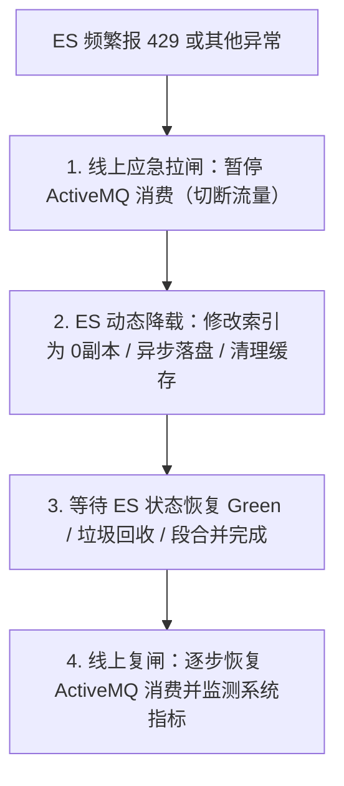

# Elasticsearch 线上故障与应急处理排查指南

当线上 ES 集群出现各种突发故障（如集群变红/变黄、写入拒绝 HTTP 429、JVM OOM 与频繁熔断、查询响应变慢或慢日志飙升）时，应立即按照本指南进行线上排查和紧急恢复处理。

---

## 应急核心策略：拉闸断流 + 动态降载

线上应急处理的黄金法则：**先保护集群（切断或限制流量源头），再给集群降载（修改动态配置），最后排查根因并逐步恢复。**



---

## 一、 事故一：集群状态突然变红（Red）或变黄（Yellow）

### 1.1 场景模拟
线上监控告警：ES 集群状态由 Green 变为 Red（主分片未分配，数据面临丢失风险）或 Yellow（副本分片未分配）。

### 1.2 排查与解决步骤
1.  **获取集群健康状态**
    ```json
    GET /_cluster/health?pretty
    ```
    *   检查 `unassigned_shards`（未分配分片数）和 `initializing_shards`（正在初始化分片数）。
2.  **定位受影响的红/黄索引**
    ```json
    GET /_cat/indices?v&s=health:desc
    ```
    *   列出所有非 Green 状态的索引名（如 `practice_knowledge_chunks`）。
3.  **定位具体的 UNASSIGNED 分片**
    ```json
    GET /_cat/shards?v&h=index,shard,prirep,state,node,unassigned.reason&s=state:asc
    ```
    *   找到未分配的原因（常见如 `NODE_LEFT`、`ALLOCATION_FAILED`、`CLUSTER_RECOVERED`）。
4.  **诊断分片未分配的根本原因**
    使用 ES 的诊断终极 API：
    ```json
    GET /_cluster/allocation/explain
    {
      "index": "practice_knowledge_chunks",
      "shard": 0,
      "primary": true
    }
    ```
    *   **原因 A：`node_left`（物理节点离线）**
        *   *解决*：检查对应节点的机器，如果是因 OOM 被杀或容器挂了，重新拉起进程。
    *   **原因 B：磁盘空间超过高水位限制（Watermark Exceeded）**
        *   *解决*：若磁盘已满，可临时调大水位阈值（开发/临时应急，生产需扩容）：
            ```json
            PUT /_cluster/settings
            {
              "persistent": {
                "cluster.routing.allocation.disk.watermark.low": "90%",
                "cluster.routing.allocation.disk.watermark.high": "95%",
                "cluster.routing.allocation.disk.watermark.flood_stage": "97%"
              }
            }
            ```
    *   **原因 C：分片分配次数超限（超过默认重试 5 次）**
        *   *解决*：手动触发失败重试：
            ```json
            POST /_cluster/reroute?retry_failed=true
            ```

---

## 二、 事故二：写入响应变慢，写入被频繁拒绝（HTTP 429）

### 2.1 场景模拟
在大批量写入数据（如知识库批量导入）时，Java 消费端频繁抛出 `HTTP 429 (Too Many Requests / es_rejected_execution_exception)`。

### 2.2 排查与解决步骤
1.  **挂起异步消息消费通道（拉闸保护）**
    *   登录 ActiveMQ 控制台（默认 `8161`），进入 `Queues` 页，找到 `airag.practice.es.sync.queue`，点击 **Pause** 暂停消费。
    *   或者通过运维控制器动态挂起 Spring 监听容器（无需重启）：
        ```java
        @Autowired
        private JmsListenerEndpointRegistry jmsListenerEndpointRegistry;
        
        public void pauseConsumer() {
            MessageListenerContainer container = 
                jmsListenerEndpointRegistry.getListenerContainer("org.springframework.jms.JmsListenerContainerFactory#0");
            if (container != null && container.isRunning()) {
                container.stop(); // 动态挂起消费
            }
        }
        ```
2.  **降低 ES 集群写入负载（动态降载）**
    *   **副本调零**：
        ```json
        PUT /practice_knowledge_chunks/_settings
        {
          "index.number_of_replicas": 0
        }
        ```
    *   **延长 Refresh 间隔**（降低 Segment 频繁生成及磁盘 I/O 合并压力）：
        ```json
        PUT /practice_knowledge_chunks/_settings
        {
          "index.refresh_interval": "60s"
        }
        ```
    *   **Translog 刷盘改为异步**：
        ```json
        PUT /practice_knowledge_chunks/_settings
        {
          "index.translog.durability": "async",
          "index.translog.sync_interval": "5s"
        }
        ```
3.  **监控恢复后开启消费**
    *   确认 ES 节点 CPU 和 磁盘 I/O 降下来后，在 ActiveMQ 页面上点击 **Resume** 恢复消费。

---

## 三、 事故三：集群频繁熔断，报错 CircuitBreakingException，JVM 内存居高不下

### 3.1 场景模拟
集群频繁返回 `CircuitBreakingException` 错误，说明单次请求或 Fielddata 加载预计消耗的内存超过了内置断路器水位，拒绝执行，以此防范 OOM。

### 3.2 排查与解决步骤
1.  **诊断内存和熔断状态**
    *   查看各节点 Heap 使用占比：
        ```json
        GET /_cat/nodes?v&h=name,ip,heap.percent,ram.percent,cpu
        ```
    *   查看是哪个断路器触发了熔断（通常为 `fielddata` 或 `parent`）：
        ```json
        GET /_nodes/stats/breaker
        ```
2.  **紧急清除 Fielddata 缓存**
    如果内存被大聚合或大排序撑爆，可执行清理紧急释放堆内存：
    ```json
    POST /_cache/clear?fielddata=true
    ```
3.  **根治调优**
    *   **Mapping 字段纠正**：检查是否有对 `text` 字段进行聚合或排序。如果有，必须将其字段类型改为 `keyword`。
    *   **高基数聚合优化**：不要在千万级、亿级去重字段上执行 `terms` 聚合。应改用 `composite` 聚合分页获取结果。
    *   **小段文件合并**：
        ```json
        POST /practice_knowledge_chunks/_forcemerge?max_num_segments=1
        ```

---

## 四、 事故四：查询性能骤降，响应时间变长，频繁出现 Slow Log

### 4.1 场景模拟
用户反馈检索响应卡顿，服务器偶发 Slow Log（慢查询日志）。

### 4.2 排查与解决步骤
1.  **配置慢查询日志阈值**
    如果尚未配置，可动态调整索引设置（日志会写入 ES 安装目录的 `*_index_search_slowlog.log` 中）：
    ```json
    PUT /practice_knowledge_chunks/_settings
    {
      "index.search.slowlog.threshold.query.warn": "2s",
      "index.search.slowlog.threshold.query.info": "1s",
      "index.search.slowlog.threshold.fetch.warn": "1s"
    }
    ```
2.  **利用 Profile 诊断慢查询 DSL**
    在慢查询语句外包裹 `"profile": true` 进行分析，找出最慢的片段：
    ```json
    GET /practice_knowledge_chunks/_search
    {
      "profile": true,
      "query": {
        "match": {
          "chunk_text": "ActiveMQ 最终一致性"
        }
      }
    }
    ```
3.  **查询调优黄金法则**
    *   **Filter 缓存**：对不需要打分的条件（例如 `knowledge_base_id` 等过滤条件），从 `must` 改写入 `filter` 中，利用 ES 缓存过滤结果。
    *   **禁用深分页**：严禁在生产中执行大 offset 翻页（如 `from: 5000, size: 20`）。如果要拉取大量数据，必须强制改用 **`search_after`** 滚动游标。
    *   **禁止首部通配符查询**：绝对不能使用 `{"wildcard": {"heading_path": "*xxxx"}}`，此类查询无法使用倒排索引，会导致全分片扫描，应该改用分词匹配或 Edge N-Gram 机制。

---

## 五、 Java 客户端熔断器（AOP Circuit Breaker）接入指南

为了防止 ES 出现以上故障（如慢响应或彻底宕机）时，同步搜索接口拖垮 Java 的 Tomcat 线程池，项目在 `org.jeecg.modules.airag.practice` 包内集成了**客户端熔断器**。

### 5.1 熔断器设计原理
*   **CLOSED（闭合）**：请求正常通过。当异常次数达到设定阈值（例如 5 次）时，切换到 OPEN。
*   **OPEN（开启）**：请求直接被切断（快速失败），不访问 ES，避免线程阻塞等待。等到冷却时间（例如 10 秒）结束后，切换到 HALF_OPEN。
*   **HALF_OPEN（半开）**：允许少数测试请求通过。如果连续成功（例如 3 次），则恢复 CLOSED 状态；如果期间有任何一次失败，则重新切回 OPEN。

### 5.2 接入与配置
1.  **方法标注 `@CircuitBreaker`**：
    在 `VectorStoreService` 的 `search` 方法上增加了熔断配置：
    ```java
    @CircuitBreaker(
        value = "es_vector_search", 
        failureThreshold = 5, 
        timeout = 10000, 
        fallbackMethod = "searchFallback"
    )
    public List<VectorSearchResultVO> search(String query, int topK, String knowledgeBaseId) {
        // ... 原查询逻辑 ...
    }
    ```
2.  **配置 Fallback 降级方法**：
    编写同参数、同返回值的降级实现。在熔断器触发时（或者检索抛出异常时），直接降级返回空列表，防止业务崩溃：
    ```java
    public List<VectorSearchResultVO> searchFallback(String query, int topK, String knowledgeBaseId) {
        log.warn("[熔断器降级] ES 检索触发降级，返回空列表. query={}", query);
        return Collections.emptyList();
    }
    ```
