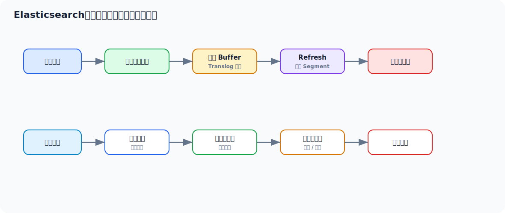

# Elasticsearch 面试实用学习文档

> 适合 3-5 年 Java 工程师面试冲刺。目标不是只会写查询 DSL，而是能把倒排索引、分片副本、写入链路、搜索链路、相关性、聚合、深分页、集群治理和线上排查讲清楚。



## 先看一个直观示例：商品搜索

Elasticsearch 最直观的作用是：**让用户按关键词、分类、价格区间、品牌、排序等条件快速搜索商品**。MySQL 可以做精确查询，但面对全文检索、相关性排序、聚合筛选时会很吃力。

先设计一个商品索引：

```json
PUT /product_index
{
  "mappings": {
    "properties": {
      "id": { "type": "keyword" },
      "title": {
        "type": "text",
        "analyzer": "ik_max_word",
        "fields": {
          "keyword": { "type": "keyword" }
        }
      },
      "brand": { "type": "keyword" },
      "categoryId": { "type": "keyword" },
      "price": { "type": "integer" },
      "status": { "type": "keyword" },
      "createdAt": { "type": "date" }
    }
  }
}
```

写入一个商品文档：

```json
POST /product_index/_doc/10001
{
  "id": "10001",
  "title": "Java 面试突击手册 Redis Spring Cloud Elasticsearch",
  "brand": "tech-book",
  "categoryId": "book",
  "price": 9900,
  "status": "ON_SALE",
  "createdAt": "2026-05-09T10:00:00"
}
```

用户搜索“Java Redis”，并按状态、分类、价格过滤，同时按相关性和时间排序：

```json
POST /product_index/_search
{
  "from": 0,
  "size": 20,
  "_source": ["id", "title", "brand", "price"],
  "query": {
    "bool": {
      "must": [
        { "match": { "title": "Java Redis" } }
      ],
      "filter": [
        { "term": { "status": "ON_SALE" } },
        { "term": { "categoryId": "book" } },
        { "range": { "price": { "gte": 1000, "lte": 20000 } } }
      ]
    }
  },
  "sort": [
    { "_score": "desc" },
    { "createdAt": "desc" }
  ],
  "aggs": {
    "brand_count": {
      "terms": { "field": "brand" }
    }
  }
}
```

这个例子里 ES 做了几件 MySQL 不擅长的事：

1. `title` 分词后做全文检索。
2. `filter` 做精确过滤，不参与打分。
3. `_score` 做相关性排序。
4. `aggs` 做品牌聚合，支撑前端筛选项。
5. `_source` 控制返回字段，减少网络传输。

工程上通常是：MySQL 存事实数据，ES 存搜索视图。商品变更后通过 MQ 或 binlog 同步到 ES，接受短暂最终一致。

## 目录

- [一、Elasticsearch 面试主线](#一elasticsearch-面试主线)
- [二、Elasticsearch 到底解决什么问题](#二elasticsearch-到底解决什么问题)
- [三、核心概念：Index、Document、Shard、Replica](#三核心概念indexdocumentshardreplica)
- [四、倒排索引与分词原理](#四倒排索引与分词原理)
- [五、写入链路与近实时搜索](#五写入链路与近实时搜索)
- [六、搜索链路、打分与聚合](#六搜索链路打分与聚合)
- [七、Mapping、Analyzer 与字段设计](#七mappinganalyzer-与字段设计)
- [八、深分页、排序与性能优化](#八深分页排序与性能优化)
- [九、高级用法与工程场景](#九高级用法与工程场景)
- [十、常见线上问题与排查](#十常见线上问题与排查)
- [十一、面试高频回答模板](#十一面试高频回答模板)

---

## 一、Elasticsearch 面试主线

四年 Java 工程师面试 ES，常见追问链路是：

```text
为什么用 ES
  -> 倒排索引是什么
  -> 写入为什么不是立刻可搜
  -> 分片和副本怎么设计
  -> keyword 和 text 区别
  -> match 和 term 区别
  -> 深分页为什么慢
  -> 聚合为什么吃内存
  -> ES 和 MySQL 数据一致性怎么做
  -> 集群黄/红、写入慢、查询慢怎么排查
```

面试官不是想听你背 DSL，而是想确认你理解：  
**ES 是搜索引擎，不是关系型数据库替代品。**

---

## 二、Elasticsearch 到底解决什么问题

ES 核心解决的是：

1. 全文检索
2. 多条件复杂搜索
3. 日志检索分析
4. 近实时查询
5. 聚合统计

典型 Java 业务场景：

| 场景 | 为什么适合 ES |
| --- | --- |
| 商品搜索 | 分词、相关性排序、过滤、聚合 |
| 日志检索 | 大量文本检索、时间范围筛选 |
| 用户行为分析 | 聚合统计 |
| 订单后台检索 | 多条件组合查询 |
| 内容搜索 | 高亮、召回、相关性 |

### 2.1 不适合什么

ES 不适合：

- 强事务
- 高频单行更新
- 复杂 Join
- 替代核心账务库

更成熟的表达是：

> ES 适合搜索和分析，不适合作为强一致事务数据库。工程上通常是 MySQL 承载事实数据，ES 承载搜索视图，两者之间通过同步链路做最终一致。

---

## 三、核心概念：Index、Document、Shard、Replica

### 3.1 基础概念

| 概念 | 类比 | 说明 |
| --- | --- | --- |
| Index | 数据库表的搜索视图 | 一类文档集合 |
| Document | 一行数据 | JSON 文档 |
| Field | 字段 | 文档属性 |
| Shard | 数据分片 | Index 被拆成多个分片 |
| Replica | 副本 | 提高可用性和读能力 |

### 3.2 分片为什么重要

分片决定：

- 数据怎么分布
- 查询怎么并行
- 单分片大小是否健康
- 后续扩展成本

### 3.3 分片不是越多越好

分片过多会带来：

- 集群元数据膨胀
- 查询扇出变大
- JVM heap 压力
- 文件句柄和 segment 数量增多

分片过少会带来：

- 单分片过大
- 迁移恢复慢
- 并行度不足

### 3.4 副本的价值

副本用于：

- 高可用
- 提升读吞吐

但副本也会增加：

- 写入复制成本
- 存储成本

---

## 四、倒排索引与分词原理

### 4.1 倒排索引是什么

正排索引像这样：

```text
文档 -> 包含哪些词
```

倒排索引像这样：

```text
词 -> 出现在哪些文档
```

例如：

```text
doc1: Java Redis 面试
doc2: Java Elasticsearch 搜索

倒排：
Java -> doc1, doc2
Redis -> doc1
Elasticsearch -> doc2
搜索 -> doc2
```

全文检索快，关键就是因为可以先按词找到候选文档，再做过滤和排序。

### 4.2 分词 Analyzer 做什么

Analyzer 通常包含：

1. Character Filter
2. Tokenizer
3. Token Filter

本质上是把文本处理成 token。

### 4.3 `text` 和 `keyword` 区别

| 类型 | 是否分词 | 适用场景 |
| --- | --- | --- |
| `text` | 是 | 全文搜索 |
| `keyword` | 否 | 精确匹配、排序、聚合 |

高频坑：

- 对 `text` 做精确聚合可能不符合预期
- 对 `keyword` 做全文搜索召回能力弱

### 4.4 `match` 和 `term` 区别

| 查询 | 特点 |
| --- | --- |
| `match` | 会走分词分析，适合全文检索 |
| `term` | 不分词，适合精确值匹配 |

面试表达：

> `match` 面向全文检索，会对查询文本做分析；`term` 面向倒排词项精确匹配，不会再分析输入。字段是 `text` 还是 `keyword` 会直接影响查询结果。

---

## 五、写入链路与近实时搜索

### 5.1 写入链路

一次写入大致是：

```text
客户端请求
  -> 协调节点
  -> 路由到主分片
  -> 写入内存 buffer
  -> 写 translog
  -> 同步到副本分片
  -> 返回结果
```

### 5.2 为什么 ES 是近实时

因为写入后不是每次都立刻生成可搜索 segment。  
通常要等 refresh，把内存中的数据刷新成新的 segment，搜索才能看到。

所以 ES 是：

- Near Real Time

不是严格实时。

### 5.3 translog 的作用

translog 用来保证：

- 崩溃恢复时不丢已确认写入

segment 负责搜索，translog 负责恢复兜底。

### 5.4 refresh、flush、merge 区别

| 动作 | 含义 |
| --- | --- |
| refresh | 生成可搜索 segment |
| flush | 持久化并清理 translog |
| merge | 合并小 segment |

### 5.5 写入优化常见手段

1. 批量写入 Bulk
2. 合理调大 refresh interval
3. 控制副本数
4. 避免频繁更新
5. 使用合理路由减少热点

---

## 六、搜索链路、打分与聚合

### 6.1 搜索链路

大致是：

```text
请求到协调节点
  -> 分发到相关分片
  -> 每个分片本地查询
  -> 各分片返回 TopN
  -> 协调节点归并排序
  -> 返回结果
```

### 6.2 为什么查询会慢

常见原因：

- 查询命中范围太大
- 分片过多导致扇出大
- 深分页
- 脚本查询
- 高基数字段聚合
- 没有利用 filter cache

### 6.3 Query 和 Filter 区别

| 类型 | 是否打分 | 适用 |
| --- | --- | --- |
| Query | 是 | 需要相关性 |
| Filter | 否 | 精确过滤 |

工程实践：

- 条件过滤尽量放 filter
- 需要搜索相关性才用 query

### 6.4 聚合为什么可能吃内存

聚合需要在分片上收集大量候选数据，再汇总。  
如果字段基数很高，比如用户 ID、订单号，聚合压力会很大。

---

## 七、Mapping、Analyzer 与字段设计

### 7.1 Mapping 设计决定后期成本

ES 字段设计一旦不合理，后面修复往往需要重建索引。

常见原则：

1. 精确匹配字段用 `keyword`
2. 全文检索字段用 `text`
3. 金额用整数分存储，避免浮点误差
4. 时间字段使用 date
5. 控制字段数量，避免 mapping 爆炸

### 7.2 Dynamic Mapping 的风险

自动推断虽然方便，但容易导致：

- 类型不符合预期
- 字段无限膨胀
- 后续查询异常

生产建议：

- 核心索引显式 mapping

### 7.3 中文分词

中文搜索一般需要中文分词器，否则会出现召回差的问题。

要关注：

- 分词粒度
- 同义词
- 停用词
- 业务词典

---

## 八、深分页、排序与性能优化

### 8.1 深分页为什么慢

`from + size` 深分页会让每个分片都取更大的候选集，协调节点再合并。

比如：

```text
from = 100000, size = 20
```

不是只取 20 条，而是要跳过大量结果。

### 8.2 解决方式

| 方案 | 场景 |
| --- | --- |
| `search_after` | 深翻页，基于排序游标 |
| Scroll | 大批量导出，不适合用户实时翻页 |
| 限制最大翻页深度 | 搜索产品常用 |

### 8.3 排序字段注意点

排序字段最好：

- doc_values 友好
- 基数合理
- 类型明确

不要对分词字段直接排序。

### 8.4 常见优化手段

1. 减少返回字段
2. filter 替代 query 过滤
3. 使用 routing 降低查询分片数
4. 控制索引和分片规模
5. 避免高基数大聚合

---

## 九、高级用法与工程场景

### 9.1 MySQL 同步 ES

常见方式：

- 业务双写
- MQ 异步同步
- Binlog 订阅同步

更推荐：

- MySQL 做事实源
- ES 做查询视图
- 通过消息或 binlog 保证最终一致

### 9.2 索引别名与零停机重建

典型流程：

1. 建新索引
2. 全量导入
3. 增量同步
4. 切换 alias
5. 下线旧索引

这是 ES 生产里非常常用的高级实践。

### 9.3 热温冷数据

日志类数据常按时间分层：

- 热数据：高频查询
- 温数据：低频查询
- 冷数据：归档

这样能平衡成本和性能。

### 9.4 搜索相关性调优

常见手段：

- 字段权重
- boost
- 同义词
- 业务排序因子
- function score

---

## 十、常见线上问题与排查

### 10.1 集群 yellow / red

yellow：

- 主分片可用，副本未完全分配

red：

- 有主分片不可用，影响读写

排查方向：

- 节点是否宕机
- 磁盘水位
- 分片分配规则
- 副本数是否超过节点数

### 10.2 写入慢

看：

1. refresh interval 是否太短
2. bulk size 是否合理
3. 磁盘 IO 是否高
4. 副本数是否过多
5. 是否有热点分片

### 10.3 查询慢

看：

1. 是否深分页
2. 是否大范围扫描
3. 是否脚本查询
4. 是否高基数聚合
5. 分片数量是否过多

### 10.4 JVM heap 高

常见原因：

- 大聚合
- mapping 太多
- fielddata 误用
- segment / shard 太多

---

## 十一、面试高频回答模板

### 11.1 ES 为什么适合搜索

> ES 底层基于倒排索引，把“文档包含哪些词”转成“词出现在哪些文档”，所以全文检索时能快速召回候选文档，再进行过滤和相关性排序。

### 11.2 ES 为什么是近实时

> 文档写入后会先进入内存 buffer 并写 translog，只有 refresh 生成新的可搜索 segment 后，搜索才能看到这批数据，所以 ES 是近实时，不是严格实时。

### 11.3 text 和 keyword 区别

> `text` 会分词，适合全文搜索；`keyword` 不分词，适合精确匹配、排序和聚合。字段类型设计错了，查询语义和性能都会出问题。

### 11.4 深分页为什么慢

> `from + size` 深分页会让每个分片取大量候选结果，再由协调节点归并排序，页数越深浪费越大。深翻页更适合用 `search_after`，大批量导出则用 Scroll 类方案。

### 11.5 MySQL 和 ES 一致性怎么做

> 通常 MySQL 做事实数据源，ES 做搜索视图，通过 MQ 或 binlog 同步实现最终一致。写入 ES 失败时要有重试、补偿和对账机制，不能把 ES 当强一致主库。

---

## 最后建议

ES 面试最值钱的一条线是：

> 倒排索引为什么适合搜索，写入为什么近实时，分片副本怎么影响性能，Mapping 为什么要提前设计，深分页和聚合为什么容易慢。

这条线讲顺，ES 就能从“会写 DSL”升级成“懂搜索系统工程边界”。
