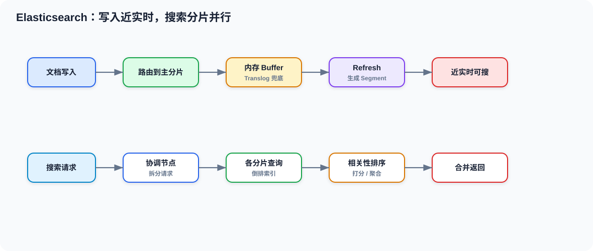

# Elasticsearch 面试实用学习文档

> 适合 3-5 年 Java 工程师面试冲刺。目标不是只会写查询 DSL，而是能把倒排索引、分片副本、写入链路、搜索链路、相关性、聚合、深分页、集群治理、线上排查讲清楚，同时掌握 ES 8.x 向量搜索（dense_vector / kNN / HNSW）在 RAG 场景中的应用。



## 先看一个直观示例：商品搜索

Elasticsearch 最直观的作用是：**让用户按关键词、分类、价格区间、品牌、排序等条件快速搜索商品**。MySQL 可以做精确查询，但面对全文检索、相关性排序、聚合筛选时会很吃力。

先设计一个商品索引：

```json
PUT /product_index
{
  "mappings": {
    "properties": {
      "id": { "type": "keyword" },
      "title": {
        "type": "text",
        "analyzer": "ik_max_word",
        "fields": {
          "keyword": { "type": "keyword" }
        }
      },
      "brand": { "type": "keyword" },
      "categoryId": { "type": "keyword" },
      "price": { "type": "integer" },
      "status": { "type": "keyword" },
      "createdAt": { "type": "date" }
    }
  }
}
```

写入一个商品文档：

```json
POST /product_index/_doc/10001
{
  "id": "10001",
  "title": "Java 面试突击手册 Redis Spring Cloud Elasticsearch",
  "brand": "tech-book",
  "categoryId": "book",
  "price": 9900,
  "status": "ON_SALE",
  "createdAt": "2026-05-09T10:00:00"
}
```

用户搜索“Java Redis”，并按状态、分类、价格过滤，同时按相关性和时间排序：

```json
POST /product_index/_search
{
  "from": 0,
  "size": 20,
  "_source": ["id", "title", "brand", "price"],
  "query": {
    "bool": {
      "must": [
        { "match": { "title": "Java Redis" } }
      ],
      "filter": [
        { "term": { "status": "ON_SALE" } },
        { "term": { "categoryId": "book" } },
        { "range": { "price": { "gte": 1000, "lte": 20000 } } }
      ]
    }
  },
  "sort": [
    { "_score": "desc" },
    { "createdAt": "desc" }
  ],
  "aggs": {
    "brand_count": {
      "terms": { "field": "brand" }
    }
  }
}
```

这个例子里 ES 做了几件 MySQL 不擅长的事：

1. `title` 分词后做全文检索。
2. `filter` 做精确过滤，不参与打分。
3. `_score` 做相关性排序。
4. `aggs` 做品牌聚合，支撑前端筛选项。
5. `_source` 控制返回字段，减少网络传输。

工程上通常是：MySQL 存事实数据，ES 存搜索视图。商品变更后通过 MQ 或 binlog 同步到 ES，接受短暂最终一致。

## 目录

- [一、Elasticsearch 面试主线](#一elasticsearch-面试主线)
- [二、Elasticsearch 到底解决什么问题](#二elasticsearch-到底解决什么问题)
- [三、核心概念：Index、Document、Shard、Replica](#三核心概念indexdocumentshardreplica)
- [四、倒排索引与分词原理](#四倒排索引与分词原理)
- [五、写入链路与近实时搜索](#五写入链路与近实时搜索)
- [六、搜索链路、打分与聚合](#六搜索链路打分与聚合)
- [七、Mapping、Analyzer 与字段设计](#七mappinganalyzer-与字段设计)
- [八、深分页、排序与性能优化](#八深分页排序与性能优化)
- [九、高级用法与工程场景](#九高级用法与工程场景)
- [十、常见线上问题与排查](#十常见线上问题与排查)
- [十一、面试高频回答模板](#十一面试高频回答模板)
- [十二、ES 8.x 向量搜索与 RAG 场景](#十二es-8x-向量搜索与-rag-场景)

---

## 一、Elasticsearch 面试主线

四年 Java 工程师面试 ES，常见追问链路是：

```text
为什么用 ES
  -> 倒排索引是什么
  -> 写入为什么不是立刻可搜
  -> 分片和副本怎么设计
  -> keyword 和 text 区别
  -> match 和 term 区别
  -> 深分页为什么慢
  -> 聚合为什么吃内存
  -> ES 和 MySQL 数据一致性怎么做
  -> 集群黄/红、写入慢、查询慢怎么排查
  -> ES 8.x 怎么做向量搜索（dense_vector / kNN）
  -> 为什么 RAG 场景选 ES 而不是专用向量库
  -> HNSW 索引原理是什么
```

面试官不是想听你背 DSL，而是想确认你理解：  
**ES 是搜索引擎，不是关系型数据库替代品。**

---

## 二、Elasticsearch 到底解决什么问题

ES 核心解决的是：

1. 全文检索
2. 多条件复杂搜索
3. 日志检索分析
4. 近实时查询
5. 聚合统计

典型 Java 业务场景：

| 场景 | 为什么适合 ES |
| --- | --- |
| 商品搜索 | 分词、相关性排序、过滤、聚合 |
| 日志检索 | 大量文本检索、时间范围筛选 |
| 用户行为分析 | 聚合统计 |
| 订单后台检索 | 多条件组合查询 |
| 内容搜索 | 高亮、召回、相关性 |

### 2.1 不适合什么

ES 不适合：

- 强事务
- 高频单行更新
- 复杂 Join
- 替代核心账务库

更成熟的表达是：

> ES 适合搜索和分析，不适合作为强一致事务数据库。工程上通常是 MySQL 承载事实数据，ES 承载搜索视图，两者之间通过同步链路做最终一致。

---

## 三、核心概念：Index、Document、Shard、Replica

### 3.1 基础概念

| 概念 | 类比 | 说明 |
| --- | --- | --- |
| Index | 数据库表的搜索视图 | 一类文档集合 |
| Document | 一行数据 | JSON 文档 |
| Field | 字段 | 文档属性 |
| Shard | 数据分片 | Index 被拆成多个分片 |
| Replica | 副本 | 提高可用性和读能力 |

### 3.2 分片为什么重要

分片决定：

- 数据怎么分布
- 查询怎么并行
- 单分片大小是否健康
- 后续扩展成本

### 3.3 分片不是越多越好

分片过多会带来：

- 集群元数据膨胀
- 查询扇出变大
- JVM heap 压力
- 文件句柄和 segment 数量增多

分片过少会带来：

- 单分片过大
- 迁移恢复慢
- 并行度不足

### 3.4 副本的价值

副本用于：

- 高可用
- 提升读吞吐

但副本也会增加：

- 写入复制成本
- 存储成本

---

## 四、倒排索引与分词原理

### 4.1 倒排索引是什么

正排索引像这样：

```text
文档 -> 包含哪些词
```

倒排索引像这样：

```text
词 -> 出现在哪些文档
```

例如：

```text
doc1: Java Redis 面试
doc2: Java Elasticsearch 搜索

倒排：
Java -> doc1, doc2
Redis -> doc1
Elasticsearch -> doc2
搜索 -> doc2
```

全文检索快，关键就是因为可以先按词找到候选文档，再做过滤和排序。

### 4.2 分词 Analyzer 做什么

Analyzer 通常包含：

1. Character Filter
2. Tokenizer
3. Token Filter

本质上是把文本处理成 token。

### 4.3 `text` 和 `keyword` 区别

这两个类型的本质区别在于数据怎么存：`keyword` 存原样值，`text` 存分词后的 token。

```text
字段值: "Java Redis 面试突击"

keyword 存储: "Java Redis 面试突击"（一整块，不做任何处理）
text 存储（standard analyzer）: ["java", "redis", "面试", "突击"]（分词后的小写 token）
```

`keyword` 适合精确匹配场景：状态码 `ON_SALE`、分类 ID `book`、用户 ID、标签。你可以把它理解成 MySQL 的 `VARCHAR` 加了索引，等值查询、范围查询、聚合、排序都没问题。

`text` 适合全文搜索场景：用户拿一段自然语言来搜，需要召回语义相关的文档。倒排索引里存的是分词后的 token 到文档的映射，原始文本本身不在倒排里。

| 类型 | 是否分词 | 适用场景 | 能聚合/排序 | 能全文搜索 |
| --- | --- | --- | --- | --- |
| `text` | 是 | 全文搜索 | 不建议（聚合的是 token 不是原文） | 是 |
| `keyword` | 否 | 精确匹配、排序、聚合 | 是 | 只能精确匹配 |

高频坑：

- 对 `text` 做聚合，出来的 key 是分词后的 token 而不是原文。比如 100 篇标题 `"Java 面试 xxx"` 的文章，聚合结果是 `"java"` 出现 100 次，而不是每个标题一个桶
- 对 `keyword` 做全文搜索，ES 会把搜索词和整个字段值做精确比较。搜 `"redis"` 匹配不到 `"Java Redis 面试突击"`，因为整块字符串不相等

工程上常用 `fields` 多字段映射，让同一个字段既能全文搜索又能精确匹配：

```json
"title": {
  "type": "text",
  "analyzer": "ik_max_word",
  "fields": {
    "keyword": { "type": "keyword" }
  }
}
```

这样 `title` 走全文搜索，`title.keyword` 走精确匹配和聚合。

### 4.4 `match` 和 `term` 区别

这两个查询的区别和上面的字段类型是一一对应的：**字段类型决定数据怎么存，查询方式决定数据怎么查**。

`term` 不做任何分析。你写 `{"term": {"status": "ON_SALE"}}`，ES 直接拿 `"ON_SALE"` 去倒排索引里精确查找。它和 `keyword` 字段是天然搭档。

你也可以对 `text` 字段用 `term`，但这时候 ES 是拿你的输入去和分词后的 token 做精确比较，不是和原文比。这里有一个容易踩的坑：

```text
文档: "Java Redis 面试"  →  text 分词后: ["java", "redis", "面试"]

{"term": {"title": "redis"}}  → 命中（token 里有小写 "redis"）
{"term": {"title": "Redis"}}  → 不命中（token 是小写，大写 "Redis" 不等）
```

这种行为很反直觉，所以一般**不对 `text` 字段用 `term`**。

`match` 会先分析你的输入。你写 `{"match": {"title": "Java Redis 实战"}}`，ES 先把 `"Java Redis 实战"` 也过一遍 Analyzer，拆成 `["java", "redis", "实战"]`，然后用这些 token 分别去倒排索引里查，把命中的文档按相关性打分排序。这是全文搜索的标准用法。

`match` 内部其实是多个 `term` 查询的 OR 组合（默认），可以通过 `operator` 参数控制：

```json
// 默认 or：包含 java 或 redis 的文档都返回，按命中数量打分
{"match": {"title": "Java Redis"}}

// and：必须同时包含 java 和 redis 才返回
{"match": {"title": {"query": "Java Redis", "operator": "and"}}}
```

| 查询 | 是否分析输入 | 适合字段类型 | 典型场景 |
| --- | --- | --- | --- |
| `match` | 是 | `text` | 全文搜索、自然语言查询 |
| `term` | 否 | `keyword` | 状态过滤、ID 精确匹配、标签筛选 |

面试表达：

> `match` 面向全文检索，会对查询文本做分词分析再匹配倒排索引；`term` 面向精确值匹配，不做任何分析直接查倒排词项。字段是 `text` 还是 `keyword` 决定了应该用哪种查询，选错了要么召回为零，要么结果不符合预期。

---

## 五、写入链路与近实时搜索

### 5.1 写入链路

一次写入大致是：

```text
客户端请求
  -> 协调节点
  -> 路由到主分片
  -> 写入内存 buffer
  -> 写 translog
  -> 同步到副本分片
  -> 返回结果
```

### 5.2 为什么 ES 是近实时

因为写入后不是每次都立刻生成可搜索 segment。  
通常要等 refresh，把内存中的数据刷新成新的 segment，搜索才能看到。

所以 ES 是：

- Near Real Time

不是严格实时。

### 5.3 translog 的作用

translog 用来保证：

- 崩溃恢复时不丢已确认写入

segment 负责搜索，translog 负责恢复兜底。

### 5.4 refresh、flush、merge 区别

| 动作 | 含义 |
| --- | --- |
| refresh | 生成可搜索 segment |
| flush | 持久化并清理 translog |
| merge | 合并小 segment |

### 5.5 写入优化常见手段

1. 批量写入 Bulk
2. 合理调大 refresh interval
3. 控制副本数
4. 避免频繁更新
5. 使用合理路由减少热点

---

## 六、搜索链路、打分与聚合

### 6.1 搜索链路

大致是：

```text
请求到协调节点
  -> 分发到相关分片
  -> 每个分片本地查询
  -> 各分片返回 TopN
  -> 协调节点归并排序
  -> 返回结果
```

### 6.2 为什么查询会慢

常见原因：

- 查询命中范围太大
- 分片过多导致扇出大
- 深分页
- 脚本查询
- 高基数字段聚合
- 没有利用 filter cache

### 6.3 Query 和 Filter 区别

| 类型 | 是否打分 | 适用 |
| --- | --- | --- |
| Query | 是 | 需要相关性 |
| Filter | 否 | 精确过滤 |

工程实践：

- 条件过滤尽量放 filter
- 需要搜索相关性才用 query

### 6.4 聚合为什么可能吃内存

聚合需要在分片上收集大量候选数据，再汇总。  
如果字段基数很高，比如用户 ID、订单号，聚合压力会很大。

---

## 七、Mapping、Analyzer 与字段设计

### 7.1 Mapping 设计决定后期成本

ES 字段设计一旦不合理，后面修复往往需要重建索引。

常见原则：

1. 精确匹配字段用 `keyword`
2. 全文检索字段用 `text`
3. 金额用整数分存储，避免浮点误差
4. 时间字段使用 date
5. 控制字段数量，避免 mapping 爆炸

### 7.2 Dynamic Mapping 的风险

自动推断虽然方便，但容易导致：

- 类型不符合预期
- 字段无限膨胀
- 后续查询异常

生产建议：

- 核心索引显式 mapping

### 7.3 中文分词

中文搜索一般需要中文分词器，否则会出现召回差的问题。

要关注：

- 分词粒度
- 同义词
- 停用词
- 业务词典

---

## 八、深分页、排序与性能优化

### 8.1 深分页为什么慢

`from + size` 深分页会让每个分片都取更大的候选集，协调节点再合并。

比如：

```text
from = 100000, size = 20
```

不是只取 20 条，而是要跳过大量结果。

### 8.2 解决方式

| 方案 | 场景 |
| --- | --- |
| `search_after` | 深翻页，基于排序游标 |
| Scroll | 大批量导出，不适合用户实时翻页 |
| 限制最大翻页深度 | 搜索产品常用 |

### 8.3 排序字段注意点

排序字段最好：

- doc_values 友好
- 基数合理
- 类型明确

不要对分词字段直接排序。

### 8.4 常见优化手段

1. 减少返回字段
2. filter 替代 query 过滤
3. 使用 routing 降低查询分片数
4. 控制索引和分片规模
5. 避免高基数大聚合

---

## 九、高级用法与工程场景

### 9.1 MySQL 同步 ES

常见方式：

- 业务双写
- MQ 异步同步
- Binlog 订阅同步

更推荐：

- MySQL 做事实源
- ES 做查询视图
- 通过消息或 binlog 保证最终一致

### 9.2 索引别名与零停机重建

典型流程：

1. 建新索引
2. 全量导入
3. 增量同步
4. 切换 alias
5. 下线旧索引

这是 ES 生产里非常常用的高级实践。

### 9.3 热温冷数据

日志类数据常按时间分层：

- 热数据：高频查询
- 温数据：低频查询
- 冷数据：归档

这样能平衡成本和性能。

### 9.4 搜索相关性调优

常见手段：

- 字段权重
- boost
- 同义词
- 业务排序因子
- function score

---

## 十、常见线上问题与排查

### 10.1 集群 yellow / red

yellow：

- 主分片可用，副本未完全分配

red：

- 有主分片不可用，影响读写

排查方向：

- 节点是否宕机
- 磁盘水位
- 分片分配规则
- 副本数是否超过节点数

### 10.2 写入慢

看：

1. refresh interval 是否太短
2. bulk size 是否合理
3. 磁盘 IO 是否高
4. 副本数是否过多
5. 是否有热点分片

### 10.3 查询慢

看：

1. 是否深分页
2. 是否大范围扫描
3. 是否脚本查询
4. 是否高基数聚合
5. 分片数量是否过多

### 10.4 JVM heap 高

常见原因：

- 大聚合
- mapping 太多
- fielddata 误用
- segment / shard 太多

---

## 十一、面试高频回答模板

### 11.1 ES 为什么适合搜索

> ES 底层基于倒排索引，把“文档包含哪些词”转成“词出现在哪些文档”，所以全文检索时能快速召回候选文档，再进行过滤和相关性排序。

### 11.2 ES 为什么是近实时

> 文档写入后会先进入内存 buffer 并写 translog，只有 refresh 生成新的可搜索 segment 后，搜索才能看到这批数据，所以 ES 是近实时，不是严格实时。

### 11.3 text 和 keyword 区别

> `keyword` 存原样值，不分词，适合精确匹配、排序和聚合；`text` 存分词后的 token，适合全文搜索。工程上常用 `fields` 多字段映射，同一个字段 `title` 走全文搜索，`title.keyword` 走精确匹配和聚合。选错了类型，聚合结果不符合预期或者全文搜索召回为零。

### 11.4 深分页为什么慢

> `from + size` 深分页会让每个分片取大量候选结果，再由协调节点归并排序，页数越深浪费越大。深翻页更适合用 `search_after`，大批量导出则用 Scroll 类方案。

### 11.5 MySQL 和 ES 一致性怎么做

> 通常 MySQL 做事实数据源，ES 做搜索视图，通过 MQ 或 binlog 同步实现最终一致。写入 ES 失败时要有重试、补偿和对账机制，不能把 ES 当强一致主库。

### 11.6 ES 怎么做向量搜索

> ES 8.x 原生支持 `dense_vector` 字段类型和 kNN 搜索。文本通过 Embedding 模型转成高维向量存入 ES，查询时对问题也做 Embedding，再用 kNN 基于 HNSW 索引做近似最近邻搜索，毫秒级返回 topK 语义最相似的文档。

### 11.7 HNSW 索引是什么

> HNSW 是一种分层图索引。高层节点稀疏、连接跨度大，负责快速粗定位；低层节点密集，负责精确搜索。查询从最高层贪心搜索逐层下降到 Layer 0，时间复杂度接近 O(logN)，是 ES 向量搜索性能的基础。

### 11.8 为什么 RAG 场景选 ES 而不是专用向量库

> 知识库规模在百万级以内时，ES 向量检索性能和专用库无差距，而且 ES 天然支持混合搜索（向量 + 关键词 + 过滤），团队有运维经验，不需要额外引入中间件。如果后续规模到亿级或对延迟有极致要求再考虑迁移。

---

## 十二、ES 8.x 向量搜索与 RAG 场景

ES 8.x 最大的变化之一是原生支持向量搜索。这让 ES 从纯文本搜索引擎进化为可以同时做文本检索和语义检索的混合搜索平台，也是 RAG（检索增强生成）架构中向量存储的热门选型。

### 012.1 向量搜索解决什么问题

传统搜索靠关键词匹配，遇到语义近似但关键词不同的情况就无能为力：

```text
用户搜索："怎么让 Redis 数据不丢"
文档内容："Redis 的 RDB 持久化和 AOF 持久化机制"
```

关键词完全不重叠，`match` 查询召回为零。但这两段话语义高度相关。向量搜索就是解决这个问题的——把文本转成高维向量，用向量之间的几何距离衡量语义相似度。

### 12.2 dense_vector 字段类型

ES 8.x 用 `dense_vector` 字段存储向量：

```json
PUT /knowledge_chunks
{
  "mappings": {
    "properties": {
      "chunk_text": { "type": "text", "analyzer": "ik_max_word" },
      "chunk_vector": {
        "type": "dense_vector",
        "dims": 1024,
        "index": true,
        "similarity": "cosine"
      },
      "doc_id": { "type": "keyword" },
      "knowledge_base_id": { "type": "keyword" },
      "heading_path": { "type": "keyword" }
    }
  }
}
```

关键参数：

| 参数 | 说明 |
| --- | --- |
| `dims` | 向量维度，必须和 Embedding 模型输出一致（如 bge-m3 是 1024） |
| `index` | `true` 启用 HNSW 索引，支持 kNN 搜索；`false` 只能暴力扫描 |
| `similarity` | 相似度算法：`cosine`（余弦，最常用）、`dot_product`（点积）、`l2_norm`（欧氏距离） |

`dims` 一旦设定不能改，改维度需要重建索引。

### 12.3 kNN 搜索

向量写入后，用 kNN 查询找语义最相似的 topK 文档：

```json
POST /knowledge_chunks/_search
{
  "knn": {
    "field": "chunk_vector",
    "query_vector": [0.012, -0.034, ..., 0.056],
    "k": 5,
    "num_candidates": 50
  }
}
```

| 参数 | 说明 |
| --- | --- |
| `field` | dense_vector 字段名 |
| `query_vector` | 查询文本经 Embedding 模型生成的向量 |
| `k` | 返回的最相似文档数 |
| `num_candidates` | 每个分片采集的候选数，越大召回越准但越慢，一般设为 k 的 5~10 倍 |

kNN 搜索的返回结果自带 `_score`，分数越高语义越相似。

### 12.4 混合搜索：向量 + 传统检索

ES 8.x 支持把 kNN 和传统 query 组合在一起，这是比纯向量搜索更实用的模式：

```json
POST /knowledge_chunks/_search
{
  "knn": {
    "field": "chunk_vector",
    "query_vector": [0.012, -0.034, ..., 0.056],
    "k": 5,
    "num_candidates": 50
  },
  "query": {
    "bool": {
      "must": [
        { "match": { "chunk_text": "Redis 持久化" } }
      ],
      "filter": [
        { "term": { "knowledge_base_id": "kb_001" } }
      ]
    }
  },
  "size": 10
}
```

这种写法下 ES 会同时执行 kNN 和 bool query，两者的结果通过 Reciprocal Rank Fusion（RRF）合并排序。关键词能命中的文档和语义相关的文档都能被召回，覆盖面更广。

工程上还有一种用法：用 `filter` 做预过滤再做 kNN，比如限定知识库 ID、文档状态等，缩小向量搜索范围：

```json
"knn": {
  "field": "chunk_vector",
  "query_vector": [...],
  "k": 5,
  "num_candidates": 50,
  "filter": { "term": { "knowledge_base_id": "kb_001" } }
}
```

### 12.5 HNSW 索引原理

ES 8.x 的 kNN 底层用 HNSW（Hierarchical Navigable Small World）算法，面试高频考点。

**直觉理解**：想象你要在一个城市里找一家特定的咖啡店。你不会挨家挨户找（暴力扫描），而是先看大区域路标（高层图），确定大致片区，再看小街道标识（低层图），逐步逼近目标。

HNSW 的核心思想：

```text
Layer 2（最稀疏）:  A -------- D                    跳得远，粗定位
                    |           |
Layer 1（中等）:    A --- B --- D --- F              中等粒度
                    |     |     |     |
Layer 0（最密）:    A-B-C-D-E-F-G-H-I-J            逐个比较，精确定位
```

构建时，每个向量节点被随机分配到若干层。高层节点稀疏、连接跨度大，负责快速粗定位；低层节点密集、连接短，负责精确搜索。查询从最高层入口开始贪心搜索，逐层下降，最终在 Layer 0 找到最近邻。

关键参数：

| 参数 | 含义 | 调优方向 |
| --- | --- | --- |
| `m` | 每层每个节点的最大连接数 | m 大 → 召回率高，内存占用大 |
| `ef_construction` | 构建索引时的搜索宽度 | 大 → 索引质量高，构建慢 |
| `ef_search`（查询时） | 搜索时的候选队列大小 | 大 → 召回率高，查询慢 |

ES 默认 `m=16, ef_construction=100`，对大多数场景够用。

### 12.6 内存开销估算

HNSW 索引需要常驻堆外内存（off-heap），这是向量搜索的主要成本：

```text
单条向量内存 ≈ dims × 4 bytes（float32） × HNSW 系数（约 2~3 倍）
```

以 bge-m3（1024 维）为例：

| 数据量 | 向量原始大小 | HNSW 索引约占用 |
| --- | --- | --- |
| 10 万条 | ~400MB | ~1GB |
| 100 万条 | ~4GB | ~10GB |
| 1000 万条 | ~40GB | ~100GB |

学习阶段几千条 chunk 数据，内存开销可以忽略。生产环境百万级以上需要考虑节点内存规划。

### 12.7 Embedding 接入流程

向量搜索的前提是有 Embedding 模型把文本转成向量。典型的 RAG 写入和查询流程：

```text
【写入流程】
原始文档
  -> 文档解析（Markdown/PDF/Word）
  -> 文本切分（按标题/段落，控制 chunk 大小）
  -> 调 Embedding API（如 bge-m3）得到 1024 维向量
  -> 写入 ES（chunk_text + chunk_vector + 元数据）

【查询流程】
用户提问
  -> 调 Embedding API 把问题转成向量
  -> ES kNN 搜索找 topK 最相似的 chunk
  -> 把 chunk 文本作为上下文拼进 Prompt
  -> 调 LLM 生成带引用的回答
```

这就是 RAG 的完整链路，ES 在其中承担向量存储和语义检索的角色。

### 12.8 ES 向量搜索 vs 专用向量数据库

| 维度 | ES 8.x | Milvus / Qdrant |
| --- | --- | --- |
| 向量检索性能 | 百万级内无差距 | 亿级场景更优 |
| 混合搜索 | 天然支持（kNN + bool + agg） | 需要额外集成 |
| 全文检索 | 原生强项 | 不支持或很弱 |
| 运维复杂度 | 已有 ES 集群即可复用 | 新增中间件 |
| 生态成熟度 | 监控、备份、分片管理完善 | 相对年轻 |
| 适用场景 | 中小规模 RAG、企业知识库 | 大规模纯向量检索 |

面试表达：

> 我们选 ES 做向量存储是因为知识库规模在百万级以内，ES 原生支持混合搜索（向量 + 关键词 + 过滤），而且团队已有 ES 运维经验，不需要额外引入专用向量库增加系统复杂度。如果后续向量规模到亿级或对延迟有极致要求，可以考虑迁移到 Milvus。

### 12.9 向量搜索常见面试追问

**Q：cosine 和 dot_product 区别？**
cosine 衡量的是方向相似度（归一化后等价于点积），不受向量长度影响；dot_product 要求向量先归一化，ES 会做优化跳过除法。如果 Embedding 模型输出的向量已经归一化，用 `dot_product` 性能更好。

**Q：num_candidates 设多少合适？**
经验值是 k 的 5~10 倍。设太小召回不够（可能漏掉真正相似的文档），设太大性能下降。生产上一般先设 10 倍，根据实际召回效果微调。

**Q：向量字段能更新吗？**
可以。对同一个 document ID 做 index 操作会覆盖旧向量。但维度不能变，变维度必须重建索引。

**Q：kNN 和 script_score 暴力搜索区别？**
kNN 走 HNSW 索引，近似最近邻，速度快但结果不是 100% 精确；script_score 是全量扫描精确计算距离，数据量大时极慢。生产环境用 kNN，调试或小数据量可以用 script_score 做 baseline 对比。

---

## 最后建议

ES 面试最值钱的一条线是：

> 倒排索引为什么适合搜索，写入为什么近实时，分片副本怎么影响性能，Mapping 为什么要提前设计，深分页和聚合为什么容易慢，ES 8.x 怎么做向量搜索以及为什么 RAG 场景选 ES。

这条线讲顺，ES 就能从”会写 DSL”升级成”懂搜索系统工程边界”，再升级到”懂向量检索与混合搜索架构”。
