# JVM 面试实用学习文档

> 适合 3-5 年 Java 工程师面试准备。目标不是死背概念，而是能把 JVM 的原理、参数、GC、线上排查讲清楚，并且能落到真实问题定位。

## 目录

- [一、JVM 学习重点总览](#一jvm-学习重点总览)
- [二、JVM 运行时内存结构](#二jvm-运行时内存结构)
- [三、对象创建、内存布局与分配优化](#三对象创建内存布局与分配优化)
- [四、类加载机制](#四类加载机制)
- [五、垃圾回收基础](#五垃圾回收基础)
- [六、垃圾回收算法](#六垃圾回收算法)
- [七、常见垃圾收集器](#七常见垃圾收集器)
- [八、常用 JVM 参数](#八常用-jvm-参数)
- [九、GC 日志怎么看](#九gc-日志怎么看)
- [十、线上 JVM 问题排查详解](#十线上-jvm-问题排查详解)
- [十一、JMM Java 内存模型](#十一jmm-java-内存模型)
- [十二、面试高频问题回答模板](#十二面试高频问题回答模板)
- [十三、建议复习路线](#十三建议复习路线)
- [十四、最后的复习建议](#十四最后的复习建议)

---

## 一、JVM 学习重点总览

面试 JVM 时，常见问题可以分成四类：

| 类型 | 需要掌握什么 | 面试期待 |
| --- | --- | --- |
| 基础原理 | 内存结构、类加载、对象创建、GC Roots | 能讲清楚基本概念，不混淆 |
| GC 机制 | GC 算法、CMS、G1、ZGC、Full GC 触发原因 | 能解释为什么这么设计 |
| 参数调优 | 堆大小、栈大小、元空间、GC 日志、OOM dump | 能结合生产环境说出配置依据 |
| 问题排查 | CPU 飙高、内存泄漏、频繁 Full GC、死锁、OOM | 能讲出完整定位链路 |

对 3-5 年 Java 工程师来说，最加分的是：

1. 能结合线上服务讲 JVM 参数配置。
2. 能看懂 GC 日志。
3. 能讲清楚 Full GC、OOM、CPU 飙高的排查步骤。
4. 能解释 CMS、G1、ZGC 的适用场景。
5. 能把 JVM 和并发里的 JMM、`volatile`、`synchronized` 串起来。

### 1.1 JVM 整体架构怎么理解

从整体架构看，JVM 可以理解为五个核心部分协同完成一件事：**把 `.class` 字节码加载到内存中，解释或编译成本地指令执行，并在运行过程中管理内存和回收无用对象**。

| 组件 | 核心职责 | 面试要点 |
| --- | --- | --- |
| 类加载子系统 | 加载 `.class` 文件，并转换成 JVM 可识别的运行时数据结构 | 重点掌握加载、链接、初始化，以及双亲委派模型 |
| 运行时数据区 | 管理程序运行时需要的内存区域 | 重点掌握堆、栈、方法区、程序计数器、本地方法栈 |
| 执行引擎 | 执行字节码，把字节码转换成底层机器可以执行的指令 | 重点掌握解释器、JIT、垃圾回收器之间的关系 |
| 本地方法接口 JNI | 让 Java 代码可以调用 C/C++ 等本地方法 | 重点理解 `native` 方法为什么能访问操作系统或本地库能力 |
| 本地方法库 | 提供本地方法的具体实现 | 例如 `System.currentTimeMillis()` 底层会调用操作系统能力 |

可以把一次 Java 程序运行串成下面这条链路：

```text
.java 源码
  -> javac 编译成 .class 字节码
  -> 类加载子系统加载、链接、初始化
  -> 运行时数据区保存类信息、对象、栈帧等运行数据
  -> 执行引擎通过解释执行或 JIT 编译执行字节码
  -> GC 在运行过程中回收不可达对象
  -> JNI 在需要时调用本地方法库
```

**类加载子系统**主要包括三个大阶段：

| 阶段 | 做什么 | 容易被问到的点 |
| --- | --- | --- |
| 加载 Loading | 查找并读取 `.class` 字节流，在内存中生成对应的 `Class` 对象 | 类加载器、双亲委派 |
| 链接 Linking | 包括验证、准备、解析 | 准备阶段给静态变量赋默认值，解析阶段把符号引用转成直接引用 |
| 初始化 Initialization | 执行静态变量赋值和 `static` 代码块 | `<clinit>`、主动使用触发初始化 |

**运行时数据区**是 JVM 面试最常考的部分，但要注意它和 JMM 不是一回事：

- JVM 运行时数据区讲的是 JVM 进程里的内存区域划分，比如堆、栈、方法区。
- JMM Java 内存模型讲的是多线程下共享变量的可见性、有序性和 happens-before 规则。
- 面试里说“JVM 内存模型”时，很多人实际想问运行时数据区，回答时可以先澄清一下，更显得专业。

**执行引擎**可以这样理解：

- 解释器启动快，逐条解释执行字节码，适合程序刚启动时快速运行。
- JIT 编译器会把热点代码编译成本地机器码，后续执行效率更高。
- 垃圾回收器负责自动回收堆中不再可达的对象，减少手动管理内存的负担。

面试可以这样回答：

> JVM 整体上可以分成类加载子系统、运行时数据区、执行引擎、本地方法接口和本地方法库。类加载子系统负责把 `.class` 加载进 JVM；运行时数据区负责保存对象、栈帧、类元信息等运行数据；执行引擎负责解释执行或 JIT 编译执行字节码，同时配合 GC 做内存回收；JNI 和本地方法库则让 Java 能调用操作系统或 C/C++ 实现的底层能力。

---

## 二、JVM 运行时内存结构

### 2.1 总体结构图

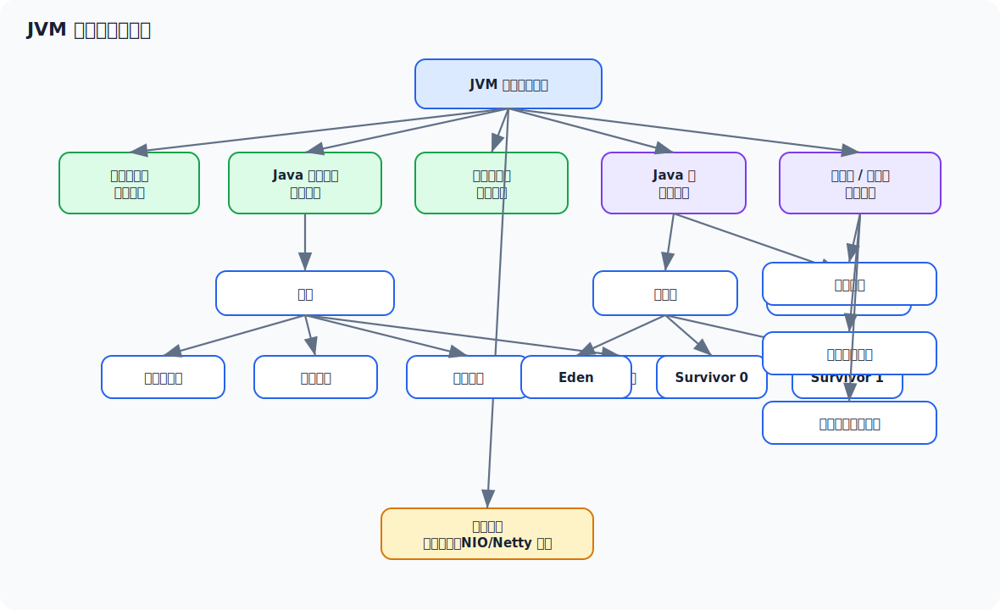

### 2.2 各区域作用

| 区域 | 线程是否共享 | 主要存放内容 | 常见异常 |
| --- | --- | --- | --- |
| 程序计数器 | 线程私有 | 当前线程执行的字节码行号指示器 | 基本不会 OOM |
| Java 虚拟机栈 | 线程私有 | 栈帧、局部变量、方法调用信息 | `StackOverflowError`、`OutOfMemoryError` |
| 本地方法栈 | 线程私有 | Native 方法调用信息 | `StackOverflowError`、`OutOfMemoryError` |
| Java 堆 | 线程共享 | 对象实例、数组 | `Java heap space` |
| 方法区 / 元空间 | 线程共享 | 类元信息、常量池、方法元信息 | `Metaspace` |
| 直接内存 | 线程共享 | NIO、Netty 常用的堆外内存 | `Direct buffer memory` |

### 2.3 堆和栈的区别

**栈：**

- 跟线程生命周期一致。
- 方法调用时创建栈帧，方法结束后栈帧出栈。
- 存放局部变量、操作数栈、返回地址等。
- 空间一般较小。
- 访问速度快。

**堆：**

- 所有线程共享。
- 主要存放对象实例和数组。
- 是 GC 管理的主要区域。
- 空间通常较大。
- 容易发生内存泄漏、频繁 GC、OOM。

面试可以这样回答：

> 栈是线程私有的，主要服务于方法调用；堆是线程共享的，主要存放对象实例。栈里的数据随着方法调用结束自动释放，堆里的对象需要由 GC 判断是否可达后回收。

### 2.4 Java 堆分代：Eden、新生代、老年代

Java 堆是 GC 管理的主要区域。为了让垃圾回收更高效，经典分代收集思路会把堆划分为**新生代**和**老年代**，新生代里又通常包含 **Eden 区**和两个 **Survivor 区**。

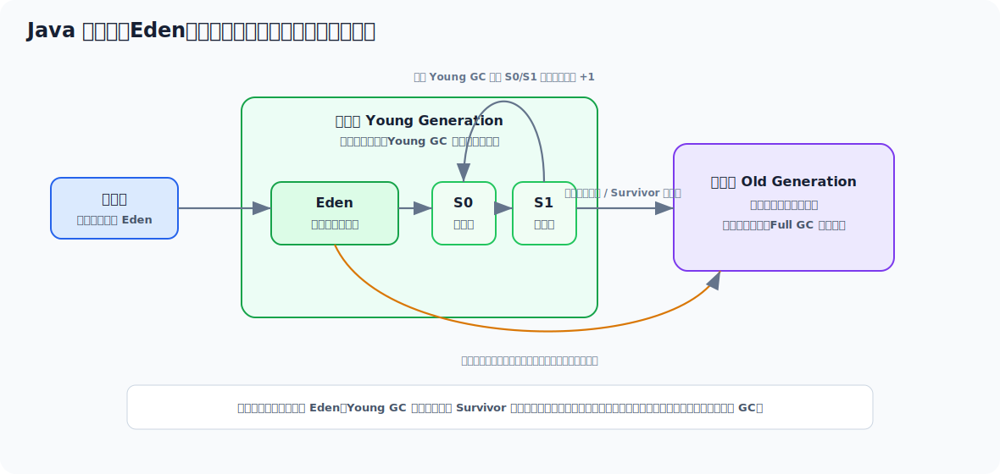

这套设计背后的核心假设叫**分代假说**：

1. 大多数对象都是朝生夕死的，很快就会变成垃圾。
2. 熬过多次 GC 的对象，后续继续存活的概率更高。

所以 JVM 不会每次都扫描整个堆，而是把对象按“年龄”和“存活特征”分开管理。

#### 2.4.1 Eden 区是什么

Eden 是新对象最主要的分配区域。

大多数普通对象创建时，会先尝试分配到：

```text
线程 TLAB -> Eden 区 -> 慢路径分配
```

Eden 的特点：

| 特征 | 说明 |
| --- | --- |
| 对象来源 | 大多数新创建对象 |
| 对象生命周期 | 通常很短，很多对象在下一次 Young GC 就会被回收 |
| GC 触发 | Eden 空间不足时，常触发 Young GC / Minor GC |
| 回收算法 | 通常适合复制算法，因为存活对象少 |
| 性能影响 | Eden 太小会导致 Young GC 频繁 |

为什么对象优先放 Eden？

因为绝大多数临时对象很快就没用了，比如：

```java
public String buildMessage(User user) {
    StringBuilder builder = new StringBuilder();
    builder.append(user.getName());
    builder.append(":");
    builder.append(System.currentTimeMillis());
    return builder.toString();
}
```

这类方法调用过程中创建的中间对象，很多执行完就不可达。如果它们都直接进入老年代，老年代很快会膨胀，Full GC 压力会很大。

#### 2.4.2 新生代是什么

新生代包括：

```text
Eden + Survivor 0 + Survivor 1
```

新生代的职责是：**承接新对象，并通过高频、相对轻量的 Young GC 快速清理短命对象**。

新生代对象流转大致是：

```text
新对象进入 Eden
  -> Eden 满触发 Young GC
  -> Eden 中仍然存活的对象复制到 Survivor
  -> Survivor 中存活对象在 S0/S1 之间来回复制，年龄 +1
  -> 达到年龄阈值或 Survivor 放不下时晋升到老年代
```

Survivor 为什么有两个？

因为新生代常用复制算法。两个 Survivor 区一个作为 From，一个作为 To：

```text
本次 GC：Eden + From 中存活对象 -> To
下次 GC：Eden + To 中存活对象 -> From
```

这样可以避免内存碎片，并且只复制少量存活对象。

新生代的典型特征：

| 维度 | 特征 |
| --- | --- |
| 对象年龄 | 年轻对象、短命对象为主 |
| GC 类型 | Young GC / Minor GC |
| GC 频率 | 通常较高 |
| 单次停顿 | 通常比 Full GC 短 |
| 性能风险 | 太小会频繁 Young GC，太大可能单次 Young GC 停顿变长 |

#### 2.4.3 老年代是什么

老年代主要存放：

1. 多次 Young GC 后仍然存活的对象。
2. 大对象。
3. Survivor 区放不下而提前晋升的对象。
4. 长生命周期对象，例如缓存、Spring 单例、线程池任务队列中长期引用的对象等。

老年代的特点：

| 特征 | 说明 |
| --- | --- |
| 对象生命周期 | 通常较长 |
| 空间占用变化 | 增长较慢，但一旦持续上涨要警惕 |
| GC 成本 | 回收成本通常高于新生代 |
| 常见风险 | 晋升过快、老年代空间不足、内存泄漏、Full GC |
| 排查重点 | Full GC 后 Old 区是否明显下降 |

老年代不是“不会回收”，而是回收频率低、成本高。  
如果 Full GC 后老年代占用下降很少，通常说明大量对象仍然被引用，可能存在内存泄漏或长期缓存膨胀。

#### 2.4.4 对象什么时候进入老年代

常见情况有四类：

| 场景 | 说明 |
| --- | --- |
| 年龄达到阈值 | 对象每熬过一次 Young GC，年龄增加，达到阈值后晋升 |
| 动态年龄判断 | Survivor 中某年龄及以上对象总大小超过 Survivor 一半，可能提前晋升 |
| Survivor 放不下 | Young GC 后存活对象太多，Survivor 容纳不了，部分对象进入老年代 |
| 大对象直接进入 | 很大的数组、字符串、批量集合可能直接进入老年代 |

例如下面这种代码容易制造大对象：

```java
byte[] buffer = new byte[20 * 1024 * 1024];
```

如果大对象频繁创建，很容易造成老年代压力，甚至触发 Full GC。

#### 2.4.5 Eden、新生代、老年代的区别总结

| 区域 | 属于哪里 | 主要存放 | GC 特征 | 面试关键词 |
| --- | --- | --- | --- | --- |
| Eden | 新生代 | 大多数新对象 | Eden 满常触发 Young GC | 新对象入口、TLAB、分配快 |
| Survivor | 新生代 | Young GC 后仍存活的年轻对象 | S0/S1 来回复制，年龄增长 | 存活对象缓冲区、年龄判断 |
| 新生代 | Java 堆 | 短命对象为主 | GC 频繁，通常较快 | 朝生夕死、复制算法 |
| 老年代 | Java 堆 | 长期存活对象、大对象 | GC 少但重，Full GC 风险高 | 晋升、内存泄漏、Full GC |

#### 2.4.6 这部分线上怎么用

如果你看到 Young GC 很频繁，优先想：

- Eden 是否太小。
- 对象创建速率是否太高。
- 是否有大量临时对象，比如大 JSON、批量 List、字符串拼接。

如果你看到 Old 区持续上涨，优先想：

- 对象是否晋升过快。
- 是否有缓存不释放。
- 是否有集合、Map、队列持续增长。
- Full GC 后 Old 区能不能降下来。

如果你看到 Full GC 频繁，优先想：

- 老年代是否不足。
- 大对象是否直接进入老年代。
- Young GC 后晋升失败。
- 是否存在内存泄漏。

面试可以这样回答：

> Java 堆按分代思想通常分为新生代和老年代。新生代包括 Eden 和两个 Survivor 区，大多数新对象先进入 Eden，Eden 满时触发 Young GC，存活对象会复制到 Survivor，并随着熬过 GC 次数增加年龄。达到年龄阈值、Survivor 放不下或者是大对象时，对象会进入老年代。新生代对象大多朝生夕死，所以 GC 频繁但通常较快；老年代对象生命周期长，回收成本更高，一旦 Old 区持续上涨或 Full GC 后降不下来，就要重点怀疑内存泄漏或长期引用。

### 2.5 方法区、永久代、元空间的区别

**方法区**是 JVM 规范中的逻辑概念。

**永久代**是 HotSpot 在 Java 8 之前对方法区的一种实现。

**元空间**是 Java 8 之后 HotSpot 对方法区的实现，使用本地内存。

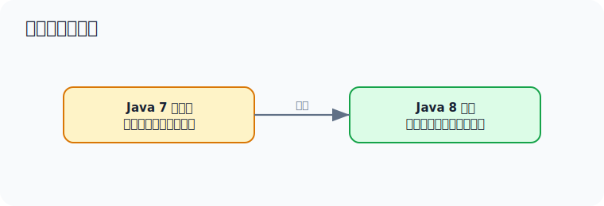

为什么改成元空间？

- 永久代大小较难估算，容易出现 `PermGen space`。
- 元空间使用本地内存，默认情况下受机器内存限制。
- 类元信息管理更灵活。

注意：元空间虽然使用本地内存，但仍然可能 OOM，所以生产环境通常也要配置 `-XX:MaxMetaspaceSize`。

---

## 三、对象创建、内存布局与分配优化

### 3.1 `new Object()` 发生了什么

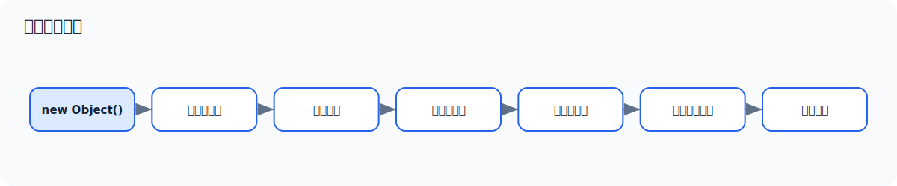

详细过程：

1. **类加载检查**：检查这个类是否已经被加载、解析、初始化。
2. **分配内存**：从堆中划出一块确定大小的内存。
3. **初始化零值**：把对象字段设置为默认值，例如 `int` 为 `0`，引用为 `null`。
4. **设置对象头**：写入 Mark Word、类型指针等信息。
5. **执行构造方法**：调用 `<init>`，执行字段赋值和构造逻辑。
6. **返回引用**：把对象引用返回给调用方。

### 3.2 对象内存布局

HotSpot 中对象通常包括三部分：

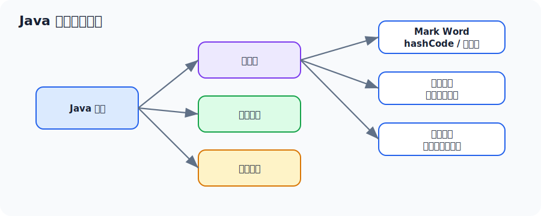

### 3.3 对象一定在堆上分配吗

大多数情况下，对象在堆上分配。

但 JIT 编译器可能通过**逃逸分析**做优化：

- **栈上分配**：对象没有逃出方法作用域时，可能不分配到堆。
- **标量替换**：对象被拆成若干字段直接使用，不再创建完整对象。
- **锁消除**：对象没有线程逃逸时，可能消除无意义的同步。

示例：

```java
public int add() {
    Point point = new Point(1, 2);
    return point.x + point.y;
}
```

如果 `point` 没有逃出 `add()` 方法，JIT 可能不真正创建 `Point` 对象，而是直接用两个局部变量代替。

### 3.4 TLAB 是什么

TLAB：Thread Local Allocation Buffer，线程本地分配缓冲区。

因为堆是线程共享的，如果多个线程同时分配对象，每次都竞争堆指针会影响性能。JVM 会在 Eden 区给每个线程划出一小块私有区域，线程优先在自己的 TLAB 中分配对象。

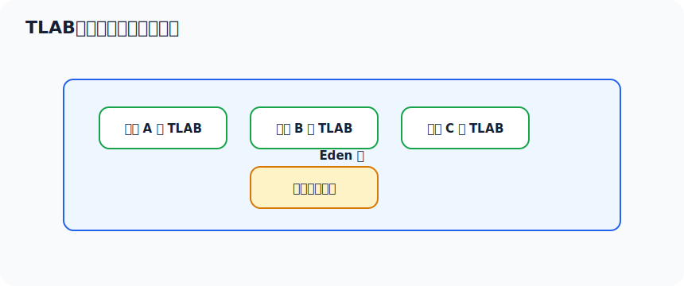

面试可以这样答：

> TLAB 是 Eden 区里给线程预留的小块私有分配空间，用来减少多线程对象分配时的同步开销。对象优先在 TLAB 分配，TLAB 不够时再走慢路径分配。

---

## 四、类加载机制

### 4.1 类加载过程

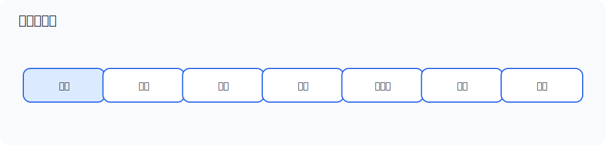

| 阶段 | 做什么 |
| --- | --- |
| 加载 | 通过类名获取二进制字节流，生成 `Class` 对象 |
| 验证 | 验证字节码是否合法、安全 |
| 准备 | 为静态变量分配内存，并设置默认初始值 |
| 解析 | 把符号引用转换为直接引用 |
| 初始化 | 执行静态变量赋值和 `static` 代码块 |

### 4.2 准备阶段和初始化阶段的区别

代码：

```java
public class Demo {
    public static int count = 10;
    public static final int SIZE = 100;

    static {
        count = 20;
    }
}
```

关键点：

- 准备阶段：`count` 先被赋默认值 `0`。
- 初始化阶段：执行 `count = 10`，再执行 `static` 代码块，最终 `count = 20`。
- `static final` 编译期常量比较特殊，`SIZE` 可能在准备阶段就赋值为 `100`。

### 4.3 双亲委派模型

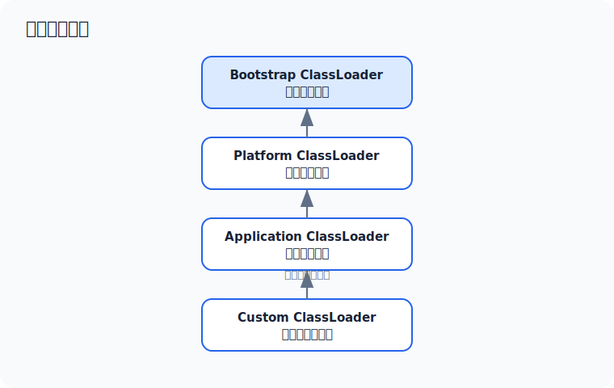

加载逻辑：

1. 一个类加载器收到类加载请求。
2. 先委托父加载器加载。
3. 父加载器继续向上委托。
4. 最顶层无法加载时，子加载器才尝试自己加载。

优点：

- 避免核心类被篡改。例如自定义一个 `java.lang.String` 不会覆盖 JDK 的 `String`。
- 保证类加载的一致性。
- 避免类重复加载。

### 4.4 哪些场景会打破双亲委派

常见场景：

- Tomcat：不同 Web 应用需要隔离类加载。
- SPI：父加载器加载的接口，需要反向使用子加载器加载实现类。
- OSGi、插件化框架：需要模块隔离和动态加载。

Tomcat 为什么要打破？

> Tomcat 中每个 Web 应用可以有自己的 `WEB-INF/lib`。如果完全遵循双亲委派，不同应用依赖的不同版本 jar 难以隔离。Tomcat 通过自定义类加载器实现应用之间的类隔离。

---

## 五、垃圾回收基础

### 5.1 JVM 如何判断对象是否存活

主流 JVM 使用**可达性分析**，不是引用计数。

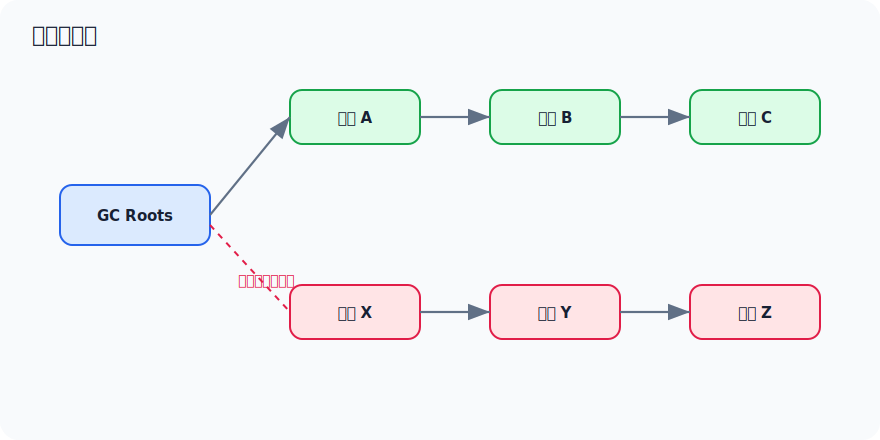

从 GC Roots 出发，可以访问到的对象是存活对象；访问不到的对象可以被回收。

### 5.2 什么可以作为 GC Roots

常见 GC Roots：

- 虚拟机栈中引用的对象，例如方法局部变量。
- 本地方法栈 JNI 引用的对象。
- 方法区中类静态属性引用的对象。
- 方法区中常量引用的对象。
- 被 `synchronized` 锁持有的对象。
- JVM 内部引用，例如系统类加载器、异常对象等。

### 5.3 引用类型

| 引用类型 | 回收时机 | 常见用途 |
| --- | --- | --- |
| 强引用 | 只要可达就不回收 | 普通对象引用 |
| 软引用 | 内存不足时可能回收 | 缓存 |
| 弱引用 | 下次 GC 时回收 | `WeakHashMap` |
| 虚引用 | 无法通过虚引用获取对象，只用于回收通知 | 堆外内存清理、对象回收跟踪 |

### 5.4 Minor GC、Major GC、Full GC

| 名称 | 主要回收区域 | 说明 |
| --- | --- | --- |
| Minor GC / Young GC | 新生代 | Eden 空间不足时常触发 |
| Major GC / Old GC | 老年代 | 不同资料定义不完全统一，通常指老年代回收 |
| Full GC | 整个堆 + 方法区相关 | 停顿通常更重，需要重点关注 |

常见 Full GC 触发原因：

- 老年代空间不足。
- 元空间不足。
- 显式调用 `System.gc()`。
- Young GC 后对象晋升失败。
- 大对象直接进入老年代导致空间不足。
- CMS 出现 Concurrent Mode Failure。
- 堆内存分配担保失败。

---

## 六、垃圾回收算法

### 6.1 标记-清除

过程：

1. 标记所有存活对象。
2. 清除未标记对象。

优点：实现简单，不需要移动对象。

缺点：

- 会产生内存碎片。
- 清除效率随对象数量增加而下降。

### 6.2 标记-复制

过程：

1. 把内存分成两块。
2. 每次只使用一块。
3. GC 时把存活对象复制到另一块。
4. 清空原来的区域。

优点：

- 没有碎片。
- 适合存活对象少的场景。

缺点：

- 需要额外空间。
- 存活对象多时复制成本高。

新生代对象通常朝生夕死，所以适合复制算法。

### 6.3 标记-整理

过程：

1. 标记存活对象。
2. 把存活对象向一端移动。
3. 清理边界外的内存。

优点：

- 没有碎片。
- 适合老年代。

缺点：

- 移动对象成本较高。

### 6.4 分代收集理论

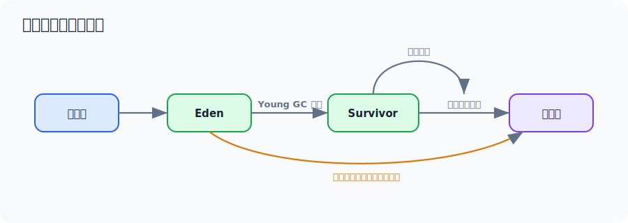

核心思想：

- 大多数对象生命周期很短。
- 少数对象会存活较长时间。
- 新生代和老年代采用不同回收策略更高效。

---

## 七、常见垃圾收集器

### 7.1 总览

| 收集器 | 主要特点 | 适用场景 |
| --- | --- | --- |
| Serial | 单线程，简单 | Client、小内存 |
| ParNew | 多线程新生代收集器 | 曾常与 CMS 搭配 |
| Parallel Scavenge | 关注吞吐量 | 后台任务、批处理 |
| CMS | 低停顿，并发清理 | 老版本低延迟服务 |
| G1 | 可预测停顿，Region 化 | 服务端应用、大堆 |
| ZGC | 超低停顿，大部分并发 | 大内存、低延迟服务 |
| Shenandoah | 超低停顿，并发整理 | 低延迟场景 |

### 7.2 CMS

CMS：Concurrent Mark Sweep，并发标记清除。

流程：

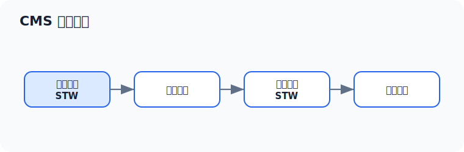

特点：

- 目标是降低停顿。
- 标记和清除大部分阶段与用户线程并发执行。
- 使用标记-清除算法。

缺点：

- 会产生内存碎片。
- 对 CPU 资源敏感。
- 无法处理并发阶段产生的浮动垃圾。
- 可能出现 `Concurrent Mode Failure`，退化为更重的 Full GC。

面试回答：

> CMS 通过并发标记和并发清除减少 STW 时间，但因为使用标记-清除算法，会产生内存碎片。如果并发清理过程中老年代空间不够，就可能发生 Concurrent Mode Failure。

### 7.3 G1

G1：Garbage First。

它把堆划分成多个 Region，不再严格要求新生代和老年代物理连续。

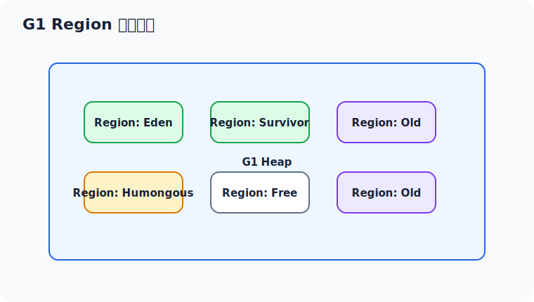

核心特点：

- Region 化管理。
- 优先回收价值最高的 Region。
- 支持设置期望停顿时间：`-XX:MaxGCPauseMillis`。
- 通过 Remembered Set 解决跨 Region 引用问题。
- 支持 Mixed GC，同时回收新生代和部分老年代 Region。
- 大对象会进入 Humongous Region，超过单个 Region 一半大小的对象就可能被当作 Humongous 对象处理。
- `MaxGCPauseMillis` 是期望目标，不是硬性 SLA。对象创建太快、老年代压力太大、堆太小，都可能导致停顿超过目标。

G1 常见阶段：

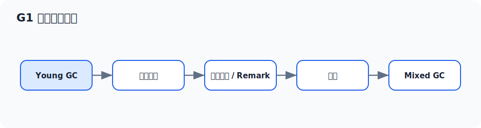

面试回答：

> G1 把堆划分成多个 Region，通过评估每个 Region 的回收收益，优先回收垃圾最多、收益最高的 Region。它可以通过 `MaxGCPauseMillis` 设置期望停顿时间，适合较大堆和对停顿敏感的服务。

G1 面试加分点：

- G1 不是完全没有 Full GC，只是尽量通过 Young GC、并发标记和 Mixed GC 避免退化到 Full GC。
- 如果出现 `to-space exhausted`、`G1 Compaction Pause`、频繁 Humongous 分配，说明 G1 已经比较吃紧。
- 大批量导出、大 JSON、大数组、一次性查全量数据，容易制造 Humongous 对象。
- 调 G1 不要只盯 `MaxGCPauseMillis`，还要看堆大小、对象分配速率、老年代增长、Mixed GC 是否跟得上。

### 7.4 ZGC

ZGC 是低延迟垃圾收集器。

特点：

- 大部分 GC 工作并发完成。
- 停顿时间通常很短。
- 支持大堆。
- 使用染色指针、读屏障等技术。

面试回答不需要讲太底层，可以这样说：

> ZGC 的目标是低延迟，大部分标记、转移、重定位工作都和用户线程并发执行，因此 STW 时间很短。它适合大内存、对响应时间敏感的服务，但需要结合 JDK 版本、业务场景和资源成本评估。

---

## 八、常用 JVM 参数

### 8.1 堆、栈、元空间

| 参数 | 含义 | 示例 |
| --- | --- | --- |
| `-Xms` | 初始堆大小 | `-Xms2g` |
| `-Xmx` | 最大堆大小 | `-Xmx2g` |
| `-Xmn` | 新生代大小 | `-Xmn512m` |
| `-Xss` | 每个线程栈大小 | `-Xss512k` |
| `-XX:MetaspaceSize` | 元空间初始触发 GC 阈值 | `-XX:MetaspaceSize=256m` |
| `-XX:MaxMetaspaceSize` | 最大元空间大小 | `-XX:MaxMetaspaceSize=512m` |
| `-XX:MaxDirectMemorySize` | 最大直接内存 | `-XX:MaxDirectMemorySize=1g` |

### 8.2 GC 选择

```bash
# 使用 G1
-XX:+UseG1GC

# 使用 ZGC
-XX:+UseZGC
```

### 8.3 GC 日志

Java 8：

```bash
-XX:+PrintGCDetails
-XX:+PrintGCDateStamps
-XX:+PrintGCTimeStamps
-Xloggc:/data/logs/app/gc.log
```

Java 9+：

```bash
-Xlog:gc*:file=/data/logs/app/gc.log:time,uptime,level,tags:filecount=10,filesize=100m
```

### 8.4 OOM 自动 dump

```bash
-XX:+HeapDumpOnOutOfMemoryError
-XX:HeapDumpPath=/data/dump/app.hprof
```

建议生产环境开启：

```bash
-Xms2g
-Xmx2g
-XX:+UseG1GC
-XX:MaxGCPauseMillis=200
-Xlog:gc*:file=/data/logs/app/gc.log:time,uptime,level,tags:filecount=10,filesize=100m
-XX:+HeapDumpOnOutOfMemoryError
-XX:HeapDumpPath=/data/dump
```

### 8.5 `-Xms` 和 `-Xmx` 为什么通常设置一样

生产环境常把初始堆和最大堆设置一样：

- 避免运行期堆扩容和缩容带来的性能抖动。
- 让容量更可预测。
- 方便容器或机器资源规划。

但也不是绝对。如果是资源弹性要求较高、启动内存敏感的场景，也可能不设置成一样。

### 8.6 生产参数怎么估算

面试里不要只背参数名，要能说出配置依据。一个普通 Spring Boot 服务可以按下面思路估算：

1. 先看部署资源，例如容器限制是 `4C 8G`。
2. JVM 堆不要把 8G 全吃掉，要给 Metaspace、直接内存、线程栈、JIT CodeCache、系统页缓存和 agent 留空间。
3. 如果服务不是 Netty、大文件传输这类堆外内存重的应用，可以先给堆 `4G-5G`，例如 `-Xms4g -Xmx4g`。
4. 如果线程很多，要关注 `-Xss`。例如 500 个线程、`-Xss1m`，理论线程栈就可能占到 500MB 左右。
5. 如果大量使用 NIO、Netty、文件上传下载，要显式关注 `-XX:MaxDirectMemorySize`。
6. 开启 GC 日志和 OOM dump，让问题发生时有证据。

示例：

```bash
-Xms4g
-Xmx4g
-Xss512k
-XX:+UseG1GC
-XX:MaxGCPauseMillis=200
-XX:MaxMetaspaceSize=512m
-XX:MaxDirectMemorySize=1g
-Xlog:gc*:file=/data/logs/app/gc.log:time,uptime,level,tags:filecount=10,filesize=100m
-XX:+HeapDumpOnOutOfMemoryError
-XX:HeapDumpPath=/data/dump
```

容器环境补充：

- JDK 8 较老版本对容器内存识别不完善，要注意版本。
- JDK 10+ 对容器支持更好，可以使用 `-XX:MaxRAMPercentage`、`-XX:InitialRAMPercentage`。
- 如果已经手动设置 `-Xmx`，通常就不再依赖 `MaxRAMPercentage` 控制堆上限。
- Kubernetes 里要看容器 `limit`，不是只看宿主机内存。

### 8.7 常用诊断命令速查

| 目标 | 命令 |
| --- | --- |
| 看 Java 进程 | `jps -l` |
| 看 JVM 参数 | `jcmd <pid> VM.flags` |
| 看启动命令 | `jcmd <pid> VM.command_line` |
| 看堆概况 | `jcmd <pid> GC.heap_info` |
| 看 GC 趋势 | `jstat -gcutil <pid> 1000 10` |
| 看对象分布 | `jcmd <pid> GC.class_histogram` |
| 导出线程栈 | `jcmd <pid> Thread.print` |
| 导出堆 dump | `jcmd <pid> GC.heap_dump /tmp/app.hprof` |
| 看 Native Memory | `jcmd <pid> VM.native_memory summary` |

注意：`GC.heap_dump`、`jmap -dump`、`jcmd GC.class_histogram` 都可能造成停顿，生产环境要结合故障等级、磁盘空间、低峰期和是否有备节点来决定。

---

## 九、GC 日志怎么看

### 9.1 先看四个问题

看 GC 日志不要一开始就陷入细节，先问四个问题：

1. GC 是否频繁？
2. 单次 GC 是否耗时过长？
3. Full GC 是否频繁？
4. GC 后内存是否能明显下降？

### 9.2 Young GC 关注点

如果 Young GC 很频繁，可能原因：

- 对象创建速度太快。
- 新生代太小。
- Eden 区太小。
- 瞬时流量过高。
- 代码中频繁创建大对象或临时集合。

判断方法：

- 看 Young GC 间隔。
- 看 Eden 回收前后的变化。
- 看对象是否快速晋升到老年代。

### 9.3 Full GC 关注点

如果 Full GC 很频繁，重点看：

- Full GC 后 Old 区是否明显下降。
- Metaspace 是否持续上涨。
- 是否有 `System.gc()`。
- 是否有晋升失败。
- 是否有大对象直接进入老年代。

判断逻辑：

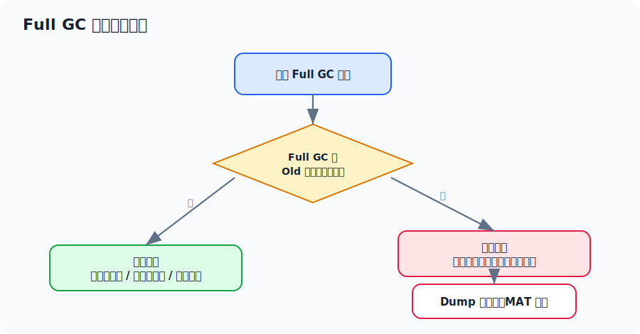

### 9.4 一个简化日志示例

示例：

```text
[2026-05-06T10:00:01.123+0800][info][gc] GC(12) Pause Young (Normal) 512M->180M(2048M) 25.3ms
[2026-05-06T10:00:06.456+0800][info][gc] GC(13) Pause Young (Normal) 530M->220M(2048M) 28.1ms
[2026-05-06T10:00:11.789+0800][info][gc] GC(14) Pause Full (G1 Compaction Pause) 1900M->1850M(2048M) 1200.8ms
```

分析：

- Young GC 间隔约 5 秒，暂时不一定严重。
- Full GC 前后从 `1900M` 变成 `1850M`，只回收了 50M。
- Full GC 耗时 1.2 秒，且回收效果很差。
- 如果持续出现，优先怀疑老年代中有大量对象被长期引用，可能是内存泄漏。

### 9.5 G1 日志里的常见信号

看到 G1 日志时，重点关注这些关键词：

| 关键词 | 含义 | 排查方向 |
| --- | --- | --- |
| `Pause Young (Normal)` | 普通 Young GC | 看频率、耗时、回收后大小 |
| `Pause Young (Concurrent Start)` | Young GC 后启动并发标记 | 老年代占用达到触发阈值 |
| `Pause Remark` | 并发标记后的重新标记 | 停顿过长时看引用处理、类卸载 |
| `Pause Cleanup` | 清理阶段 | 通常较短 |
| `Pause Young (Mixed)` | Mixed GC | 回收新生代和部分老年代 Region |
| `Humongous` | 大对象相关 | 查大数组、大集合、大 JSON、导出 |
| `to-space exhausted` | 转移对象时目标空间不够 | 堆压力大，可能退化 Full GC |
| `G1 Compaction Pause` | G1 Full GC 压缩整理 | 比较严重，说明并发回收没跟上 |

判断口诀：

- Young GC 频繁：先看对象创建速率和新生代大小。
- Full GC 后下降少：优先怀疑泄漏或长期引用。
- Full GC 后下降多但很快涨回去：优先怀疑流量、批量任务、大对象、堆偏小。
- Humongous 多：重点查一次性大对象，尤其是导出、报表、文件、图片、超大 JSON。
- Metaspace 涨：查动态代理、脚本引擎、热部署、类加载器泄漏。

---

## 十、线上 JVM 问题排查详解

本章是最实用的部分。面试时你可以按下面的思路讲，工作中也能照着做。

### 10.1 排查前先确认环境

先拿到这些信息：

```bash
# Java 版本
java -version

# 进程列表
jps -l

# JVM 参数
jcmd <pid> VM.flags
jcmd <pid> VM.command_line

# 堆信息
jcmd <pid> GC.heap_info

# 线程信息
jcmd <pid> Thread.print
```

如果没有 `jcmd`，可以用：

```bash
jps -l
jmap -heap <pid>
jstack <pid>
jstat -gcutil <pid> 1000 10
```

Windows 上也可以使用：

```powershell
jps -l
jcmd <pid> VM.flags
jcmd <pid> Thread.print
```

### 10.2 CPU 飙高排查

#### 现象

- 接口响应变慢。
- 机器 CPU 使用率接近 100%。
- Java 进程 CPU 占用很高。

#### 排查流程图

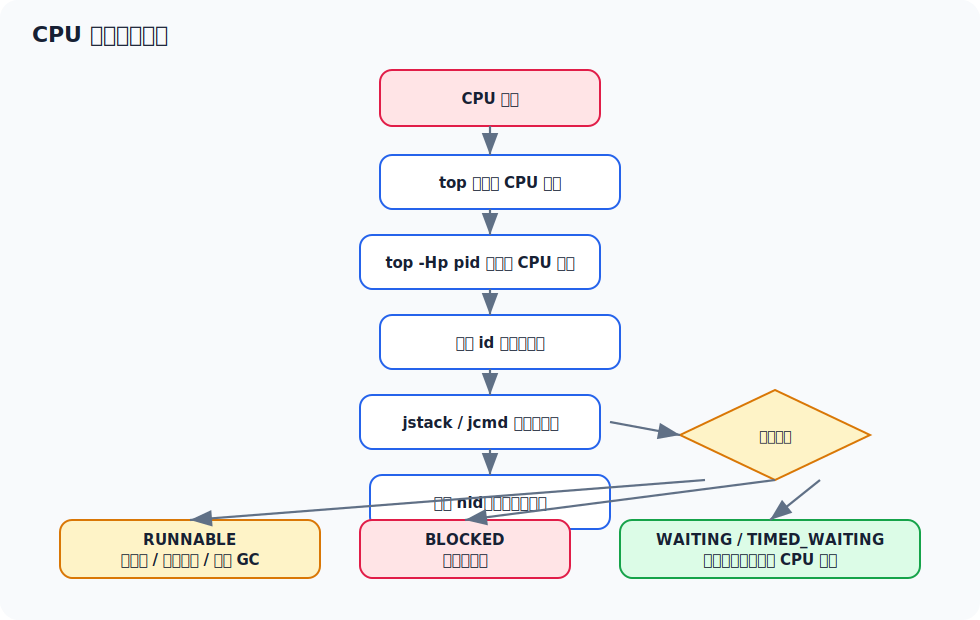

#### Linux 实操步骤

1. 找到高 CPU 的 Java 进程：

```bash
top
```

假设看到：

```text
PID     USER    PR  NI  VIRT   RES   SHR S  %CPU %MEM TIME+   COMMAND
12345   app     20   0  5.2g   2.1g  20m S  380  30.1 10:23.45 java
```

说明 PID 为 `12345` 的 Java 进程 CPU 很高。

2. 查看这个进程中哪个线程 CPU 高：

```bash
top -Hp 12345
```

示例：

```text
PID     USER    PR  NI  VIRT   RES   SHR S  %CPU %MEM TIME+   COMMAND
12388   app     20   0  5.2g   2.1g  20m R  98.7 30.1 03:12.01 java
12389   app     20   0  5.2g   2.1g  20m R  96.4 30.1 03:10.22 java
```

高 CPU 线程 ID 是 `12388`。

3. 把线程 ID 转成十六进制：

```bash
printf "%x\n" 12388
```

输出：

```text
3064
```

4. 导出线程栈：

```bash
jstack 12345 > /tmp/jstack-12345.txt
```

或者：

```bash
jcmd 12345 Thread.print > /tmp/jstack-12345.txt
```

5. 搜索 `nid=0x3064`：

```bash
grep -n "nid=0x3064" /tmp/jstack-12345.txt
```

可能看到：

```text
"http-nio-8080-exec-42" #88 daemon prio=5 os_prio=0 tid=0x00007f9d8c08a000 nid=0x3064 runnable
   java.lang.Thread.State: RUNNABLE
        at com.example.order.PriceCalculator.calculate(PriceCalculator.java:87)
        at com.example.order.OrderService.submit(OrderService.java:215)
```

结论：

- 高 CPU 线程在执行 `PriceCalculator.calculate()`。
- 状态是 `RUNNABLE`。
- 优先检查这段代码是否有死循环、复杂计算、数据量异常、正则回溯、排序或集合操作过重。

#### 常见原因

| 栈表现 | 可能原因 |
| --- | --- |
| 线程一直在同一行业务代码 | 死循环或计算过重 |
| 大量线程在 JSON 序列化 | 返回对象过大或循环引用 |
| 大量线程在正则匹配 | 正则灾难性回溯 |
| 大量线程在 GC 相关 | 可能是内存压力导致 GC 占 CPU |
| 大量线程 BLOCKED | 锁竞争严重 |

#### 面试表达模板

> 我会先用 `top` 找到高 CPU 的 Java 进程，再用 `top -Hp pid` 找到高 CPU 线程，把线程 ID 转成十六进制后，在 `jstack` 中搜索对应的 `nid`。如果线程是 `RUNNABLE`，就看具体业务栈是否存在死循环、复杂计算或频繁对象创建；如果大量线程 `BLOCKED`，就进一步分析锁竞争。

### 10.3 内存泄漏排查

#### 现象

- 服务运行一段时间后越来越慢。
- Old 区持续上涨。
- Full GC 频繁。
- Full GC 后内存下降很少。
- 最终出现 `java.lang.OutOfMemoryError: Java heap space`。

#### 排查流程图

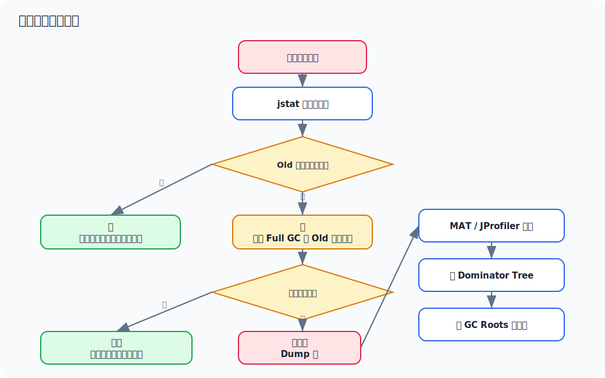

#### 实操步骤

1. 观察 GC 情况：

```bash
jstat -gcutil <pid> 1000 10
```

示例：

```text
  S0     S1     E      O      M     CCS    YGC   YGCT   FGC   FGCT     GCT
  0.00  45.22  78.31  65.10  72.1  68.2   120   2.34     1   0.80    3.14
  0.00  48.19  80.45  68.70  72.1  68.2   121   2.37     1   0.80    3.17
  0.00  50.80  82.20  72.90  72.1  68.2   122   2.41     1   0.80    3.21
  0.00  52.30  85.10  78.40  72.1  68.2   123   2.45     1   0.80    3.25
```

字段说明：

| 字段 | 含义 |
| --- | --- |
| `S0` / `S1` | Survivor 区使用百分比 |
| `E` | Eden 区使用百分比 |
| `O` | Old 区使用百分比 |
| `M` | Metaspace 使用百分比 |
| `YGC` | Young GC 次数 |
| `YGCT` | Young GC 总耗时 |
| `FGC` | Full GC 次数 |
| `FGCT` | Full GC 总耗时 |
| `GCT` | GC 总耗时 |

如果 `O` 持续上涨，且 Full GC 后不下降，就要重点怀疑内存泄漏。

2. 手动触发一次堆直方图观察大对象：

```bash
jcmd <pid> GC.class_histogram
```

示例：

```text
 num     #instances         #bytes  class name
----------------------------------------------------
   1:       4200000      268800000  java.util.HashMap$Node
   2:       1800000      172800000  com.example.user.UserSession
   3:       1600000      128000000  java.lang.String
```

分析：

- `UserSession` 数量异常多。
- `HashMap$Node` 很多，说明可能有大量 Map 缓存。
- 下一步要找是谁持有这些对象。

3. Dump 堆内存：

```bash
jcmd <pid> GC.heap_dump /tmp/app-heap.hprof
```

或者：

```bash
jmap -dump:format=b,file=/tmp/app-heap.hprof <pid>
```

注意：

- Dump 可能导致短暂停顿。
- Dump 文件可能很大，要确认磁盘空间。
- 生产环境建议优先在从节点、低峰期或故障现场允许的情况下操作。

4. 用 MAT 分析：

打开 `app-heap.hprof` 后重点看：

- Leak Suspects Report。
- Dominator Tree。
- Histogram。
- Path To GC Roots。

#### MAT 分析思路

**Dominator Tree** 看谁占用内存最大。

常见指标：

- Shallow Heap：对象自身占用大小。
- Retained Heap：对象被回收后可以释放的总内存。

真正重要的是 `Retained Heap`。

示例：

```text
com.example.cache.LocalCache @ 0x7f81aab0
  Retained Heap: 1.2 GB
  |- java.util.concurrent.ConcurrentHashMap
      |- com.example.user.UserSession
```

说明：

- `LocalCache` 间接持有了 1.2GB 对象。
- 如果这个缓存没有过期策略，就可能是内存泄漏。

**Path To GC Roots** 看为什么对象不能被回收。

示例引用链：

```text
GC Roots
  -> static com.example.cache.SessionHolder.CACHE
  -> ConcurrentHashMap
  -> UserSession
```

结论：

- `UserSession` 被静态变量 `SessionHolder.CACHE` 持有。
- 只要静态 Map 不清理，这些 session 就不会被回收。

#### 常见内存泄漏场景

| 场景 | 原因 |
| --- | --- |
| 静态集合 | `static Map/List` 只添加不删除 |
| 本地缓存 | 没有最大容量或过期策略 |
| ThreadLocal | 使用后没有 `remove()` |
| 监听器 / 回调 | 注册后没有取消注册 |
| 连接 / 流 | 未关闭导致引用链残留 |
| Netty ByteBuf | 引用计数对象未释放 |
| 定时任务 | 任务对象持续引用大量业务数据 |

#### ThreadLocal 泄漏示例

问题代码：

```java
private static final ThreadLocal<UserContext> USER_CONTEXT = new ThreadLocal<>();

public void handle(Request request) {
    UserContext context = buildContext(request);
    USER_CONTEXT.set(context);
    doBusiness();
}
```

线程池中的线程会复用，如果没有清理，`ThreadLocalMap` 中的 value 可能长期挂在线程上。

修复：

```java
public void handle(Request request) {
    UserContext context = buildContext(request);
    try {
        USER_CONTEXT.set(context);
        doBusiness();
    } finally {
        USER_CONTEXT.remove();
    }
}
```

#### 面试表达模板

> 我会先用 `jstat -gcutil` 观察 Old 区是否持续上涨，再看 Full GC 后 Old 区是否能下降。如果 Full GC 后下降很少，说明大量对象仍被引用，可能存在内存泄漏。然后用 `jcmd GC.class_histogram` 初步看对象分布，再 dump 堆，用 MAT 的 Dominator Tree 找 Retained Heap 最大的对象，并通过 Path To GC Roots 找到是谁持有它，最后定位到具体代码。

### 10.4 频繁 Full GC 排查

#### 现象

- 接口周期性卡顿。
- GC 日志中 Full GC 很多。
- CPU 可能升高。
- 响应时间 P99 明显变差。

#### 排查流程

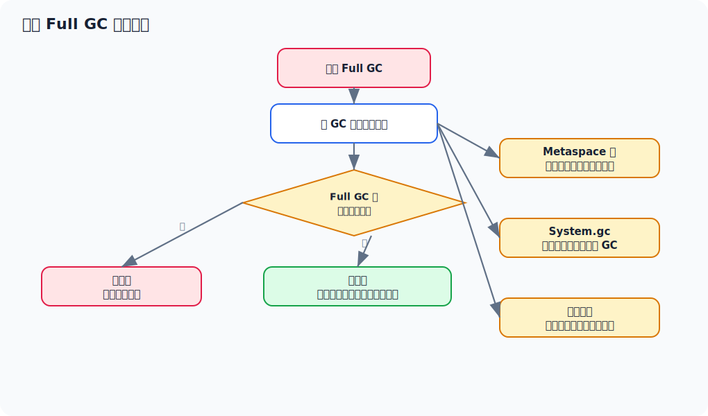

#### 重点排查项

1. **Full GC 后 Old 区下降很少**

高度怀疑：

- 内存泄漏。
- 缓存无限增长。
- 长生命周期对象过多。

处理：

- Dump 堆。
- MAT 分析引用链。

2. **Full GC 后 Old 区下降明显，但很快又涨上去**

可能原因：

- 瞬时流量大。
- 大量临时对象。
- 堆设置过小。
- 老年代空间不足。
- 对象晋升过快。

处理：

- 分析对象创建热点。
- 评估堆大小。
- 优化大对象和集合使用。
- 检查批量查询、分页、导出等接口。

3. **Metaspace 导致 Full GC**

可能原因：

- 动态代理类过多。
- CGLIB、Groovy、JSP、脚本引擎动态生成类。
- 类加载器泄漏。
- 热部署或插件化重复加载类。

处理：

```bash
jcmd <pid> VM.classloader_stats
jcmd <pid> GC.class_stats
```

部分 JDK 可能需要额外参数支持 `GC.class_stats`。

4. **显式 `System.gc()`**

GC 日志中如果看到类似 `System.gc()` 触发，需要排查：

- 业务代码。
- 第三方依赖。
- RMI。
- NIO 或堆外内存相关代码。

可以考虑：

```bash
-XX:+DisableExplicitGC
```

注意：不要无脑加，需要确认业务和依赖是否依赖显式 GC 回收堆外资源。

#### 面试表达模板

> 频繁 Full GC 我会先看 GC 日志里的触发原因，再看 Full GC 前后 Old 区变化。如果回收后 Old 区下降很少，优先怀疑内存泄漏；如果下降明显但很快涨回去，可能是对象创建过快或堆参数不合理。还要检查 Metaspace、显式 `System.gc()`、晋升失败、大对象分配等情况。

### 10.5 OOM 排查

#### OOM 类型总览

| 异常 | 常见原因 |
| --- | --- |
| `Java heap space` | 堆内存不足或内存泄漏 |
| `GC overhead limit exceeded` | GC 花大量时间但回收很少 |
| `Metaspace` | 类元信息过多或类加载器泄漏 |
| `Direct buffer memory` | 直接内存不足，常见于 NIO/Netty |
| `unable to create new native thread` | 线程数过多或系统资源限制 |
| `StackOverflowError` | 递归过深或方法调用栈过深 |

#### Java heap space

排查：

1. 确认是否生成 hprof。
2. 用 MAT 打开。
3. 看 Dominator Tree。
4. 看 Path To GC Roots。
5. 找到最大 Retained Heap 的对象。

建议参数：

```bash
-XX:+HeapDumpOnOutOfMemoryError
-XX:HeapDumpPath=/data/dump
```

#### GC overhead limit exceeded

含义：

> JVM 花了大量时间做 GC，但只回收了很少内存。

常见原因：

- 堆太小。
- 内存泄漏。
- 老年代几乎满了。

处理：

- 看 GC 日志。
- 看 OOM dump。
- 不要只想着加内存，要确认是否泄漏。

#### Metaspace OOM

现象：

```text
java.lang.OutOfMemoryError: Metaspace
```

可能原因：

- 动态生成类太多。
- 类加载器无法卸载。
- 频繁热部署。
- 反射、代理、脚本引擎使用异常。

排查：

```bash
jcmd <pid> VM.native_memory summary
jcmd <pid> VM.classloader_stats
```

如果要使用 Native Memory Tracking，需要启动时开启：

```bash
-XX:NativeMemoryTracking=summary
```

#### Direct buffer memory

常见于：

- Netty。
- NIO。
- 文件传输。
- 大量 `ByteBuffer.allocateDirect()`。

排查方向：

- 是否限制了 `-XX:MaxDirectMemorySize`。
- 是否存在 direct buffer 未释放。
- Netty ByteBuf 是否正确 release。
- 是否有连接泄漏。

Netty 中常见问题：

```java
ByteBuf buf = ctx.alloc().directBuffer();
try {
    // 使用 buf
} finally {
    buf.release();
}
```

如果使用 Netty，要关注引用计数和泄漏检测：

```bash
-Dio.netty.leakDetection.level=advanced
```

#### unable to create new native thread

含义：

> JVM 想创建新线程，但操作系统无法再分配线程资源。

可能原因：

- 线程池没有限制。
- 每个请求创建线程。
- 线程泄漏。
- `-Xss` 设置过大，导致单线程栈占用太多内存。
- 系统 `ulimit` 限制。

排查：

```bash
# 查看线程数
ps -eLf | grep <pid> | wc -l

# 查看进程限制
cat /proc/<pid>/limits

# 导出线程栈
jstack <pid> > /tmp/thread.txt
```

Java 内查看线程数量：

```bash
jcmd <pid> Thread.print | grep "java.lang.Thread.State" | wc -l
```

修复方向：

- 使用有界线程池。
- 避免请求级别创建线程。
- 检查线程是否正常退出。
- 合理设置 `-Xss`。
- 调整操作系统线程限制。

### 10.6 死锁排查

#### 示例代码

```java
public class DeadLockDemo {
    private static final Object LOCK_A = new Object();
    private static final Object LOCK_B = new Object();

    public static void main(String[] args) {
        new Thread(() -> {
            synchronized (LOCK_A) {
                sleep();
                synchronized (LOCK_B) {
                    System.out.println("thread1");
                }
            }
        }, "thread-1").start();

        new Thread(() -> {
            synchronized (LOCK_B) {
                sleep();
                synchronized (LOCK_A) {
                    System.out.println("thread2");
                }
            }
        }, "thread-2").start();
    }

    private static void sleep() {
        try {
            Thread.sleep(1000);
        } catch (InterruptedException ignored) {
        }
    }
}
```

排查：

```bash
jstack <pid>
```

如果有死锁，jstack 通常会输出：

```text
Found one Java-level deadlock:
"thread-1":
  waiting to lock monitor ...
  which is held by "thread-2"
"thread-2":
  waiting to lock monitor ...
  which is held by "thread-1"
```

解决思路：

- 保证多个线程获取锁的顺序一致。
- 减小锁粒度。
- 避免嵌套锁。
- 使用带超时的锁，例如 `tryLock`。

### 10.7 线程池问题排查

线程池相关问题常表现为：

- 接口卡住。
- 请求堆积。
- CPU 不高但响应很慢。
- 大量线程处于 `WAITING` 或 `BLOCKED`。

排查：

```bash
jstack <pid> > /tmp/jstack.txt
```

重点看线程状态：

| 状态 | 说明 | 排查方向 |
| --- | --- | --- |
| `RUNNABLE` | 正在运行或等待 CPU | 看是否计算过重、IO、GC |
| `BLOCKED` | 等待锁 | 查锁竞争 |
| `WAITING` | 无限等待 | 查队列、锁、条件变量 |
| `TIMED_WAITING` | 限时等待 | 查 sleep、超时等待、连接池 |

常见栈：

```text
java.lang.Thread.State: WAITING
    at java.util.concurrent.locks.LockSupport.park
    at java.util.concurrent.ThreadPoolExecutor.getTask
```

这通常表示线程池工作线程正在等任务，不一定是问题。

如果大量请求线程卡在数据库连接池：

```text
at com.zaxxer.hikari.pool.HikariPool.getConnection
```

说明可能是：

- 数据库慢。
- 连接池太小。
- 连接泄漏。
- SQL 卡住。

### 10.8 一套完整排查案例：导出接口导致频繁 Full GC 和 OOM

这个案例可以当作面试里的模拟项目经历来讲。注意表达时可以说“我按这个链路演练过/复盘过类似问题”，不要硬说自己真实处理过。

#### 背景

订单服务提供一个后台导出接口 `/admin/order/export`，平时 QPS 不高，但运营会在月底集中导出大批订单。某天 10:00 后服务开始变慢：

- 接口 P99 从 `300ms` 升到 `5s+`。
- 机器 CPU 从 `40%` 升到 `260%`，但数据库 CPU 不高。
- GC 日志中开始频繁出现 Full GC。
- 最后出现 `java.lang.OutOfMemoryError: Java heap space`。

JVM 参数：

```text
-Xms2g -Xmx2g -Xss512k -XX:+UseG1GC
-XX:MaxGCPauseMillis=200
-Xlog:gc*:file=/data/logs/order/gc.log:time,uptime,level,tags:filecount=10,filesize=100m
-XX:+HeapDumpOnOutOfMemoryError
-XX:HeapDumpPath=/data/dump
```

#### 第一步：先判断是 CPU 问题还是 GC 问题

```bash
top
```

看到 Java 进程 CPU 很高：

```text
PID     USER  %CPU %MEM  COMMAND
12345   app   265  62.1  java
```

继续看线程：

```bash
top -Hp 12345
```

发现高 CPU 线程比较分散，没有某一个业务线程长期 100%，并且很多线程名类似：

```text
12371 app 38.4 java
12372 app 36.8 java
12373 app 35.1 java
```

导出线程栈：

```bash
jcmd 12345 Thread.print > /tmp/order-thread.txt
```

线程栈里能看到一些业务线程在导出接口，但没有明显死循环：

```text
"http-nio-8080-exec-41" nid=0x3053 runnable
   java.lang.Thread.State: RUNNABLE
        at com.fasterxml.jackson.databind.ser.BeanSerializer.serialize(...)
        at com.example.order.ExportController.export(ExportController.java:88)
```

此时不能直接下结论是代码死循环，因为 GC 频繁时也会带来 CPU 上升。下一步看 GC。

#### 第二步：看 GC 趋势，确认 Old 区是否持续上涨

```bash
jstat -gcutil 12345 1000 10
```

示例输出：

```text
  S0     S1      E       O       M     CCS    YGC   YGCT  FGC   FGCT    GCT
  0.00  62.31   88.15   74.20   78.1  71.4   420   8.20    3    2.10   10.30
 45.12   0.00   91.44   78.85   78.1  71.4   421   8.31    3    2.10   10.41
  0.00  58.72   94.03   83.90   78.2  71.4   422   8.43    4    3.42   11.85
 48.30   0.00   96.70   88.60   78.2  71.4   423   8.57    4    3.42   11.99
  0.00  61.90   97.10   93.40   78.2  71.4   424   8.72    5    5.01   13.73
```

判断：

- `O` 代表 Old 区使用率，从 `74%` 持续涨到 `93%`。
- `FGC` 在增加，说明已经发生 Full GC。
- `FGCT` 增长明显，Full GC 停顿成本在变高。
- 如果 Full GC 后 Old 区仍然降不下来，优先怀疑长期引用或内存泄漏。

#### 第三步：看 GC 日志确认 Full GC 回收效果

```bash
grep "Pause Full\\|Humongous\\|to-space" /data/logs/order/gc.log | tail -50
```

示例：

```text
[2026-05-06T10:18:21.332+0800][info][gc] GC(428) Pause Young (Concurrent Start) (G1 Humongous Allocation) 1670M->1512M(2048M) 86.4ms
[2026-05-06T10:18:22.018+0800][info][gc] GC(429) Pause Remark 1530M->1530M(2048M) 42.1ms
[2026-05-06T10:18:23.907+0800][info][gc] GC(431) Pause Young (Mixed) 1790M->1668M(2048M) 122.8ms
[2026-05-06T10:18:25.441+0800][info][gc] GC(432) Pause Full (G1 Compaction Pause) 1988M->1826M(2048M) 1840.6ms
[2026-05-06T10:18:31.084+0800][info][gc] GC(436) Pause Full (G1 Compaction Pause) 2001M->1842M(2048M) 2103.3ms
```

判断：

- `G1 Humongous Allocation` 说明有大对象分配。
- Full GC 前后从 `1988M` 到 `1826M`，只回收 `162M`，效果很差。
- 第二次 Full GC 后仍有 `1842M`，说明大量对象还被引用。
- 方向基本收敛到：大对象 + 长期引用，而不是简单的堆太小。

#### 第四步：用对象直方图找异常对象

```bash
jcmd 12345 GC.class_histogram > /tmp/order-histo.txt
head -30 /tmp/order-histo.txt
```

示例：

```text
 num     #instances         #bytes  class name
----------------------------------------------------
   1:       3800000      608000000  com.example.order.dto.OrderExportRow
   2:       7200000      460800000  java.util.HashMap$Node
   3:       4100000      262400000  java.lang.String
   4:        820000      196800000  java.util.ArrayList
   5:        120000       96000000  byte[]
```

判断：

- `OrderExportRow` 数量达到 380 万，很不正常。
- `HashMap$Node`、`ArrayList`、`String` 同时很高，像是大量业务 DTO 被集合持有。
- 仅凭直方图还不能知道“谁持有它”，下一步要看 heap dump。

#### 第五步：导出 dump，用 MAT 看引用链

如果服务已经 OOM 且配置了 `HeapDumpOnOutOfMemoryError`，优先拿自动生成的 dump。没有的话，在确认磁盘空间和停顿风险后手动导出：

```bash
df -h /data/dump
jcmd 12345 GC.heap_dump /data/dump/order-service-oom.hprof
```

MAT 分析顺序：

1. 打开 `Leak Suspects Report`，看是否有明显泄漏嫌疑。
2. 打开 `Dominator Tree`，按 `Retained Heap` 排序。
3. 找到业务对象或集合对象。
4. 对可疑对象执行 `Path To GC Roots`，排除弱引用。

示例 Dominator Tree：

```text
Class Name                                                       Retained Heap
com.example.order.export.ExportTaskManager @ 0x6c18a9d0          1.35 GB
|- java.util.concurrent.ConcurrentHashMap @ 0x6c18aa18           1.31 GB
   |- java.util.concurrent.ConcurrentHashMap$Node[]              1.22 GB
      |- java.util.ArrayList @ 0x7112f4c0                         780 MB
         |- com.example.order.dto.OrderExportRow[]                620 MB
```

Path To GC Roots：

```text
GC Roots
  -> Thread "export-cleaner"
  -> com.example.order.export.ExportTaskManager
  -> field runningTasks
  -> ConcurrentHashMap
  -> ExportTask
  -> field rows
  -> ArrayList
  -> OrderExportRow
```

这个引用链的含义：

- `ExportTaskManager` 是一个 Spring 单例，生命周期和应用一样长。
- 它里面的 `runningTasks` 持有每个导出任务。
- 每个 `ExportTask` 又持有完整的导出结果 `rows`。
- 任务完成后没有及时从 `runningTasks` 删除，所以 GC 认为这些对象仍然可达。

#### 第六步：定位代码

问题代码类似这样：

```java
@Service
public class ExportTaskManager {
    private final Map<String, ExportTask> runningTasks = new ConcurrentHashMap<>();

    public String submit(String userId, ExportQuery query) {
        String taskId = UUID.randomUUID().toString();
        ExportTask task = new ExportTask(taskId, userId);
        runningTasks.put(taskId, task);

        List<OrderExportRow> rows = orderMapper.queryAll(query);
        task.setRows(rows);
        excelWriter.write(rows);
        task.markSuccess();
        return taskId;
    }
}
```

核心问题：

- `queryAll()` 一次性查出所有订单，瞬间制造大量 DTO。
- `task.setRows(rows)` 把完整结果挂在任务对象上。
- `runningTasks` 没有过期和清理，Spring 单例长期持有任务。
- 导出 Excel 时又可能生成大 `byte[]` 或大缓冲区，进一步放大内存压力。

#### 第七步：修复方案

短期止血：

- 临时限制导出时间范围和最大导出条数。
- 对导出接口做限流，同一用户同一时间只允许一个导出任务。
- 重启释放内存，但这只是止血，不是修复。
- 如果有多实例，先摘除异常实例，保留现场 dump 后再恢复流量。

代码修复：

```java
@Service
public class ExportTaskManager {
    private final Cache<String, ExportTaskStatus> taskStatusCache = Caffeine.newBuilder()
            .maximumSize(5000)
            .expireAfterWrite(Duration.ofHours(2))
            .build();

    public String submit(String userId, ExportQuery query) {
        String taskId = UUID.randomUUID().toString();
        taskStatusCache.put(taskId, ExportTaskStatus.running());

        try {
            exportByPage(query);
            taskStatusCache.put(taskId, ExportTaskStatus.success());
            return taskId;
        } catch (Exception ex) {
            taskStatusCache.put(taskId, ExportTaskStatus.failed(ex.getMessage()));
            throw ex;
        }
    }

    private void exportByPage(ExportQuery query) {
        int pageNo = 1;
        while (true) {
            List<OrderExportRow> rows = orderMapper.queryPage(query, pageNo, 1000);
            if (rows.isEmpty()) {
                break;
            }
            excelWriter.append(rows);
            rows.clear();
            pageNo++;
        }
    }
}
```

更好的方向：

- 导出结果写入文件存储，只在 JVM 中保存任务状态和文件地址。
- 查询改成分页、游标或流式处理，避免一次性把全量数据放进内存。
- 缓存必须设置最大容量和过期时间。
- 导出完成后清理临时文件、临时集合和任务上下文。
- 对大对象接口增加监控：导出条数、任务耗时、失败数、单实例并发导出数。

#### 第八步：验证修复

压测或灰度时观察：

```bash
jstat -gcutil <pid> 1000 20
```

期望现象：

- Old 区不再阶梯式持续上涨。
- Full GC 次数不再快速增加。
- Young GC 后对象大多能被回收。
- 导出接口 P99 回落。
- `GC.class_histogram` 中 `OrderExportRow` 数量不会持续堆积。

还可以对比 GC 日志：

```text
修复前：Full GC 后 1988M->1826M，回收效果差
修复后：导出期间 Young GC 增多，但 Old 区稳定在 45%-55%
```

#### 面试复述模板

> 我会先判断 CPU 高是不是业务线程死循环，如果线程栈没有单点死循环，再结合 GC 日志和 `jstat` 看是否是 GC 压力导致。这个案例里 Old 区持续上涨，Full GC 后下降很少，同时 G1 日志出现 Humongous Allocation，说明有大对象并且还被长期引用。然后我用 `GC.class_histogram` 看到导出 DTO、ArrayList、HashMap 数量异常，再用 MAT 的 Dominator Tree 和 Path To GC Roots 找到引用链，发现 Spring 单例里的导出任务 Map 持有完整导出结果，任务完成后也没有清理。修复上，我会把全量查询改成分页或流式导出，只保存任务状态和文件地址，缓存加最大容量和过期时间，并对导出接口做并发限制。这个链路能从现象、指标、证据、代码、修复和验证闭环讲完整。

---

## 十一、JMM Java 内存模型

JMM 主要解决并发场景下三个问题：

- 原子性。
- 可见性。
- 有序性。

### 11.1 主内存和工作内存

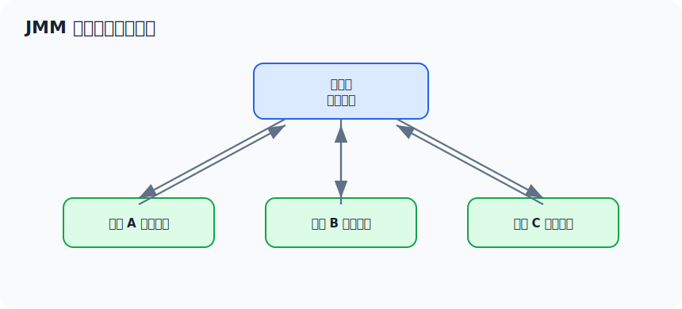

线程通常操作的是共享变量的本地副本，然后再同步回主内存。

### 11.2 `volatile`

`volatile` 保证：

- 可见性。
- 有序性，禁止特定指令重排序。

`volatile` 不保证：

- 复合操作的原子性。

示例：

```java
private volatile int count = 0;

public void add() {
    count++;
}
```

`count++` 包括读取、加一、写回，不是原子操作，所以 `volatile` 不能保证线程安全。

适合场景：

```java
private volatile boolean running = true;

public void stop() {
    running = false;
}

public void run() {
    while (running) {
        doWork();
    }
}
```

### 11.3 `synchronized`

`synchronized` 保证：

- 原子性。
- 可见性。
- 有序性。

进入同步块前，需要获取锁；退出同步块时，会把修改刷新到主内存。

### 11.4 happens-before

常见规则：

- 程序顺序规则：同一个线程内，前面的操作 happens-before 后面的操作。
- 锁规则：解锁 happens-before 后续对同一把锁的加锁。
- volatile 规则：对 volatile 变量的写 happens-before 后续对它的读。
- 线程启动规则：`Thread.start()` happens-before 新线程中的操作。
- 线程终止规则：线程中的操作 happens-before 其他线程检测到它结束。
- 传递性：A happens-before B，B happens-before C，则 A happens-before C。

### 11.5 双重检查锁为什么要加 `volatile`

错误示例：

```java
public class Singleton {
    private static Singleton instance;

    public static Singleton getInstance() {
        if (instance == null) {
            synchronized (Singleton.class) {
                if (instance == null) {
                    instance = new Singleton();
                }
            }
        }
        return instance;
    }
}
```

问题在于 `new Singleton()` 可能发生指令重排序：

1. 分配内存。
2. 把引用赋给 `instance`。
3. 执行构造方法。

如果第二步和第三步重排序，其他线程可能拿到一个还没初始化完成的对象。

正确写法：

```java
public class Singleton {
    private static volatile Singleton instance;

    public static Singleton getInstance() {
        if (instance == null) {
            synchronized (Singleton.class) {
                if (instance == null) {
                    instance = new Singleton();
                }
            }
        }
        return instance;
    }
}
```

---

## 十二、面试高频问题回答模板

### 12.1 JVM 内存结构怎么划分

> JVM 运行时数据区主要包括程序计数器、Java 虚拟机栈、本地方法栈、堆、方法区。程序计数器、虚拟机栈、本地方法栈是线程私有的；堆和方法区是线程共享的。堆主要存放对象实例，是 GC 的主要区域；方法区在 HotSpot 中 Java 8 以后由元空间实现，主要存放类元信息。

### 12.2 对象创建过程

> 执行 `new` 时，JVM 会先检查类是否已经加载，然后为对象分配内存，初始化零值，设置对象头，最后执行构造方法并返回引用。对象一般分配在堆上，但经过逃逸分析后，JIT 可能进行标量替换、锁消除等优化。

### 12.3 双亲委派模型

> 类加载器收到加载请求后，会先委托父加载器加载，父加载器无法加载时才由自己加载。这样可以避免核心类被篡改，也能避免类重复加载。Tomcat、SPI、插件化框架等场景会打破或调整双亲委派，以实现类隔离或反向加载实现类。

### 12.4 JVM 如何判断对象可以回收

> 主流 JVM 使用可达性分析，从 GC Roots 出发，能访问到的对象就是存活对象，访问不到的对象可以被回收。常见 GC Roots 包括栈中的引用、静态变量引用、常量引用、JNI 引用、被锁持有的对象等。

### 12.5 CMS 和 G1 的区别

> CMS 主要目标是降低老年代回收停顿，使用标记-清除算法，大部分标记和清除阶段并发执行，但会产生内存碎片，也可能出现 Concurrent Mode Failure。G1 把堆划分成多个 Region，优先回收收益高的 Region，可以设置期望停顿时间，更适合较大堆和服务端应用。

### 12.6 频繁 Full GC 怎么排查

> 我会先看 GC 日志确认触发原因，再看 Full GC 前后 Old 区变化。如果 Full GC 后 Old 区下降很少，说明大量对象仍然被引用，优先怀疑内存泄漏；如果下降明显但很快又涨回去，可能是对象创建过快、堆太小或晋升过快。之后会结合 `jstat`、`jcmd GC.class_histogram` 和堆 dump，用 MAT 分析 Dominator Tree 和 GC Roots。

### 12.7 CPU 飙高怎么排查

> 先用 `top` 找高 CPU Java 进程，再用 `top -Hp pid` 找高 CPU 线程，把线程 ID 转成十六进制后，在 `jstack` 里搜索对应 `nid`。如果线程处于 `RUNNABLE`，看具体业务代码是否死循环、计算过重或频繁创建对象；如果大量线程 `BLOCKED`，重点看锁竞争。

### 12.8 内存泄漏怎么排查

> 我会通过 `jstat -gcutil` 观察 Old 区是否持续上涨。如果 Full GC 后 Old 区仍然降不下来，就 dump 堆内存，用 MAT 看 Dominator Tree 找 Retained Heap 最大的对象，再通过 Path To GC Roots 找到引用链，最终定位是谁持有对象不释放。

### 12.9 `volatile` 和 `synchronized` 区别

> `volatile` 保证可见性和有序性，但不保证复合操作的原子性；`synchronized` 可以保证原子性、可见性和有序性。`volatile` 适合状态标记、配置开关等场景，`synchronized` 适合需要互斥访问共享资源的场景。

---

## 十三、建议复习路线

### 第一阶段：基础概念

目标：能准确解释 JVM 内存结构、类加载、对象创建。

学习内容：

- JVM 运行时内存结构。
- 堆和栈区别。
- 方法区、永久代、元空间。
- 对象创建过程。
- 类加载过程。
- 双亲委派模型。

### 第二阶段：GC 原理

目标：能解释对象为什么会被回收，以及不同 GC 的适用场景。

学习内容：

- 可达性分析。
- GC Roots。
- 引用类型。
- GC 算法。
- CMS。
- G1。
- ZGC。
- Full GC 触发原因。

### 第三阶段：参数和日志

目标：能说清楚生产 JVM 参数怎么配，GC 日志怎么看。

学习内容：

- `-Xms`、`-Xmx`、`-Xss`。
- 元空间和直接内存参数。
- GC 日志参数。
- OOM dump 参数。
- Young GC / Full GC 日志分析。

### 第四阶段：实战排查

目标：面试中能讲真实排查链路。

重点练习：

- CPU 飙高。
- 内存泄漏。
- 频繁 Full GC。
- OOM。
- 死锁。
- 线程池阻塞。

建议你至少能手写或口述这三条链路：

```text
CPU 飙高：
top -> top -Hp -> printf 十六进制 -> jstack -> 搜 nid -> 定位代码

内存泄漏：
jstat -> 看 Old 区趋势 -> class_histogram -> heap dump -> MAT -> Dominator Tree -> GC Roots

频繁 Full GC：
GC 日志 -> 看触发原因 -> 看 Full GC 后 Old 是否下降 -> 判断泄漏/参数/晋升/元空间/System.gc
```

---

## 十四、最后的复习建议

JVM 面试不要只背术语。更好的表达方式是：

1. 先给定义。
2. 再讲为什么。
3. 接着讲应用场景。
4. 最后补一个排查或调优案例。

例如被问到 Full GC，不要只说触发原因，而是这样展开：

> Full GC 可能由老年代不足、元空间不足、显式 `System.gc()`、晋升失败等原因触发。排查时我会先看 GC 日志确认原因，再看 Full GC 前后 Old 区变化。如果回收效果差，会 dump 堆用 MAT 分析引用链；如果回收效果好但很快又涨，可能是对象创建过快或堆参数不合理。

能这样回答，面试官通常会认为你不是只背过 JVM，而是具备真实线上问题定位能力。

