# Java 并发编程面试实用学习文档

> 适合对象：工作 3-5 年 Java 后端工程师。  
> 目标：不只会背 `synchronized`、线程池、AQS，而是能把“线程原理、JMM、锁、线程池、异步编排、线上排查、场景决策”串成一套可落地的方法论。

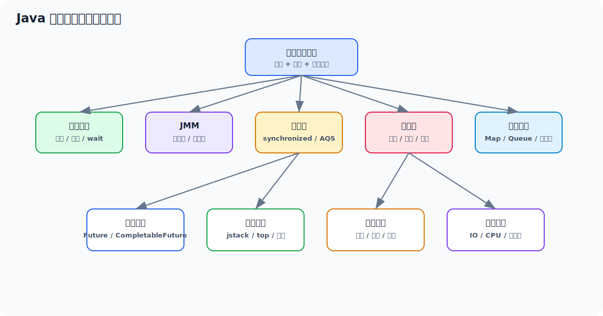

## 目录

- [1. 并发面试主线](#1-并发面试主线)
- [2. 进程、线程、并发、并行](#2-进程线程并发并行)
- [3. 线程生命周期与常用方法](#3-线程生命周期与常用方法)
- [4. wait/notify、sleep、park/unpark](#4-waitnotifysleepparkunpark)
- [5. JMM、volatile 与 happens-before](#5-jmmvolatile-与-happens-before)
- [6. synchronized 与锁优化](#6-synchronized-与锁优化)
- [7. ReentrantLock 与 AQS](#7-reentrantlock-与-aqs)
- [8. CAS、原子类与 LongAdder](#8-cas原子类与-longadder)
- [9. 线程池：参数、队列、拒绝策略和隔离](#9-线程池参数队列拒绝策略和隔离)
- [10. 阻塞队列、并发容器和同步工具](#10-阻塞队列并发容器和同步工具)
- [11. CompletableFuture 与异步编排](#11-completablefuture-与异步编排)
- [12. 并发场景决策](#12-并发场景决策)
- [13. 线上并发问题排查](#13-线上并发问题排查)
- [14. 完整案例：线程池打满导致接口雪崩](#14-完整案例线程池打满导致接口雪崩)
- [15. 高频面试题速答](#15-高频面试题速答)
- [16. 面试前复习路线](#16-面试前复习路线)

## 1. 并发面试主线

四年 Java 面试里，并发通常不是单点考察，而是沿着这条链路往下追：

```text
接口为什么慢
  -> 是否线程池打满、锁竞争、下游阻塞、GC 抢 CPU
  -> 线程状态怎么看，jstack 怎么分析
  -> 线程池参数为什么这么配
  -> synchronized、ReentrantLock、AQS 怎么工作
  -> volatile 能解决什么，不能解决什么
  -> 高并发下共享数据怎么保证安全
  -> 异步化、限流、隔离、降级怎么设计
```

**推荐回答结构**

1. 先说结论：例如“这里更像线程池阻塞，不是 CPU 算法问题”。
2. 再说证据：线程状态、队列长度、活跃线程数、慢日志、GC 日志。
3. 再说原理：线程池执行流程、锁竞争、JMM、AQS。
4. 再说方案：隔离线程池、限流、超时、降级、缩小锁粒度、异步化。
5. 最后说验证：压测、监控指标、P99、错误率、线程池水位。

面试官真正想听的是：你是否知道工具怎么用，知道问题怎么分类，知道方案有什么代价。

## 2. 进程、线程、并发、并行

### 2.1 进程和线程

进程可以理解为系统分配资源的基本单位。程序启动后，操作系统会为它分配内存空间、文件句柄、网络连接等资源。

线程可以理解为 CPU 调度执行的基本单位。一个进程里可以有多个线程，它们共享进程内的堆内存、方法区、文件句柄等资源，但每个线程有自己的程序计数器、虚拟机栈和本地方法栈。

| 对比项 | 进程 | 线程 |
| --- | --- | --- |
| 资源隔离 | 进程之间相互隔离 | 同一进程内线程共享资源 |
| 通信成本 | 较高，常见 IPC、Socket、HTTP | 较低，可共享变量 |
| 创建/切换成本 | 较高 | 较低，但频繁切换也很贵 |
| 故障影响 | 一个进程崩溃通常不直接影响另一个进程 | 一个线程异常可能影响整个进程 |

**面试表达**

> 进程更偏资源隔离，线程更偏执行调度。同一个 Java 进程里的多个线程共享堆内存，所以并发安全问题本质上来自多个线程同时访问共享可变数据。

### 2.2 并发和并行

并发强调“同一时间段内处理多个任务”。单核 CPU 下多个线程通过时间片轮转，看起来像同时运行，本质是微观串行、宏观并发。

并行强调“同一时刻真正执行多个任务”。多核 CPU 下，多个线程可以分别在不同 CPU 核上同时执行。

| 概念 | 重点 | 示例 |
| --- | --- | --- |
| 并发 | 应对多任务 | 一个 Tomcat 同时处理多个请求 |
| 并行 | 同时执行多任务 | 8 核 CPU 同时跑 8 个计算线程 |

### 2.3 同步和异步

同步和异步通常从调用方视角区分：

- 同步：调用后等待结果返回，期间当前线程被占用。
- 异步：调用后不立刻等待结果，结果通过回调、Future、消息等方式拿到。

注意：异步不等于更快。异步只是改变等待方式，如果下游本身慢、线程池没有隔离、没有超时，异步也会把问题藏到队列里。

## 3. 线程生命周期与常用方法

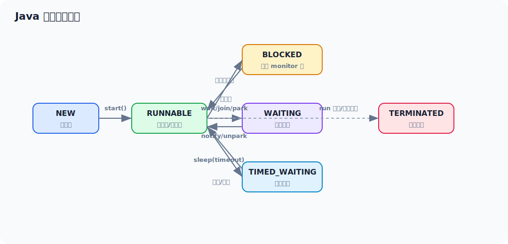

### 3.1 Java 线程状态

| 状态 | 含义 | 常见场景 |
| --- | --- | --- |
| `NEW` | 创建但未启动 | `new Thread()` 后还没 `start()` |
| `RUNNABLE` | 可运行或正在运行 | 正在执行 Java 代码、等待 CPU、执行 IO |
| `BLOCKED` | 等待进入 synchronized 代码块 | monitor 锁竞争 |
| `WAITING` | 无限等待 | `wait()`、`join()`、`LockSupport.park()` |
| `TIMED_WAITING` | 限时等待 | `sleep()`、`wait(timeout)`、`join(timeout)` |
| `TERMINATED` | 执行结束 | `run()` 结束或异常退出 |

排查时不要把 `RUNNABLE` 简单理解为一定正在占 CPU。线程执行 socket read 等 native IO 时，也可能显示为 `RUNNABLE`。

### 3.2 创建线程的方式

常见方式：

- 继承 `Thread`，重写 `run()`。
- 实现 `Runnable`，交给 `Thread` 或线程池。
- 实现 `Callable`，配合 `FutureTask` 或线程池拿返回值。
- 使用线程池，这是项目里最常见的方式。

示例：

```java
class MyCallable implements Callable<String> {
    @Override
    public String call() {
        return "任务完成，返回结果";
    }
}

FutureTask<String> future = new FutureTask<>(new MyCallable());
new Thread(future, "demo-thread").start();

String result = future.get();
```

工程上更推荐交给线程池：

```java
ExecutorService executor = Executors.newFixedThreadPool(4);
Future<String> future = executor.submit(() -> "任务完成");
String result = future.get();
```

不过核心业务不要直接使用 `Executors` 的快捷工厂，原因后面线程池章节会讲。

### 3.3 常用方法和面试细节

| 方法 | 作用 | 注意点 |
| --- | --- | --- |
| `start()` | 启动新线程 | 真正创建新调用栈，不能重复调用 |
| `run()` | 线程执行逻辑 | 直接调用只是普通方法调用 |
| `join()` | 等待线程结束 | 底层基于 wait，可能抛 `InterruptedException` |
| `sleep()` | 当前线程休眠 | 不释放锁 |
| `yield()` | 提示让出 CPU | 只是提示，不保证让出 |
| `interrupt()` | 打断线程 | 不会粗暴杀死线程 |
| `isInterrupted()` | 查看打断标记 | 不清除标记 |
| `Thread.interrupted()` | 查看当前线程打断标记 | 会清除标记 |

**interrupt 怎么理解**

`interrupt()` 更像一种协作式取消信号：

- 如果线程在 `sleep`、`wait`、`join` 中，会抛 `InterruptedException`，并清除打断标记。
- 如果线程正在正常运行，只会设置打断标记，需要代码自己检查。
- 如果线程被 `LockSupport.park()` 阻塞，会被唤醒，并设置打断标记。

推荐写法：

```java
while (!Thread.currentThread().isInterrupted()) {
    doWork();
}
```

捕获 `InterruptedException` 后，如果当前方法不能处理取消语义，通常要恢复打断标记：

```java
try {
    Thread.sleep(1000);
} catch (InterruptedException e) {
    Thread.currentThread().interrupt();
    return;
}
```

## 4. wait/notify、sleep、park/unpark

### 4.1 wait/notify

`wait()`、`notify()`、`notifyAll()` 是 `Object` 方法，必须配合对象锁使用。

```java
synchronized (lock) {
    while (!condition) {
        lock.wait();
    }
    doBusiness();
}
```

为什么用 `while`，不用 `if`？

- 线程可能被虚假唤醒。
- `notifyAll` 后多个线程重新竞争锁，拿到锁时条件可能已经被其他线程改变。

| 方法 | 作用 |
| --- | --- |
| `wait()` | 当前线程释放对象锁，进入 WaitSet 等待 |
| `notify()` | 随机唤醒一个在该对象 WaitSet 等待的线程 |
| `notifyAll()` | 唤醒该对象 WaitSet 中所有等待线程 |

### 4.2 sleep 和 wait 的区别

| 对比 | `sleep()` | `wait()` |
| --- | --- | --- |
| 所属类 | `Thread` | `Object` |
| 是否释放锁 | 不释放 | 释放对象锁 |
| 是否必须持有锁 | 不需要 | 必须在 synchronized 内 |
| 唤醒方式 | 超时或 interrupt | notify/notifyAll/超时/interrupt |
| 常见用途 | 暂停执行 | 线程协作 |

### 4.3 park/unpark

`park/unpark` 来自 `LockSupport`，它以线程为单位阻塞和唤醒，比 `notify` 更精确。

```java
Thread worker = new Thread(() -> {
    LockSupport.park();
    System.out.println("继续执行");
});

worker.start();
LockSupport.unpark(worker);
```

特点：

- `unpark` 可以先于 `park` 调用，相当于提前发了一个许可。
- 每个线程最多只有一个许可，多次 `unpark` 不会累积多个许可。
- AQS、ReentrantLock、Semaphore 等底层都会用到 `park/unpark`。

## 5. JMM、volatile 与 happens-before

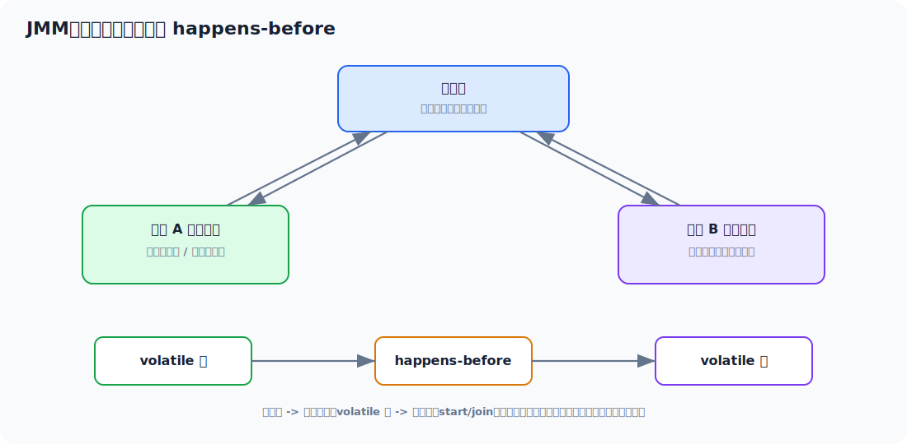

### 5.1 JMM 解决什么问题

Java 内存模型主要解决并发下三个问题：

- 原子性：一个操作是否不可分割。
- 可见性：一个线程修改共享变量，其他线程能否及时看到。
- 有序性：代码执行顺序是否可能被编译器或 CPU 重排序。

典型问题：

```java
private boolean running = true;

public void stop() {
    running = false;
}

public void run() {
    while (running) {
        doWork();
    }
}
```

如果 `running` 不是 `volatile`，工作线程可能一直读自己的缓存，看不到其他线程写入的 `false`。

### 5.2 volatile 能做什么

`volatile` 保证：

- 可见性：写入后其他线程能看到。
- 有序性：禁止特定指令重排序。

`volatile` 不保证复合操作的原子性。

错误示例：

```java
private volatile int count = 0;

public void add() {
    count++;
}
```

`count++` 包含读取、加一、写回三个动作，多线程下仍然会丢失更新。

适合场景：

- 开关标记，例如 `running`。
- 配置刷新标记。
- 单例双重检查锁里的实例引用。
- 一写多读、写入不依赖旧值的场景。

### 5.3 happens-before

常见规则：

- 程序顺序规则：同一线程内，前面的操作 happens-before 后面的操作。
- 锁规则：解锁 happens-before 后续对同一把锁的加锁。
- volatile 规则：对 volatile 变量的写 happens-before 后续对它的读。
- 线程启动规则：`Thread.start()` happens-before 新线程中的操作。
- 线程终止规则：线程中的操作 happens-before 其他线程检测到它结束。
- 传递性：A happens-before B，B happens-before C，则 A happens-before C。

**面试表达**

> happens-before 不是单纯的时间先后，它表示一种可见性和有序性的保证。比如线程 A 对 volatile 变量的写，对线程 B 后续读这个变量是可见的。

## 6. synchronized 与锁优化

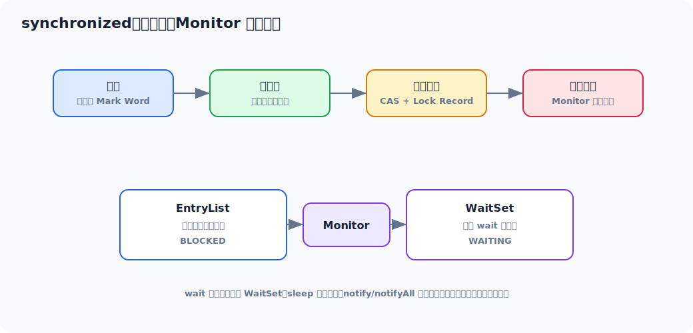

### 6.1 synchronized 保证什么

`synchronized` 可以保证：

- 原子性：同一时刻只有一个线程进入同步代码块。
- 可见性：释放锁前会把修改刷新出去，获取锁后能看到之前释放锁线程的修改。
- 有序性：同步块内外会形成内存语义约束。

用法：

```java
public synchronized void add() {
    count++;
}

public void add2() {
    synchronized (this) {
        count++;
    }
}
```

锁对象非常关键：

- 普通同步方法锁的是 `this`。
- 静态同步方法锁的是 `Class` 对象。
- 同步代码块锁的是括号里的对象。

### 6.2 synchronized 和 wait/notify 的关系

每个 Java 对象都可以关联一个 Monitor：

- 竞争 `synchronized` 锁失败的线程进入 EntryList，状态通常是 `BLOCKED`。
- 调用 `wait()` 的线程释放锁，进入 WaitSet，状态通常是 `WAITING`。
- `notify/notifyAll` 只是把线程从 WaitSet 唤醒，线程还要重新竞争锁。

### 6.3 锁升级

HotSpot 为了降低锁成本，做过偏向锁、轻量级锁、重量级锁等优化。不同 JDK 版本细节会变化，面试不需要背所有 Mark Word 位，只要能讲清楚方向：

- 无竞争时尽量降低加锁成本。
- 轻微竞争时用 CAS 尝试避免阻塞。
- 竞争激烈时膨胀为重量级锁，线程阻塞和唤醒由操作系统参与，成本更高。

### 6.4 synchronized 优化原则

- 缩小锁范围，不要把 IO、RPC、数据库查询放在锁里。
- 降低锁粒度，能按用户、订单、资源 ID 分段，就不要全局锁。
- 避免锁嵌套，确实需要时保证加锁顺序一致。
- 读多写少时考虑 `ReadWriteLock`，但写多场景读写锁不一定更快。
- 能用不可变对象、局部变量、消息队列避免共享，就优先避免共享。

## 7. ReentrantLock 与 AQS

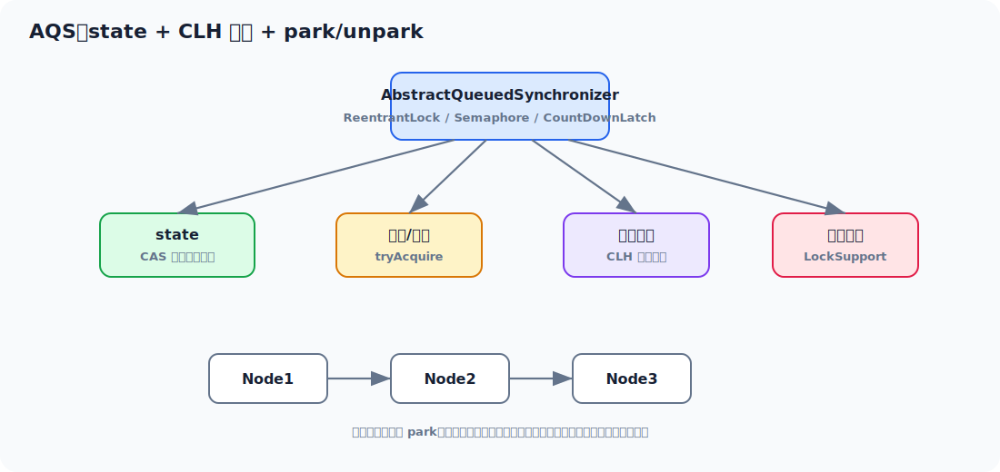

### 7.1 ReentrantLock 和 synchronized 对比

| 对比 | `synchronized` | `ReentrantLock` |
| --- | --- | --- |
| 使用方式 | 关键字，自动释放 | 手动 lock/unlock |
| 可中断 | 不支持等待锁时中断 | `lockInterruptibly()` 支持 |
| 超时获取 | 不支持 | `tryLock(timeout)` 支持 |
| 公平锁 | 不支持显式公平 | 支持公平/非公平 |
| 条件队列 | 一个 WaitSet | 多个 `Condition` |
| 易用性 | 简单，不易忘释放 | 必须 finally 解锁 |

标准写法：

```java
lock.lock();
try {
    doBusiness();
} finally {
    lock.unlock();
}
```

### 7.2 AQS 核心思想

AQS 可以理解为很多同步器的基础框架：

- 一个 `volatile int state` 表示同步状态。
- 用 CAS 修改 `state`。
- 获取失败的线程进入 CLH 等待队列。
- 通过 `LockSupport.park/unpark` 阻塞和唤醒线程。

常见基于 AQS 的工具：

| 工具 | state 含义 |
| --- | --- |
| `ReentrantLock` | 重入次数 |
| `Semaphore` | 剩余许可数量 |
| `CountDownLatch` | 还需要倒数的次数 |
| `ReentrantReadWriteLock` | 读锁和写锁状态 |

**面试表达**

> AQS 的核心就是 state + 队列。线程获取同步状态失败后进入等待队列并 park，释放锁或释放许可时再唤醒后继节点。ReentrantLock、Semaphore、CountDownLatch 都是在这个基础上定义不同的 state 语义。

### 7.3 公平锁和非公平锁

非公平锁：

- 新线程来了先尝试 CAS 抢锁。
- 吞吐量通常更高。
- 可能让等待时间长的线程继续等待。

公平锁：

- 获取锁前先看队列里是否有前驱节点。
- 更公平，但吞吐可能下降。

工程里默认通常用非公平锁，除非业务明确要求公平性。

## 8. CAS、原子类与 LongAdder

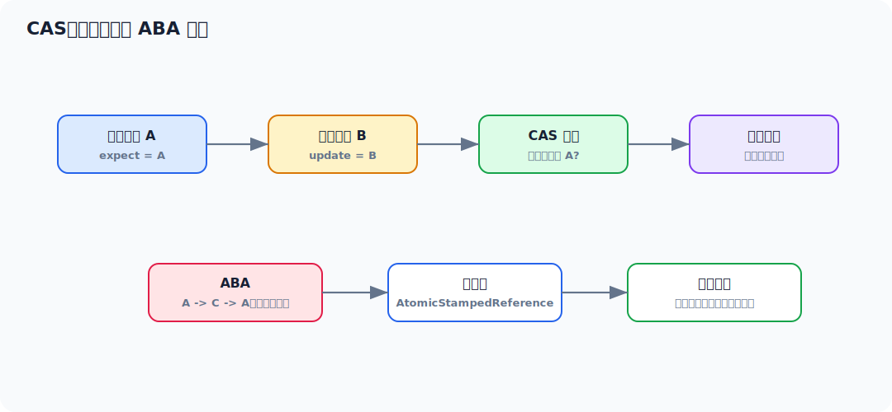

### 8.1 CAS 是什么

CAS：Compare And Swap，比较并交换。

逻辑是：

1. 读取旧值 `expect`。
2. 计算新值 `update`。
3. 如果当前值仍等于 `expect`，就更新为 `update`。
4. 如果不相等，说明被其他线程改过，更新失败，可以重试。

示例：

```java
AtomicInteger count = new AtomicInteger();
count.incrementAndGet();
```

### 8.2 CAS 的优缺点

优点：

- 不需要阻塞线程。
- 低冲突下性能好。
- 适合计数器、状态位、引用更新。

缺点：

- 高冲突下会大量自旋，浪费 CPU。
- 只能保证单个变量的原子更新。
- 存在 ABA 问题。

### 8.3 ABA 问题

ABA 指一个值从 A 变成 B，又变回 A。CAS 只比较值，会误以为没有变化。

解决方式：

- 加版本号，例如 `AtomicStampedReference`。
- 使用带标记的引用，例如 `AtomicMarkableReference`。
- 业务上确认 ABA 不影响结果时，可以不处理。

### 8.4 AtomicLong 和 LongAdder

`AtomicLong` 通过一个变量 CAS 更新，高并发下多个线程竞争同一个点。

`LongAdder` 把热点分散到多个 Cell 上，最后求和，适合高并发计数，例如 QPS、请求数、命中数。

| 场景 | 推荐 |
| --- | --- |
| 需要实时精确值，竞争不高 | `AtomicLong` |
| 高并发统计计数，允许求和瞬间不绝对一致 | `LongAdder` |
| 多字段一致更新 | 锁或重新设计数据结构 |

## 9. 线程池：参数、队列、拒绝策略和隔离

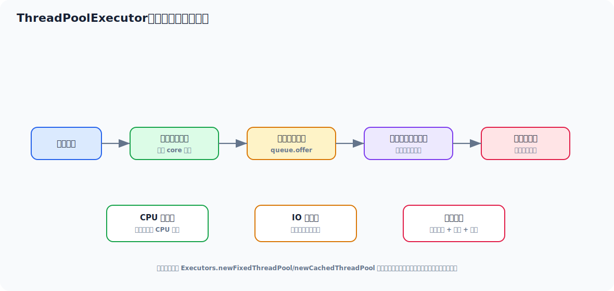

### 9.1 为什么要用线程池

线程池解决三个问题：

- 复用线程，减少频繁创建销毁成本。
- 控制并发数量，避免线程无限增长拖垮系统。
- 提供队列、拒绝策略、监控指标，方便治理。

### 9.2 核心参数

```java
new ThreadPoolExecutor(
        corePoolSize,
        maximumPoolSize,
        keepAliveTime,
        TimeUnit.SECONDS,
        workQueue,
        threadFactory,
        rejectedExecutionHandler
);
```

| 参数 | 含义 | 重点 |
| --- | --- | --- |
| `corePoolSize` | 核心线程数 | 常驻线程数量 |
| `maximumPoolSize` | 最大线程数 | 队列满后还能扩到多少 |
| `keepAliveTime` | 空闲线程存活时间 | 非核心线程回收 |
| `workQueue` | 工作队列 | 必须重点设计 |
| `threadFactory` | 线程工厂 | 命名、异常处理 |
| `rejectedExecutionHandler` | 拒绝策略 | 过载时如何处理 |

### 9.3 任务提交流程

1. 当前线程数小于 `corePoolSize`，创建核心线程执行任务。
2. 核心线程已满，尝试放入队列。
3. 队列已满，且线程数小于 `maximumPoolSize`，创建非核心线程。
4. 线程也满了，执行拒绝策略。

这个流程决定了队列选择非常关键。如果使用无界队列，`maximumPoolSize` 基本不会生效，任务会一直堆在队列里。

### 9.4 为什么不推荐 Executors 快捷方法

| 方法 | 风险 |
| --- | --- |
| `newFixedThreadPool` | 默认无界队列，任务堆积可能 OOM |
| `newSingleThreadExecutor` | 默认无界队列，单线程阻塞后任务无限堆积 |
| `newCachedThreadPool` | 最大线程数接近无限，可能创建过多线程 |
| `newScheduledThreadPool` | 延迟队列可能堆积大量任务 |

推荐显式创建：

```java
private static final AtomicInteger THREAD_INDEX = new AtomicInteger(1);

private static final ThreadFactory ORDER_EXPORT_THREAD_FACTORY = runnable -> {
    Thread thread = new Thread(runnable);
    thread.setName("order-export-" + THREAD_INDEX.getAndIncrement());
    thread.setUncaughtExceptionHandler((t, e) -> log.error("thread error, name={}", t.getName(), e));
    return thread;
};

ThreadPoolExecutor executor = new ThreadPoolExecutor(
        16,
        32,
        60,
        TimeUnit.SECONDS,
        new ArrayBlockingQueue<>(1000),
        ORDER_EXPORT_THREAD_FACTORY,
        new ThreadPoolExecutor.CallerRunsPolicy()
);
```

如果项目里有 Guava、Apache Commons Lang 或自研基础包，也可以用现成的 `ThreadFactoryBuilder`。关键是至少要给线程命名，最好再加未捕获异常日志，否则线上看线程栈时很难定位任务来源。

### 9.5 线程数怎么估算

CPU 密集型：

```text
线程数 ≈ CPU 核数 或 CPU 核数 + 1
```

目标是减少上下文切换，避免太多线程抢 CPU。

IO 密集型：

```text
线程数 ≈ CPU 核数 * (1 + 等待时间 / 计算时间)
```

这只是估算，最终要通过压测和监控调整。

例如一个任务计算 20ms，等待数据库/RPC 80ms，等待/计算 = 4，8 核机器可以估算：

```text
8 * (1 + 4) = 40
```

但不能机械套公式，还要看：

- 下游数据库连接池大小。
- RPC 超时时间。
- 单机内存。
- 队列长度。
- P99 延迟和错误率。

### 9.6 拒绝策略怎么选

| 策略 | 行为 | 适用场景 |
| --- | --- | --- |
| `AbortPolicy` | 直接抛异常 | 让上游明确失败 |
| `CallerRunsPolicy` | 提交任务的线程自己执行 | 轻度背压，降低提交速度 |
| `DiscardPolicy` | 直接丢弃 | 可丢弃任务，例如非核心日志 |
| `DiscardOldestPolicy` | 丢弃队列最老任务 | 很少用于核心业务 |

核心业务不建议静默丢弃。一般要么快速失败，要么调用方执行形成背压，要么进入降级流程。

### 9.7 线程池隔离

不要把所有异步任务都扔到一个公共线程池。

应该按业务和资源隔离：

- 查询聚合线程池。
- 导出线程池。
- MQ 消费线程池。
- 通知推送线程池。
- 慢下游专用线程池。

隔离的意义是：一个慢任务不会拖死所有任务。

场景	说明
微服务调用	每个下游服务（用户中心、订单、支付）使用独立线程池
混合任务类型	CPU 密集型 vs I/O 密集型任务分开
核心 vs 非核心业务	如“下单”用高优先级池，“发通知”用低优先级池
第三方 API 调用	不同供应商（短信、物流、征信）隔离


根据业务划分但注意不要过度隔离，线程池都有固定的开销如内存、上下文切换，过多的线程池会适得其反。


### 9.8 必须监控的线程池指标

- 当前线程数。
- 活跃线程数。
- 队列长度。
- 最大队列长度。
- 任务完成数。
- 拒绝次数。
- 单任务执行耗时。
- 任务排队等待时间。

面试加分表达：

> 我不会只配一个线程池参数就结束，还会把线程池活跃数、队列长度、拒绝次数、任务耗时接入监控。因为很多线上问题不是线程池一开始就错，而是流量或下游变慢后，队列慢慢堆起来，最后把系统拖死。

## 10. 阻塞队列、并发容器和同步工具

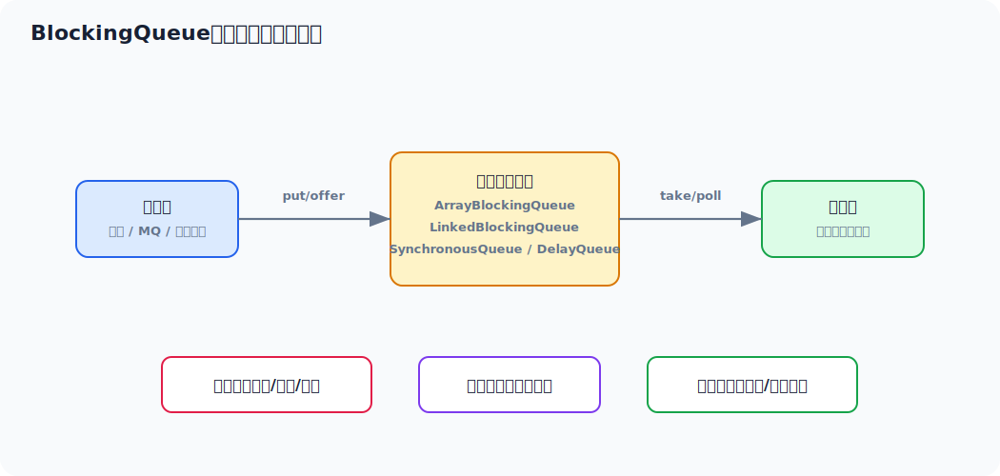

### 10.1 BlockingQueue

阻塞队列常用于生产者消费者、线程池任务队列、削峰缓冲。

| 队列 | 特点 | 场景 |
| --- | --- | --- |
| `ArrayBlockingQueue` | 数组，有界 | 固定容量，便于控制内存 |
| `LinkedBlockingQueue` | 链表，可有界也可无界 | 注意无界风险 |
| `SynchronousQueue` | 不存储元素，直接交接 | cached 线程池 |
| `PriorityBlockingQueue` | 优先级队列 | 优先级任务 |
| `DelayQueue` | 延迟队列 | 超时任务、延迟调度 |

核心原则：核心业务优先使用有界队列。无界队列只是把过载问题延后，最后可能变成 OOM 或超长延迟。

### 10.2 ConcurrentHashMap

JDK 8 之后 `ConcurrentHashMap` 主要通过 CAS + synchronized + 链表/红黑树实现并发安全。

常见面试点：

- 不允许 key/value 为 null，避免并发下无法区分“没有值”和“值就是 null”。
- 读操作大多不加锁，依赖 volatile 可见性。
- 写操作在桶级别加锁，降低锁粒度。
- 链表过长会树化，降低查询复杂度。

常用方法注意：

```java
map.computeIfAbsent(key, k -> loadValue(k));
```

`computeIfAbsent` 适合缓存懒加载，但 mapping function 里不要做过慢、会递归修改同一个 map、或者可能长时间阻塞的操作，否则会扩大锁影响。

### 10.3 CopyOnWriteArrayList

写时复制，读不加锁，写时复制新数组。

适合：

- 读多写少。
- 数据量不大。
- 允许读到旧快照。

不适合：

- 写频繁。
- 列表很大。
- 强一致读写。

典型场景：监听器列表、配置快照。

### 10.4 CountDownLatch、CyclicBarrier、Semaphore

| 工具 | 作用 | 场景 |
| --- | --- | --- |
| `CountDownLatch` | 一个或多个线程等待其他任务完成 | 主线程等多个初始化任务 |
| `CyclicBarrier` | 多个线程互相等待，到齐后继续 | 分阶段并行计算 |
| `Semaphore` | 控制并发许可数 | 限制同时访问某个资源 |

Semaphore 示例：

```java
Semaphore semaphore = new Semaphore(20);

if (!semaphore.tryAcquire(200, TimeUnit.MILLISECONDS)) {
    throw new RuntimeException("系统繁忙");
}
try {
    callRemote();
} finally {
    semaphore.release();
}
```

这类限并发比单纯排队更直接，适合保护慢下游。

## 11. CompletableFuture 与异步编排

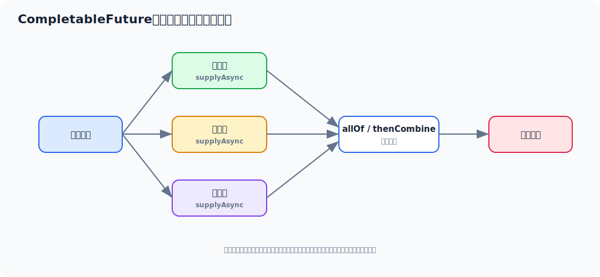

### 11.1 适合什么场景

`CompletableFuture` 适合多个相互独立的 IO 查询并行执行，例如：

- 查用户信息。
- 查订单列表。
- 查优惠券。
- 查账户余额。

如果串行调用需要 4 个接口各 100ms，总耗时约 400ms；并行调用理论上接近最慢的那个接口耗时。

### 11.2 基本写法

```java
CompletableFuture<UserDTO> userFuture = CompletableFuture.supplyAsync(
        () -> userClient.getUser(userId),
        queryExecutor
);

CompletableFuture<List<OrderDTO>> orderFuture = CompletableFuture.supplyAsync(
        () -> orderClient.listOrders(userId),
        queryExecutor
);

CompletableFuture<ResultDTO> resultFuture = userFuture.thenCombine(orderFuture, (user, orders) -> {
    return buildResult(user, orders);
});

ResultDTO result = resultFuture.get(300, TimeUnit.MILLISECONDS);
```

### 11.3 工程注意事项

- 一定要传自定义线程池，不要默认使用公共 `ForkJoinPool.commonPool()` 承载业务阻塞 IO。
- 每个下游调用都要有超时。
- 异常要有兜底，不要让一个非核心查询拖垮整个接口。
- 注意上下文传递，例如 traceId、登录用户、MDC。
- 不要过度异步化。强依赖、必须串行、数据量很小的逻辑，异步反而增加复杂度。

异常兜底示例：

```java
CompletableFuture<CouponDTO> couponFuture = CompletableFuture.supplyAsync(
        () -> couponClient.query(userId),
        queryExecutor
).completeOnTimeout(CouponDTO.empty(), 200, TimeUnit.MILLISECONDS)
 .exceptionally(ex -> CouponDTO.empty());
```

## 12. 并发场景决策

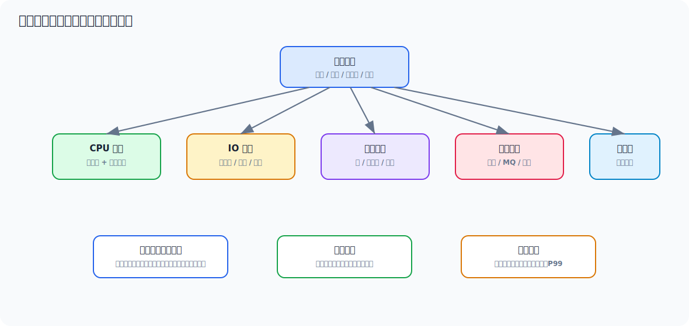

做并发方案前，先问四个问题：

1. 是否存在共享可变数据？
2. 是否必须强一致？
3. 任务是否可以丢弃、重试、延迟？
4. 瓶颈是 CPU、IO、锁、数据库、还是外部服务？

### 12.1 常见场景怎么选

| 场景 | 推荐方案 | 原因 |
| --- | --- | --- |
| 多线程更新计数 | `AtomicLong` / `LongAdder` | 避免显式锁 |
| 高并发统计 QPS | `LongAdder` | 分散热点 |
| 读多写少列表 | `CopyOnWriteArrayList` | 读无锁，写复制 |
| 多线程缓存 | `ConcurrentHashMap` + 过期策略 | 线程安全，但要防止无限增长 |
| 限制并发访问下游 | `Semaphore` / 独立线程池 | 保护下游和自身 |
| 多个查询并行聚合 | `CompletableFuture` + 自定义线程池 | 降低接口总耗时 |
| 任务削峰 | 有界队列 / MQ | 平滑流量 |
| 定时延迟任务 | `ScheduledThreadPoolExecutor` / MQ 延迟消息 | 看可靠性要求 |
| 批量数据处理 | 分片 + 线程池 + 有界队列 | 控制并发和内存 |
| 防止重复提交 | 幂等 key + Redis/DB 唯一约束 | 并发控制不能只靠 JVM 锁 |

### 12.2 JVM 锁和分布式锁怎么选

JVM 锁只在单个 Java 进程内有效。如果应用多实例部署，`synchronized`、`ReentrantLock` 只能保护单实例内并发，不能保护多个实例同时操作同一资源。

| 场景 | 选择 |
| --- | --- |
| 单实例内共享对象 | JVM 锁 |
| 多实例抢同一业务资源 | 数据库唯一约束、乐观锁、Redis 分布式锁 |
| 资金、库存等强一致 | 优先数据库事务、行锁、唯一约束、幂等 |
| 可重试异步任务 | MQ + 幂等 + 状态机 |

分布式锁不是银弹。能用数据库唯一约束和状态机保证正确性时，通常比“先加锁再更新”更稳。

### 12.3 锁、队列、异步的取舍

- 锁解决共享数据一致性，但会降低并行度。
- 队列解决削峰和解耦，但会引入延迟和积压问题。
- 异步解决等待占用线程的问题，但会增加超时、异常、上下文、排查复杂度。
- 线程池解决并发控制，但配置不当会变成故障放大器。

面试表达：

> 我会先判断是否真的需要共享。如果能通过局部变量、不可变对象、消息传递避免共享，就不加锁。必须共享时，再根据读写比例、竞争强度、一致性要求选择 synchronized、ReentrantLock、原子类或并发容器。对于 IO 等待型任务，会考虑异步和独立线程池，但必须配超时、限流和监控。

## 13. 线上并发问题排查

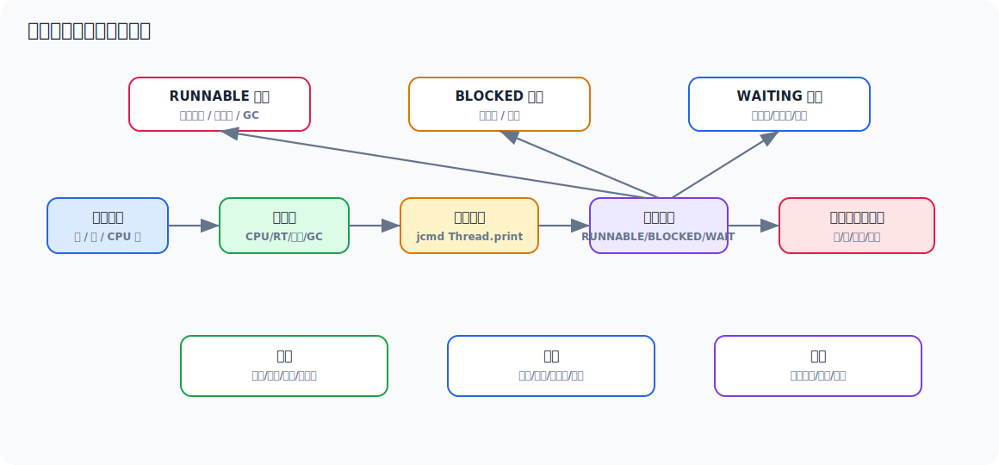

### 13.1 常用命令

```bash
# 找 Java 进程
jps -l

# 看 JVM 参数
jcmd <pid> VM.flags

# 导出线程栈
jcmd <pid> Thread.print > /tmp/thread.txt

# 或使用 jstack
jstack <pid> > /tmp/thread.txt

# 看某进程线程 CPU
top -Hp <pid>

# 线程 id 转十六进制
printf "%x\n" <tid>
```

Windows 可以用：

```powershell
jps -l
jcmd <pid> Thread.print
```

### 13.2 CPU 飙高怎么排查

1. `top` 找到 CPU 高的 Java 进程。
2. `top -Hp <pid>` 找到 CPU 高的线程。
3. 把线程 ID 转成十六进制。
4. `jstack` 或 `jcmd Thread.print` 导出线程栈。
5. 搜索 `nid=0x...`。
6. 看线程在跑业务代码、GC、锁自旋、序列化、正则、还是死循环。

如果很多线程都在 GC 或对象创建相关栈，要结合 GC 日志，不要只盯业务代码。

### 13.3 接口卡住但 CPU 不高

常见原因：

- 线程池队列堆积。
- 数据库连接池耗尽。
- Redis/RPC 下游慢。
- 大量线程 `BLOCKED` 等锁。
- 大量线程 `WAITING` 等队列任务。

线程栈示例：

```text
java.lang.Thread.State: WAITING
    at java.util.concurrent.locks.LockSupport.park
    at java.util.concurrent.ThreadPoolExecutor.getTask
```

这通常表示线程池工作线程在等任务，不一定是问题。

如果看到：

```text
java.lang.Thread.State: WAITING
    at com.zaxxer.hikari.pool.HikariPool.getConnection
```

更像数据库连接池不够、SQL 慢或连接泄漏。

### 13.4 死锁排查

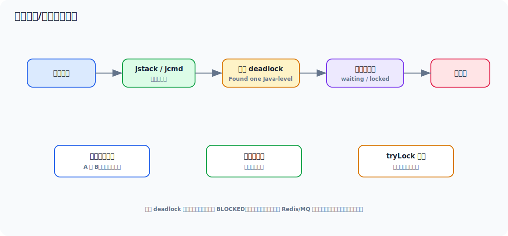

死锁通常满足四个条件：

- 互斥。
- 持有并等待。
- 不可抢占。
- 循环等待。

示例：

```java
Thread t1 = new Thread(() -> {
    synchronized (lockA) {
        synchronized (lockB) {
            doWork();
        }
    }
});

Thread t2 = new Thread(() -> {
    synchronized (lockB) {
        synchronized (lockA) {
            doWork();
        }
    }
});
```

导出线程栈：

```bash
jstack <pid> > /tmp/deadlock.txt
```

如果是 Java 级死锁，通常能看到：

```text
Found one Java-level deadlock:
"thread-1":
  waiting to lock monitor ...
  which is held by "thread-2"
"thread-2":
  waiting to lock monitor ...
  which is held by "thread-1"
```

治理：

- 统一加锁顺序。
- 减少锁嵌套。
- 缩小锁范围。
- 使用 `tryLock(timeout)`，失败后释放已持有资源。
- 对热点资源做分段锁或无锁化设计。

### 13.5 线程池问题排查清单

重点看这些指标：

- 活跃线程数是否长期接近最大线程数。
- 队列长度是否持续上涨。
- 拒绝次数是否增加。
- 单任务执行耗时是否变长。
- 任务排队等待时间是否变长。
- 是否有某类任务占满公共线程池。

如果没有监控，也可以临时通过代码或 Arthas 看线程池对象，但面试里重点是思路：

```text
线程池打满
  -> 是任务执行慢，还是任务提交太快
  -> 是所有任务慢，还是某类任务慢
  -> 是本地锁竞争，还是下游响应慢
  -> 队列积压是否可以丢弃/降级/限流
```

## 14. 完整案例：线程池打满导致接口雪崩

这个案例可以作为面试复述模板。你没有真实处理过也没关系，可以表达为“我按这个链路复盘和演练过类似问题”。

### 14.1 背景

用户中心有一个聚合接口 `/user/home`，会查询：

- 用户基础信息。
- 最近订单。
- 优惠券。
- 推荐商品。
- 会员等级。

为了提升响应速度，代码用 `CompletableFuture` 并行查询。上线后平时没问题，大促时接口开始大量超时。

现象：

- `/user/home` P99 从 `500ms` 升到 `8s`。
- Tomcat 线程数升高，大量请求堆积。
- CPU 不高，GC 也不明显。
- 下游推荐服务偶发变慢。

### 14.2 问题代码

```java
CompletableFuture<UserDTO> userFuture = CompletableFuture.supplyAsync(
        () -> userClient.getUser(userId)
);

CompletableFuture<List<OrderDTO>> orderFuture = CompletableFuture.supplyAsync(
        () -> orderClient.listRecent(userId)
);

CompletableFuture<List<ItemDTO>> recommendFuture = CompletableFuture.supplyAsync(
        () -> recommendClient.list(userId)
);

CompletableFuture.allOf(userFuture, orderFuture, recommendFuture).join();
```

问题点：

- 没有传自定义线程池，默认使用 `ForkJoinPool.commonPool()`。
- commonPool 被多个业务共享，一个慢下游会影响其他异步任务。
- 没有超时和异常兜底，推荐服务慢会拖住整个聚合接口。
- 调用方 `join()` 一直等待，Tomcat 请求线程也被占住。

### 14.3 现场排查

先看线程栈：

```bash
jcmd 12345 Thread.print > /tmp/user-home-thread.txt
```

看到大量请求线程卡在：

```text
"http-nio-8080-exec-87"
   java.lang.Thread.State: WAITING
        at java.util.concurrent.CompletableFuture.join(CompletableFuture.java:...)
        at com.example.user.HomeService.queryHome(HomeService.java:88)
```

再看 ForkJoinPool 线程：

```text
"ForkJoinPool.commonPool-worker-7"
   java.lang.Thread.State: RUNNABLE
        at java.net.SocketInputStream.socketRead0(Native Method)
        at com.example.recommend.RecommendClient.list(RecommendClient.java:42)
```

判断：

- 请求线程在等异步任务完成。
- commonPool 工作线程在等待推荐服务响应。
- CPU 不高，因为线程主要在等 IO。
- 根因不是“线程太少”这么简单，而是慢下游 + 公共线程池 + 无超时导致故障扩散。

### 14.4 修复方案

1. 给聚合查询配置独立线程池。
2. 推荐服务设置更短超时，非核心数据允许降级为空。
3. 限制同一实例对推荐服务的并发。
4. 接入线程池监控。
5. 保留核心信息，非核心模块失败不影响主接口。

修复示例：

```java
private static final AtomicInteger HOME_QUERY_INDEX = new AtomicInteger(1);

ThreadPoolExecutor homeQueryExecutor = new ThreadPoolExecutor(
        20,
        40,
        60,
        TimeUnit.SECONDS,
        new ArrayBlockingQueue<>(500),
        runnable -> {
            Thread thread = new Thread(runnable);
            thread.setName("home-query-" + HOME_QUERY_INDEX.getAndIncrement());
            return thread;
        },
        new ThreadPoolExecutor.CallerRunsPolicy()
);

CompletableFuture<UserDTO> userFuture = CompletableFuture.supplyAsync(
        () -> userClient.getUser(userId),
        homeQueryExecutor
).orTimeout(300, TimeUnit.MILLISECONDS);

CompletableFuture<List<OrderDTO>> orderFuture = CompletableFuture.supplyAsync(
        () -> orderClient.listRecent(userId),
        homeQueryExecutor
).completeOnTimeout(Collections.emptyList(), 300, TimeUnit.MILLISECONDS);

CompletableFuture<List<ItemDTO>> recommendFuture = CompletableFuture.supplyAsync(
        () -> recommendClient.list(userId),
        homeQueryExecutor
).completeOnTimeout(Collections.emptyList(), 150, TimeUnit.MILLISECONDS)
 .exceptionally(ex -> Collections.emptyList());
```

如果推荐服务是强风险点，可以再加 `Semaphore`：

```java
if (!recommendSemaphore.tryAcquire(50, TimeUnit.MILLISECONDS)) {
    return Collections.emptyList();
}
try {
    return recommendClient.list(userId);
} finally {
    recommendSemaphore.release();
}
```

### 14.5 验证

灰度后观察：

- `/user/home` P99 是否回落。
- `home-query` 线程池队列长度是否稳定。
- 拒绝次数是否为 0 或在可接受范围。
- 推荐服务超时次数是否可见。
- Tomcat 工作线程是否不再大面积 `WAITING`。

面试复述：

> 这个问题我会先看 CPU 和 GC，确认不是 CPU 打满或 GC 引起。然后导线程栈，发现大量 Tomcat 线程卡在 CompletableFuture.join，而 commonPool 线程在等推荐服务 socket read。根因是 CompletableFuture 没指定业务线程池，且没有超时降级，慢下游把公共异步线程池占满，最终请求线程也被拖住。修复上我会给聚合接口单独线程池，设置有界队列、超时、异常兜底和推荐服务并发限制，并监控线程池活跃数、队列长度和拒绝次数。

## 15. 高频面试题速答

### 15.1 synchronized 和 volatile 区别

> `volatile` 保证可见性和有序性，不保证复合操作原子性；`synchronized` 保证原子性、可见性和有序性。状态标记适合 volatile，涉及共享变量复合修改时要用锁、原子类或重新设计。

### 15.2 synchronized 和 ReentrantLock 区别

> synchronized 是 JVM 关键字，使用简单，自动释放锁；ReentrantLock 是 JUC 类，支持可中断、超时获取、公平锁和多个 Condition，但必须在 finally 里 unlock。简单互斥优先 synchronized，需要超时、公平、条件队列时考虑 ReentrantLock。

### 15.3 ThreadLocal 原理和风险

> ThreadLocal 的值实际存在线程自己的 ThreadLocalMap 里，key 是 ThreadLocal 弱引用，value 是业务对象。线程池场景下线程会复用，如果用完不 remove，value 可能长期挂在线程上，造成内存泄漏或上下文串数据。使用时建议 try-finally remove。

示例：

```java
try {
    USER_CONTEXT.set(context);
    doBusiness();
} finally {
    USER_CONTEXT.remove();
}
```

### 15.4 线程池参数怎么设置

> 先区分 CPU 密集还是 IO 密集。CPU 密集线程数接近 CPU 核数，IO 密集可以按等待时间和计算时间比例适当放大。队列建议有界，拒绝策略要结合业务选择，核心业务通常不能静默丢弃。最终参数要靠压测和线上监控验证，而不是只套公式。

### 15.5 线程池队列为什么不能无界

> 无界队列会让任务无限堆积，短期看没有拒绝，长期会导致延迟越来越大，甚至 OOM。它还会让 maximumPoolSize 基本失效，因为核心线程满了之后任务直接进队列，不会继续扩线程。

### 15.6 CAS 有什么问题

> CAS 低冲突下性能好，但高冲突下会大量自旋消耗 CPU，只能保证单变量原子更新，还可能有 ABA 问题。ABA 可以用版本号或 AtomicStampedReference 解决，但很多计数场景 ABA 不影响业务。

### 15.7 CountDownLatch 和 CyclicBarrier 区别

> CountDownLatch 是一个或多个线程等待其他任务完成，计数减到 0 后不能重置；CyclicBarrier 是多个线程互相等待，到齐后一起继续，可以重复使用。前者常用于主线程等初始化任务，后者常用于分阶段并行计算。

### 15.8 如何排查死锁

> 先用 jstack 或 jcmd Thread.print 导出线程栈，搜索 `Found one Java-level deadlock`，看线程分别持有什么锁、等待什么锁，然后定位代码里的加锁顺序。修复一般是统一加锁顺序、减少锁嵌套、缩小锁粒度，或者改用 tryLock 超时释放。

### 15.9 CompletableFuture 使用注意点

> 核心是指定自定义线程池、设置超时、做好异常兜底、避免阻塞公共线程池。它适合多个独立 IO 查询并行聚合，不适合把所有逻辑都异步化。强依赖串行逻辑过度异步反而难排查。

### 15.10 Java 里如何安全停止线程

> 不建议使用 stop。推荐用 interrupt 或 volatile 标记做协作式停止。阻塞方法抛 InterruptedException 后，要么结束任务，要么恢复打断标记，让上层知道线程已被请求停止。

## 16. 面试前复习路线

### 第一阶段：基础概念

必须讲清楚：

- 进程和线程区别。
- 并发和并行区别。
- 线程状态。
- start 和 run 区别。
- sleep 和 wait 区别。
- interrupt 语义。

### 第二阶段：内存模型和锁

重点掌握：

- JMM 三大问题。
- volatile 能做什么，不能做什么。
- happens-before 常见规则。
- synchronized 锁对象、Monitor、wait/notify。
- ReentrantLock、AQS、公平锁和非公平锁。
- CAS、ABA、AtomicLong、LongAdder。

### 第三阶段：线程池和工具类

必须能落地：

- ThreadPoolExecutor 七个参数。
- 任务提交流程。
- 有界队列的重要性。
- 拒绝策略怎么选。
- 线程池隔离。
- ConcurrentHashMap、BlockingQueue、Semaphore、CountDownLatch。
- CompletableFuture 的超时、异常和线程池。

### 第四阶段：实战排查

每天练一遍这几个问题：

1. CPU 飙高怎么排查？
2. 接口卡住但 CPU 不高怎么排查？
3. 线程池打满怎么排查？
4. 死锁怎么排查？
5. CompletableFuture 把服务拖慢怎么排查？

### 最后建议

并发面试最忌讳只背概念。你要把每个知识点都落到工程问题上：

- `volatile` 落到状态标记和双重检查锁。
- `synchronized` 落到共享数据保护和锁竞争。
- AQS 落到 ReentrantLock、Semaphore、CountDownLatch。
- 线程池落到隔离、限流、队列、拒绝、监控。
- CompletableFuture 落到聚合查询、超时、降级、公共线程池风险。
- jstack 落到 RUNNABLE、BLOCKED、WAITING 的分类判断。

能讲清楚“为什么这么选、出了问题怎么看、修完怎么验证”，并发这一块就会很有分量。
