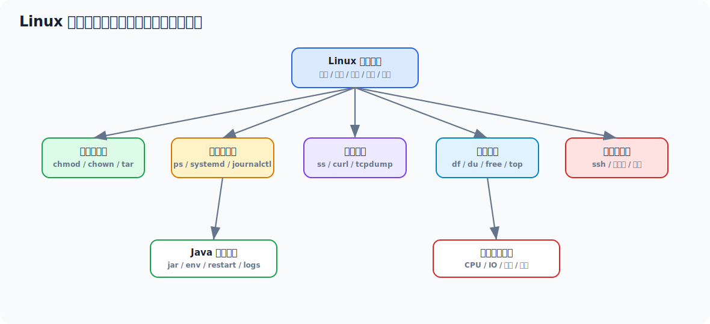

# Linux 部署与排查实用学习文档

> 面向 4 年 Java 工程师复习 Linux 部署能力。目标是能独立在虚拟机上部署 Java 服务和中间件，能排查端口、进程、日志、磁盘、内存、网络和权限问题。



## 目录

- [一、先看一个 Java 服务部署例子](#一先看一个-java-服务部署例子)
- [二、Linux 部署能力主线](#二linux-部署能力主线)
- [三、文件、目录与权限](#三文件目录与权限)
- [四、进程、端口与服务管理](#四进程端口与服务管理)
- [五、日志查看与定位](#五日志查看与定位)
- [六、网络排查](#六网络排查)
- [七、磁盘、内存、CPU 排查](#七磁盘内存cpu-排查)
- [八、Java 服务部署标准动作](#八java-服务部署标准动作)
- [九、Linux 安全与防火墙](#九linux-安全与防火墙)
- [十、常见部署故障排查手册](#十常见部署故障排查手册)
- [十一、面试高频回答模板](#十一面试高频回答模板)

---

## 一、先看一个 Java 服务部署例子

假设你有一个 Spring Boot jar：

```text
order-service.jar
```

准备目录：

```bash
sudo mkdir -p /opt/apps/order-service
sudo mkdir -p /data/logs/order-service
sudo useradd -r -s /sbin/nologin appuser
sudo chown -R appuser:appuser /opt/apps/order-service /data/logs/order-service
```

上传 jar：

```bash
scp order-service.jar root@192.168.56.10:/opt/apps/order-service/
```

写启动脚本：

```bash
cat > /opt/apps/order-service/start.sh <<'EOF'
#!/usr/bin/env bash
APP_HOME=/opt/apps/order-service
JAR_NAME=order-service.jar
LOG_FILE=/data/logs/order-service/app.log

cd "$APP_HOME" || exit 1

nohup java \
  -Xms512m -Xmx512m \
  -Dspring.profiles.active=prod \
  -jar "$JAR_NAME" \
  > "$LOG_FILE" 2>&1 &

echo $! > "$APP_HOME/app.pid"
EOF

chmod +x /opt/apps/order-service/start.sh
```

启动：

```bash
sudo -u appuser /opt/apps/order-service/start.sh
```

检查：

```bash
ps -ef | grep order-service
ss -lntp | grep 8080
tail -f /data/logs/order-service/app.log
curl http://127.0.0.1:8080/actuator/health
```

这个例子已经覆盖 Linux 部署最核心的能力：

- 目录规划
- 用户权限
- 进程启动
- 日志重定向
- 端口检查
- 健康检查

---

## 二、Linux 部署能力主线

你部署任何服务，基本都离不开这条线：

```text
文件放哪
  -> 用哪个用户跑
  -> 配置从哪来
  -> 端口是否监听
  -> 日志去哪了
  -> 进程怎么管理
  -> 出问题怎么查 CPU/内存/磁盘/网络
```

四年 Java 工程师要掌握的不是命令数量，而是排查思路。

---

## 三、文件、目录与权限

### 3.1 常见目录规划

| 目录 | 用途 |
| --- | --- |
| `/opt/apps` | 应用程序 |
| `/data/logs` | 应用日志 |
| `/data/mysql` | MySQL 数据 |
| `/data/redis` | Redis 数据 |
| `/etc` | 系统配置 |
| `/var/log` | 系统日志 |

### 3.2 权限三件套

```bash
ls -l
chmod +x start.sh
chown -R appuser:appuser /opt/apps/order-service
```

权限含义：

```text
r 读
w 写
x 执行
```

### 3.3 常见坑

脚本不能执行：

```bash
chmod +x start.sh
```

日志写不进去：

```bash
chown -R appuser:appuser /data/logs/order-service
```

Windows 上传脚本后换行错误：

```bash
sed -i 's/\r$//' start.sh
```

---

## 四、进程、端口与服务管理

### 4.1 查进程

```bash
ps -ef | grep java
jps -l
```

### 4.2 查端口

```bash
ss -lntp
ss -lntp | grep 8080
```

老系统也可能用：

```bash
netstat -lntp
```

### 4.3 杀进程

优先正常停止。  
不得已再：

```bash
kill PID
kill -9 PID
```

`kill -9` 是强杀，不给应用清理资源的机会，生产要谨慎。

### 4.4 systemd 管理服务

创建：

```bash
sudo vim /etc/systemd/system/order-service.service
```

内容：

```ini
[Unit]
Description=Order Service
After=network.target

[Service]
User=appuser
WorkingDirectory=/opt/apps/order-service
ExecStart=/usr/bin/java -Xms512m -Xmx512m -Dspring.profiles.active=prod -jar /opt/apps/order-service/order-service.jar
Restart=on-failure
RestartSec=5
StandardOutput=append:/data/logs/order-service/app.log
StandardError=append:/data/logs/order-service/app-error.log

[Install]
WantedBy=multi-user.target
```

启动：

```bash
sudo systemctl daemon-reload
sudo systemctl enable order-service
sudo systemctl start order-service
sudo systemctl status order-service
```

查看日志：

```bash
journalctl -u order-service -f
```

---

## 五、日志查看与定位

### 5.1 常用命令

```bash
tail -f app.log
tail -n 200 app.log
grep "ERROR" app.log
grep -n "NullPointerException" app.log
less app.log
```

### 5.2 按时间查日志

如果日志有时间戳：

```bash
grep "2026-05-09 10:15" app.log
```

### 5.3 大日志怎么查

不要直接 `vim` 超大日志。

用：

```bash
less app.log
grep "keyword" app.log
awk '/ERROR/ {print}' app.log
```

### 5.4 日志磁盘打满

查看：

```bash
df -h
du -sh /data/logs/*
```

处理：

- 配 logrotate
- 删除旧日志
- 降低高频无用日志

---

## 六、网络排查

### 6.1 本机端口是否监听

```bash
ss -lntp | grep 9200
```

### 6.2 本机能不能访问

```bash
curl http://127.0.0.1:9200
```

### 6.3 其他机器能不能访问

```bash
curl http://192.168.56.10:9200
```

### 6.4 DNS 是否正常

```bash
nslookup example.com
```

### 6.5 路由和连通性

```bash
ping 192.168.56.10
traceroute 8.8.8.8
```

### 6.6 抓包

```bash
sudo tcpdump -i any port 9200
```

抓包是定位“请求到底有没有到机器”的利器。

---

## 七、磁盘、内存、CPU 排查

### 7.1 CPU

```bash
top
top -Hp PID
```

Java 线程定位：

```bash
jstack PID > jstack.log
```

把线程 ID 转 16 进制：

```bash
printf "%x\n" THREAD_ID
```

### 7.2 内存

```bash
free -h
top
ps -o pid,rss,cmd -p PID
```

Java 堆：

```bash
jmap -heap PID
jmap -histo:live PID | head
```

### 7.3 磁盘

```bash
df -h
du -sh /*
du -sh /data/*
```

### 7.4 IO

```bash
iostat -x 1
```

如果没有：

```bash
sudo yum install -y sysstat
sudo apt install -y sysstat
```

---

## 八、Java 服务部署标准动作

### 8.1 部署前检查

```bash
java -version
df -h
free -h
ss -lntp | grep 8080
```

### 8.2 启动参数

建议至少明确：

```bash
-Xms512m -Xmx512m
-Dspring.profiles.active=prod
-Dfile.encoding=UTF-8
```

### 8.3 健康检查

```bash
curl http://127.0.0.1:8080/actuator/health
```

### 8.4 发布后观察

```bash
tail -f app.log
top
ss -lntp | grep 8080
```

观察：

- 错误日志
- CPU
- 内存
- 端口
- 接口健康

---

## 九、Linux 安全与防火墙

### 9.1 防火墙

CentOS / Rocky 常见：

```bash
sudo firewall-cmd --list-ports
sudo firewall-cmd --add-port=9200/tcp --permanent
sudo firewall-cmd --reload
```

Ubuntu 常见：

```bash
sudo ufw status
sudo ufw allow 9200/tcp
```

### 9.2 SSH

常见操作：

```bash
ssh root@192.168.56.10
scp app.jar root@192.168.56.10:/tmp/
```

### 9.3 不建议用 root 跑业务

原因：

- 权限过大
- 出问题影响面大
- 安全风险高

生产建议：

- 创建专门业务用户
- 只给必要目录权限

---

## 十、常见部署故障排查手册

### 10.1 服务启动失败

查：

```bash
java -jar app.jar
tail -n 200 app.log
journalctl -u service-name -n 200
```

常见原因：

- 端口占用
- 配置缺失
- JDK 版本不对
- 数据库连不上
- 文件权限不足

### 10.2 端口不通

排查顺序：

1. 服务是否启动
2. 端口是否监听
3. 监听地址是否是 `0.0.0.0`
4. 防火墙是否放行
5. 虚拟机网络是否可达

命令：

```bash
ss -lntp | grep 8080
curl 127.0.0.1:8080
curl 192.168.56.10:8080
```

### 10.3 磁盘满

```bash
df -h
du -sh /data/*
```

常见大户：

- 日志
- Docker 数据
- ES 数据
- MySQL binlog

### 10.4 CPU 高

```bash
top
top -Hp PID
jstack PID
```

定位：

- 找高 CPU 线程
- 转 16 进制
- 在 jstack 中查线程堆栈

---

## 十一、面试高频回答模板

### 11.1 Linux 上怎么部署 Java 服务

> 我会先规划应用目录、日志目录和运行用户，然后上传 jar，配置 JVM 参数和 profile，用 systemd 或启动脚本管理进程，启动后检查端口、健康检查、日志和资源指标。

### 11.2 端口不通怎么排查

> 先看进程是否存在，再用 `ss -lntp` 看端口是否监听，然后本机 curl，再远程 curl，最后查防火墙、安全组和虚拟机网络。

### 11.3 CPU 高怎么定位

> 先用 top 找进程，再用 `top -Hp` 找高 CPU 线程，把线程 ID 转成 16 进制后去 jstack 里查对应线程栈，判断是业务死循环、锁竞争、GC 还是外部调用问题。

### 11.4 磁盘满怎么处理

> 先 `df -h` 确认哪个分区满，再 `du -sh` 逐级找大目录，常见是日志、Docker 数据、ES 数据或数据库日志。处理时要避免误删业务数据，优先清理过期日志并补日志轮转。

---

## 最后建议

Linux 部署能力最关键的是形成排查链路：

```text
进程在不在
  -> 端口听没听
  -> 本机通不通
  -> 远程通不通
  -> 日志有没有错
  -> CPU/内存/磁盘/网络是否异常
```

这条线熟了，你部署 Docker、ES、Java 服务都会稳很多。
