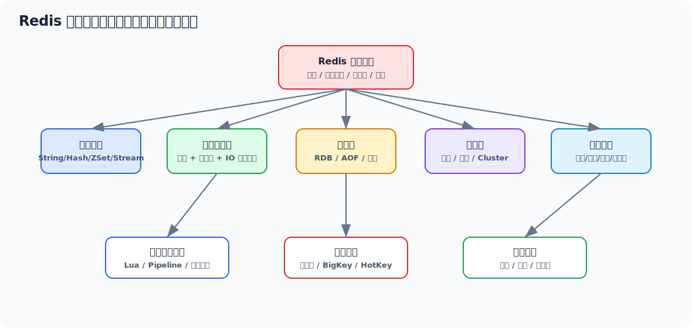
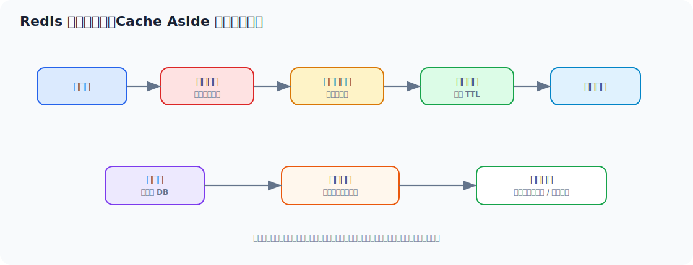

# Redis 面试实用学习文档

> 适合 3-5 年 Java 工程师面试冲刺。目标不是只会 `set/get`，而是能把 Redis 的数据结构、单线程模型、持久化、高可用、缓存设计、一致性与线上排查讲清楚，并落到真实业务场景。



## 先看一个直观示例：商品详情缓存 + 防击穿

假设商品详情接口访问量很高，如果每次都查 MySQL，热点商品会把数据库打得很难受。Redis 在这里的作用是：**把热点读请求挡在内存层，同时用互斥重建避免缓存失效瞬间大量请求打到数据库**。

```java
@Service
public class ProductQueryService {

    private static final String PRODUCT_KEY = "product:detail:";
    private static final String LOCK_KEY = "lock:product:detail:";

    private final StringRedisTemplate redisTemplate;
    private final ProductMapper productMapper;
    private final ObjectMapper objectMapper;

    public ProductDTO getProduct(Long productId) throws Exception {
        String cacheKey = PRODUCT_KEY + productId;
        String json = redisTemplate.opsForValue().get(cacheKey);
        if (json != null) {
            if (json.isEmpty()) {
                return null;
            }
            return objectMapper.readValue(json, ProductDTO.class);
        }

        String lockKey = LOCK_KEY + productId;
        Boolean locked = redisTemplate.opsForValue()
                .setIfAbsent(lockKey, "1", Duration.ofSeconds(5));

        if (Boolean.TRUE.equals(locked)) {
            try {
                ProductDTO product = productMapper.selectById(productId);
                if (product == null) {
                    redisTemplate.opsForValue().set(cacheKey, "", Duration.ofMinutes(5));
                    return null;
                }
                redisTemplate.opsForValue().set(
                        cacheKey,
                        objectMapper.writeValueAsString(product),
                        Duration.ofMinutes(30).plusSeconds(ThreadLocalRandom.current().nextInt(60))
                );
                return product;
            } finally {
                redisTemplate.delete(lockKey);
            }
        }

        Thread.sleep(50);
        return getProduct(productId);
    }
}
```

这个例子里 Redis 做了几件事：

1. 热点数据缓存，降低数据库压力。
2. 空值缓存，缓解缓存穿透。
3. TTL 加随机值，降低雪崩风险。
4. 互斥重建，缓解热点 key 击穿。

生产上还要继续增强：分布式锁释放要校验 value，递归重试要改成有限循环，热点商品可以使用逻辑过期 + 后台异步刷新。

## 目录

- [一、Redis 面试主线](#一redis-面试主线)
- [二、Redis 到底解决什么问题](#二redis-到底解决什么问题)
- [三、核心数据结构与底层编码](#三核心数据结构与底层编码)
- [四、为什么 Redis 快](#四为什么-redis-快)
- [五、持久化：RDB、AOF、混合持久化](#五持久化rdbaof混合持久化)
- [六、高可用：主从、哨兵、集群](#六高可用主从哨兵集群)
- [七、缓存设计与一致性问题](#七缓存设计与一致性问题)
- [八、分布式锁、限流与消息场景](#八分布式锁限流与消息场景)
- [九、高级用法与工程实践](#九高级用法与工程实践)
- [十、常见线上问题与排查](#十常见线上问题与排查)
- [十一、面试高频回答模板](#十一面试高频回答模板)

---

## 一、Redis 面试主线

四年 Java 工程师面试 Redis，常见追问链路通常是：

```text
为什么要用 Redis
  -> Redis 为什么快
  -> 你用过哪些数据结构
  -> 缓存击穿/穿透/雪崩怎么处理
  -> Redis 持久化怎么选
  -> 主从/哨兵/集群区别
  -> 分布式锁靠谱吗
  -> 大 key、热 key、阻塞、内存淘汰怎么排查
```

面试官真正想听的是三件事：

1. 你理解 Redis 不是停留在 API 层。
2. 你知道缓存不是“放进去就完事”，而是一个一致性和稳定性工程问题。
3. 你遇到线上问题时，知道该看哪些指标、哪些命令、哪些根因。

---

## 二、Redis 到底解决什么问题

Redis 的本质定位是：**高性能内存型键值数据库 + 丰富数据结构 + 一组适合缓存、分布式协调和流式消费的原子操作**。

它通常解决这些问题：

| 场景 | Redis 的价值 |
| --- | --- |
| 热点数据缓存 | 降低数据库压力，降低接口 RT |
| 分布式会话/Token | 多实例共享状态 |
| 排行榜、计数器、点赞 | 原子计数、排序结构 |
| 限流、幂等、防重 | 原子操作 + TTL |
| 分布式锁 | 跨实例协调 |
| 消息削峰/轻量队列 | List / Stream |
| 地理位置、标签检索 | GEO / Set / Bitmap / HyperLogLog |

面试里不要把 Redis 只说成“缓存”，更成熟的表达是：

> Redis 首先是高性能内存数据库，但工程上最常用的能力是缓存、分布式协调和高频读写场景下的数据结构支持。真正的难点不在于会不会用命令，而在于缓存一致性、高可用、失效策略和线上稳定性治理。

---

## 三、核心数据结构与底层编码

### 3.1 Redis 常用数据结构

| 结构 | 常见用途 | Java 业务场景 |
| --- | --- | --- |
| String | 缓存对象、计数器、分布式锁 | 用户缓存、验证码、库存扣减 |
| Hash | 对象局部字段 | 用户 profile、配置项 |
| List | 简单消息队列、时间线 | 异步任务、评论流 |
| Set | 去重、标签 | UV、用户标签 |
| ZSet | 排行榜、延迟队列 | 热度榜、积分榜 |
| Bitmap | 状态压缩 | 签到、在线标记 |
| HyperLogLog | 近似去重计数 | UV 统计 |
| GEO | 地理位置 | 附近门店 |
| Stream | 消息流 | 轻量消息消费组 |

### 3.2 不要只背“数据结构”，要知道“底层编码”

Redis 对外暴露的是逻辑结构，但底层为了节省内存和提高性能，会采用不同编码。

例如：

- String：`int`、`embstr`、`raw`
- Hash：小对象时偏紧凑编码，大对象时转哈希表
- List：现代版本核心思路是快速双端操作 + 紧凑存储
- ZSet：小集合时紧凑编码，大集合时跳表 + 字典

面试点不在于背所有编码名字，而在于你知道：

1. Redis 不只是“Map<String, Object>”
2. 小对象和大对象的内部实现不同
3. 底层编码切换会影响内存和性能

### 3.3 为什么 ZSet 适合排行榜

因为它同时维护：

- score 有序
- member 唯一

所以能高效支持：

- 查排名
- 查 TopN
- 查某人分数
- 按分数范围查人

---

## 四、为什么 Redis 快

### 4.1 常规回答太浅

很多人只会说：

1. 基于内存
2. 单线程避免锁
3. IO 多路复用

这三句没错，但还不够。

### 4.2 更完整的解释

Redis 快，核心是几个因素叠加：

1. **数据在内存中**
2. **绝大多数命令是 O(1) 或接近 O(1)**
3. **单线程执行命令避免了多线程竞争和上下文切换**
4. **网络层使用 IO 多路复用，提高连接处理效率**
5. **协议简单，序列化负担小**
6. **内部对象设计和内存布局比较激进**

### 4.3 单线程到底指什么

这里的“单线程”主要指：

- **命令执行主线程是单线程模型**

不代表 Redis 完全没有其他线程。现代 Redis 在持久化、异步删除、网络读写辅助等方面会用到后台线程。

所以更准确的表达是：

> Redis 的核心命令执行路径是单线程串行执行，这保证了绝大多数操作的原子性和实现简单性；而一些非核心路径，如持久化重写、异步回收等，会借助后台线程处理。

### 4.4 IO 多路复用怎么理解

本质上是：

- 一个线程监听多个 socket
- 哪个连接可读/可写，就处理哪个
- 避免每个连接一个线程

这让 Redis 在高并发短请求场景下非常高效。

---

## 五、持久化：RDB、AOF、混合持久化

### 5.1 RDB

RDB 是快照，特点：

- 某个时刻全量数据快照
- 文件紧凑，恢复快
- 适合备份和冷恢复

缺点：

- 可能丢最后一次快照后的数据

### 5.2 AOF

AOF 是追加写日志，特点：

- 记录写命令
- 恢复时重放命令
- 数据更完整

缺点：

- 文件更大
- 恢复一般比 RDB 慢

### 5.3 `appendfsync` 三种策略

| 策略 | 含义 | 取舍 |
| --- | --- | --- |
| `always` | 每次写都刷盘 | 最安全，性能最差 |
| `everysec` | 每秒刷盘 | 工程上常用 |
| `no` | 交给 OS | 性能高，风险大 |

### 5.4 混合持久化

现代 Redis 常见思路是：

- 重写时用 RDB 作为 base
- 增量用 AOF 记录

这样能在恢复速度和数据完整性之间取得平衡。

### 5.5 面试怎么选

如果是纯缓存：

- 可以弱持久化，甚至关闭

如果是高价值状态数据：

- 通常至少 AOF `everysec`
- 关键业务可结合 RDB + AOF

### 5.6 你要知道 fork 的代价

无论 RDB 还是 AOF rewrite，常见都会涉及 `fork`。  
大内存实例 `fork` 会带来：

- 短时阻塞
- Copy-On-Write 内存膨胀

这也是为什么超大单实例 Redis 风险很高。

---

## 六、高可用：主从、哨兵、集群

### 6.1 主从复制

核心目的：

- 读扩展
- 数据冗余
- 为故障切换提供基础

注意：

- 主从默认异步复制
- 不能把它当成强一致数据库

### 6.2 哨兵 Sentinel

解决的是：

- 主节点故障检测
- 自动故障转移
- 客户端感知新主

它不是分片方案，只是高可用方案。

### 6.3 Cluster

Redis Cluster 解决的是：

1. 数据分片
2. 节点故障转移

核心概念：

- 16384 槽
- key 映射到槽
- 槽分布到不同节点

### 6.4 Cluster 的工程注意点

1. 多 key 操作必须考虑是否在同槽
2. Lua 脚本也要考虑槽位
3. 大 key 和热 key 依然会让某个槽过热

### 6.5 主从、哨兵、集群区别

| 方案 | 解决什么问题 | 是否分片 |
| --- | --- | --- |
| 主从 | 读扩展、冗余 | 否 |
| 哨兵 | 高可用切换 | 否 |
| 集群 | 分片 + 高可用 | 是 |

---

## 七、缓存设计与一致性问题



### 7.1 缓存三大经典问题

#### 缓存穿透

查询根本不存在的数据，请求打穿到 DB。

解法：

- 布隆过滤器
- 空值缓存
- 参数校验

#### 缓存击穿

热点 key 恰好失效，瞬间大量请求打到 DB。

解法：

- 热点不过期 / 逻辑过期
- 单飞重建
- 互斥锁重建

#### 缓存雪崩

大量 key 同时过期或 Redis 整体不可用。

解法：

- TTL 加随机值
- 多级缓存
- 限流降级
- Redis 高可用

### 7.2 一致性不要回答成“绝对一致”

Redis + MySQL 的缓存一致性，本质上多数业务只能做到：

- **最终一致**

常见策略：

#### Cache Aside

读：

- 先查缓存
- miss 再查库并回填

写：

- 先更新 DB
- 再删缓存

这是最常用方案。

### 7.3 为什么常说“更新 DB 后删缓存”

因为如果先删缓存再写库，可能出现：

1. A 删除缓存
2. B 查库读到旧值并回填缓存
3. A 写库新值

结果缓存里是旧值。

### 7.4 延迟双删怎么看

它是补救手段，不是银弹。

思路：

1. 更新 DB
2. 删缓存
3. 延迟一段时间再删一次

问题：

- 延迟时间不好定
- 还是不能严格保证强一致

工程上更重要的是：

- 识别一致性要求
- 决定是否可接受短暂脏读

---

## 八、分布式锁、限流与消息场景

### 8.1 Redis 分布式锁最基础正确姿势

至少要做到：

```text
SET key value NX PX 30000
```

包含：

- `NX`：不存在才加锁
- `PX`：过期时间
- `value`：唯一标识，解锁时校验是不是自己

### 8.2 为什么不能直接 `DEL`

因为可能出现：

1. 线程 A 锁超时
2. 线程 B 获得新锁
3. 线程 A 执行 `DEL`

把 B 的锁删掉了。

所以解锁要用 Lua 保证：

- 比较 value
- 一致才删除

### 8.3 Redis 锁有哪些局限

1. 本质上是 AP 系统上的工程锁，不是数据库事务锁
2. 时钟、GC、网络抖动都可能带来边界问题
3. 高一致核心链路不要过度迷信“Redis 锁万能”

### 8.4 限流场景

常见方案：

- 固定窗口计数
- 滑动窗口
- 漏桶
- 令牌桶

Redis 常用落地：

- `INCR + EXPIRE`
- Lua 脚本做原子窗口计数
- ZSet 记录请求时间戳实现滑动窗口

### 8.5 Stream 什么时候值得用

适合：

- 轻量异步任务
- 需要消费组
- 需要保留未确认消息

但如果你已经有 RocketMQ / Kafka，Redis Stream 通常不是主消息平台，而是补位能力。

---

## 九、高级用法与工程实践

### 9.1 Lua 脚本

适合把多条命令合成一个原子操作：

- 扣库存
- 分布式锁释放
- 限流判断
- 幂等校验

注意：

- 脚本不要过长
- 避免重 CPU 逻辑
- 仍然会阻塞单线程

### 9.2 Pipeline

适合：

- 大量小命令批量发

它优化的是：

- 网络往返次数

不是把多条命令做成事务。

### 9.3 事务 `MULTI/EXEC`

Redis 事务不是关系型数据库事务。  
它主要保证：

- 命令顺序执行

但不提供关系型事务那种回滚语义。

### 9.4 过期策略与淘汰策略

常见淘汰：

- `noeviction`
- `allkeys-lru`
- `volatile-lru`
- `allkeys-lfu`

面试里建议这样说：

> 如果 Redis 做纯缓存，一般会更关注 `allkeys-lru` 或 `allkeys-lfu`；如果同时存一些不允许被淘汰的数据，就要非常小心策略和内存隔离。

### 9.5 BigKey 和 HotKey

BigKey 风险：

- 网络抖动
- 阻塞主线程
- 删除慢

HotKey 风险：

- 单点热点
- 某个实例被打爆

典型治理：

- 拆 key
- 本地缓存
- 热点预热
- 分片散列

---

## 十、常见线上问题与排查

### 10.1 Redis 阻塞了怎么查

看这些方向：

1. 是否有慢命令
2. 是否有大 key
3. 是否执行了 `KEYS`、`FLUSHALL`、大范围扫描
4. 是否有 AOF rewrite / RDB fork 抖动
5. 是否内存打满触发淘汰

### 10.2 常用排查命令

- `INFO`
- `SLOWLOG GET`
- `LATENCY LATEST`
- `MEMORY USAGE key`
- `MEMORY STATS`
- `SCAN`
- `CLUSTER INFO`
- `CLIENT LIST`

### 10.3 内存暴涨怎么想

先分层：

1. 业务写入真的变多了？
2. TTL 失效配置是否异常？
3. 是否有大 key / 无过期 key？
4. 是否 COW 导致 fork 阶段额外内存膨胀？

### 10.4 缓存命中率低怎么查

重点看：

- key 设计是否离散过头
- TTL 是否太短
- 是否频繁删除
- 是否本来就不是热点数据

---

## 十一、面试高频回答模板

### 11.1 Redis 为什么快

> Redis 快的核心原因不是单一因素，而是内存访问、绝大多数命令复杂度低、核心命令执行路径单线程避免锁竞争、网络层采用 IO 多路复用，以及比较激进的内部数据结构设计共同作用的结果。

### 11.2 Redis 持久化怎么选

> 如果 Redis 只是做纯缓存，可以接受弱持久化；如果承载高价值状态数据，通常会选择 AOF `everysec`，并结合 RDB 或混合持久化来兼顾恢复速度和数据安全。真正要注意的是大实例 `fork` 带来的阻塞和内存膨胀。

### 11.3 缓存一致性怎么保证

> Redis 和 MySQL 组合大多数场景只能做最终一致。工程上常用 Cache Aside，写路径优先更新数据库再删除缓存。如果业务不能接受短暂脏读，就要进一步引入消息、重试、延迟双删或直接减少缓存参与关键写路径。

### 11.4 Redis 分布式锁靠谱吗

> 能用，但要清楚边界。基础正确姿势是 `SET key value NX PX` 加唯一值，解锁用 Lua 校验 value 后删除。它适合做工程级互斥，不适合替代数据库事务锁去承载特别强一致的核心扣减链路。

### 11.5 主从、哨兵、集群区别

> 主从解决读扩展和冗余，哨兵解决故障检测与自动切换，集群解决分片和高可用。哨兵不是分片方案，集群也不能天然解决大 key 和热 key 问题。

---

## 最后建议

Redis 这块，四年经验想在面试里拉开差距，重点不是背命令，而是把下面这条线讲顺：

> Redis 为什么快，缓存为什么会出一致性问题，分布式锁为什么有边界，持久化和高可用怎么选，线上 BigKey/HotKey/慢命令怎么查。

你把这条主线吃透，Redis 基本就不再是“会用”，而是“真正在工程里用过并思考过”。
