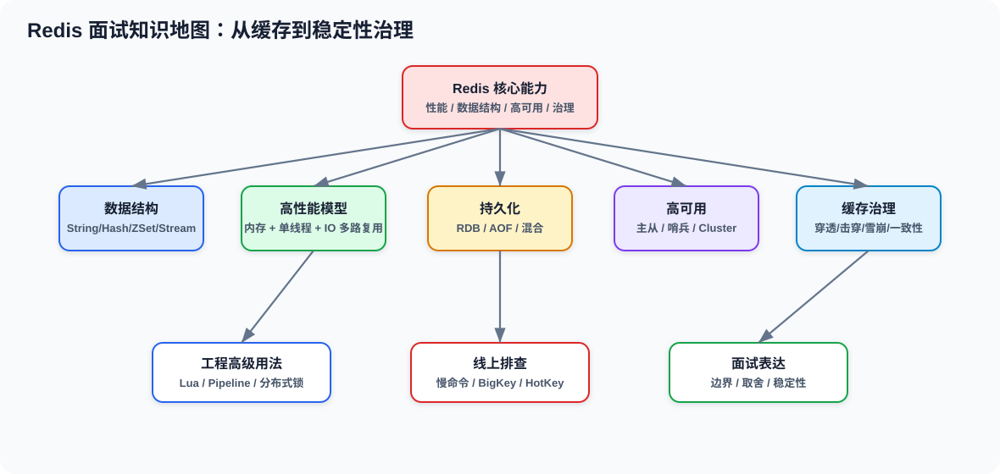
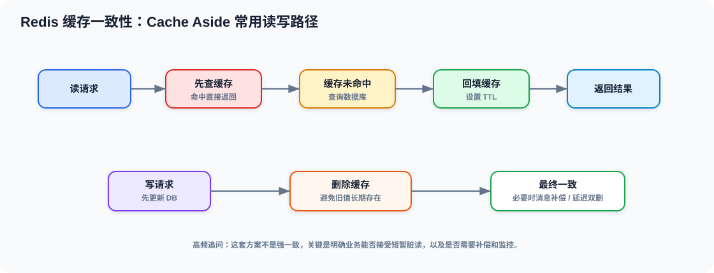

# Redis 面试实用学习文档

> 适合 3-5 年 Java 工程师面试冲刺。目标不是只会 `set/get`，而是能把 Redis 的数据结构、单线程模型、持久化、高可用、缓存设计、一致性与线上排查讲清楚，并落到真实业务场景。



## 先看一个直观示例：商品详情缓存 + 防击穿

假设商品详情接口访问量很高，如果每次都查 MySQL，热点商品会把数据库打得很难受。Redis 在这里的作用是：**把热点读请求挡在内存层，同时用互斥重建避免缓存失效瞬间大量请求打到数据库**。

```java
@Service
public class ProductQueryService {

    private static final String PRODUCT_KEY = "product:detail:";
    private static final String LOCK_KEY = "lock:product:detail:";

    private final StringRedisTemplate redisTemplate;
    private final ProductMapper productMapper;
    private final ObjectMapper objectMapper;

    public ProductDTO getProduct(Long productId) throws Exception {
        String cacheKey = PRODUCT_KEY + productId;
        String json = redisTemplate.opsForValue().get(cacheKey);
        if (json != null) {
            if (json.isEmpty()) {
                return null;
            }
            return objectMapper.readValue(json, ProductDTO.class);
        }

        String lockKey = LOCK_KEY + productId;
        Boolean locked = redisTemplate.opsForValue()
                .setIfAbsent(lockKey, "1", Duration.ofSeconds(5));

        if (Boolean.TRUE.equals(locked)) {
            try {
                ProductDTO product = productMapper.selectById(productId);
                if (product == null) {
                    redisTemplate.opsForValue().set(cacheKey, "", Duration.ofMinutes(5));
                    return null;
                }
                redisTemplate.opsForValue().set(
                        cacheKey,
                        objectMapper.writeValueAsString(product),
                        Duration.ofMinutes(30).plusSeconds(ThreadLocalRandom.current().nextInt(60))
                );
                return product;
            } finally {
                redisTemplate.delete(lockKey);
            }
        }

        Thread.sleep(50);
        return getProduct(productId);
    }
}
```

这个例子里 Redis 做了几件事：

1. 热点数据缓存，降低数据库压力。
2. 空值缓存，缓解缓存穿透。
3. TTL 加随机值，降低雪崩风险。
4. 互斥重建，缓解热点 key 击穿。

生产上还要继续增强：分布式锁释放要校验 value，递归重试要改成有限循环，热点商品可以使用逻辑过期 + 后台异步刷新。

## 目录

- [一、Redis 面试主线](#一redis-面试主线)
- [二、Redis 数据类型与真实业务场景](#二redis-数据类型与真实业务场景)
- [三、底层编码要点](#三底层编码要点)
- [四、为什么 Redis 快](#四为什么-redis-快)
- [五、持久化：RDB、AOF、混合持久化](#五持久化rdbaof混合持久化)
- [六、高可用：主从、哨兵、集群](#六高可用主从哨兵集群)
- [七、缓存设计与一致性问题](#七缓存设计与一致性问题)
- [八、分布式锁、限流与消息场景](#八分布式锁限流与消息场景)
- [九、高级用法与工程实践](#九高级用法与工程实践)
- [十、常见线上问题与排查](#十常见线上问题与排查)
- [十一、面试高频回答模板](#十一面试高频回答模板)

---

## 一、Redis 面试主线

四年 Java 工程师面试 Redis，常见追问链路通常是：

```text
为什么要用 Redis
  -> Redis 为什么快
  -> 你用过哪些数据结构
  -> 缓存击穿/穿透/雪崩怎么处理
  -> Redis 持久化怎么选
  -> 主从/哨兵/集群区别
  -> 分布式锁靠谱吗
  -> 大 key、热 key、阻塞、内存淘汰怎么排查
```

面试官真正想听的是三件事：

1. 你理解 Redis 不是停留在 API 层。
2. 你知道缓存不是"放进去就完事"，而是一个一致性和稳定性工程问题。
3. 你遇到线上问题时，知道该看哪些指标、哪些命令、哪些根因。

---

## 二、Redis 数据类型与真实业务场景

Redis 对外暴露 5 种基础类型 + 4 种扩展类型，面试的关键不是背命令，而是能说清"这个结构在什么业务下用、为什么不用别的"。

### 2.1 String — 缓存 / 计数 / 分布式锁

最万能的类型。存 JSON 做缓存、`INCR` 做原子计数、`SETNX + PX` 做分布式锁。

**场景：短信验证码，60 秒过期，防重发**

```java
// 存验证码，60s 自动过期
redisTemplate.opsForValue().set("sms:code:" + phone, code, 60, TimeUnit.SECONDS);

// 校验
String cached = redisTemplate.opsForValue().get("sms:code:" + phone);
if (!code.equals(cached)) throw new BizException("验证码错误或已过期");
```

**场景：接口限流 — 固定窗口**

```java
String key = "rate:limit:" + userId;
Long count = redisTemplate.opsForValue().increment(key);
if (count == 1) redisTemplate.expire(key, 1, TimeUnit.MINUTES);
if (count > 100) throw new BizException("请求过于频繁");
```

### 2.2 Hash — 对象局部读写

适合存"字段多但每次只改几个"的对象，比整个 JSON 覆盖更省带宽、更安全。

**场景：用户 Profile 局部更新**

```java
String key = "user:profile:" + userId;
// 只改昵称和头像，不碰其他字段
Map<String, String> updates = Map.of("nickname", "阿飞", "avatar", "https://cdn/a.png");
redisTemplate.opsForHash().putAll(key, updates);

// 读取单个字段
String nickname = (String) redisTemplate.opsForHash().get(key, "nickname");
```

对比 String 存 JSON：每次改一个字段都要反序列化→改→序列化→整体覆盖，Hash 只动目标字段。

### 2.3 List — 消息队列 / 时间线

有序、可重复、支持两端操作。`LPUSH + BRPOP` 可实现轻量阻塞队列。

**场景：简易异步任务队列**

```java
// 生产者：投递任务
redisTemplate.opsForList().leftPush("task:queue", taskJson);

// 消费者：阻塞取任务，超时 5s
String task = redisTemplate.opsForList().rightPop("task:queue", 5, TimeUnit.SECONDS);
if (task != null) processTask(task);
```

**场景：最新评论时间线（保留最近 200 条）**

```java
redisTemplate.opsForList().leftPush("comment:timeline:" + articleId, commentJson);
redisTemplate.opsForList().trim("comment:timeline:" + articleId, 0, 199);
```

### 2.4 Set — 去重 / 标签 / 交并差

无序、唯一。天然适合"判断在不在"和"求交集"。

**场景：文章点赞 + 判断是否已赞**

```java
String key = "article:likes:" + articleId;
redisTemplate.opsForSet().add(key, userId);        // 点赞
redisTemplate.opsForSet().remove(key, userId);     // 取消点赞
Boolean liked = redisTemplate.opsForSet().isMember(key, userId); // 是否已赞
Long likeCount = redisTemplate.opsForSet().size(key);            // 点赞总数
```

**场景：共同关注（两个用户关注集合取交集）**

```java
Set<String> common = redisTemplate.opsForSet().intersect(
    "user:following:" + userIdA,
    "user:following:" + userIdB
);
```

### 2.5 ZSet（Sorted Set）— 排行榜 / 延迟队列

score 排序 + member 唯一，是排行榜的标配结构。

**场景：实时热搜排行榜**

```java
String key = "hot:search:rank";
// 用户每搜一次，score +1
redisTemplate.opsForZSet().incrementScore(key, keyword, 1);

// 取 Top 10（score 从高到低）
Set<ZSetOperations.TypedTuple<String>> top10 =
    redisTemplate.opsForZSet().reverseRangeWithScores(key, 0, 9);

// 查某关键词排名（0-based，需要 +1）
Long rank = redisTemplate.opsForZSet().reverseRank(key, keyword);
```

**场景：延迟队列 — 订单超时取消**

```java
// score = 过期时间戳
redisTemplate.opsForZSet().add("order:delay:queue", orderId, expireTimestamp);

// 定时扫描：取出所有已到期的订单
Set<String> expiredOrders = redisTemplate.opsForZSet()
    .rangeByScore("order:delay:queue", 0, System.currentTimeMillis());
// 处理后移除
expiredOrders.forEach(id ->
    redisTemplate.opsForZSet().remove("order:delay:queue", id));
```

### 2.6 Bitmap — 状态压缩

本质还是 String，但按 bit 操作。适合"连续日期 + 布尔状态"场景，内存极省。

**场景：用户每日签到，一年只占 365 bit ≈ 46 字节**

```java
String key = "user:checkin:" + userId + ":" + year;
int dayOfYear = LocalDate.now().getDayOfYear();

redisTemplate.opsForValue().setBit(key, dayOfYear, true);   // 签到
boolean checked = redisTemplate.opsForValue().getBit(key, dayOfYear); // 今日是否已签

// 本月签到天数
long monthDays = redisTemplate.execute((RedisCallback<Long>) conn ->
    conn.bitCount(key.getBytes(), startOffset, endOffset));
```

### 2.7 HyperLogLog — 近似去重计数

误差约 0.81%，但内存固定 12KB。适合亿级 UV 统计这种"不需要精确到个位"的场景。

**场景：页面 UV 统计**

```java
String key = "page:uv:" + date;
redisTemplate.opsForHyperLogLog().add(key, userId);   // 每次访问丢进去
Long uv = redisTemplate.opsForHyperLogLog().size(key); // 估算 UV 数
```

对比 Set：1 亿用户 Set 要几百 MB，HyperLogLog 只要 12KB。

### 2.8 GEO — 地理位置

存经纬度，支持距离计算和范围查询。

**场景：附近门店**

```java
// 录入门店坐标
redisTemplate.opsForGeo().add("store:geo",
    new Point(116.397128, 39.916527), "朝阳店");
redisTemplate.opsForGeo().add("store:geo",
    new Point(116.481050, 39.908715), "国贸店");

// 查 3km 内的门店
GeoResults<RedisGeoCommands.GeoLocation<String>> nearby =
    redisTemplate.opsForGeo().radius("store:geo",
        new Circle(new Point(lng, lat),
            new Distance(3, RedisGeoCommands.DistanceUnit.KILOMETERS)));
```

### 2.9 Stream — 消息流 / 消费组

Redis 5.0 引入，支持消费组和消息确认，是 Redis 里最接近消息队列的结构。

**场景：轻量订单消费组**

```java
// 生产
Map<String, String> msg = Map.of("orderId", "10001", "action", "pay");
redisTemplate.opsForStream()
    .add(StreamRecords.string(msg).withStreamKey("order:stream"));

// 创建消费组（只需一次）
redisTemplate.opsForStream().createGroup("order:stream", "order-group");

// 消费
List<MapRecord<String, String, String>> records = redisTemplate.opsForStream().read(
    Consumer.from("order-group", "consumer-1"),
    StreamReadOptions.empty().count(10).block(Duration.ofSeconds(3)),
    StreamOffset.create("order:stream", ReadOffset.lastConsumed()));

// 确认
records.forEach(r -> redisTemplate.opsForStream()
    .acknowledge("order:stream", "order-group", r.getId()));
```

> 如果已有 RocketMQ / Kafka，Stream 通常做补位（轻量异步、临时消费），不替代专业 MQ。

---

## 三、底层编码要点

面试不需要背所有编码名字，但要理解"同一个逻辑类型，数据量不同，底层实现不同"。

### 3.1 编码转换核心思路

| 逻辑类型 | 数据量小时 | 数据量大时 | 关键点 |
| --- | --- | --- | --- |
| String | `int`（纯数字）/ `embstr`（短串） | `raw`（SDS） | embstr 一次 malloc，raw 两次 |
| Hash | `listpack`（紧凑数组） | `hashtable` | 阈值由 `hash-max-listpack-entries/size` 控制 |
| List | `listpack` | `quicklist`（listpack + 双向链表） | 两端操作 O(1)，中间操作 O(N) |
| Set | `intset`（纯整数）/ `listpack` | `hashtable` | intset 升序数组，二分查找 |
| ZSet | `listpack` | `skiplist + hashtable` | 跳表保序，字典 O(1) 查分 |

### 3.2 面试该怎么说

三个要点够了：

1. **Redis 不是简单的 Map**——同一个类型在不同数据规模下编码不同，内存和性能特征也不同。
2. **编码切换有阈值**——比如 Hash 默认 128 个字段或 64 字节以内用 listpack，超了切 hashtable。生产上可以调大阈值来省内存。
3. **ZSet 为什么用跳表不用红黑树**——跳表实现简单、范围查询天然友好（链表顺序遍历）、并发友好。

### 3.3 一个容易踩的坑

如果你往 Hash 里存了 200 个字段，它会从 listpack 切成 hashtable，内存瞬间膨胀。如果你知道这个对象字段不会太多，可以适当调大 `hash-max-listpack-entries`，让它留在紧凑编码里。反过来说，如果你发现某个 Hash 内存异常大，先看看是不是编码已经切了 hashtable。

---

## 四、为什么 Redis 快

### 4.1 常规回答太浅

很多人只会说：

1. 基于内存
2. 单线程避免锁
3. IO 多路复用

这三句没错，但还不够。

### 4.2 更完整的解释

Redis 快，核心是几个因素叠加：

1. **数据在内存中**
2. **绝大多数命令是 O(1) 或接近 O(1)**
3. **单线程执行命令避免了多线程竞争和上下文切换**
4. **网络层使用 IO 多路复用，提高连接处理效率**
5. **协议简单，序列化负担小**
6. **内部对象设计和内存布局比较激进**

### 4.3 单线程到底指什么

这里的"单线程"主要指：

- **命令执行主线程是单线程模型**

不代表 Redis 完全没有其他线程。现代 Redis 在持久化、异步删除、网络读写辅助等方面会用到后台线程。

所以更准确的表达是：

> Redis 的核心命令执行路径是单线程串行执行，这保证了绝大多数操作的原子性和实现简单性；而一些非核心路径，如持久化重写、异步回收等，会借助后台线程处理。

### 4.4 IO 多路复用怎么理解

本质上是：

- 一个线程监听多个 socket
- 哪个连接可读/可写，就处理哪个
- 避免每个连接一个线程

这让 Redis 在高并发短请求场景下非常高效。

---

## 五、持久化：RDB、AOF、混合持久化

Redis 数据在内存里，进程一挂数据就没了。持久化就是把内存数据落盘的手段，有两种基本方式 + 一种组合方式。

### 5.1 RDB（快照）

RDB 的思路很直接：**在某个时间点把内存里的全量数据dump成一个紧凑的二进制文件**（默认 `dump.rdb`）。

触发方式有三种：`save`（阻塞主进程，生产别用）、`bgsave`（fork 子进程，主进程继续服务）、`shutdown`（关进程时自动触发）。

优点：文件小、恢复速度快、适合定期备份和异地容灾。

缺点：两次快照之间的写操作可能丢失。如果你设了 `save 900 1`（900 秒内至少 1 次写入才触发），那最坏情况可能丢 15 分钟数据。

### 5.2 AOF（追加日志）

AOF 的思路是：**把每一条写命令追加到日志文件末尾**（默认 `appendonly.aof`），恢复时重放所有命令。

AOF 文件会随着写入不断膨胀，所以引入了 **AOF rewrite（重写）**：Redis fork 一个子进程，根据当前内存数据重新生成一份最小命令集，替换掉旧文件。比如对同一个 key 做了 100 次 SET，重写后只保留最后那一条。

优点：数据更完整，最多丢 1 秒（`everysec` 策略下）。

缺点：文件比 RDB 大，恢复速度比 RDB 慢（要逐条重放命令）。

### 5.3 fork 到底干了什么

这是面试高频追问点。不管是 `bgsave` 还是 AOF rewrite，Redis 都走同一条路：

```text
主进程收到持久化指令
  → 调用 Linux fork() 创建子进程
  → 子进程拿到父进程内存的"完整副本"
  → 子进程在副本上做快照/重写，写盘
  → 主进程继续处理客户端请求，互不干扰
```

这里的核心机制是操作系统的 **Copy-On-Write（写时复制，COW）**：

fork 的瞬间，子进程并不真的复制一份完整内存，而是和父进程**共享同一份物理页**，页表标记为只读。只有当父进程要写某一页时，OS 才会把这一页复制一份给父进程去改，子进程继续读原来的。

这意味着：

**fork 本身的代价** — fork 需要复制页表（不是复制数据页）。如果 Redis 占 10GB 内存，页表大约几十 MB，fork 瞬间主进程会阻塞几毫秒到几十毫秒。内存越大，页表越大，阻塞越久。这就是为什么**大实例 fork 会造成短时延迟抖动**。

**COW 的内存代价** — fork 之后，如果主进程大量写入，被修改的页都会被复制一份。极端情况下（主进程在 bgsave 期间把全部内存页都写了一遍），实际内存占用会接近原来的 2 倍。这就是生产上 Redis 内存利用率不建议超过 50%-60% 的原因之一——要给 COW 留余量。

**实际影响总结：**

| 影响 | 表现 | 应对 |
| --- | --- | --- |
| fork 阻塞 | 主进程短时无法处理请求（ms 级） | 避免单实例内存过大，建议 < 10GB |
| COW 内存膨胀 | 物理内存可能翻倍 | 预留内存余量，`maxmemory` 不要设太满 |
| 磁盘 IO | 子进程写盘可能和主进程抢 IO | 独立磁盘或 SSD，`renice` 降低子进程优先级 |

> 面试这样说：RDB 和 AOF rewrite 都依赖 fork + COW，fork 的阻塞和 COW 的内存膨胀是大实例持久化的核心风险，所以生产上一般控制单实例内存，并用 `maxmemory-policy` 和合理的内存预留来兜底。

### 5.4 `appendfsync` 三种策略到底在控制什么

AOF 写入分两步理解：

```text
写命令 → 追加到 AOF 缓冲区（aof_buf，用户态内存）
       → fsync 刷到磁盘（内核页缓存 → 磁盘）
```

`appendfsync` 控制的就是**第二步的刷盘频率**：

| 策略 | 行为 | 性能 | 数据安全 | 适用场景 |
| --- | --- | --- | --- | --- |
| `always` | 每条写命令都立即 `fsync` 到磁盘 | 最差，TPS 可能掉到几百 | 最高，不丢数据 | 金融级强一致，极少用 |
| `everysec` | 每秒由后台线程批量 `fsync` 一次 | 好，接近无持久化 | 最多丢约 1 秒数据 | **生产最常用** |
| `no` | 不主动 `fsync`，交给 OS 自己决定（通常 30 秒） | 最好 | 风险最大，OS 崩溃可能丢大量数据 | 纯缓存、允许丢数据 |

补充一个细节：`everysec` 模式下，如果 `fsync` 还没完成又到了下一秒，Redis 默认会**阻塞等待上一次 fsync 完成**再继续写入（由 `aof-delay-fsync` 控制，默认 0 即不延迟等待）。这意味着一次慢磁盘 IO 可能拖慢整个 Redis。

> 面试这样说：`appendfsync` 本质控制的是 AOF 缓冲区到磁盘的刷盘频率。`always` 每条都刷，最安全但最慢；`everysec` 每秒刷一次，是性能和安全的平衡点；`no` 交给操作系统，性能最好但宕机可能丢数据。大多数业务选 `everysec` 就够了。

### 5.5 混合持久化

Redis 4.0+ 引入，核心思路：**AOF rewrite 时，前半段用 RDB 格式写快照，后半段追加增量 AOF 命令**。

这样得到的文件既是合法 AOF 文件（Redis 能识别），又享受了 RDB 恢复快的优势。恢复时先加载 RDB 部分（快），再重放后面的 AOF 增量命令（少），整体恢复速度远优于纯 AOF。

开启方式：`aof-use-rdb-preamble yes`（Redis 5.0+ 默认开启）。

### 5.6 生产环境怎么选

| 场景 | 推荐方案 | 理由 |
| --- | --- | --- |
| 纯缓存，数据可重建 | 关闭持久化，或只开 RDB | 省 IO，恢复不重要 |
| 一般业务缓存 + 状态 | AOF `everysec` + 混合持久化 | 兼顾恢复速度和安全 |
| 高价值状态（分布式锁、会话） | AOF `everysec` + 定期 RDB 备份 | 双保险，RDB 用于异地容灾 |

不管哪种方案，都要注意 fork 的代价。单实例内存越大，fork 阻塞越久、COW 膨胀越严重。这也是为什么生产上通常把单实例控制在 10GB 以内，大数据量用 Cluster 分片来分散。

---

## 六、高可用：主从、哨兵、集群

### 6.1 主从复制

核心目的：

- 读扩展
- 数据冗余
- 为故障切换提供基础

注意：

- 主从默认异步复制
- 不能把它当成强一致数据库

### 6.2 哨兵 Sentinel

解决的是：

- 主节点故障检测
- 自动故障转移
- 客户端感知新主

它不是分片方案，只是高可用方案。

### 6.3 Cluster

Redis Cluster 解决的是：

1. 数据分片
2. 节点故障转移

核心概念：

- 16384 槽
- key 映射到槽
- 槽分布到不同节点

### 6.4 Cluster 的工程注意点

1. 多 key 操作必须考虑是否在同槽
2. Lua 脚本也要考虑槽位
3. 大 key 和热 key 依然会让某个槽过热

### 6.5 主从、哨兵、集群区别

| 方案 | 解决什么问题 | 是否分片 |
| --- | --- | --- |
| 主从 | 读扩展、冗余 | 否 |
| 哨兵 | 高可用切换 | 否 |
| 集群 | 分片 + 高可用 | 是 |

---

## 七、缓存设计与一致性问题



### 7.1 缓存三大经典问题

#### 缓存穿透

查询根本不存在的数据，请求打穿到 DB。

解法：

- 布隆过滤器
- 空值缓存
- 参数校验

#### 缓存击穿

热点 key 恰好失效，瞬间大量请求打到 DB。

解法：

- 热点不过期 / 逻辑过期
- 单飞重建
- 互斥锁重建

#### 缓存雪崩

大量 key 同时过期或 Redis 整体不可用。

解法：

- TTL 加随机值
- 多级缓存
- 限流降级
- Redis 高可用

### 7.2 一致性不要回答成"绝对一致"

Redis + MySQL 的缓存一致性，本质上多数业务只能做到：

- **最终一致**

常见策略：

#### Cache Aside

读：

- 先查缓存
- miss 再查库并回填

写：

- 先更新 DB
- 再删缓存

这是最常用方案。

### 7.3 为什么常说"更新 DB 后删缓存"

因为如果先删缓存再写库，可能出现：

1. A 删除缓存
2. B 查库读到旧值并回填缓存
3. A 写库新值

结果缓存里是旧值。

### 7.4 延迟双删怎么看

它是补救手段，不是银弹。

思路：

1. 更新 DB
2. 删缓存
3. 延迟一段时间再删一次

问题：

- 延迟时间不好定
- 还是不能严格保证强一致

工程上更重要的是：

- 识别一致性要求
- 决定是否可接受短暂脏读

---

## 八、分布式锁、限流与消息场景

### 8.1 Redis 分布式锁最基础正确姿势

至少要做到：

```text
SET key value NX PX 30000
```

包含：

- `NX`：不存在才加锁
- `PX`：过期时间
- `value`：唯一标识，解锁时校验是不是自己

### 8.2 为什么不能直接 `DEL`

因为可能出现：

1. 线程 A 锁超时
2. 线程 B 获得新锁
3. 线程 A 执行 `DEL`

把 B 的锁删掉了。

所以解锁要用 Lua 保证：

- 比较 value
- 一致才删除

### 8.3 Redis 锁有哪些局限

1. 本质上是 AP 系统上的工程锁，不是数据库事务锁
2. 时钟、GC、网络抖动都可能带来边界问题
3. 高一致核心链路不要过度迷信"Redis 锁万能"

### 8.4 限流场景

常见方案：

- 固定窗口计数
- 滑动窗口
- 漏桶
- 令牌桶

Redis 常用落地：

- `INCR + EXPIRE`
- Lua 脚本做原子窗口计数
- ZSet 记录请求时间戳实现滑动窗口

### 8.5 Stream 什么时候值得用

适合：

- 轻量异步任务
- 需要消费组
- 需要保留未确认消息

但如果你已经有 RocketMQ / Kafka，Redis Stream 通常不是主消息平台，而是补位能力。

---

## 九、高级用法与工程实践

### 9.1 Lua 脚本

适合把多条命令合成一个原子操作：

- 扣库存
- 分布式锁释放
- 限流判断
- 幂等校验

注意：

- 脚本不要过长
- 避免重 CPU 逻辑
- 仍然会阻塞单线程

### 9.2 Pipeline

适合：

- 大量小命令批量发

它优化的是：

- 网络往返次数

不是把多条命令做成事务。

### 9.3 事务 `MULTI/EXEC`

Redis 事务不是关系型数据库事务。  
它主要保证：

- 命令顺序执行

但不提供关系型事务那种回滚语义。

### 9.4 过期策略与淘汰策略

常见淘汰：

- `noeviction`
- `allkeys-lru`
- `volatile-lru`
- `allkeys-lfu`

面试里建议这样说：

> 如果 Redis 做纯缓存，一般会更关注 `allkeys-lru` 或 `allkeys-lfu`；如果同时存一些不允许被淘汰的数据，就要非常小心策略和内存隔离。

### 9.5 BigKey 和 HotKey

BigKey 风险：

- 网络抖动
- 阻塞主线程
- 删除慢

HotKey 风险：

- 单点热点
- 某个实例被打爆

典型治理：

- 拆 key
- 本地缓存
- 热点预热
- 分片散列

---

## 十、常见线上问题与排查

### 10.1 Redis 阻塞了怎么查

看这些方向：

1. 是否有慢命令
2. 是否有大 key
3. 是否执行了 `KEYS`、`FLUSHALL`、大范围扫描
4. 是否有 AOF rewrite / RDB fork 抖动
5. 是否内存打满触发淘汰

### 10.2 常用排查命令

- `INFO`
- `SLOWLOG GET`
- `LATENCY LATEST`
- `MEMORY USAGE key`
- `MEMORY STATS`
- `SCAN`
- `CLUSTER INFO`
- `CLIENT LIST`

### 10.3 内存暴涨怎么想

先分层：

1. 业务写入真的变多了？
2. TTL 失效配置是否异常？
3. 是否有大 key / 无过期 key？
4. 是否 COW 导致 fork 阶段额外内存膨胀？

### 10.4 缓存命中率低怎么查

重点看：

- key 设计是否离散过头
- TTL 是否太短
- 是否频繁删除
- 是否本来就不是热点数据

---

## 十一、面试高频回答模板

### 11.1 Redis 为什么快

> Redis 快的核心原因不是单一因素，而是内存访问、绝大多数命令复杂度低、核心命令执行路径单线程避免锁竞争、网络层采用 IO 多路复用，以及比较激进的内部数据结构设计共同作用的结果。

### 11.2 Redis 持久化怎么选

> 如果 Redis 只是做纯缓存，可以接受弱持久化；如果承载高价值状态数据，通常会选择 AOF `everysec`，并结合 RDB 或混合持久化来兼顾恢复速度和数据安全。真正要注意的是大实例 `fork` 带来的阻塞和内存膨胀。

### 11.3 缓存一致性怎么保证

> Redis 和 MySQL 组合大多数场景只能做最终一致。工程上常用 Cache Aside，写路径优先更新数据库再删除缓存。如果业务不能接受短暂脏读，就要进一步引入消息、重试、延迟双删或直接减少缓存参与关键写路径。

### 11.4 Redis 分布式锁靠谱吗

> 能用，但要清楚边界。基础正确姿势是 `SET key value NX PX` 加唯一值，解锁用 Lua 校验 value 后删除。它适合做工程级互斥，不适合替代数据库事务锁去承载特别强一致的核心扣减链路。

### 11.5 主从、哨兵、集群区别

> 主从解决读扩展和冗余，哨兵解决故障检测与自动切换，集群解决分片和高可用。哨兵不是分片方案，集群也不能天然解决大 key 和热 key 问题。

---

## 最后建议

Redis 这块，四年经验想在面试里拉开差距，重点不是背命令，而是把下面这条线讲顺：

> Redis 为什么快，缓存为什么会出一致性问题，分布式锁为什么有边界，持久化和高可用怎么选，线上 BigKey/HotKey/慢命令怎么查。

你把这条主线吃透，Redis 基本就不再是"会用"，而是"真正在工程里用过并思考过"。
