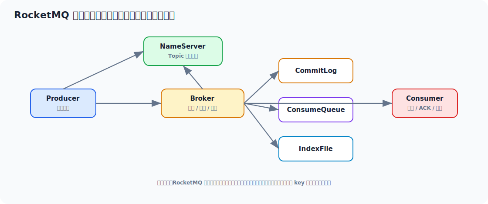

# RocketMQ 面试实用学习文档

> 适合 3-5 年 Java 工程师面试冲刺。目标不是只会“发消息、收消息”，而是能把 RocketMQ 的架构、消息模型、顺序/事务/重试/积压/幂等讲清楚，并能落到真实业务链路。



## 先看一个直观示例：下单成功后异步发积分

RocketMQ 最直观的作用是：**把主链路和非核心链路解耦**。下单接口只负责创建订单，积分、短信、优惠券等后置动作通过消息异步执行，避免把用户请求卡在多个下游系统上。

订单服务发送消息：

```java
@Service
public class OrderService {

    private final OrderMapper orderMapper;
    private final RocketMQTemplate rocketMQTemplate;

    @Transactional(rollbackFor = Exception.class)
    public Long createOrder(CreateOrderRequest request) {
        Order order = Order.create(request);
        orderMapper.insert(order);

        OrderCreatedEvent event = new OrderCreatedEvent(
                order.getId(),
                order.getUserId(),
                order.getPayAmount()
        );

        rocketMQTemplate.convertAndSend("order-created-topic", event);
        return order.getId();
    }
}
```

积分服务消费消息：

```java
@Component
@RocketMQMessageListener(
        topic = "order-created-topic",
        consumerGroup = "point-service-order-created-group"
)
public class OrderCreatedConsumer implements RocketMQListener<OrderCreatedEvent> {

    private final PointAccountService pointAccountService;
    private final ConsumeLogMapper consumeLogMapper;

    @Override
    public void onMessage(OrderCreatedEvent event) {
        String messageKey = "order-created:" + event.orderId();
        if (consumeLogMapper.exists(messageKey)) {
            return;
        }

        pointAccountService.addPoint(event.userId(), event.payAmount());
        consumeLogMapper.insert(messageKey);
    }
}
```

这个例子体现了 RocketMQ 的几个核心价值：

1. 下单主链路不再同步等待积分系统。
2. 消息失败可以重试，提高最终成功率。
3. 消费端必须做幂等，因为 MQ 通常是至少一次投递。
4. 积分系统慢了只会造成消息积压，不会直接拖慢下单接口。

生产上如果要更稳，可以把“订单本地事务”和“消息发送”改造成事务消息或本地消息表 + 补偿任务。

## 目录

- [一、RocketMQ 面试主线](#一rocketmq-面试主线)
- [二、RocketMQ 到底解决什么问题](#二rocketmq-到底解决什么问题)
- [三、核心架构与角色分工](#三核心架构与角色分工)
- [四、消息发送与存储原理](#四消息发送与存储原理)
- [五、消费模型、负载均衡与重试](#五消费模型负载均衡与重试)
- [六、顺序消息、延时消息、事务消息](#六顺序消息延时消息事务消息)
- [七、幂等、重复消费与最终一致性](#七幂等重复消费与最终一致性)
- [八、高级用法与工程实践](#八高级用法与工程实践)
- [九、常见线上问题与排查](#九常见线上问题与排查)
- [十、面试高频回答模板](#十面试高频回答模板)

---

## 一、RocketMQ 面试主线

面试常见追问链路：

```text
为什么要用 MQ
  -> RocketMQ 架构是什么
  -> 消息怎么存
  -> 顺序消息怎么保证
  -> 消费失败怎么重试
  -> 事务消息怎么实现
  -> 如何避免重复消费
  -> 消息积压、丢失、乱序怎么处理
```

RocketMQ 面试里真正拉开差距的点是：

1. 不只会 API
2. 知道消息系统不是数据库事务
3. 知道“至少一次投递”带来的幂等问题
4. 知道线上积压和消费失败怎么处理

---

## 二、RocketMQ 到底解决什么问题

MQ 在业务里常见价值：

1. **异步解耦**
2. **削峰填谷**
3. **广播通知**
4. **最终一致性链路编排**

典型场景：

| 场景 | 说明 |
| --- | --- |
| 下单后发券、发消息、写积分 | 异步解耦 |
| 秒杀请求入队 | 削峰 |
| 用户信息变更通知多个系统 | 广播/事件分发 |
| 本地事务后驱动下游处理 | 最终一致性 |

面试里最好能强调：

> MQ 不是让系统更简单，而是把同步复杂度换成异步复杂度。好处是解耦和抗峰值，代价是幂等、重试、顺序、积压和一致性问题要自己设计。

---

## 三、核心架构与角色分工

### 3.1 核心角色

| 角色 | 职责 |
| --- | --- |
| Producer | 发送消息 |
| Consumer | 消费消息 |
| Broker | 存储消息、转发消费 |
| NameServer | 路由发现 |

### 3.2 NameServer 不是什么

很多人会把 NameServer 想成“强一致注册中心”，这是不准确的。

它更像：

- 轻量路由服务

特点：

- 结构简单
- 去中心化
- Broker 定期上报路由信息

### 3.3 Topic、Queue、ConsumerGroup

这是 RocketMQ 的基础语义模型。

- Topic：消息主题
- Queue：Topic 下的物理队列分片
- ConsumerGroup：一组逻辑消费者

理解这三个概念后，你才能真正讲清：

- 并发消费
- 顺序消费
- 负载均衡

---

## 四、消息发送与存储原理

### 4.1 发送流程

大体上是：

```text
Producer 获取 Topic 路由
  -> 选择 Broker / Queue
  -> 发送消息
  -> Broker 落盘
  -> 返回发送结果
```

### 4.2 RocketMQ 为什么适合高吞吐

因为它在存储层大量利用了：

- 顺序写
- 零拷贝相关思路
- CommitLog 统一追加存储

### 4.3 常见存储文件角色

高层理解上你需要知道：

- CommitLog：消息主存储
- ConsumeQueue：消费逻辑队列索引
- IndexFile：按 key 查消息的辅助索引

### 4.4 为什么不是直接按队列存消息

因为统一写入 CommitLog 更利于：

- 顺序写磁盘
- 提高吞吐

而消费侧再通过逻辑索引映射到对应队列。

### 4.5 发送可靠性不要回答成“绝对不丢”

更成熟的表达是：

> MQ 的可靠性取决于发送确认、Broker 落盘策略、主从复制策略和消费确认机制的组合。工程上追求的是尽量可靠，而不是脱离配置和部署谈绝对不丢。

---

## 五、消费模型、负载均衡与重试

### 5.1 集群消费和广播消费

| 模式 | 含义 |
| --- | --- |
| 集群消费 | 同一个消费组内一条消息只被一台消费者处理 |
| 广播消费 | 消费组内每台消费者都收到一份 |

### 5.2 负载均衡本质

RocketMQ 在集群消费下会把队列分配给不同消费者实例。  
所以一个核心认知是：

**消费并发度通常先受队列数限制。**

### 5.3 消费失败会怎样

RocketMQ 常见是：

- 失败后重试
- 重试多次仍失败进入死信队列

### 5.4 为什么不能把重试当回滚

因为消息系统天然更偏：

- 至少一次投递

所以重试意味着：

- 业务可能收到重复消息

这就要求消费端幂等。

### 5.5 积压本质上是什么问题

通常不是“MQ 坏了”，而是：

1. 生产速度大于消费速度
2. 下游依赖慢
3. 消费逻辑过重
4. 队列数和消费者并发不匹配

---

## 六、顺序消息、延时消息、事务消息

### 6.1 顺序消息怎么理解

顺序通常分：

- 全局顺序
- 分区顺序

工程上大多数用的是：

- **分区顺序**

也就是同一业务 key 的消息进入同一队列，队列内按顺序消费。

### 6.2 为什么很少追求全局顺序

因为全局顺序意味着：

- 所有消息都受限于一个串行瓶颈

吞吐会很难看。

### 6.3 延时消息

适合：

- 订单超时关闭
- 延迟通知
- 延迟补偿

但要知道：

- 它不是高精度定时器
- 更适合业务级延迟任务

### 6.4 事务消息

它解决的是：

- 本地事务和消息发送之间的一致性问题

高层流程通常是：

1. 先发半消息
2. 执行本地事务
3. 提交或回滚消息
4. Broker 通过回查兜底最终状态

### 6.5 事务消息不是分布式事务银弹

它适合：

- 本地事务成功后需要可靠驱动下游

但依然是：

- 最终一致

不是强一致两阶段提交替代品。

---

## 七、幂等、重复消费与最终一致性

### 7.1 为什么 MQ 场景幂等几乎必聊

因为：

- 生产端可能重试
- Broker 可能重复投递
- 消费端可能处理后 ack 失败

所以重复消费是常态边界，不是异常特例。

### 7.2 幂等常见做法

1. 业务唯一 ID 去重
2. 数据库唯一索引
3. 状态机控制
4. 幂等表
5. Redis 防重

### 7.3 最终一致性怎么讲更稳

不要说“MQ 保证一致性”，更准确是：

> MQ 通过异步事件驱动把跨系统事务从同步强一致改造成最终一致。真正的一致性保障来自本地事务、可靠投递、消费重试和幂等控制的组合。

---

## 八、高级用法与工程实践

### 8.1 消息 key 和 tag

建议业务上合理使用：

- key：便于排查、索引、追踪
- tag：便于同 topic 下分类

### 8.2 主题设计

不要一上来就：

- 一个业务一个 topic
- 或所有业务塞一个 topic

更成熟的维度：

- 业务领域
- 吞吐特征
- 顺序要求
- 权限和隔离需求

### 8.3 消费逻辑不要过重

常见问题：

- 一条消息里做多个远程调用
- 长事务
- 大量锁竞争

这样很容易导致：

- 消费 RT 高
- 重试放大
- 积压

### 8.4 批量消费与批量发送

适合高吞吐场景，但要权衡：

- 延迟
- 单次失败影响面
- 幂等复杂度

### 8.5 顺序消费的常见工程取舍

如果业务只要求“同订单顺序”，不要上升成“全系统顺序”。  
分区顺序通常是更合理的工程答案。

---

## 九、常见线上问题与排查

### 9.1 消息积压怎么查

重点看：

1. 哪个 topic / group 积压
2. 是所有队列积压还是部分队列热点
3. 消费端 RT 是否上升
4. 下游依赖是否慢

### 9.2 消费重复怎么查

想这些方向：

1. 消费逻辑成功但 ack 有问题
2. 消费失败触发重试
3. 生产端本身重复发送

### 9.3 顺序乱了怎么查

1. 业务 key 是否正确路由到同一队列
2. 是否使用了并发消费而非顺序消费
3. 消费失败重试是否改变处理顺序

### 9.4 Broker 压力高怎么查

关注：

- 写入吞吐
- 落盘策略
- 主从复制延迟
- 磁盘 IO

---

## 十、面试高频回答模板

### 10.1 RocketMQ 为什么适合业务消息

> RocketMQ 比较适合业务消息链路，尤其是需要高吞吐、顺序、延时、事务消息和较强工程治理能力的场景。它的优势不只是发收消息，而是围绕存储模型、重试机制和业务消息类型支持比较完整。

### 10.2 RocketMQ 架构怎么讲

> RocketMQ 的核心角色有 Producer、Consumer、Broker 和 NameServer。Producer 负责发消息，Broker 负责存储和转发，Consumer 负责消费，NameServer 提供路由发现。Broker 定期上报路由，Producer 和 Consumer 再按路由信息与 Broker 通信。

### 10.3 顺序消息怎么保证

> 工程上通常保证分区顺序而不是全局顺序。做法是把同一业务 key 的消息路由到同一队列，再在消费侧按顺序消费该队列。这样能兼顾顺序性和吞吐，不至于把整个系统压成单线程。

### 10.4 事务消息怎么理解

> 事务消息解决的是本地事务和消息发送之间的最终一致性问题。通常先发半消息，再执行本地事务，成功后提交消息，失败则回滚；如果中间状态不确定，Broker 会发起回查。它适合最终一致，不是强一致分布式事务。

### 10.5 为什么消费端一定要幂等

> 因为 RocketMQ 这类 MQ 工程上通常保证至少一次投递，重复消息是正常边界条件。消费端必须通过业务唯一键、状态机、唯一索引或幂等表等手段保证重复消费不会造成业务副作用。

---

## 最后建议

RocketMQ 这块最值钱的不是背术语，而是把这条线讲顺：

> 为什么要异步、消息怎么存、为什么会重复、顺序怎么做、事务消息解决什么、积压怎么排。

把这条线讲清楚，RocketMQ 基本就够硬了。
