# SSM 从源码到面试总稿

> 这是一份把原来的 `SSM源码深挖版`、`SSM面试实用学习文档`、`SSM高频面试速记版` 合在一起的总稿。  
> 如果你时间不多，建议只看这一份，按“先主线、后细节、再速记”的顺序读。

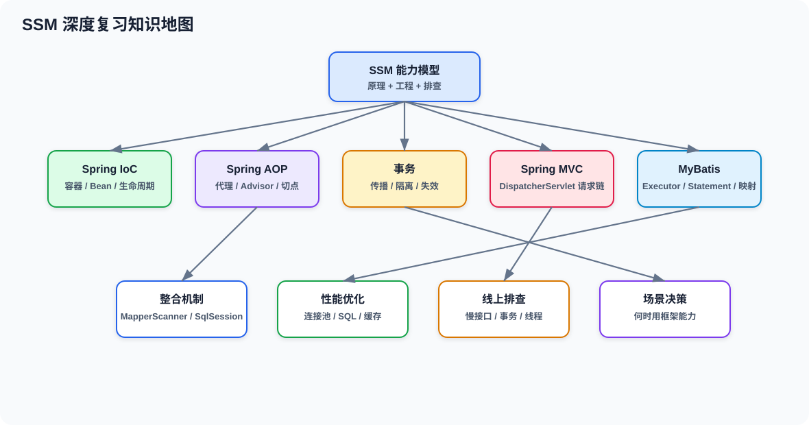

## 目录

- [一、怎么读这份总稿](#一怎么读这份总稿)
- [二、先认识源码里的几个关键类](#二先认识源码里的几个关键类)
- [三、Spring 容器启动主线](#三spring-容器启动主线)
- [四、Bean 创建与生命周期](#四bean-创建与生命周期)
- [五、IoC、依赖注入与 BeanDefinition](#五ioc依赖注入与-beandefinition)
- [六、循环依赖与三级缓存](#六循环依赖与三级缓存)
- [七、AOP 与声明式事务](#七aop-与声明式事务)
- [八、Spring MVC 请求处理链](#八spring-mvc-请求处理链)
- [九、MyBatis 核心执行链](#九mybatis-核心执行链)
- [十、Spring 与 MyBatis 怎么整合](#十spring-与-mybatis-怎么整合)
- [十一、面试高频题速答](#十一面试高频题速答)
- [十二、推荐复习路线和断点位](#十二推荐复习路线和断点位)

---

## 一、怎么读这份总稿

如果你只剩很少时间，按这个顺序看：

1. 先看二、三、四，搞懂 Spring 容器和 Bean 是怎么来的。
2. 再看六、七，搞懂循环依赖、AOP 和事务。
3. 再看八、九、十，搞懂 MVC 和 MyBatis。
4. 最后看十一，背高频回答。

这份总稿的目标不是把所有源码都啃完，而是让你能回答这几个核心问题：

- `BeanDefinition` 是什么。
- `BeanFactoryPostProcessor` 和 `BeanPostProcessor` 有什么区别。
- Spring 为什么能创建 Bean、注入依赖、解决部分循环依赖。
- `@Transactional` 为什么本质上是 AOP。
- 一个请求为什么能从 `DispatcherServlet` 走到 Controller。
- Mapper 为什么一个接口就能直接执行 SQL。

---

## 二、先认识源码里的几个关键类

下面这几个类，是你看 Spring 源码时最该先认识的。

| 类 | 你可以先这样理解 | 你要记住的点 |
| --- | --- | --- |
| `BeanDefinition` | Bean 的“图纸” | 描述这个 Bean 是什么、怎么创建、什么时候初始化 |
| `BeanFactory` | Bean 的工厂接口 | 负责拿 Bean，不负责调度整套容器生命周期 |
| `ApplicationContext` | 更完整的容器 | 在 `BeanFactory` 基础上加了事件、国际化、资源加载等能力 |
| `DefaultListableBeanFactory` | Spring 容器核心实现 | 既能注册 `BeanDefinition`，又能查找、创建 Bean |
| `AbstractApplicationContext` | `refresh()` 的总调度器 | 容器启动主线大多从这里看 |
| `AbstractAutowireCapableBeanFactory` | 真正创建 Bean 的关键类 | 实例化、属性填充、初始化基本都在这条线上 |
| `BeanFactoryPostProcessor` | 改“图纸”的扩展点 | 在 Bean 实例化前修改 `BeanDefinition` |
| `BeanPostProcessor` | 改“成品”的扩展点 | 在 Bean 创建前后增强 Bean 实例 |
| `InstantiationAwareBeanPostProcessor` | 更早介入的后置处理器 | 能插到实例化前、属性填充前 |
| `SmartInstantiationAwareBeanPostProcessor` | 更聪明的后置处理器 | 循环依赖早期暴露、AOP 代理经常会碰到它 |
| `FactoryBean` | 生产别的对象的 Bean | `getBean("x")` 拿到的是产品，`&x` 才能拿到工厂本身 |
| `SingletonBeanRegistry` | 单例注册中心 | 三层缓存的基础就在这条线上 |

### 2.1 `BeanDefinition` 到底是什么

它不是 Bean 本身，而是 Bean 的元数据描述。常见信息包括：

- `beanClassName`
- 作用域 `scope`
- 是否懒加载 `lazyInit`
- 初始化方法 `initMethodName`
- 销毁方法 `destroyMethodName`
- 构造器参数、属性值、依赖关系

你可以把它理解成“建筑图纸”，Spring 先拿图纸，再决定怎么盖房子。

### 2.2 `BeanFactoryPostProcessor` 和 `BeanPostProcessor` 的区别

最短记法：

- `BeanFactoryPostProcessor` 改图纸，也就是 `BeanDefinition`。
- `BeanPostProcessor` 改成品，也就是实际 Bean 实例。

```java
@Component
public class DemoBeanFactoryPostProcessor implements BeanFactoryPostProcessor {
    @Override
    public void postProcessBeanFactory(ConfigurableListableBeanFactory beanFactory) {
        BeanDefinition bd = beanFactory.getBeanDefinition("userService");
        bd.setLazyInit(true);
    }
}
```

```java
@Component
public class DemoBeanPostProcessor implements BeanPostProcessor {
    @Override
    public Object postProcessAfterInitialization(Object bean, String beanName) {
        if (bean instanceof UserService) {
            return bean; // 这里可以做代理、增强、包装
        }
        return bean;
    }
}
```

### 2.3 `FactoryBean` 容易混淆的地方

`FactoryBean` 本身也是一个 Bean，但它返回的不是它自己，而是它生产出来的对象。  
MyBatis 和 Spring 整合里很常见的 `SqlSessionFactoryBean` 就是这个思路。

如果要拿工厂本身，用 `&beanName`；如果直接 `getBean("beanName")`，拿到的是它生产出来的对象。

---

## 三、Spring 容器启动主线

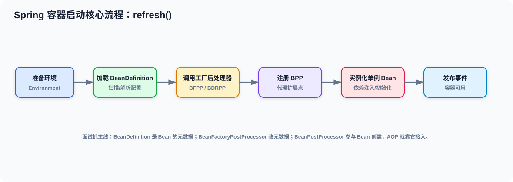

Spring 容器启动最核心的入口是：

```text
AbstractApplicationContext#refresh()
```

可以把它理解成下面这条链：

```text
prepareRefresh()
  -> obtainFreshBeanFactory()
  -> invokeBeanFactoryPostProcessors()
  -> registerBeanPostProcessors()
  -> finishBeanFactoryInitialization()
  -> finishRefresh()
```

### 3.1 `refresh()` 大概干了什么

1. 准备环境。
2. 读取并刷新 `BeanFactory`。
3. 执行 `BeanFactoryPostProcessor`。
4. 注册 `BeanPostProcessor`。
5. 预实例化非懒加载单例 Bean。
6. 发布容器刷新完成事件。

### 3.2 为什么要先处理 `BeanDefinition`

因为 Spring 不是一上来就 new 对象，而是先收集“对象怎么创建”的信息。  
这样做的好处是：

- 可以统一处理配置。
- 可以给后置处理器预留插入点。
- 可以在实例化前修改属性、作用域、条件装配结果。

### 3.3 这几个方法建议先眼熟

```text
AbstractApplicationContext#refresh
AbstractApplicationContext#invokeBeanFactoryPostProcessors
AbstractApplicationContext#registerBeanPostProcessors
AbstractApplicationContext#finishBeanFactoryInitialization
DefaultListableBeanFactory#preInstantiateSingletons
```

如果你只想先追主线，断点打这几个地方就够了。

---

## 四、Bean 创建与生命周期

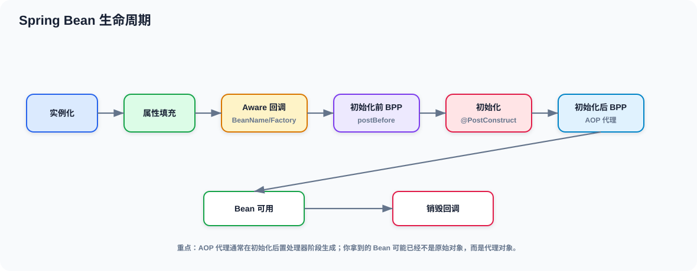

Bean 的生命周期可以粗略记成：

```text
实例化 -> 属性填充 -> Aware 回调 -> 初始化前处理 -> 初始化 -> 初始化后处理 -> 可用 -> 销毁
```

### 4.1 创建 Bean 的关键方法

```text
AbstractBeanFactory#doGetBean
AbstractAutowireCapableBeanFactory#createBean
AbstractAutowireCapableBeanFactory#doCreateBean
AbstractAutowireCapableBeanFactory#createBeanInstance
AbstractAutowireCapableBeanFactory#populateBean
AbstractAutowireCapableBeanFactory#initializeBean
```

你可以先把这几步理解成：

- `doGetBean()`：我要这个 Bean。
- `createBean()`：如果没有，就创建它。
- `doCreateBean()`：真正执行创建流程。
- `createBeanInstance()`：先把对象造出来。
- `populateBean()`：把依赖注入进去。
- `initializeBean()`：做初始化、AOP、后置处理。

### 4.2 一个最常见的生命周期顺序

```text
实例化
  -> 属性填充
  -> Aware 回调
  -> BeanPostProcessor#postProcessBeforeInitialization
  -> 初始化方法
  -> BeanPostProcessor#postProcessAfterInitialization
```

### 4.3 `BeanFactoryPostProcessor` vs `BeanPostProcessor`

这个题几乎必问。

| 扩展点 | 作用对象 | 作用时机 | 典型用途 |
| --- | --- | --- | --- |
| `BeanFactoryPostProcessor` | `BeanDefinition` | Bean 实例化前 | 改配置、改作用域、改懒加载 |
| `BeanPostProcessor` | Bean 实例 | Bean 创建前后 | AOP 代理、依赖注入增强、对象包装 |

一句话：

> 前者改“图纸”，后者改“成品”。

---

## 五、IoC、依赖注入与 BeanDefinition

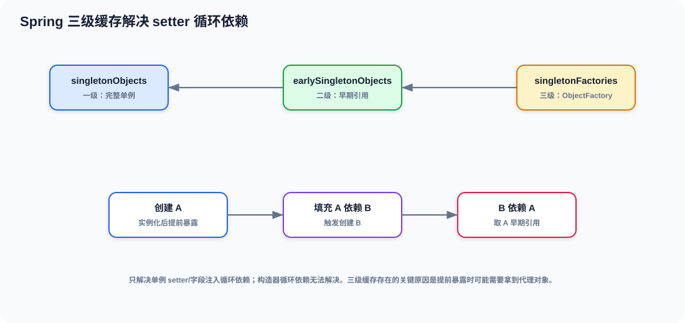

### 5.1 IoC 到底解决了什么

没有 IoC 时，对象之间自己 `new`，依赖关系散在各处。  
有了 IoC 之后，对象的创建和依赖关系交给容器统一管理。

你可以把 Spring 看成一个“对象关系调度中心”：

- 对象什么时候创建，由容器决定。
- 对象依赖谁，由容器注入。
- 对象是否单例、是否懒加载，由图纸决定。

### 5.2 `@Autowired` 底层是怎么找依赖的

常见主线是：

```text
AutowiredAnnotationBeanPostProcessor
  -> resolveDependency()
  -> DefaultListableBeanFactory#doResolveDependency
```

它做的事情本质上就是：

1. 看注入点要什么类型。
2. 去容器里找候选 Bean。
3. 根据 `@Primary`、`@Qualifier`、名称、类型等规则选出一个。
4. 注入进去。

### 5.3 `BeanDefinition` 和注入有什么关系

`BeanDefinition` 不只是记录类名，它还记录：

- 这个 Bean 依赖什么
- 由哪个构造器创建
- 是否延迟初始化
- 是否是单例
- 是否需要走自动装配

所以你可以这样理解：

> Spring 先根据 `BeanDefinition` 知道“这个对象要怎么造”，再在创建过程中完成依赖注入。

### 5.4 多实现类为什么会冲突

当容器里有多个同类型 Bean 时，Spring 需要做决策：

- `@Primary` 优先
- `@Qualifier` 精确指定
- 按名字匹配
- 实在不行就报错

这也是面试时经常追问“为什么注入失败”的原因。

---

## 六、循环依赖与三级缓存

### 6.1 哪些情况能解决，哪些不行

能解决的常见场景：

- 单例 Bean
- setter 注入
- 字段注入

通常解决不了的场景：

- 构造器注入循环依赖
- prototype 作用域循环依赖
- 过早触发代理失败的复杂场景

### 6.2 三级缓存是什么

| 缓存 | 存什么 |
| --- | --- |
| `singletonObjects` | 完整初始化好的单例 |
| `earlySingletonObjects` | 早期曝光的对象引用 |
| `singletonFactories` | 生成早期引用的 `ObjectFactory` |

### 6.3 为什么不是二级缓存

因为 Spring 有时候不能太早决定暴露的是“原始对象”还是“代理对象”。  
三级缓存里放的是一个工厂，等真正有人来取早期引用时，再决定给谁。

### 6.4 `ObjectFactory` 为什么重要

它的作用就是“延迟决定”：

- 先把创建早期引用的能力放进去。
- 等真正需要时再拿。
- 这样可以兼容 AOP 代理和循环依赖场景。

### 6.5 一句话回答

> Spring 通过单例三级缓存和早期曝光机制解决部分循环依赖，核心是先暴露一个可延迟生成早期引用的 `ObjectFactory`，等后置处理器和代理逻辑准备好后，再决定对外暴露原始对象还是代理对象。

---

## 七、AOP 与声明式事务

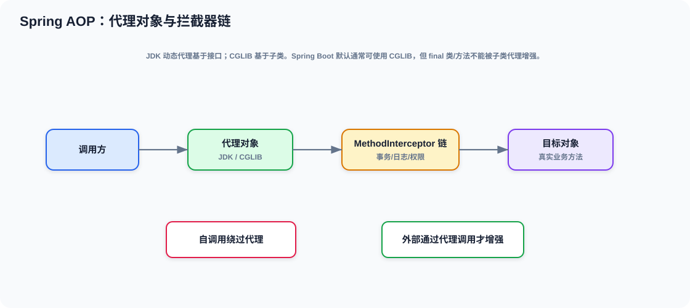
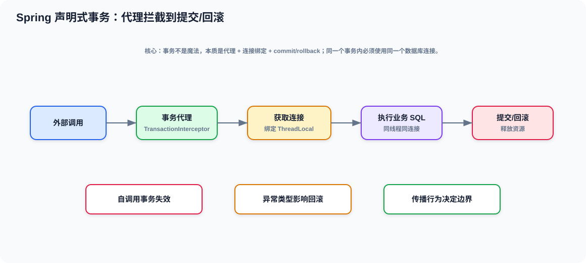

### 7.1 AOP 是什么

一句话：

> 在不改业务代码的前提下，把日志、权限、审计、事务等横切逻辑织入方法调用过程。

### 7.2 JDK 动态代理和 CGLIB

| 方式 | 代理对象 | 适合场景 |
| --- | --- | --- |
| JDK 动态代理 | 接口代理 | 有接口的 Bean |
| CGLIB | 继承目标类生成子类 | 没有接口或需要强制代理类 |

### 7.3 AOP 调用链主线

```text
外部调用代理对象
  -> 拦截器链
  -> 目标方法
  -> 返回结果 / 异常处理
```

### 7.4 `@Transactional` 为什么本质上也是 AOP

因为它也是方法拦截：

1. 进入代理。
2. `TransactionInterceptor` 开启或加入事务。
3. 从数据源拿连接并绑定到当前线程。
4. 执行业务方法。
5. 正常提交，异常回滚。

### 7.5 事务为什么能共用同一个连接

关键在于：

- 连接被绑定到了当前线程。
- 后续同线程内的 JDBC/MyBatis 操作复用这个连接。

你可以直接记：

> Spring 事务靠的是 `TransactionSynchronizationManager` 这类线程绑定机制，不是“自动帮你新开一个事务对象”那么简单。

### 7.6 事务失效最常见的几个坑

1. 自调用。
2. 非 `public` 方法。
3. 异常被吞掉。
4. 异步线程切换。
5. 传播行为理解错误。

### 7.7 面试一句话版

> Spring 声明式事务本质是 AOP，核心是代理拦截、线程绑定连接、提交回滚控制。最常见失效原因是自调用、异常被吞、非 public 方法和线程切换。

---

## 八、Spring MVC 请求处理链

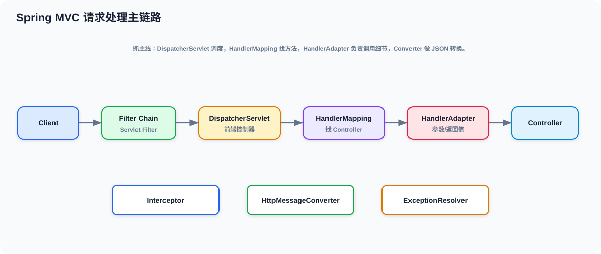
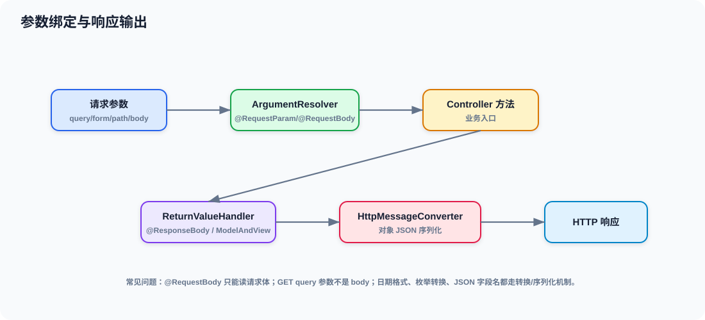
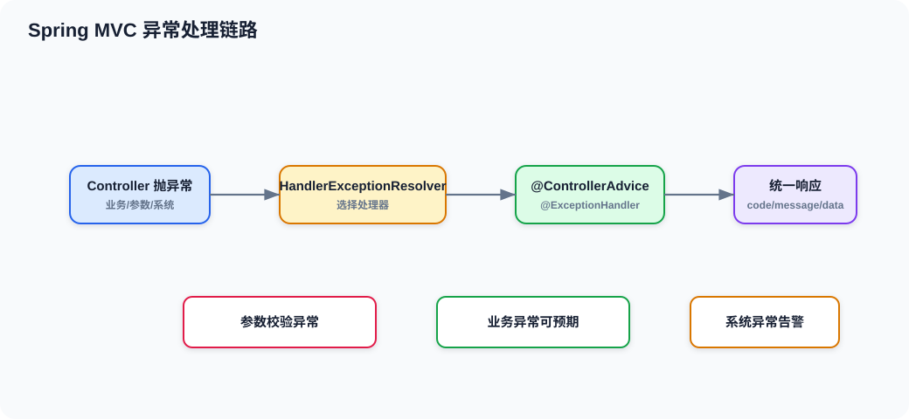

### 8.1 一次请求的大链路

```text
DispatcherServlet
  -> HandlerMapping 找到处理器
  -> HandlerAdapter 适配并调用
  -> 参数解析器完成入参绑定
  -> Controller 执行业务方法
  -> 返回值处理器处理结果
  -> 消息转换器写回 JSON / 视图
  -> 异常处理器统一兜底
```

### 8.2 为什么要有 HandlerAdapter

因为 Controller 形式不止一种：

- `@RequestMapping`
- `@ResponseBody`
- 参数注解绑定
- 返回值类型多样

`HandlerAdapter` 的作用就是把“不同风格的 Handler”统一成可执行流程。

### 8.3 参数为什么能自动绑定

核心是 `HandlerMethodArgumentResolver`。

它会根据：

- 参数类型
- 注解类型
- 请求体内容
- URL 参数

决定如何构造方法入参。

### 8.4 返回值为什么能自动转 JSON

核心是 `HandlerMethodReturnValueHandler` 和消息转换器。  
如果方法上有 `@ResponseBody`，Spring 会把对象交给合适的 `HttpMessageConverter` 输出成 JSON。

### 8.5 异常为什么能统一处理

常见入口是：

- `@ControllerAdvice`
- `@ExceptionHandler`
- `HandlerExceptionResolver`

这让你可以把 Controller 里的 try-catch 收敛到统一异常体系。

---

## 九、MyBatis 核心执行链

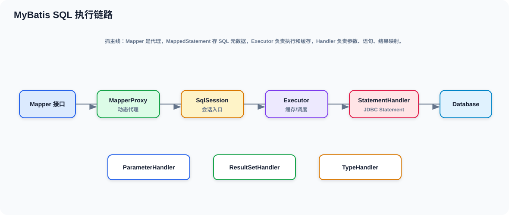
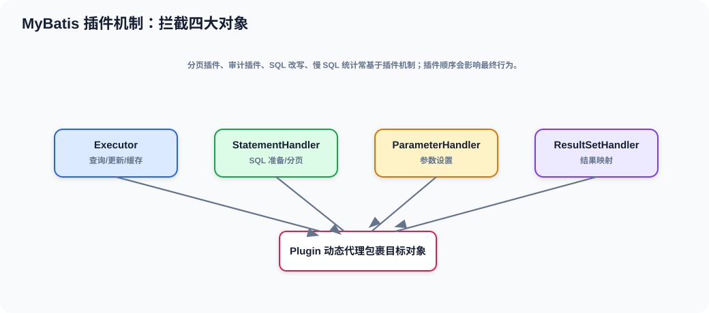
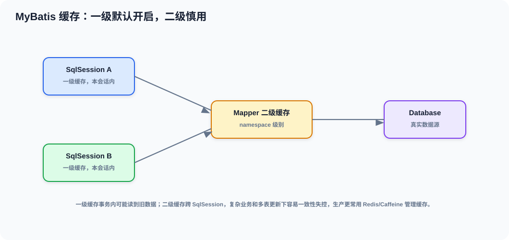

### 9.1 Mapper 为什么能直接调用

Mapper 接口并不是普通对象，而是动态代理。

```text
MapperProxy#invoke
  -> MapperMethod#execute
  -> SqlSession
  -> Executor
  -> StatementHandler
  -> ParameterHandler
  -> ResultSetHandler
```

### 9.2 `SqlSession`、`Executor`、`MappedStatement`

| 对象 | 作用 |
| --- | --- |
| `SqlSession` | 对外操作入口 |
| `Executor` | 执行调度、缓存、事务协同 |
| `MappedStatement` | 一条 SQL 的元数据描述 |
| `StatementHandler` | JDBC Statement 执行 |
| `ParameterHandler` | 参数绑定 |
| `ResultSetHandler` | 结果映射 |

### 9.3 `#{}` 和 `${}` 的区别

| 写法 | 含义 | 风险 |
| --- | --- | --- |
| `#{}` | 预编译参数 | 安全，推荐 |
| `${}` | 字符串拼接 | SQL 注入风险高 |

### 9.4 插件和缓存最该记住什么

- 插件本质是拦截 MyBatis 四大对象。
- 一级缓存是 `SqlSession` 级别。
- 二级缓存是 namespace 级别。
- 写操作会清缓存。

---

## 十、Spring 与 MyBatis 怎么整合

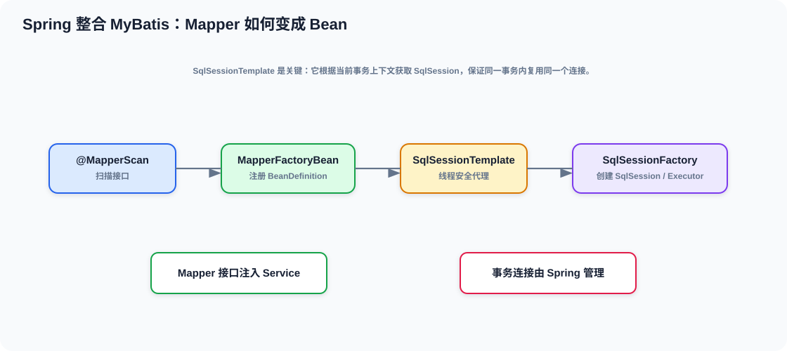

### 10.1 Mapper 为什么能变成 Spring Bean

常见主线是：

```text
@MapperScan
  -> 注册 MapperDefinition
  -> MapperFactoryBean
  -> 生成 MapperProxy
```

也就是说，Mapper 接口并不是直接 `new` 出来的，而是交给 Spring + MyBatis 的集成体系处理。

### 10.2 `SqlSessionTemplate` 为什么重要

`SqlSessionTemplate` 的价值是把 MyBatis 的 `SqlSession` 使用方式托管给 Spring。

它的作用包括：

- 让 SQL 执行参与 Spring 事务。
- 统一连接获取和释放。
- 让 Mapper 调用更安全。

### 10.3 为什么 Spring 事务能管住 MyBatis

因为 Spring 在事务开启时会把连接资源绑定到当前线程，而 MyBatis 执行 SQL 时会从这套线程资源里拿连接。  
所以同一个事务内，Spring 和 MyBatis 能协同工作。

### 10.4 一个常见面试回答

> Mapper 接口之所以能直接调用，是因为 Spring 通过 `MapperFactoryBean` 把接口注册成 Bean，运行时实际返回的是 `MapperProxy` 动态代理。SQL 执行交给 `SqlSession` 和 `Executor`，而 `SqlSessionTemplate` 让 MyBatis 的执行过程接入 Spring 事务管理。

---

## 十一、面试高频题速答

### 11.1 什么是 IoC

> IoC 就是把对象的创建和依赖关系交给容器统一管理，业务代码只关心使用，不关心怎么 new 和怎么组装。

### 11.2 `BeanDefinition` 是什么

> 它是 Bean 的元数据描述，像图纸一样记录类名、作用域、依赖、初始化方法等信息，Spring 先处理它，再创建对象。

### 11.3 `BeanFactoryPostProcessor` 和 `BeanPostProcessor` 区别

> 前者操作 `BeanDefinition`，后者操作 Bean 实例。前者在实例化前执行，后者在 Bean 创建前后执行。

### 11.4 Spring 如何解决循环依赖

> 通过单例三级缓存和早期曝光机制解决 setter/字段注入的部分循环依赖，构造器循环依赖通常解决不了。

### 11.5 AOP 底层原理

> 基于 JDK 动态代理或 CGLIB 生成代理对象，调用时按拦截器链增强目标方法。

### 11.6 为什么事务本质上也是 AOP

> 因为 `@Transactional` 也是方法拦截，代理里会开启事务、绑定连接、决定提交回滚。

### 11.7 事务为什么会失效

> 常见原因是自调用、异常被吞、非 public、异步线程切换、传播行为理解错。

### 11.8 Spring MVC 请求怎么走

> `DispatcherServlet` 先通过 `HandlerMapping` 找到处理器，再通过 `HandlerAdapter` 执行，参数解析器负责入参绑定，返回值处理器和消息转换器负责输出。

### 11.9 Mapper 为什么能执行 SQL

> 因为 Mapper 是动态代理对象。方法调用会进入 `MapperProxy#invoke`，再转成 `MapperMethod` 执行语义，最后交给 `SqlSession` 和 `Executor`。

### 11.10 `#{}` 和 `${}` 区别

> `#{}` 是预编译参数，安全；`${}` 是字符串拼接，灵活但容易 SQL 注入。

### 11.11 `BeanFactory` 和 `ApplicationContext` 区别

> `BeanFactory` 更底层，主要负责取 Bean；`ApplicationContext` 是更完整的容器，在此基础上加了国际化、事件、资源加载等能力。

---

## 十二、推荐复习路线和断点位

### 12.1 如果你只想快速过一遍

建议顺序：

1. 二、先认识关键类
2. 三、Spring 容器启动主线
3. 四、Bean 创建与生命周期
4. 六、循环依赖与三级缓存
5. 七、AOP 与声明式事务
6. 八、Spring MVC 请求处理链
7. 九、MyBatis 核心执行链
8. 十、Spring 与 MyBatis 怎么整合
9. 十一、高频题速答

### 12.2 最值得打断点的地方

| 模块 | 建议断点 |
| --- | --- |
| Spring 容器 | `AbstractApplicationContext#refresh` |
| Bean 创建 | `DefaultListableBeanFactory#preInstantiateSingletons`、`AbstractAutowireCapableBeanFactory#doCreateBean` |
| 循环依赖 | `AbstractAutowireCapableBeanFactory#doCreateBean`、`getSingleton` |
| AOP | `AbstractAutoProxyCreator`、`createProxy` |
| 事务 | `TransactionInterceptor#invoke` |
| MVC | `DispatcherServlet#doDispatch` |
| MyBatis | `MapperProxy#invoke`、`MapperMethod#execute` |

### 12.3 三天冲刺版

**第 1 天**：Spring 容器、BeanDefinition、生命周期、循环依赖。  
**第 2 天**：AOP、事务、MVC 请求链。  
**第 3 天**：MyBatis、Spring 整合、速答背诵。

### 12.4 最后建议

如果你时间真的不多，就先把下面这条线背顺：

```text
BeanDefinition -> refresh() -> Bean 创建 -> 三级缓存 -> AOP 代理 -> 事务拦截 -> MVC 调度 -> Mapper 动态代理
```

这条线顺了，SSM 面试基本就不会再是“背答案”，而是能讲机制、讲链路、讲排查。
