# SSM 面试实用学习文档

> 适合 3-5 年 Java 工程师系统复习 SSM。目标不是停留在“会用”，而是把 Spring、Spring MVC、MyBatis 背后的容器机制、代理机制、执行链路、常见坑和线上排查讲清楚，能落到工程实践和面试表达。

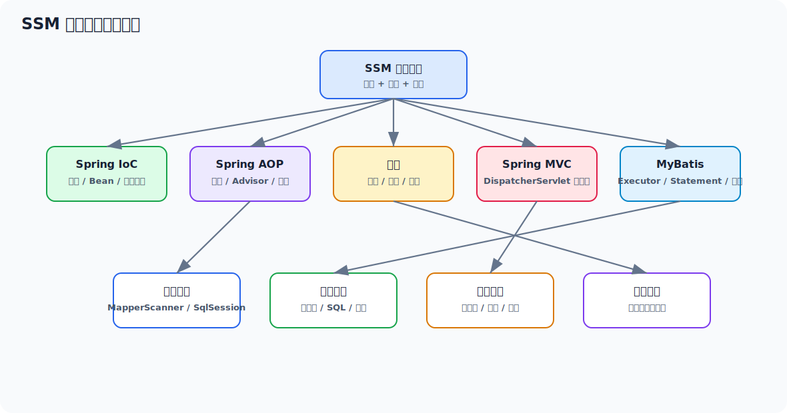

## 目录

- [一、SSM 复习总览](#一ssm-复习总览)
- [二、Spring 容器启动主线](#二spring-容器启动主线)
- [三、IoC 到底解决了什么](#三ioc-到底解决了什么)
- [四、BeanDefinition 与容器核心数据结构](#四beandefinition-与容器核心数据结构)
- [五、Bean 生命周期全链路](#五bean-生命周期全链路)
- [六、依赖注入的底层过程](#六依赖注入的底层过程)
- [七、循环依赖与三级缓存](#七循环依赖与三级缓存)
- [八、AOP 原理与代理链](#八aop-原理与代理链)
- [九、声明式事务为什么本质上也是 AOP](#九声明式事务为什么本质上也是-aop)
- [十、Spring MVC 请求处理链](#十spring-mvc-请求处理链)
- [十一、参数绑定、返回值处理与异常机制](#十一参数绑定返回值处理与异常机制)
- [十二、MyBatis 核心执行链](#十二mybatis-核心执行链)
- [十三、MyBatis 插件、缓存与 Spring 整合](#十三mybatis-插件缓存与-spring-整合)
- [十四、SSM 常见高频坑点](#十四ssm-常见高频坑点)
- [十五、线上排查思路](#十五线上排查思路)
- [十六、面试高频回答模板](#十六面试高频回答模板)
- [十七、建议复习路线](#十七建议复习路线)

---

## 一、SSM 复习总览

很多工程师对 SSM 的理解停留在：

```text
Controller 收请求
  -> Service 写业务
  -> Mapper 查数据库
  -> @Transactional 保事务
  -> AOP 打日志、做权限
```

这条链当然没错，但面试官真正想听的是：**这条链为什么成立**。

SSM 这套体系真正的底层主线可以压缩成下面五个问题：

1. Spring 容器为什么能把一堆对象组织起来？
2. Spring 为什么能在不侵入业务代码的前提下做增强？
3. 事务为什么能做到“同一个线程里多个 SQL 共用一个连接”？
4. Spring MVC 为什么能自动完成参数绑定、方法调用和结果渲染？
5. MyBatis 为什么一个接口就能直接执行 SQL？

如果你把这五个问题讲透，SSM 基本就不再是“配置驱动的黑盒”，而是一套你能解释、能优化、能排查的工程基础设施。

### 1.1 SSM 的能力边界

| 模块 | 核心职责 | 底层关键字 | 面试重点 |
| --- | --- | --- | --- |
| Spring | 管对象、管依赖、管扩展点 | `BeanFactory`、`ApplicationContext`、`BeanDefinition` | IoC、生命周期、循环依赖 |
| Spring AOP | 非侵入增强 | JDK 动态代理、CGLIB、Advisor、Interceptor Chain | 代理对象、调用链、失效场景 |
| Spring Tx | 事务边界管理 | `TransactionInterceptor`、`PlatformTransactionManager`、`ThreadLocal` | 自调用失效、传播行为、回滚规则 |
| Spring MVC | Web 请求调度 | `DispatcherServlet`、`HandlerMapping`、`HandlerAdapter` | 请求链、参数绑定、异常处理 |
| MyBatis | SQL 映射与执行 | `MapperProxy`、`SqlSession`、`Executor`、`StatementHandler` | 执行链、插件、缓存、整合 |

### 1.2 面试里怎么体现“不是只会用”

你要尽量从三个层次回答：

1. **表层功能**：这个注解/组件干什么。
2. **中层机制**：它依赖哪条核心链路完成。
3. **工程视角**：什么场景会失效、有什么代价、线上怎么排。

比如面试官问 `@Transactional`，不应该只说“开启事务”，更好的回答是：

> `@Transactional` 本质是基于 AOP 的方法拦截。调用进入代理后，`TransactionInterceptor` 会根据事务属性获取或加入事务，通过事务管理器拿连接并绑定到当前线程，业务方法内多个 MyBatis/JDBC 操作复用同一连接。方法正常结束时提交，出现满足回滚规则的异常时回滚。它最典型的失效点是自调用、非 public 方法、异常被吞、以及多线程切换导致 ThreadLocal 上下文丢失。

---

## 二、Spring 容器启动主线

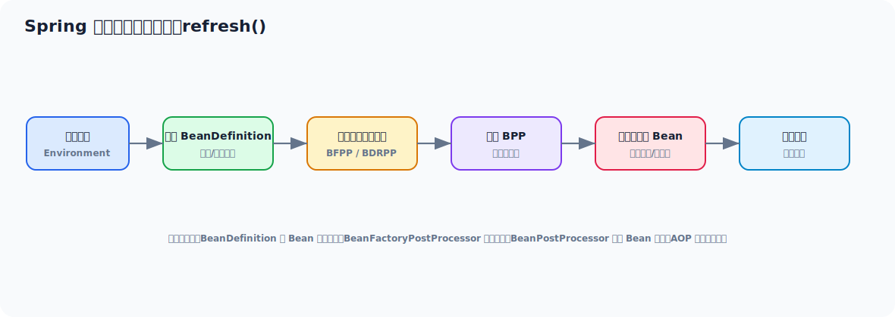

Spring 容器启动的核心不是“创建 Bean”，而是：

1. 先准备容器运行环境。
2. 把 Bean 的元数据加载进来。
3. 给扩展点机会修改元数据。
4. 注册 Bean 创建阶段的扩展点。
5. 最后再实例化非懒加载单例 Bean。

如果从 `AbstractApplicationContext#refresh()` 这条主线看，可以理解成：

```text
prepareRefresh()
  -> obtainFreshBeanFactory()
  -> invokeBeanFactoryPostProcessors()
  -> registerBeanPostProcessors()
  -> finishBeanFactoryInitialization()
  -> finishRefresh()
```

### 2.1 为什么要先加载元数据，再创建对象

因为 Spring 需要先知道：

- Bean 是什么类型
- 作用域是什么
- 依赖谁
- 初始化方法是什么
- 是否需要代理
- 是否需要懒加载

这些信息都属于 **BeanDefinition 阶段**，还没到真正 new 对象的时候。

这也是 Spring 的核心设计之一：**先描述对象，再创建对象**。

### 2.2 容器刷新过程中两个最重要的扩展点

| 扩展点 | 作用时机 | 操作对象 | 常见用途 |
| --- | --- | --- | --- |
| `BeanFactoryPostProcessor` | Bean 实例化之前 | `BeanDefinition` | 改属性、改作用域、补充配置 |
| `BeanPostProcessor` | Bean 创建过程中 | Bean 实例 | 包装、增强、代理、注入额外逻辑 |

一句话记忆：

- `BFPP` 改的是“图纸”
- `BPP` 改的是“成品”

Spring AOP 之所以能工作，关键就是在 `BeanPostProcessor` 阶段把原始 Bean 包成代理对象。

---

## 三、IoC 到底解决了什么

IoC，Inversion of Control，控制反转。很多人背成“对象创建权交给容器”，这句话没错，但不够深。

更准确地说，IoC 解决的是三个问题：

1. **对象依赖关系如何管理**
2. **对象生命周期如何统一管理**
3. **框架能力如何无侵入地织入业务对象**

### 3.1 没有 IoC 时的问题

```java
public class OrderService {
    private final OrderRepository orderRepository = new OrderRepository();
    private final PayService payService = new PayService();
}
```

这种写法的问题不是“new 不优雅”，而是：

- 依赖关系写死
- 无法轻易替换实现
- 生命周期分散在各处
- 很难统一做事务、日志、监控、权限增强

### 3.2 有了 IoC 之后发生了什么

容器会接管：

- Bean 定义注册
- Bean 实例化
- 依赖注入
- 初始化回调
- 销毁回调
- 与其他基础设施协同，比如 AOP、事务、事件机制

所以 IoC 不只是“解耦”，更是一套 **对象管理平台**。

### 3.3 BeanFactory 和 ApplicationContext 的区别

| 对比项 | `BeanFactory` | `ApplicationContext` |
| --- | --- | --- |
| 定位 | 最基础 IoC 容器 | 更完整的应用上下文 |
| 是否支持国际化 | 弱 | 支持 |
| 是否支持事件发布 | 弱 | 支持 |
| 是否自动注册后处理器 | 基础 | 更完整 |
| 常用场景 | 理解底层、最小容器模型 | 实际项目主流使用 |

面试里可以这样表达：

> `BeanFactory` 是最核心的 IoC 容器抽象，负责 Bean 获取和管理；`ApplicationContext` 在它的基础上整合了资源加载、国际化、事件机制和自动注册扩展点等能力。实际项目里我们通常直接用 `ApplicationContext`，但理解底层还是要回到 `BeanFactory`。

---

## 四、BeanDefinition 与容器核心数据结构

Spring 容器内部并不是直接存对象，而是先存对象的“定义信息”。

### 4.1 BeanDefinition 可以理解成什么

可以把 `BeanDefinition` 理解成 Bean 的建模结果，它至少描述：

- Bean 对应的类
- Bean 名称
- 作用域
- 是否懒加载
- 构造参数
- 属性依赖
- 初始化方法
- 销毁方法
- 是否主候选 Bean

### 4.2 为什么说 BeanDefinition 是 Spring 的“图纸”

因为在真正实例化之前，Spring 做的大量事情都围绕它展开：

- 组件扫描把类解析成 `BeanDefinition`
- `@Configuration` 解析成 `BeanDefinition`
- `@Bean` 方法也会变成 `BeanDefinition`
- `BeanFactoryPostProcessor` 也是改 `BeanDefinition`

这意味着：Spring 很多能力的入口其实都在“元数据阶段”。

### 4.3 SingletonBeanRegistry 存的是什么

Spring 单例池核心上维护的不只是一个 Map，而是几层结构：

- 完整单例对象缓存
- 早期曝光对象缓存
- 单例工厂缓存
- 已创建 Bean 集合
- 正在创建中的 Bean 集合

后面讲循环依赖时，这些结构就会串起来。

---

## 五、Bean 生命周期全链路

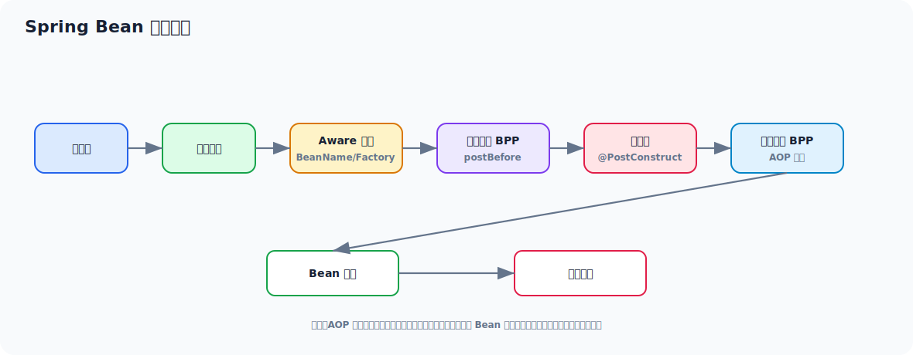

生命周期是 Spring 面试中的必考大题，而且最容易回答得太浅。

很多人只会说：

```text
实例化 -> 属性注入 -> 初始化 -> 使用 -> 销毁
```

这只能算框架使用层答案。更完整的底层链路是：

```text
实例化
  -> 提前曝光 ObjectFactory（必要时）
  -> 属性填充
  -> Aware 回调
  -> BeanPostProcessor before
  -> 初始化方法
  -> BeanPostProcessor after
  -> 放入单例池
  -> 销毁回调
```

### 5.1 实例化阶段

Spring 会根据 BeanDefinition 决定如何创建对象：

- 构造器注入
- 工厂方法
- `FactoryBean`
- 供应器等扩展模式

这个阶段只是把“对象壳子”造出来，还没有注入依赖。

### 5.2 属性填充阶段

也就是依赖注入真正发生的时候，常见方式包括：

- `@Autowired`
- `@Resource`
- setter 注入
- 构造器注入
- 字段注入

### 5.3 Aware 回调阶段

Spring 会让 Bean 感知容器中的某些基础设施：

- `BeanNameAware`
- `BeanFactoryAware`
- `ApplicationContextAware`

这一步的意义是：给 Bean 获取框架环境的能力。

### 5.4 初始化前后置处理

最关键的是这两步：

- `postProcessBeforeInitialization`
- `postProcessAfterInitialization`

这里面可以做：

- 额外属性处理
- 注解驱动增强
- 代理包装

**AOP 通常就发生在初始化后的后置处理器阶段。**

### 5.5 初始化方法

常见入口：

- `InitializingBean#afterPropertiesSet`
- 自定义 `init-method`
- `@PostConstruct`

本质上都是：依赖注入完成后，执行业务对象自己的初始化逻辑。

### 5.6 销毁阶段

常见入口：

- `DisposableBean#destroy`
- 自定义 `destroy-method`
- `@PreDestroy`

注意单例 Bean 才更容易被容器统一管理销毁；原型 Bean 容器通常只负责创建，不负责完整销毁生命周期。

### 5.7 一个常见高质量回答

> Spring Bean 生命周期如果详细展开，可以分成实例化、属性填充、Aware 回调、初始化前后置处理、初始化方法、使用和销毁几个阶段。真正最关键的是两个点：一是依赖注入发生在属性填充阶段；二是 AOP 代理通常在初始化后置处理器阶段生成，所以业务代码拿到的 Bean 很可能已经不是原始对象，而是代理对象。

### 5.8 例子：生命周期观察

```java
@Component
public class DemoBean implements BeanNameAware, InitializingBean, DisposableBean {

    @PostConstruct
    public void postConstruct() {
        System.out.println("1. @PostConstruct");
    }

    @Override
    public void setBeanName(String name) {
        System.out.println("2. BeanNameAware: " + name);
    }

    @Override
    public void afterPropertiesSet() {
        System.out.println("3. InitializingBean#afterPropertiesSet");
    }

    @PreDestroy
    public void preDestroy() {
        System.out.println("4. @PreDestroy");
    }

    @Override
    public void destroy() {
        System.out.println("5. DisposableBean#destroy");
    }
}
```

这段代码的意义不是记回调顺序，而是理解：**Spring 给了你多个生命周期切入点，但越底层、越框架绑定，越要慎用。**

---

## 六、依赖注入的底层过程

依赖注入从表面看只是 `@Autowired`，底层其实是一套“解析依赖描述并从容器中寻找候选 Bean”的过程。

### 6.1 注入不是简单按名称找对象

Spring 做依赖解析时通常会综合：

- 依赖类型
- Bean 名称
- `@Primary`
- `@Qualifier`
- 泛型信息
- 是否 required

所以多实现类冲突时，Spring 不是“找不到”，而是“候选太多无法唯一决策”。

### 6.2 `@Autowired` 的底层主线

大体可以理解成：

1. 找到需要注入的注入点。
2. 把注入点封装成 `DependencyDescriptor`。
3. 按类型去容器中找候选 Bean。
4. 根据 `@Primary`、`@Qualifier` 等规则决策唯一候选。
5. 注入到目标字段或 setter。

### 6.3 构造器注入和字段注入的差异

| 方式 | 优点 | 风险 |
| --- | --- | --- |
| 构造器注入 | 依赖显式、便于测试、适合不可变对象 | 容易放大构造器循环依赖问题 |
| 字段注入 | 写法短 | 隐式依赖、测试不友好、可维护性差 |
| setter 注入 | 灵活、可选依赖较友好 | 对象可能在不完整状态暴露 |

工程上更推荐：

- 核心强依赖用构造器注入
- 可选依赖用 setter 或 `ObjectProvider`

---

## 七、循环依赖与三级缓存

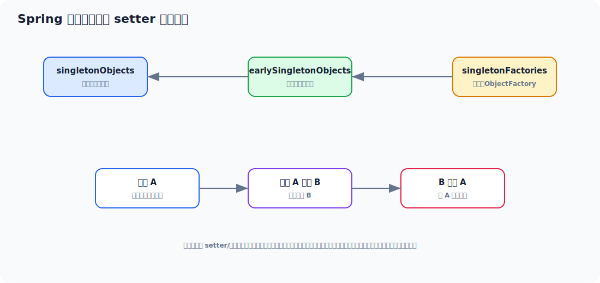

循环依赖是 Spring 底层最经典的话题之一。

### 7.1 什么情况下可以解决循环依赖

Spring 能解决的是：

- **单例**
- **setter/字段注入**
- **非强依赖构造阶段**

Spring 不能天然解决的是：

- 构造器循环依赖
- 原型 Bean 循环依赖
- 过早代理导致的不一致问题

### 7.2 三级缓存分别是什么

| 层级 | 结构 | 存的是什么 |
| --- | --- | --- |
| 一级缓存 | `singletonObjects` | 完整创建完成的单例 Bean |
| 二级缓存 | `earlySingletonObjects` | 提前曝光的早期 Bean 引用 |
| 三级缓存 | `singletonFactories` | 能生产早期 Bean 引用的工厂 |

### 7.3 为什么要三级，不是二级

这题很经典，真正关键在 AOP。

如果没有代理需求，二级缓存很多时候就够了；但 Spring 需要在“提前曝光”时保留一个机会：

- 暴露原始对象？
- 还是暴露代理对象？

三级缓存里放的是 `ObjectFactory`，这样当别的 Bean 依赖它时，Spring 才能按需决定拿到的是不是代理后的早期引用。

### 7.4 一条典型链路

以 A 依赖 B、B 又依赖 A 为例：

1. 创建 A，实例化后先把 A 的 `ObjectFactory` 放入三级缓存。
2. A 注入 B，触发创建 B。
3. 创建 B 时发现依赖 A。
4. 此时 A 还没完全初始化，但可从三级缓存拿到 A 的早期引用。
5. B 注入 A 成功，B 完成初始化。
6. 回到 A，A 再完成自己的依赖注入和初始化。
7. 最后 A、B 都进入一级缓存。

### 7.5 为什么构造器循环依赖不行

因为构造器注入时，对象本身还没实例化出来，连“早期引用”都没有，自然没法提前曝光。

### 7.6 面试里怎么说得更到位

> Spring 解决单例 setter 循环依赖的关键不在缓存本身，而在“实例化后、初始化前”的早期曝光机制。三级缓存的价值主要是配合 AOP，允许容器在需要时通过 `ObjectFactory` 暴露代理对象或原始对象。如果是构造器循环依赖，因为对象都还没实例化出来，就没有可曝光的早期引用，所以解决不了。

---

## 八、AOP 原理与代理链

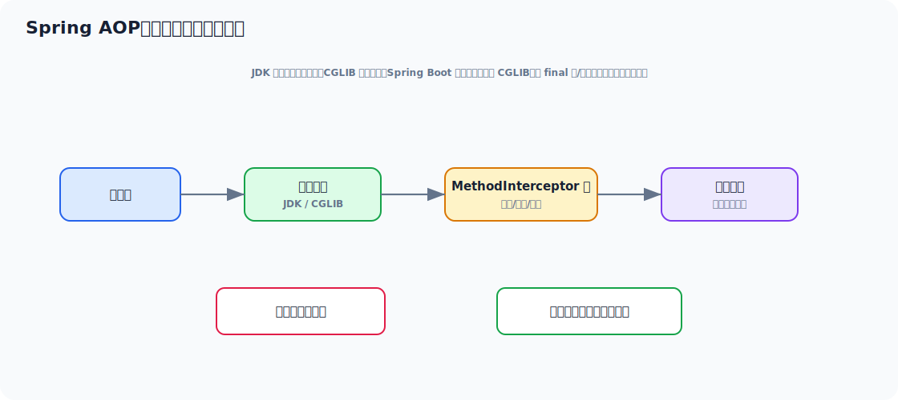

AOP 是 SSM 的第二条核心主线。你可以把它理解成：

> Spring 在不改业务类源码的情况下，把“日志、事务、权限、审计、埋点”等横切逻辑插入到目标方法调用前后。

### 8.1 AOP 的几个核心角色

| 概念 | 作用 |
| --- | --- |
| Aspect | 切面，横切逻辑的抽象 |
| JoinPoint | 可被拦截的点，Spring AOP 里通常是方法执行点 |
| Pointcut | 匹配哪些 JoinPoint |
| Advice | 在匹配点上执行什么增强 |
| Advisor | Pointcut + Advice 的组合 |
| Proxy | 代理对象，外部真正调用的是它 |

### 8.2 Spring AOP 为什么只支持方法级别

因为 Spring AOP 是基于代理实现的，代理的切入点天然围绕“方法调用”展开。  
如果你要做字段级、构造器级甚至字节码级织入，那已经更接近 AspectJ 的能力边界了。

### 8.3 JDK 动态代理和 CGLIB

| 方式 | 原理 | 适用场景 | 限制 |
| --- | --- | --- | --- |
| JDK 动态代理 | 基于接口生成代理类 | 目标类实现了接口 | 只能代理接口方法 |
| CGLIB | 生成子类覆盖方法 | 目标类没接口时常用 | `final` 类/方法难代理 |

一句话记忆：

- 有接口，优先 JDK 代理
- 没接口，通常走 CGLIB

### 8.4 AOP 调用链本质是什么

本质上不是“执行切面”，而是：

```text
代理对象接收调用
  -> 找到匹配当前方法的拦截器链
  -> 按顺序执行 interceptor
  -> 最终调用目标方法
  -> 再按调用栈退出
```

这就是典型的责任链 / 拦截器链模型。

### 8.5 `@Around` 为什么最强

因为 `@Around` 拿到了方法执行控制权，可以：

- 方法前做事
- 决定是否放行
- 方法后做事
- 改返回值
- 捕获异常并转换

但也正因为能力太强，滥用会导致业务链路难以理解。

### 8.6 一个实用示例：接口耗时统计

```java
@Aspect
@Component
public class CostLogAspect {

    @Around("execution(* com.demo.service..*(..))")
    public Object around(ProceedingJoinPoint pjp) throws Throwable {
        long start = System.currentTimeMillis();
        try {
            return pjp.proceed();
        } finally {
            long cost = System.currentTimeMillis() - start;
            System.out.println(pjp.getSignature() + " cost=" + cost + "ms");
        }
    }
}
```

这个例子要理解的重点不是注解语法，而是：

- 为什么业务代码没改却被增强了
- 因为容器里注入给外部的是代理对象，而不是目标对象本身

### 8.7 AOP 的常见失效场景

1. **自调用失效**
2. `final` 方法导致代理受限
3. 方法不是 Spring Bean 管理的
4. 切点表达式没匹配上
5. 代理对象没被外部调用到

最经典的是自调用：

```java
@Service
public class UserService {

    public void a() {
        b();
    }

    @Transactional
    public void b() {
        // ...
    }
}
```

这里 `a()` 内部直接调用 `b()`，走的是 `this.b()`，没有经过代理，所以事务/AOP 都可能失效。

### 8.8 AOP 和设计模式

Spring AOP 里最容易讲出的设计模式有：

- 代理模式
- 责任链模式
- 模板方法模式
- 适配器模式

面试里能把“原理”和“模式”串起来，整体观感会明显更成熟。

---

## 九、声明式事务为什么本质上也是 AOP

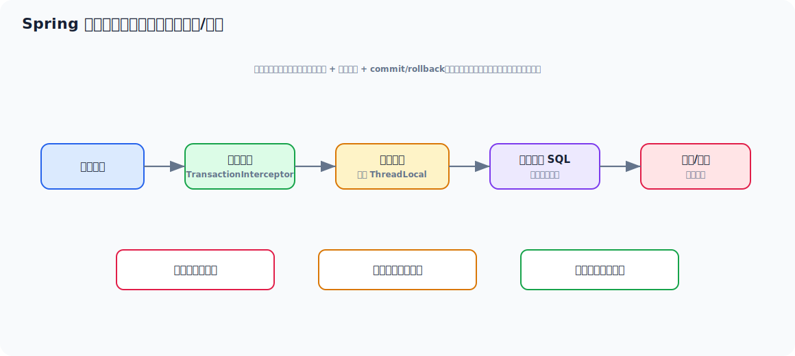

事务本身不是魔法，它只是：

- 定义一段业务边界
- 在边界开始前准备资源
- 在边界结束后提交或回滚

### 9.1 `@Transactional` 的执行主线

```text
外部调用代理方法
  -> TransactionInterceptor 拦截
  -> 读取事务属性
  -> 事务管理器开启或加入事务
  -> 获取连接并绑定到当前线程
  -> 执行业务逻辑
  -> 正常则提交，异常则按规则回滚
  -> 清理 ThreadLocal 资源
```

### 9.2 为什么同一事务内多个 SQL 能共用一个连接

关键就在于：

- 事务管理器拿到连接后
- 通过 `TransactionSynchronizationManager`
- 绑定到当前线程

后续同线程内 MyBatis/JDBC 再取连接时，会优先复用这个已绑定连接。

所以事务底层本质是：

**代理 + 连接绑定 + 提交回滚策略**

### 9.3 传播行为不是“新开事务”的同义词

| 传播行为 | 含义 |
| --- | --- |
| `REQUIRED` | 有事务就加入，没有就新建 |
| `REQUIRES_NEW` | 挂起当前事务，自己新开 |
| `SUPPORTS` | 有事务就加入，没有就非事务执行 |
| `MANDATORY` | 必须在已有事务中执行 |
| `NESTED` | 当前事务内建立嵌套保存点 |

最常考的是 `REQUIRED` 和 `REQUIRES_NEW` 的区别。

### 9.4 回滚规则为什么经常答错

Spring 默认：

- 对 `RuntimeException` 和 `Error` 回滚
- 对受检异常默认不回滚

所以如果你抛了 `Exception`，又没配置 `rollbackFor = Exception.class`，事务可能不会回滚。

### 9.5 事务失效的高频原因

1. 自调用
2. 方法不是 `public`
3. 异常被 catch 吞掉
4. 抛出的异常类型不满足默认回滚规则
5. 多线程、异步线程切换
6. 数据源或事务管理器没配对

### 9.6 一个实用示例：订单创建

```java
@Service
public class OrderService {

    @Transactional(rollbackFor = Exception.class)
    public void createOrder(OrderDTO dto) throws Exception {
        orderMapper.insertOrder(dto);
        stockMapper.deductStock(dto.getSkuId(), dto.getCount());

        if (dto.getCount() > 10) {
            throw new Exception("mock checked exception");
        }
    }
}
```

这个例子可以顺手讲出三件事：

1. 为什么要显式 `rollbackFor`
2. 为什么两个 Mapper 操作能落在同一事务里
3. 为什么不能在这里随手开异步线程继续写库

---

## 十、Spring MVC 请求处理链

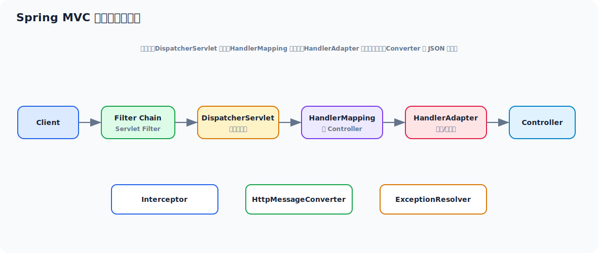

Spring MVC 的核心不是 Controller，而是 `DispatcherServlet`。

它像一个总调度器，负责：

- 找到谁来处理请求
- 用什么方式调用处理器
- 参数怎么绑定
- 返回结果怎么渲染
- 出异常怎么兜底

### 10.1 一次请求的主链路

```text
HTTP Request
  -> DispatcherServlet
  -> HandlerMapping 找到 Handler
  -> HandlerAdapter 调用 Handler
  -> 参数解析
  -> 执行 Controller 方法
  -> 返回值处理
  -> 视图渲染 / JSON 输出
```

### 10.2 为什么需要 HandlerAdapter

因为 Spring MVC 不是强耦合“只能调 Controller 的某种固定接口”，它通过适配器把不同风格的 Handler 统一调用。

这体现的是典型的 **适配器模式**。

### 10.3 拦截器和过滤器的区别

| 对比项 | Filter | Interceptor |
| --- | --- | --- |
| 属于谁 | Servlet 规范 | Spring MVC |
| 生效阶段 | 更靠前 | 更接近 Controller |
| 能否拿到 Spring Bean | 不天然方便 | 可以 |
| 典型用途 | 编码、跨域、底层请求包装 | 登录校验、权限、链路埋点 |

工程上常见分工：

- Filter 处理协议级、容器级问题
- Interceptor 处理业务入口级问题

---

## 十一、参数绑定、返回值处理与异常机制

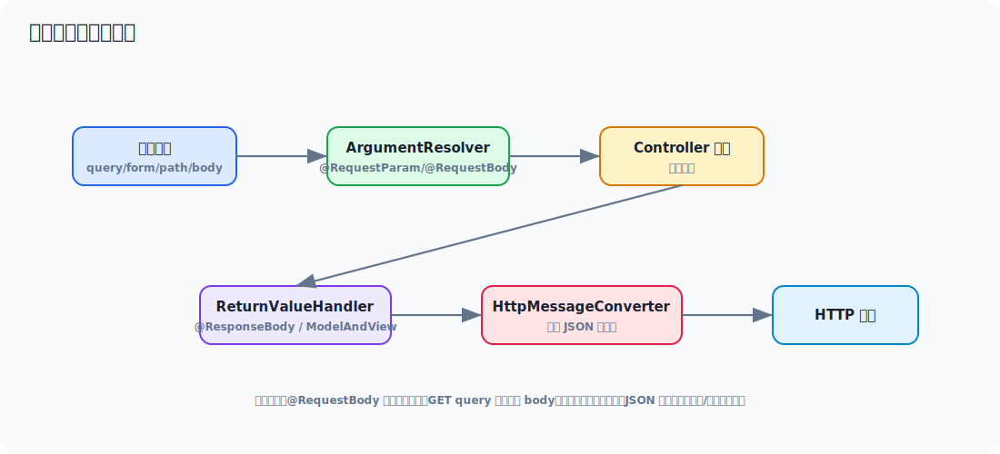

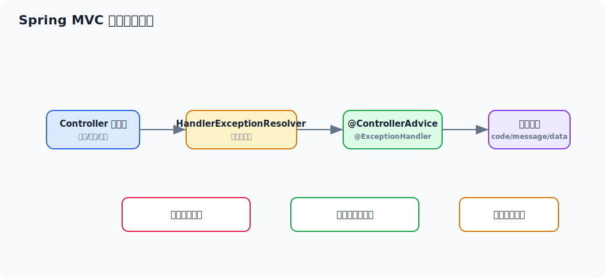

### 11.1 参数为什么能自动绑定

因为 Spring MVC 在真正调用 Controller 方法前，会通过一组 `HandlerMethodArgumentResolver` 解析参数。

比如：

- `@RequestParam`
- `@PathVariable`
- `@RequestBody`
- `HttpServletRequest`
- `Principal`

本质上都是不同的参数解析器在工作。

### 11.2 `@RequestBody` 为什么需要消息转换器

因为 HTTP body 是字节流，不是 Java 对象。  
Spring MVC 需要通过 `HttpMessageConverter` 把：

- JSON -> Java 对象
- Java 对象 -> JSON

这也是为什么 Jackson 配置经常影响接口输入输出格式。

### 11.3 返回值为什么能自动变成 JSON

如果方法上有 `@ResponseBody` 或使用 `@RestController`，Spring 会走返回值处理器，再配合消息转换器把对象序列化成 JSON。

### 11.4 全局异常处理为什么推荐 `@ControllerAdvice`

因为它能把：

- 参数校验异常
- 业务异常
- 系统异常

统一收口，避免每个 Controller 自己写 `try-catch`。

一个常见实践示例：

```java
@RestControllerAdvice
public class GlobalExceptionHandler {

    @ExceptionHandler(BusinessException.class)
    public Result<?> handleBusiness(BusinessException e) {
        return Result.error(e.getCode(), e.getMessage());
    }

    @ExceptionHandler(Exception.class)
    public Result<?> handleException(Exception e) {
        return Result.error("500", "系统异常");
    }
}
```

这不只是“统一返回格式”，更重要的是统一异常边界和日志策略。

---

## 十二、MyBatis 核心执行链

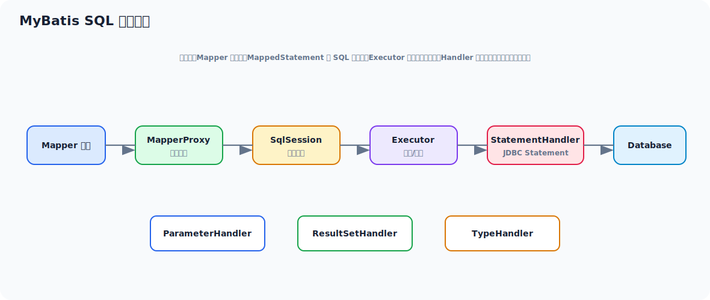

MyBatis 常被误解成“Mapper 接口 + XML”，但底层主线其实很清晰：

```text
Mapper 接口
  -> MapperProxy
  -> SqlSession
  -> Executor
  -> StatementHandler
  -> JDBC
  -> Database
```

### 12.1 Mapper 为什么能直接调用

因为 Spring/MyBatis 最后注入到容器里的并不是你写的接口本身，而是一个动态代理对象。

这个代理会根据：

- 接口名
- 方法名

定位到对应的 `MappedStatement`，再交给 `SqlSession` 执行。

### 12.2 MyBatis 核心对象怎么分工

| 对象 | 职责 |
| --- | --- |
| `SqlSession` | 对外执行入口 |
| `Executor` | 调度执行、事务配合、一级缓存 |
| `StatementHandler` | 准备和执行 JDBC Statement |
| `ParameterHandler` | 设置参数 |
| `ResultSetHandler` | 结果集映射 |
| `TypeHandler` | Java 类型和 JDBC 类型转换 |

### 12.3 一次查询发生了什么

1. 调用 Mapper 方法。
2. 代理定位到 `MappedStatement`。
3. `SqlSession` 转交给 `Executor`。
4. `Executor` 创建或委派 `StatementHandler`。
5. `ParameterHandler` 给 `PreparedStatement` 设值。
6. JDBC 执行 SQL。
7. `ResultSetHandler` 把结果集映射成对象。
8. 返回调用方。

### 12.4 `#{} 和 ${}` 的根本区别

| 写法 | 本质 | 风险 |
| --- | --- | --- |
| `#{}` | 预编译占位符，走参数绑定 | 安全，推荐 |
| `${}` | 字符串直接拼接 | 有 SQL 注入风险 |

面试里不要只说“一个安全一个不安全”，最好补一句：

> `#{}` 最终会走 `PreparedStatement` 参数绑定；`${}` 是在 SQL 解析阶段直接文本替换，所以表名、排序字段等动态片段才不得不偶尔用 `${}`，但必须配合白名单。

---

## 十三、MyBatis 插件、缓存与 Spring 整合

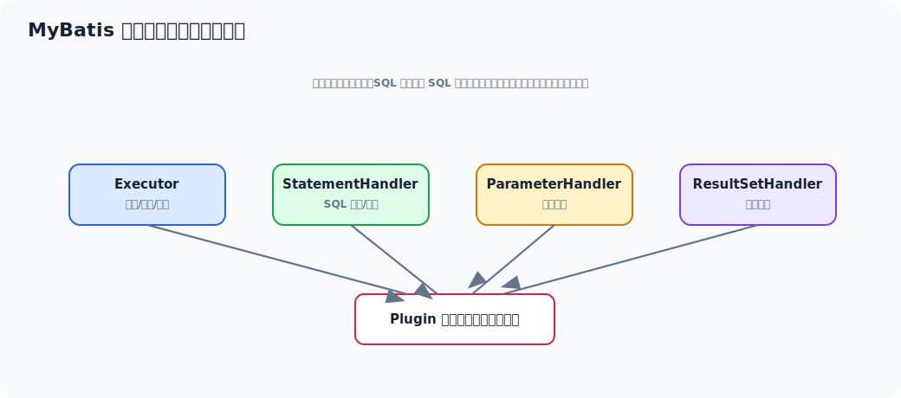

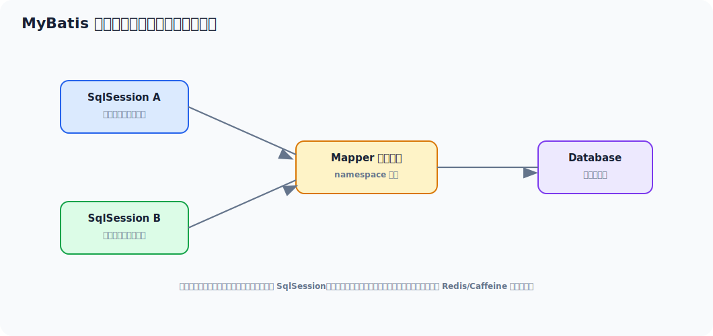

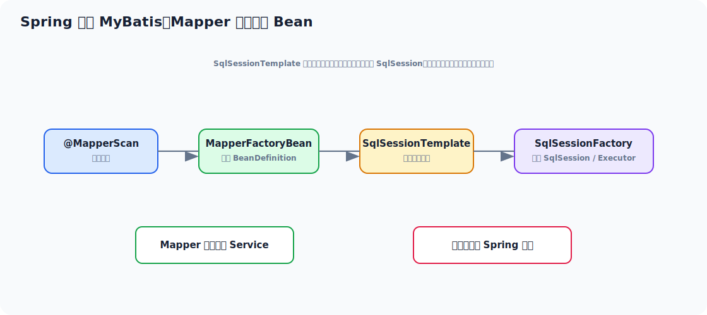

### 13.1 MyBatis 插件机制拦截谁

MyBatis 插件不是想拦谁就拦谁，它主要围绕四大对象：

1. `Executor`
2. `StatementHandler`
3. `ParameterHandler`
4. `ResultSetHandler`

本质上还是代理模式。

典型场景：

- 分页
- SQL 改写
- 审计字段填充
- 多租户条件追加

### 13.2 一级缓存和二级缓存

| 缓存 | 作用域 | 默认 | 注意点 |
| --- | --- | --- | --- |
| 一级缓存 | `SqlSession` 级别 | 默认开启 | 同会话有效，更新会清空 |
| 二级缓存 | namespace 级别 | 默认关闭/需配置 | 脏数据风险，线上慎用 |

工程上大多数业务系统：

- 一级缓存自然使用
- 二级缓存非常谨慎，很多团队直接不用

因为：

- 更新一致性复杂
- 分布式场景更难控
- Redis 等外部缓存往往更透明

### 13.3 Spring 怎么把 Mapper 变成 Bean

核心过程通常是：

1. 扫描 Mapper 接口。
2. 为每个接口注册一个 `MapperFactoryBean`。
3. 创建 `SqlSessionFactory`。
4. `MapperFactoryBean#getObject()` 生成 Mapper 代理。
5. 代理对象被注册进 Spring 容器。

所以你注入的：

```java
@Resource
private UserMapper userMapper;
```

本质上拿到的是一个 Mapper 动态代理 Bean。

### 13.4 Spring 事务和 MyBatis 为什么能协同

因为 Spring 整合 MyBatis 时，会让 MyBatis 获取连接这件事纳入 Spring 事务体系。

只要：

- 走的是 Spring 管理的 `SqlSessionTemplate`
- 数据源和事务管理器配套

MyBatis 执行 SQL 时就能拿到当前事务线程绑定的同一个连接。

---

## 十四、SSM 常见高频坑点

### 14.1 生命周期相关

1. 在构造方法里使用还没注入完成的依赖
2. 过早在初始化阶段执行重逻辑
3. 原型 Bean 误以为会被容器完整销毁

### 14.2 IoC 相关

1. 多实现类注入冲突
2. 循环依赖理解不清
3. 滥用字段注入导致依赖关系不透明

### 14.3 AOP/事务相关

1. 自调用导致事务失效
2. 异常被吞导致不回滚
3. 异步线程导致事务上下文丢失
4. 非 public 方法事务失效
5. 在 `final` 方法上期待代理增强

### 14.4 MVC 相关

1. `@RequestBody` 和 `@RequestParam` 混用理解不清
2. 参数校验异常没有统一收口
3. 拦截器里做过重逻辑导致接口整体变慢

### 14.5 MyBatis 相关

1. `${}` 拼接带来注入风险
2. N+1 查询
3. 大对象映射和无索引 SQL 导致慢查询
4. 二级缓存脏数据
5. 插件链太重影响 SQL 执行性能

---

## 十五、线上排查思路

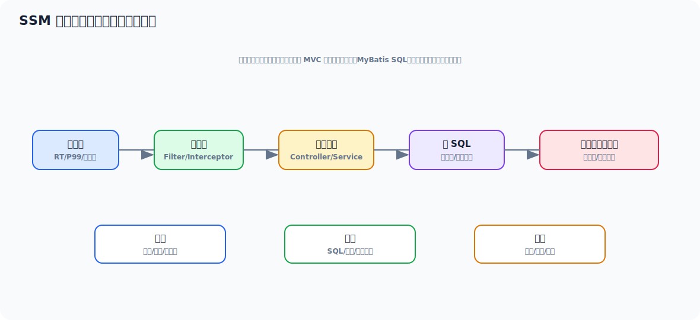

SSM 的线上问题，最怕只盯着某一个点看。  
正确思路应该是把整个请求链串起来：

```text
请求入口
  -> MVC 映射是否异常
  -> 拦截器/AOP 是否变重
  -> 事务是否拉长
  -> MyBatis SQL 是否慢
  -> 数据库是否锁等待
  -> 连接池是否耗尽
```

### 15.1 慢接口排查

建议从上往下看：

1. 网关/接口监控确认慢点范围
2. Controller 到 Service 的日志和 trace
3. 是否有 AOP、拦截器、参数解析异常放大
4. 是否存在大事务
5. SQL 是否慢、是否锁等待
6. 线程池和连接池是否阻塞

### 15.2 事务问题排查

重点看：

- 是否真的进了代理
- 是否有自调用
- 异常是否被吞
- 是否跨线程
- 传播行为是否符合预期

### 15.3 MyBatis 问题排查

重点看：

- SQL 日志
- 慢 SQL
- 参数绑定是否异常
- 批量操作是否真的批量
- 插件是否改写了 SQL

### 15.4 一个很实用的定位习惯

每次排查都尽量回答这四个问题：

1. 卡在哪一层？
2. 这一层依赖哪个下游？
3. 当前症状是 CPU 高、锁等待、连接池满、还是响应慢？
4. 是代码逻辑问题，还是框架行为问题，还是数据库资源问题？

---

## 十六、面试高频回答模板

### 16.1 说说 Spring Bean 生命周期

> Spring Bean 生命周期如果细讲，可以分成实例化、属性填充、Aware 回调、初始化前置处理、初始化方法、初始化后置处理、使用和销毁几个阶段。依赖注入发生在属性填充阶段，AOP 代理通常发生在初始化后的 BeanPostProcessor 阶段，所以最终放入容器、注入给其他 Bean 的可能已经是代理对象而不是原始对象。

### 16.2 说说 IoC

> IoC 不只是把对象创建交给容器，而是把对象依赖关系、生命周期和扩展织入能力统一交给容器管理。Spring 先用 BeanDefinition 描述 Bean 元数据，再按生命周期创建对象，并在创建过程中通过后处理器接入 AOP、事务等基础设施。

### 16.3 说说 AOP

> Spring AOP 本质是基于代理和拦截器链实现的方法增强。外部调用先进入代理对象，代理根据方法匹配到 Advisor，再形成拦截器链执行，最后调用目标方法。常见应用包括事务、日志、权限和埋点。典型问题是自调用失效，因为内部 `this` 调用绕过了代理。

### 16.4 说说 Spring 如何解决循环依赖

> Spring 主要通过单例 Bean 的三级缓存解决 setter/字段注入的循环依赖。实例化后先通过 `ObjectFactory` 提前曝光早期引用，其他 Bean 依赖它时可以先拿到这个引用。三级缓存存在的关键价值是给 AOP 留出空间，允许提前曝光的是代理对象而不是简单原始对象。构造器循环依赖由于对象尚未实例化，无法提前曝光，所以解决不了。

### 16.5 说说事务底层原理

> 声明式事务本质是 AOP。代理拦截目标方法后，`TransactionInterceptor` 根据事务属性决定开启或加入事务，通过事务管理器获取数据库连接并绑定到当前线程。业务方法中的多个数据库操作复用同一连接，方法正常结束时提交，出现满足回滚规则的异常时回滚。常见失效点包括自调用、异常被吞和跨线程执行。

### 16.6 说说 MyBatis 执行流程

> Mapper 接口实际是动态代理对象。调用 Mapper 方法时，代理会定位对应的 `MappedStatement`，交给 `SqlSession` 和 `Executor` 执行，再由 `StatementHandler`、`ParameterHandler`、`ResultSetHandler` 完成参数绑定、JDBC 执行和结果映射。Spring 整合 MyBatis 后，Mapper 会被注册为 Bean，并通过 `SqlSessionTemplate` 接入 Spring 事务体系。

---

## 十七、建议复习路线

如果你准备“复习 + 钻研”一起做，我建议按这个顺序：

1. **先吃透 Spring 容器**
   - `refresh()` 主线
   - `BeanDefinition`
   - 生命周期
   - 依赖注入
   - 循环依赖

2. **再吃透 AOP 和事务**
   - 代理模式
   - Advisor / Interceptor Chain
   - `@Transactional`
   - 自调用、传播、回滚规则

3. **然后看 Spring MVC**
   - `DispatcherServlet`
   - HandlerMapping / HandlerAdapter
   - 参数绑定
   - 全局异常处理

4. **最后看 MyBatis**
   - Mapper 代理
   - SQL 执行链
   - 插件
   - 缓存
   - 与 Spring 事务整合

### 17.1 适合你的深挖方法

你现在四年经验，最划算的方式不是全源码硬啃，而是：

1. 先把这份文档的主线背熟。
2. 每个主题只盯一个核心类往下看源码。
3. 每学完一块，自己写一段最小 demo 验证。
4. 最后把“原理 + 工程场景 + 面试表达”串成自己的答案。

建议你优先跟这些类：

- Spring：`AbstractApplicationContext`、`DefaultListableBeanFactory`、`AbstractAutowireCapableBeanFactory`
- AOP：`AnnotationAwareAspectJAutoProxyCreator`
- 事务：`TransactionInterceptor`、`DataSourceTransactionManager`
- MVC：`DispatcherServlet`
- MyBatis：`MapperProxy`、`DefaultSqlSession`、`CachingExecutor`

### 17.2 最后的复习建议

SSM 这套东西，真正拉开差距的不是会不会写注解，而是能不能把下面这句话讲顺：

> Spring 先通过 BeanDefinition 管理对象元数据，再按生命周期创建 Bean；AOP 在后处理器阶段把目标对象包装成代理；事务本质是代理拦截后做连接绑定与提交回滚；Spring MVC 用 DispatcherServlet 协调请求分发、参数绑定和结果处理；MyBatis 则通过 Mapper 动态代理把接口调用转成 SQL 执行链。几条链路合在一起，才构成我们平时写业务时看到的 SSM 运行模型。

如果你能把这句话背后的每一段都展开到工程细节，SSM 这块就已经不只是“会用”，而是有相当扎实的底层理解了。
