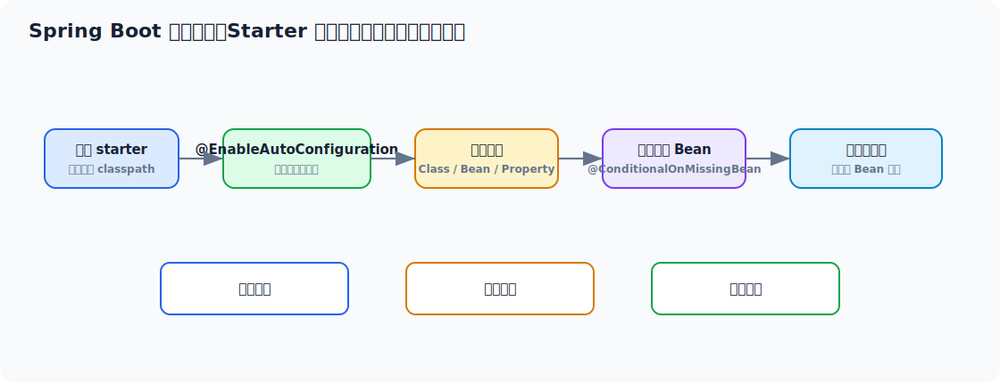

# Spring Boot 面试实用学习文档

> 适合 3-5 年 Java 工程师面试冲刺。目标不是只会 `@SpringBootApplication` 和 `starter`，而是能把自动配置、启动流程、配置体系、内嵌容器、Actuator、打包发布和生产实践讲清楚。



## 先看一个直观示例：用 Starter 快速暴露一个订单接口

Spring Boot 最直观的作用是：**把 Web 容器、MVC、JSON 序列化、配置绑定、日志等基础设施自动装配好，让你专注写业务入口**。

```java
@SpringBootApplication
public class OrderApplication {
    public static void main(String[] args) {
        SpringApplication.run(OrderApplication.class, args);
    }
}
```

```java
@RestController
@RequestMapping("/orders")
public class OrderController {

    private final OrderService orderService;

    public OrderController(OrderService orderService) {
        this.orderService = orderService;
    }

    @PostMapping
    public OrderVO create(@RequestBody CreateOrderRequest request) {
        return orderService.create(request);
    }
}
```

```java
@ConfigurationProperties(prefix = "order")
public class OrderProperties {
    private Integer payTimeoutSeconds = 900;
    private Boolean stockCheckEnabled = true;
}
```

```yaml
server:
  port: 8080

order:
  pay-timeout-seconds: 900
  stock-check-enabled: true

management:
  endpoints:
    web:
      exposure:
        include: health,info,metrics
```

你真正写的业务代码很少，但背后 Spring Boot 已经帮你做了：

1. 启动内嵌 Tomcat。
2. 自动配置 Spring MVC。
3. 自动配置 Jackson，把 JSON 和 Java 对象互转。
4. 绑定 `application.yml` 到配置对象。
5. 暴露 Actuator 健康检查和指标端点。

所以 Spring Boot 面试不要只说“简化配置”，它真正的价值是把应用启动、自动装配、配置管理和生产可观测性做成了一套工程化标准。

## 目录

- [一、Spring Boot 面试主线](#一spring-boot-面试主线)
- [二、Spring Boot 到底解决了什么](#二spring-boot-到底解决了什么)
- [三、启动流程主线](#三启动流程主线)
- [四、自动配置原理](#四自动配置原理)
- [五、配置体系与优先级](#五配置体系与优先级)
- [六、内嵌容器与 Web 启动机制](#六内嵌容器与-web-启动机制)
- [七、Starter、条件装配与扩展点](#七starter条件装配与扩展点)
- [八、生产可用性：Actuator、日志、优雅停机](#八生产可用性actuator日志优雅停机)
- [九、高级用法与工程实践](#九高级用法与工程实践)
- [十、常见线上问题与排查](#十常见线上问题与排查)
- [十一、面试高频回答模板](#十一面试高频回答模板)

---

## 一、Spring Boot 面试主线

Spring Boot 的高频追问链路通常是：

```text
Spring Boot 为什么好用
  -> 自动配置怎么实现
  -> 启动流程发生了什么
  -> starter 原理是什么
  -> application.yml 优先级怎么定
  -> 内嵌 Tomcat 怎么启动
  -> Actuator 做什么
  -> 生产上怎么做配置、日志、健康检查、优雅停机
```

面试官想听到的不是“少写配置”，而是你理解它是如何在 Spring 之上做工程化封装的。

---

## 二、Spring Boot 到底解决了什么

Spring Boot 的核心价值不是发明了新容器，而是围绕 Spring 做了几件工程上很值钱的事：

1. **自动配置**
2. **约定优于配置**
3. **统一依赖管理**
4. **内嵌容器**
5. **外部化配置**
6. **生产可观测性支持**

一句话总结：

> Spring Boot 不是替代 Spring，而是在 Spring 的基础上，解决了项目初始化、依赖组合、自动装配、运行部署和生产管理的一整套工程效率问题。

---

## 三、启动流程主线

### 3.1 启动入口

几乎所有 Boot 应用的入口都是：

```java
SpringApplication.run(Application.class, args);
```

### 3.2 启动核心链路

从高层看，可以理解成：

```text
推断应用类型
  -> 准备环境 Environment
  -> 创建 ApplicationContext
  -> 加载 BeanDefinition
  -> 刷新容器 refresh()
  -> 执行 runners
  -> 发布启动完成事件
```

### 3.3 Boot 启动和 Spring refresh 的关系

Spring Boot 不是替代 `refresh()`，而是在它前后补了一层应用级启动编排。

所以你可以这么理解：

- Spring 解决“容器如何工作”
- Spring Boot 解决“应用如何方便启动、配置和运行”

### 3.4 启动类上的几个关键注解

`@SpringBootApplication` 本质是组合注解，常见包含：

- `@SpringBootConfiguration`
- `@EnableAutoConfiguration`
- `@ComponentScan`

其中最关键的是：

- `@EnableAutoConfiguration`

---

## 四、自动配置原理

### 4.1 自动配置不是“魔法”

Spring Boot 自动配置的本质是：

1. 框架预置一组配置类
2. 在满足某些条件时装配这些配置类
3. 没满足条件就跳过

### 4.2 条件装配是核心

常见条件注解：

- `@ConditionalOnClass`
- `@ConditionalOnMissingBean`
- `@ConditionalOnProperty`
- `@ConditionalOnBean`
- `@ConditionalOnWebApplication`

你要有这个意识：

> 自动配置不是无脑生效，而是“按 classpath、配置项、上下文 Bean、应用类型等条件动态决策是否装配”。

### 4.3 为什么引一个 starter 就能用

因为 starter 通常带来两层东西：

1. 依赖
2. 自动配置类

比如引了 Redis starter：

- classpath 上有 Redis 客户端
- 条件满足
- 对应自动配置类生效
- 相关 Bean 自动注册

### 4.4 `@ConditionalOnMissingBean` 很关键

它让 Boot 能做到：

- 框架先给一套默认实现
- 用户自己声明 Bean 时再覆盖

这也是“默认可用，但又允许自定义”的核心设计。

### 4.5 面试里怎么说自动配置

> Spring Boot 自动配置的核心不是扫描所有类，而是通过 `@EnableAutoConfiguration` 导入一组预定义配置类，再配合 `@ConditionalOnClass`、`@ConditionalOnMissingBean`、`@ConditionalOnProperty` 等条件注解，按当前 classpath、配置项和上下文状态决定哪些配置生效。starter 只是依赖入口，真正关键是背后的 auto-configuration。

---

## 五、配置体系与优先级

### 5.1 外部化配置为什么重要

因为同一套代码通常会跑在：

- 本地开发
- 测试环境
- 预发环境
- 生产环境

配置如果写死，部署和变更会非常痛苦。

### 5.2 常见配置来源

- `application.yml` / `application.properties`
- 环境变量
- JVM 参数
- 命令行参数
- 外部配置文件
- 配置中心

### 5.3 优先级要点

面试里通常不需要把所有优先级背成流水账，但要知道：

1. 命令行参数优先级通常很高
2. 外部配置通常可以覆盖包内配置
3. 环境变量和系统属性常用于部署注入
4. 同名配置会按优先级覆盖

### 5.4 `@ConfigurationProperties` 比 `@Value` 更适合什么

更适合：

- 成组配置
- 复杂对象绑定
- 统一校验
- 更清晰的配置建模

示例：

```java
@ConfigurationProperties(prefix = "order.pay")
public class PayProperties {
    private Integer timeout;
    private Integer retryTimes;
}
```

### 5.5 profile 的工程意义

不是“为了切环境”这么简单，而是：

- 把环境差异从代码中抽离
- 让配置和部署边界更清楚

---

## 六、内嵌容器与 Web 启动机制

### 6.1 为什么 Boot 应用不用单独装 Tomcat

因为 Boot 支持内嵌容器：

- Tomcat
- Jetty
- Undertow

应用启动时会把容器作为库启动，而不是传统 WAR 包部署到外部容器。

### 6.2 启动本质

对于 Web 应用，Boot 会：

1. 创建 `ServletWebServerApplicationContext`
2. 初始化 WebServer
3. 注册 Servlet / Filter / Listener
4. 启动内嵌容器

### 6.3 这种模式的优势

1. 部署简单
2. 环境一致
3. 更适合容器化
4. 运维边界更清晰

### 6.4 什么时候还会用 WAR

有些传统公司仍然会：

- 部署到统一外部容器
- 遵循老平台规范

但现代微服务和容器化场景里，JAR + 内嵌容器更主流。

---

## 七、Starter、条件装配与扩展点

### 7.1 Starter 的本质

starter 不是功能本身，而是：

- 一组依赖坐标的聚合入口

比如：

- `spring-boot-starter-web`
- `spring-boot-starter-data-redis`

### 7.2 自定义 starter 怎么理解

通常会拆成两部分：

1. `xxx-spring-boot-starter`
2. `xxx-spring-boot-autoconfigure`

其中真正的核心是：

- 自动配置模块

### 7.3 常见扩展点

| 扩展点 | 用途 |
| --- | --- |
| `EnvironmentPostProcessor` | 启动前调整环境 |
| `ApplicationContextInitializer` | 容器刷新前自定义上下文 |
| `ApplicationListener` | 监听启动事件 |
| `BeanFactoryPostProcessor` | 改 BeanDefinition |
| `BeanPostProcessor` | 改 Bean 实例 |
| `CommandLineRunner` / `ApplicationRunner` | 应用启动后执行逻辑 |

### 7.4 什么时候写 starter

适合：

- 公司内部基础能力平台化
- 重复接入逻辑统一收敛
- SDK + 自动配置一体化交付

比如：

- 统一日志追踪 starter
- 公司级鉴权 starter
- 统一幂等/审计 starter

---

## 八、生产可用性：Actuator、日志、优雅停机

### 8.1 Actuator 的价值

它不是“监控插件”，而是生产可运维性的基础设施。

常见能力：

- 健康检查
- 指标暴露
- 线程、堆、环境信息
- 自定义 endpoint

### 8.2 健康检查不要只停留在 `/health`

你要知道健康检查至少分两类：

1. 存活性
2. 就绪性

例如：

- 进程活着不代表能接流量
- 依赖数据库、MQ、注册中心异常时，就绪性可能失败

### 8.3 优雅停机为什么重要

如果应用直接被杀死，可能会出现：

- 正在处理的请求中断
- 事务未完成
- MQ 消费状态不一致

优雅停机的目标是：

1. 先摘流量
2. 停止接收新请求
3. 等在途请求处理完
4. 再真正退出

### 8.4 日志要点

面试里更有含金量的表达：

- 日志分级
- traceId 透传
- 异常日志和业务日志分层
- 不在高频热路径打印大对象

---

## 九、高级用法与工程实践

### 9.1 配置绑定校验

配合 `@Validated` 可以在启动阶段发现配置错误，而不是运行时报错。

### 9.2 条件化 Bean 设计

适合做：

- 多实现切换
- 灰度功能开关
- 环境差异装配

### 9.3 多环境配置管理

工程重点不是 profile 本身，而是：

- 避免敏感配置进仓库
- 避免不同环境配置漂移
- 关键开关变更可审计

### 9.4 AOT / Native Image

面试中如果提到高级点，可以知道：

- Boot 新版本支持更好的 AOT 和 Native 方向
- 核心目标是更快启动、更低内存
- 代价是反射、动态代理、资源配置更敏感

你不一定实际用过，但知道它适合：

- Serverless
- 冷启动敏感场景

### 9.5 打包与分层镜像

现代部署常见重点：

- fat jar
- Docker 分层
- 减少镜像重建成本

---

## 十、常见线上问题与排查

### 10.1 启动变慢怎么查

看这些方向：

1. 自动配置太多
2. 启动时做了重逻辑
3. 外部依赖探测慢
4. Bean 初始化耗时大

### 10.2 内存高怎么查

分几层看：

1. 堆对象多
2. 类加载多
3. 缓存/连接池配置过大
4. 日志缓冲或线程数过多

### 10.3 接口无法访问怎么查

1. 端口和 profile 是否正确
2. 上下文路径是否变了
3. 容器是否启动完成
4. 健康检查是否已就绪

### 10.4 自动配置不生效怎么查

重点想：

1. classpath 上是否有依赖
2. 条件注解是否满足
3. 是否被用户自定义 Bean 覆盖
4. 配置项是否打开

---

## 十一、面试高频回答模板

### 11.1 Spring Boot 为什么好用

> Spring Boot 的核心价值不是简化了 XML，而是在 Spring 之上提供了自动配置、starter 依赖管理、内嵌容器、外部化配置和生产可观测性支持，解决了应用从开发、启动到部署运维的一整套工程效率问题。

### 11.2 自动配置原理

> 自动配置本质上是 Spring Boot 在启动时导入一组预定义配置类，再通过 `@ConditionalOnClass`、`@ConditionalOnMissingBean`、`@ConditionalOnProperty` 等条件注解决定哪些配置生效。starter 只是依赖入口，真正关键是 auto-configuration。

### 11.3 starter 是什么

> starter 是一组依赖和自动配置的统一入口，帮我们快速接入某类能力。它本身不一定实现功能，但会把需要的依赖和默认装配方式打包好。

### 11.4 Boot 和 Spring 的关系

> Spring 解决的是容器和框架能力本身，Spring Boot 解决的是基于 Spring 的应用如何更容易构建、配置、启动和上线。

### 11.5 内嵌容器的价值

> 内嵌容器让应用以可执行 JAR 的方式运行，不再强依赖外部 Tomcat，部署更简单，环境更一致，也更适合容器化和微服务场景。

---

## 最后建议

Spring Boot 这块，四年经验想讲出层次，重点不是背注解，而是把这条线讲顺：

> 它怎么启动，为什么能自动装配，配置怎么注入，内嵌容器怎么工作，生产上怎么做健康检查、日志和优雅停机。

这条主线讲顺了，Boot 基本就站住了。
