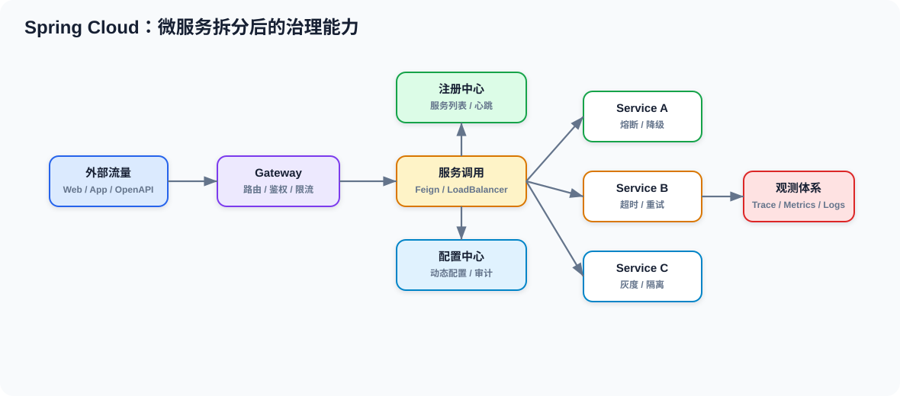

# Spring Cloud 面试实用学习文档

> 适合 3-5 年 Java 工程师面试冲刺。目标不是背组件名，而是把微服务拆分后带来的配置、注册发现、调用、熔断、网关、链路治理和部署治理问题讲清楚。



## 先看一个直观示例：订单服务调用库存服务

Spring Cloud 最直观的作用是：**服务拆开之后，仍然能通过注册发现、声明式调用、负载均衡、超时和降级把远程服务当成工程上可治理的依赖**。

订单服务里不写死库存服务地址，而是声明一个 Feign 客户端：

```java
@FeignClient(
        name = "stock-service",
        path = "/stocks",
        fallbackFactory = StockClientFallbackFactory.class
)
public interface StockClient {

    @PostMapping("/deduct")
    DeductResult deduct(@RequestBody DeductStockRequest request);
}
```

业务服务调用时像调本地接口：

```java
@Service
public class OrderService {

    private final StockClient stockClient;
    private final OrderMapper orderMapper;

    public OrderService(StockClient stockClient, OrderMapper orderMapper) {
        this.stockClient = stockClient;
        this.orderMapper = orderMapper;
    }

    public Long createOrder(CreateOrderRequest request) {
        DeductResult result = stockClient.deduct(new DeductStockRequest(
                request.getSkuId(),
                request.getCount()
        ));
        if (!result.success()) {
            throw new BusinessException("库存不足或库存服务不可用");
        }
        Order order = Order.create(request);
        orderMapper.insert(order);
        return order.getId();
    }
}
```

降级兜底：

```java
@Component
public class StockClientFallbackFactory implements FallbackFactory<StockClient> {
    @Override
    public StockClient create(Throwable cause) {
        return request -> new DeductResult(false, "STOCK_SERVICE_UNAVAILABLE");
    }
}
```

配置层面再控制超时、注册发现和网关入口：

```yaml
spring:
  application:
    name: order-service
  cloud:
    gateway:
      routes:
        - id: order-route
          uri: lb://order-service
          predicates:
            - Path=/api/orders/**

feign:
  client:
    config:
      stock-service:
        connectTimeout: 1000
        readTimeout: 2000
```

这个例子里 Spring Cloud 体现了几件事：

1. `stock-service` 地址来自注册中心，不写死 IP。
2. Feign 把 HTTP 调用封装成接口。
3. LoadBalancer 从多个库存实例里选一个。
4. 超时和降级避免库存服务拖垮订单服务。
5. Gateway 可以统一入口、鉴权、限流和路由。

## 目录

- [一、Spring Cloud 面试主线](#一spring-cloud-面试主线)
- [二、Spring Cloud 到底解决什么问题](#二spring-cloud-到底解决什么问题)
- [三、核心组件版图](#三核心组件版图)
- [四、服务注册与发现原理](#四服务注册与发现原理)
- [五、配置中心与动态配置](#五配置中心与动态配置)
- [六、服务调用、负载均衡与超时重试](#六服务调用负载均衡与超时重试)
- [七、网关、鉴权与灰度治理](#七网关鉴权与灰度治理)
- [八、熔断、限流、降级与隔离](#八熔断限流降级与隔离)
- [九、高级用法与工程实践](#九高级用法与工程实践)
- [十、常见线上问题与排查](#十常见线上问题与排查)
- [十一、面试高频回答模板](#十一面试高频回答模板)

---

## 一、Spring Cloud 面试主线

面试常见追问链路：

```text
为什么要上 Spring Cloud
  -> 它解决了哪些微服务问题
  -> 服务注册发现怎么做
  -> 配置中心为什么要有
  -> Feign / LoadBalancer 怎么工作
  -> 网关和鉴权怎么设计
  -> 熔断限流降级怎么做
  -> 链路追踪、灰度发布、配置刷新怎么做
```

要注意一件事：  
**Spring Cloud 更像一套微服务基础设施合集，不是单个中间件。**

---

## 二、Spring Cloud 到底解决什么问题

单体拆成微服务后，业务代码之外会冒出一堆基础问题：

1. 服务地址怎么找
2. 配置怎么统一管理
3. 服务间调用怎么封装
4. 下游失败时怎么自保
5. 外部流量怎么统一接入
6. 灰度、路由、限流怎么做
7. 链路、日志、指标怎么串起来

Spring Cloud 解决的不是“写业务”，而是这些分布式系统里的通用配套问题。

---

## 三、核心组件版图

现代 Spring Cloud 讨论时，建议按能力而不是按品牌来回答。

| 能力 | 常见组件 |
| --- | --- |
| 注册发现 | Eureka、Nacos、Consul、Zookeeper |
| 配置中心 | Config、Nacos Config |
| 服务调用 | OpenFeign |
| 客户端负载均衡 | Spring Cloud LoadBalancer |
| 熔断 | CircuitBreaker + Resilience4j |
| 网关 | Spring Cloud Gateway |
| 消息总线 | Bus / Stream |
| 分布式链路 | Micrometer Tracing / Zipkin 等 |

面试里一个很加分的点是：

> 现在很多公司讲 Spring Cloud，实际已经不是早期 Netflix 全家桶那套了。Ribbon、Hystrix 在很多新项目里已经被替换或弱化，更常见的是 LoadBalancer、Resilience4j、Gateway，再结合 Nacos 或 Consul 一类注册配置中心。

---

## 四、服务注册与发现原理

### 4.1 为什么不能写死地址

因为微服务实例通常会：

- 扩缩容
- 重启漂移
- 多机房部署

写死 IP 会让调用方和部署强耦合。

### 4.2 注册发现的本质

就是把这件事平台化：

1. 服务实例启动后向注册中心注册
2. 调用方从注册中心拿服务列表
3. 本地负载均衡选一个实例发请求

### 4.3 服务发现常见模式

#### 客户端发现

调用方自己拿服务列表再选实例。  
Spring Cloud 里最典型就是这个模式。

#### 服务端发现

由网关或代理层做发现与转发。

### 4.4 注册中心为什么会有心跳

因为注册中心要知道：

- 这个实例是不是还活着

心跳本质上是 liveness 信号，不代表业务一定健康。

### 4.5 为什么注册中心不是强一致数据库

服务发现更关注：

- 可用性
- 最终一致
- 快速感知变化

不是所有场景都追求强一致。

### 4.6 Nacos 注册中心的 AP/CP 双模式

Nacos 同时支持 AP（可用性优先）和 CP（一致性优先）两种模式，这是面试高频考点。

**AP 模式（默认，临时实例）**：

- 协议：Distro（Nacos 自研的最终一致性协议）
- 行为：每个 Nacos 节点独立处理请求，节点间异步同步数据，允许短暂不一致
- 健康检查：客户端心跳模式（实例定时发心跳，超时则标记不健康，再超时则剔除）
- 适用：大多数微服务注册发现场景，追求高可用

**CP 模式（持久实例）**：

- 协议：Raft（强一致性协议，类似 Zookeeper 的 ZAB）
- 行为：写入必须经过 Leader 节点，多数派确认后数据才算写入成功
- 健康检查：服务端主动探测（Nacos 服务端定时向实例发 TCP/HTTP 探测）
- 适用：DNS 解析、K8s Service 等要求强一致的场景

```text
面试回答示例：
Nacos 默认用 AP 模式（Distro 协议），追求高可用和最终一致，
实例通过心跳维持注册状态。如果需要强一致，可以切换为 CP 模式
（Raft 协议），但会牺牲部分可用性。大多数微服务场景用 AP 就够了。
```

### 4.7 Nacos 服务模型与健康检查

Nacos 的服务模型是分层的：

```text
Namespace（命名空间，通常按环境隔离：dev/test/prod）
  └── Group（分组，通常按业务域或项目分组）
        └── Service（服务名，如 order-service）
              └── Cluster（集群，通常按机房或区域分组）
                    └── Instance（实例，具体的 IP:Port）
```

面试追问"Nacos 和 Eureka 的区别"时的关键点：
- Eureka 只有 AP 模式（Peer-to-Peer 复制，最终一致），Nacos 支持 AP+CP 切换
- Eureka 客户端心跳间隔 30 秒，Nacos 默认 5 秒，感知更快
- Eureka 自我保护机制在大规模网络分区时可能保留不健康实例，Nacos 的健康检查更灵活
- Nacos 同时提供配置中心能力，减少组件数量

---

## 五、配置中心与动态配置

### 5.1 为什么需要配置中心

如果每个服务自己带配置文件，会出现：

- 变更难统一
- 多环境配置难管理
- 密钥难安全治理
- 版本回滚难追踪

### 5.2 配置中心解决什么

1. 统一配置存储
2. 环境隔离
3. 动态刷新
4. 变更审计

### 5.3 动态刷新要注意什么

配置能动态刷新，不代表业务就一定可以安全热更新。

比如：

- 限流阈值可热更新
- 线程池参数可谨慎热更新
- 数据源、协议端口这类配置不一定适合直接热切

### 5.4 配置刷新带来的风险

1. 不同实例刷新时间不一致
2. 配置变更触发短时抖动
3. 配置项误改影响面巨大

所以真正成熟的工程实践会强调：

- 灰度变更
- 审批审计
- 回滚能力

---

## 六、服务调用、负载均衡与超时重试

### 6.1 OpenFeign 本质

Feign 的核心价值是：

- 用接口方式描述远程调用

它让服务调用从“手写 HTTP 客户端”变成“声明式接口”。

### 6.2 但 Feign 不是 RPC 框架

它本质仍然通常是：

- 基于 HTTP 的客户端封装

所以序列化、网络延迟、下游超时这些问题一个都没少。

### 6.2.1 Feign 的底层执行链路

面试追问"Feign 调用到底经历了什么"时的完整链路：

```text
1. 调用 stockClient.deduct(request)
2. Feign 动态代理拦截方法调用
3. Contract 解析接口注解（@PostMapping、@RequestParam 等）→ 构建 RequestTemplate
4. Encoder 把参数序列化为请求体（默认 Jackson）
5. RequestInterceptor 链执行（可以在这里加 Token、traceId 等 Header）
6. LoadBalancer 从注册中心获取实例列表，选一个具体 IP:Port
7. Client 发 HTTP 请求（默认 JDK URLConnection，可换成 OkHttp / HttpClient）
8. Decoder 把响应体反序列化为返回对象
9. 如果异常，ErrorDecoder 处理；如果配置了 Fallback，走降级逻辑
```

**Feign 性能优化要点**：
- 默认 HTTP 客户端是 JDK 的 `HttpURLConnection`（无连接池），生产建议换成 OkHttp 或 Apache HttpClient
- 日志级别设为 BASIC 而非 FULL，FULL 会打印完整请求体和响应体
- 合理设置 connectTimeout 和 readTimeout，不要用默认值（默认各 10 秒可能过长）

### 6.3 客户端负载均衡怎么理解

调用方拿到服务列表后，本地选择一个节点发请求。

常见策略：

- 轮询
- 随机
- 加权
- 区域优先

### 6.4 超时、重试不是越多越好

错误做法：

- 超时配很大
- 重试层层叠加

结果往往是：

- 下游雪崩
- 请求堆积
- RT 爆炸

更成熟的思路：

1. 明确超时边界
2. 控制重试次数
3. 幂等接口才重试
4. 和熔断、限流联动

### 6.5 一个真实工程视角

如果链路是：

```text
A -> B -> C -> DB
```

每一层都重试 3 次，最坏放大量会非常可怕。  
这类问题在面试里一讲出来，就比较有实战味道。

---

## 七、网关、鉴权与灰度治理

### 7.1 网关为什么存在

外部请求直接打所有服务，会有这些问题：

- 安全边界分散
- 路由规则分散
- 跨域、限流、鉴权难统一

所以网关的本质是：

**统一入口层**

### 7.2 网关常见职责

1. 路由转发
2. 统一鉴权
3. 限流
4. 灰度发布
5. 黑白名单
6. 日志与链路透传

### 7.3 网关不要做过重业务

常见误区：

- 在网关做复杂业务逻辑
- 查很多库
- 调很多下游

这样会让网关从“入口设施”变成“单点瓶颈”。

### 7.4 灰度的核心不是“按用户分流”这句话

更完整的理解是：

- 如何标记流量
- 如何按规则路由
- 如何观察灰度效果
- 如何快速回退

工程上常见维度：

- 用户 ID
- Header
- 地域
- 版本号

### 7.5 Gateway 过滤器链执行原理

Spring Cloud Gateway 基于 Spring WebFlux（Netty + Reactor），核心是过滤器链模式。

**过滤器类型**：

| 类型 | 作用域 | 示例 |
| --- | --- | --- |
| `GatewayFilter` | 单个路由 | 给某个路由加请求头 |
| `GlobalFilter` | 所有路由 | 统一鉴权、日志、限流 |
| `GatewayFilterFactory` | 工厂模式创建 GatewayFilter | 通过 YAML 配置使用 |

**执行流程**：

```text
请求到达 Gateway
  → HandlerMapping 匹配 Route（根据 Predicate 判断）
  → 构建 FilterChain（该路由的 GatewayFilter + 所有 GlobalFilter）
  → 按 order 排序（数值越小越先执行）
  → Pre 阶段：从外到内依次执行过滤器（鉴权、限流、加 Header...）
  → 转发请求到下游服务（NettyRoutingFilter，order 最大，最后执行）
  → Post 阶段：从内到外依次执行过滤器（加响应头、记日志、改响应体...）
  → 返回响应给客户端
```

**和普通 Servlet Filter 的区别**：
- Gateway Filter 是异步非阻塞的，基于 `Mono<Void>` 链式调用
- 底层是 Netty 而非 Tomcat，适合高并发网关场景
- 不要在 Gateway Filter 里做阻塞操作（如 JDBC 查询），会阻塞 Netty EventLoop

**面试加分点**：Gateway 的 Predicate 机制支持按 Path、Header、Method、Query、Time、Weight（灰度权重）等多维度路由匹配，比 Zuul 1.x 的 if-else 路由灵活得多。

---

## 八、熔断、限流、降级与隔离

### 8.1 为什么分布式系统一定要自保

因为下游慢、挂、抖动是常态，不是意外。

如果不做保护：

- 调用线程被拖死
- 连接池耗尽
- 整条链路雪崩

### 8.2 熔断

核心思想：

- 失败达到阈值时，短时间内不再继续打下游

它是为了：

- 避免无效重试
- 让系统快速失败

### 8.3 限流

限制的是：

- 进入系统的速率
- 某类资源的消费速率

常见落点：

- 网关层
- 服务层
- 方法层

### 8.4 降级

降级不是报错，而是：

- 返回兜底数据
- 返回缓存数据
- 关闭次要功能

### 8.5 隔离

非常重要，但面试里很多人讲不透。

隔离常见方式：

- 线程池隔离
- 信号量隔离
- 舱壁模式

本质是：

- 一个下游的问题不要拖死整个服务

### 8.6 Resilience4j 熔断状态机

Resilience4j 是当前 Spring Cloud 推荐的熔断实现（替代已停维的 Hystrix）。

**三种状态及转换**：

```text
        失败率 ≥ 阈值              等待超时
CLOSED ──────────→ OPEN ──────────→ HALF_OPEN
  ↑                                      │
  │         探测成功                       │
  └──────────────────────────────────────┘
                    │
                    │ 探测失败
                    ↓
                  OPEN（重新计时）
```

- **CLOSED（关闭）**：正常状态，请求正常通过，内部计数器记录失败率
- **OPEN（打开）**：失败率超过阈值，所有请求直接走 Fallback，不再调用下游
- **HALF_OPEN（半开）**：等待超时后放少量探测请求（默认 10 个），成功则恢复 CLOSED，失败则回到 OPEN

**关键配置参数**：

| 参数 | 含义 | 建议值 |
| --- | --- | --- |
| failureRateThreshold | 触发熔断的失败率百分比 | 50 |
| slowCallRateThreshold | 触发熔断的慢调用百分比 | 80 |
| slowCallDurationThreshold | 慢调用判定时间 | 根据业务 RT |
| waitDurationInOpenState | OPEN 状态等待时间 | 10-30s |
| permittedNumberOfCallsInHalfOpenState | HALF_OPEN 探测请求数 | 10 |
| slidingWindowSize | 滑动窗口大小 | 100 次或 60 秒 |

**Hystrix vs Resilience4j 对比**：

| 维度 | Hystrix | Resilience4j |
| --- | --- | --- |
| 隔离方式 | 线程池隔离（默认）/ 信号量 | 信号量隔离（更轻量） |
| 熔断策略 | 基于滑动窗口计数 | 基于滑动窗口（计数或时间） |
| 并发模型 | 线程池切换，有上下文开销 | 函数式装饰器，无额外线程 |
| 维护状态 | 已停维 | 活跃维护 |

### 8.7 滑动窗口实现

Resilience4j 的熔断统计基于滑动窗口，有两种实现：

**基于计数（Count-based）**：
固定记录最近 N 次调用的结果（成功/失败/慢调用）。每次新调用进来，最旧的记录被挤出。

**基于时间（Time-based）**：
按秒切分成多个桶，保留最近 T 秒内的桶。过期桶自动丢弃。

```text
基于时间窗口示例（windowSize=10秒）：
秒:  [0] [1] [2] [3] [4] [5] [6] [7] [8] [9] [10]
桶:   3   5   2   8   1   4   6   3   7   2   5
当前时间=10秒时，窗口=[1,2,...,10]，第0秒的桶被丢弃
```

面试中如果被问"为什么用滑动窗口不用固定窗口"：固定窗口有边界跳变问题——窗口切换瞬间统计值剧烈波动。滑动窗口更平滑，能更准确反映最近的调用质量。

---

## 九、高级用法与工程实践

### 9.1 链路追踪

关键不只是“有 traceId”，而是：

- 入口生成 traceId
- 调用链透传
- 日志统一打点
- 指标与告警能关联

### 9.1.1 Micrometer Tracing 链路追踪实现

Spring Cloud 当前推荐的链路追踪方案是 Micrometer Tracing（原 Spring Cloud Sleuth 已合并进 Micrometer）。

**核心概念**：

| 概念 | 含义 |
| --- | --- |
| TraceId | 一条完整调用链的唯一标识，从入口生成，全链路透传 |
| SpanId | 一个具体操作的标识（如一次 HTTP 调用、一次 DB 查询） |
| ParentSpanId | 父操作标识，串联成树形调用关系 |
| Sampling | 采样率，生产环境通常 1%-10%，避免全量采集拖垮性能 |

**数据流转**：

```text
请求到达 Gateway
  → 生成 TraceId + 入口 SpanId
  → 通过 HTTP Header（X-B3-TraceId / X-B3-SpanId 或 W3C traceparent）透传到下游
  → 每个服务在调用链中创建新 Span，记录 ParentSpanId
  → Span 数据异步上报到 Zipkin / Jaeger / OTLP Collector
  → 在可视化界面查看完整调用链和每段耗时
```

**工程落地要点**：
- TraceId 要写入 MDC（Mapped Diagnostic Context），日志里自动带 traceId 字段，方便日志关联
- 异步线程和 MQ 消费端要手动传递 TraceContext（或用 Micrometer 提供的 TaskDecorator）
- 采样率不要在生产设为 100%，高流量下采集本身就是性能开销

### 9.2 多级超时控制

建议分层设置：

- 网关超时
- Feign/HTTP 客户端超时
- 数据库超时
- MQ 超时

避免全链路靠一个大超时兜底。

### 9.3 灰度发布

成熟做法通常包括：

1. 按维度标记流量
2. 只放小流量
3. 观察指标
4. 异常可秒回退

### 9.4 配置变更治理

重点不是能不能改，而是：

- 谁改
- 改什么
- 对哪些实例生效
- 出问题怎么回滚

### 9.5 Spring Cloud 和 Kubernetes 的关系

现在很多微服务系统里：

- 服务编排交给 K8s
- 应用内治理仍可保留 Spring Cloud 一部分能力

所以不要把两者讲成完全替代关系。

---

## 十、常见线上问题与排查

### 10.1 服务调用时好时坏怎么查

先按层拆：

1. 注册中心数据是否过期
2. 调用方负载均衡是否拿到异常实例
3. 下游是否局部慢节点
4. 超时和重试是否配置失衡

### 10.2 网关 RT 高怎么查

看：

1. 网关本身 CPU/线程
2. 过滤器链是否过重
3. 下游路由是否集中到热点服务
4. 鉴权或配置查询是否放大耗时

### 10.3 熔断频繁触发怎么查

重点看：

1. 下游真实失败率
2. 阈值是否太激进
3. 超时是否过短
4. 是否被重试放大

---

## 十一、面试高频回答模板

### 11.1 Spring Cloud 解决什么问题

> Spring Cloud 解决的是微服务拆分后的一组通用分布式问题，比如服务注册发现、配置管理、服务调用、负载均衡、熔断限流、网关路由和链路治理。它不是单个中间件，而是一套基础设施能力集合。

### 11.2 服务发现怎么工作

> 服务实例启动后向注册中心注册并定期心跳，调用方从注册中心获取服务列表，再结合本地负载均衡策略选取一个实例发请求。客户端发现模式下，调用方本身就承担了路由决策。

### 11.2.1 Nacos 和 Eureka 的区别

> Eureka 只有 AP 模式，节点间异步复制数据，追求高可用和最终一致。Nacos 同时支持 AP 和 CP 模式，默认用 AP（Distro 协议），适合大多数微服务场景；需要强一致时可以切换为 CP（Raft 协议）。此外 Nacos 心跳间隔更短（默认 5 秒 vs Eureka 的 30 秒），服务变更感知更快，而且同时提供配置中心能力，减少了组件数量。

### 11.3 为什么要配置中心

> 因为微服务多了以后，配置分散会导致环境切换、变更治理和密钥管理非常困难。配置中心的价值在于统一存储、动态刷新、权限审计和版本回滚。

### 11.4 Feign 的本质是什么

> Feign 是声明式 HTTP 客户端，把远程调用抽象成接口方法，提升开发体验。但它不改变网络调用本身的代价，所以超时、重试、幂等和熔断仍然要认真设计。

### 11.5 为什么要熔断限流降级

> 因为分布式系统里下游失败是常态。熔断是快速失败保护下游，限流是保护系统容量，降级是在资源不足时保核心功能，隔离则是避免某个依赖拖死整个服务。

---

## 最后建议

Spring Cloud 这块想讲出含金量，建议你少背组件名，多讲这条主线：

> 微服务拆分后，调用如何找到对方，配置如何统一，入口如何治理，下游失败如何自保，线上如何观察和回滚。

这条线讲明白，Spring Cloud 基本就站住了。
