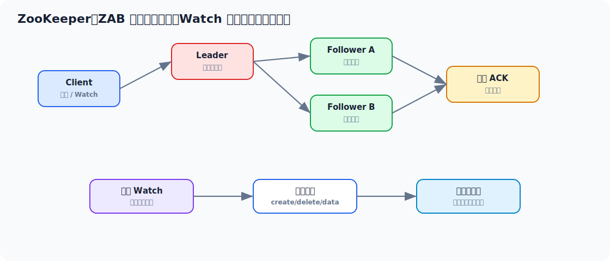

# Zookeeper 面试实用学习文档

> 适合 3-5 年 Java 工程师面试冲刺。目标不是只会“注册中心”，而是能把 Zookeeper 的数据模型、ZAB、一致性、临时节点、顺序节点、Watch、分布式锁和线上问题讲清楚。



## 先看一个直观示例：用临时顺序节点实现分布式锁

Zookeeper 最直观的作用是：**做分布式协调**。比如多个订单服务实例同时抢同一个业务资源，可以用临时顺序节点做一把相对可靠的分布式锁。

下面是伪代码级实现，生产上建议直接用 Curator 的 `InterProcessMutex`：

```java
public class ZkDistributedLock {

    private final ZooKeeper zk;
    private final String lockRoot = "/locks/order";
    private String currentNode;

    public void lock() throws Exception {
        currentNode = zk.create(
                lockRoot + "/lock-",
                new byte[0],
                ZooDefs.Ids.OPEN_ACL_UNSAFE,
                CreateMode.EPHEMERAL_SEQUENTIAL
        );

        while (true) {
            List<String> children = zk.getChildren(lockRoot, false);
            children.sort(String::compareTo);

            String currentName = currentNode.substring(lockRoot.length() + 1);
            int index = children.indexOf(currentName);
            if (index == 0) {
                return;
            }

            String prevNode = children.get(index - 1);
            CountDownLatch latch = new CountDownLatch(1);
            Stat stat = zk.exists(lockRoot + "/" + prevNode, event -> latch.countDown());
            if (stat != null) {
                latch.await();
            }
        }
    }

    public void unlock() throws Exception {
        if (currentNode != null) {
            zk.delete(currentNode, -1);
        }
    }
}
```

这个例子里 Zookeeper 的作用很清楚：

1. 每个客户端创建一个临时顺序节点。
2. 序号最小的客户端获得锁。
3. 没拿到锁的客户端只监听自己的前一个节点。
4. 锁持有者释放锁或 session 过期时，临时节点删除。
5. 后一个等待者收到 Watch 通知，再判断自己是否获得锁。

为什么不监听父节点？因为所有客户端都监听父节点会导致锁释放时大家一起醒，形成羊群效应。监听前一个节点只唤醒下一个竞争者，效率更好。

## 目录

- [一、Zookeeper 面试主线](#一zookeeper-面试主线)
- [二、Zookeeper 到底解决什么问题](#二zookeeper-到底解决什么问题)
- [三、数据模型：ZNode](#三数据模型znode)
- [四、会话、临时节点与顺序节点](#四会话临时节点与顺序节点)
- [五、Watch 机制](#五watch-机制)
- [六、ZAB 协议与一致性](#六zab-协议与一致性)
- [七、分布式锁、选主与注册发现](#七分布式锁选主与注册发现)
- [八、高级用法与工程实践](#八高级用法与工程实践)
- [九、常见线上问题与排查](#九常见线上问题与排查)
- [十、面试高频回答模板](#十面试高频回答模板)

---

## 一、Zookeeper 面试主线

常见追问链路：

```text
Zookeeper 用来做什么
  -> ZNode 有哪些类型
  -> 临时节点为什么能做注册发现
  -> 顺序节点为什么能做分布式锁
  -> Watch 是什么，有什么限制
  -> ZAB 怎么保证一致性
  -> Leader 挂了怎么办
  -> 脑裂怎么避免
  -> 会话过期、羊群效应怎么处理
```

这块面试的核心是：  
**Zookeeper 是分布式协调系统，不是普通缓存，也不是业务数据库。**

---

## 二、Zookeeper 到底解决什么问题

Zookeeper 主要解决分布式协调问题：

1. 服务注册发现
2. 配置管理
3. 分布式锁
4. 选主
5. 集群成员管理
6. 元数据存储

它适合存：

- 小数据
- 元数据
- 状态协调信息

不适合存：

- 大对象
- 高频业务数据
- 复杂查询数据

---

## 三、数据模型：ZNode

Zookeeper 的数据模型像文件系统树：

```text
/dubbo
  /com.demo.UserService
    /providers
    /consumers
```

每个节点叫 ZNode。

### 3.1 ZNode 类型

| 类型 | 特点 | 常见用途 |
| --- | --- | --- |
| 持久节点 | 客户端断开后仍存在 | 配置、目录 |
| 临时节点 | 会话结束后删除 | 服务实例注册 |
| 持久顺序节点 | 自动递增序号 | 队列、顺序任务 |
| 临时顺序节点 | 会话结束删除且有序号 | 分布式锁 |

### 3.2 为什么节点数据不能太大

ZK 的设计目标是协调，不是大数据存储。  
大节点会影响：

- 网络传输
- 内存
- Watch 通知
- 快照和同步

---

## 四、会话、临时节点与顺序节点

### 4.1 Session 很关键

客户端和 ZK 建立的是会话。  
临时节点绑定的是 session，不是 TCP 连接本身。

这意味着：

- 短暂网络抖动不一定立刻删除临时节点
- session 超时后临时节点才会被清理

### 4.2 临时节点为什么适合注册发现

服务实例启动时创建临时节点。  
如果实例宕机或 session 过期，临时节点自动删除，消费者通过 Watch 感知变化。

### 4.3 顺序节点为什么适合锁

ZK 可以创建自增序号节点，比如：

```text
/lock/order/lock-00000001
/lock/order/lock-00000002
/lock/order/lock-00000003
```

谁序号最小，谁获得锁。

---

## 五、Watch 机制

### 5.1 Watch 是什么

Watch 是客户端对节点变化注册的监听。  
节点变化时，服务端通知客户端。

### 5.2 Watch 的特点

1. 一次性触发
2. 事件通知，不携带完整最新数据
3. 需要客户端重新注册
4. 可能存在合并通知

### 5.3 Watch 常见坑

#### 以为 Watch 永久有效

错。Watch 触发一次后就失效，需要重新注册。

#### 以为 Watch 事件就是数据

错。Watch 只告诉你变了，最新数据还要重新读。

#### 对父节点下大量子节点都 Watch

可能造成通知风暴。

---

## 六、ZAB 协议与一致性

### 6.1 ZAB 解决什么

ZAB 是 Zookeeper 的原子广播协议，主要解决：

- 写请求顺序一致
- Leader 故障后的恢复

### 6.2 Leader 和 Follower

写请求通常由 Leader 处理：

1. Leader 生成事务提案
2. Follower 记录并 ACK
3. 过半 ACK 后 Leader 提交
4. 通知 Follower 提交

### 6.3 为什么需要过半机制

因为只要多数派确认，就能保证：

- 新 Leader 仍然能包含已提交事务
- 避免两个少数派各自为政

### 6.4 脑裂怎么避免

核心是：

- 多数派机制

如果一个分区拿不到多数，就不能选出有效 Leader，也就不能继续对外提交写入。

### 6.5 ZK 是 CP 还是 AP

一般认为 Zookeeper 更偏 CP。  
在网络分区时，它宁愿牺牲部分可用性，也要保证一致性。

---

## 七、分布式锁、选主与注册发现

### 7.1 分布式锁怎么做

经典做法：

1. 在锁目录下创建临时顺序节点
2. 判断自己是不是最小节点
3. 是则获得锁
4. 否则监听前一个节点
5. 前一个节点删除后再判断

### 7.2 为什么监听前一个节点

如果所有等待者都监听父节点，会造成羊群效应。  
监听前一个节点可以让锁释放时只唤醒下一个竞争者。

### 7.3 选主怎么做

类似锁：

- 多个节点创建临时顺序节点
- 序号最小者为主
- 主节点 session 失效后，后继节点接替

### 7.4 注册发现怎么做

Provider：

- 创建临时节点注册地址

Consumer：

- 读取地址列表
- 监听 providers 子节点变化

这就是早期 Dubbo + ZK 注册中心的典型模型。

---

## 八、高级用法与工程实践

### 8.1 配置管理

适合小配置、元数据配置。  
不适合大量大配置频繁更新。

### 8.2 分布式队列

可基于顺序节点实现，但现代业务更常用 MQ。  
ZK 队列适合协调，不适合高吞吐消息流。

### 8.3 Curator 的价值

Java 工程里常用 Curator 来封装：

- 分布式锁
- 选主
- Watch 重注册
- 重试策略

生产上不建议手写复杂 ZK 锁细节。

### 8.4 ACL 权限

生产环境要注意：

- 权限隔离
- 防止误删关键节点
- 防止未授权读写

---

## 九、常见线上问题与排查

### 9.1 会话频繁过期

看：

1. 网络抖动
2. GC 停顿
3. sessionTimeout 配置
4. 客户端线程阻塞

### 9.2 Watch 丢了吗

通常不是“丢”，而是：

- Watch 一次性触发后没有重新注册
- 客户端重连后没有重新拉数据
- 多次变化被合并通知

### 9.3 节点数太多

风险：

- 内存压力
- 快照变大
- Watch 通知变重

### 9.4 写入变慢

看：

1. 磁盘 IO
2. Leader 压力
3. Follower 同步延迟
4. 网络延迟

---

## 十、面试高频回答模板

### 10.1 Zookeeper 用来做什么

> Zookeeper 是分布式协调系统，适合做注册发现、配置管理、分布式锁、选主和元数据管理。它适合小数据和协调状态，不适合存业务大数据。

### 10.2 Watch 机制怎么理解

> Watch 是客户端注册在节点上的一次性事件监听。节点变化后服务端通知客户端，但通知只表示发生了变化，不携带完整最新数据，客户端收到后需要重新读取并重新注册 Watch。

### 10.3 临时节点为什么适合注册发现

> 临时节点绑定到 session，服务实例启动时创建临时节点，实例宕机或 session 过期后节点自动删除，消费者监听节点变化即可感知服务上下线。

### 10.4 分布式锁怎么实现

> 常见做法是在锁目录下创建临时顺序节点，序号最小者获得锁，其他客户端监听自己前一个节点。这样锁释放时只唤醒下一个等待者，避免所有客户端同时被唤醒。

### 10.5 ZAB 怎么保证一致性

> ZAB 通过 Leader 提案、Follower ACK、过半提交的方式保证写请求顺序一致。过半机制保证 Leader 故障后，新 Leader 能包含已经提交的事务，从而避免脑裂和不一致。

---

## 最后建议

Zookeeper 这块最值得讲清的是：

> ZNode 类型、临时节点和 session、Watch 一次性通知、ZAB 过半提交、分布式锁为什么监听前一个节点。

这些点讲透了，ZK 就不是“注册中心工具”，而是真正理解分布式协调。
