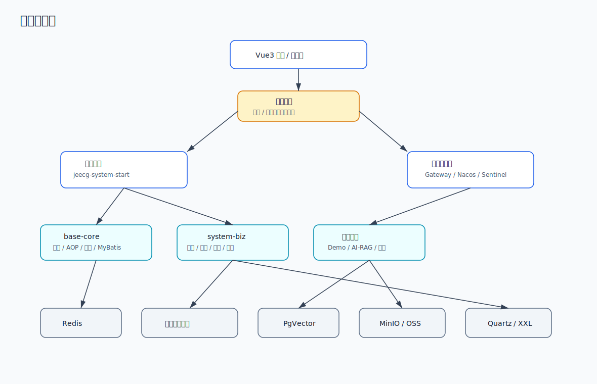
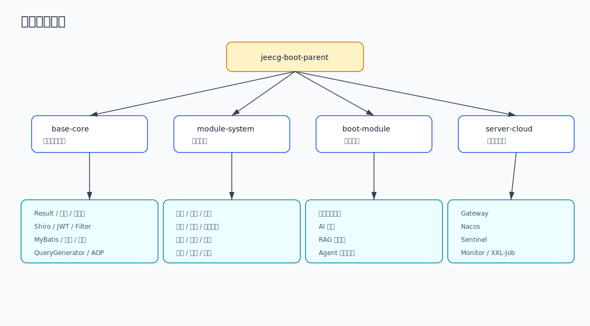
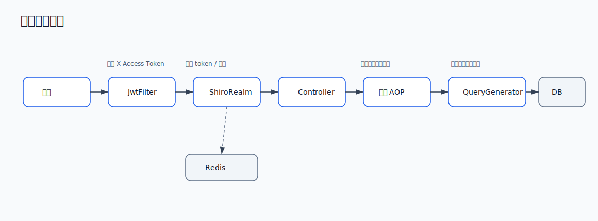
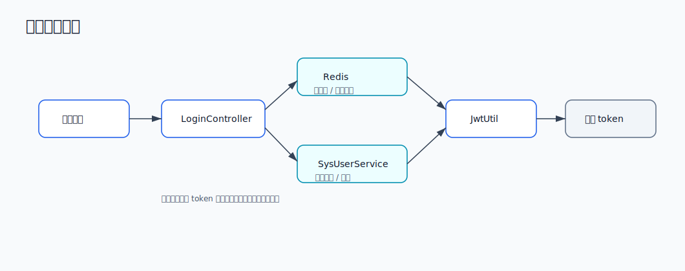
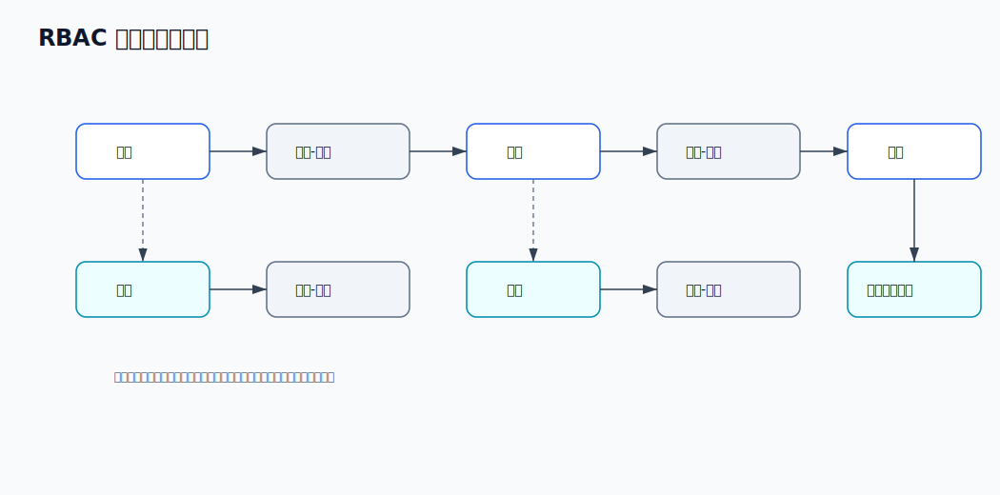
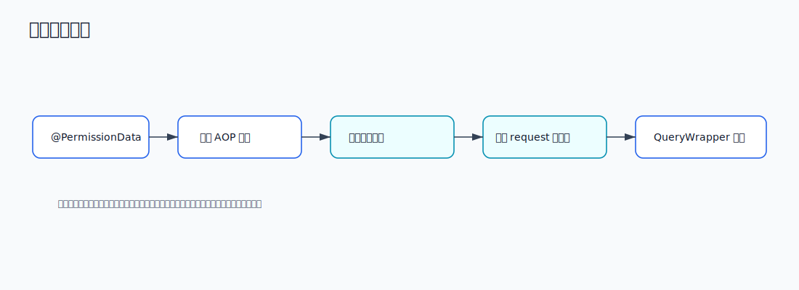
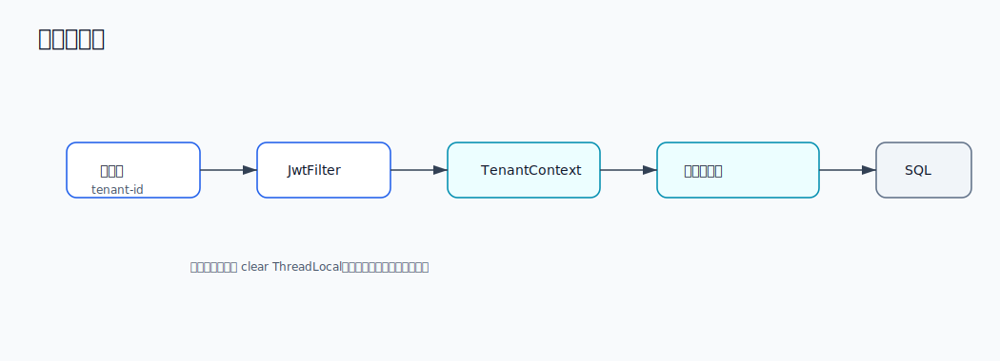
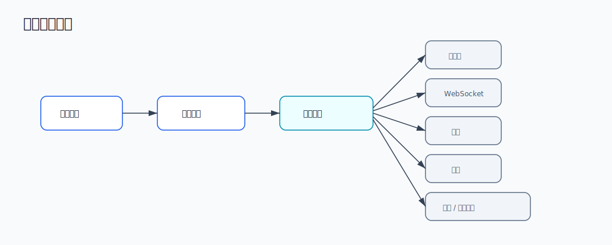
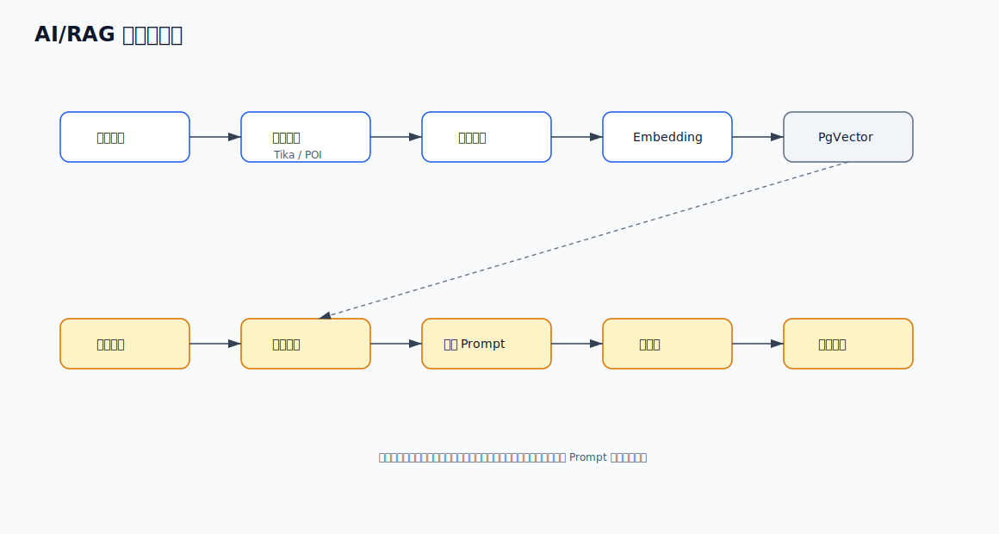
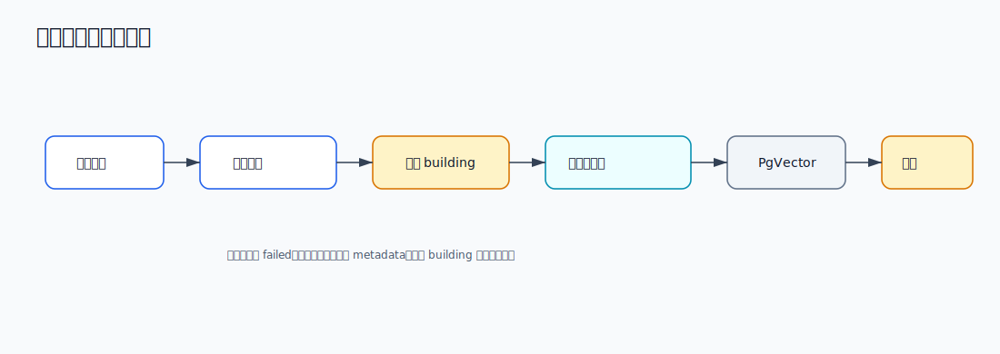

# 企业级低代码智能应用平台：后端项目面试材料

> 适用身份：Java 后端，4 年经验  
> 推荐项目名称：企业级低代码智能应用平台 / 企业内部低代码运维与智能知识库平台  
> 推荐口径：基于 JeecgBoot 进行企业内部二次开发，负责后端核心能力、权限体系、通用查询、消息任务、AI/RAG 模块接入和稳定性优化。

## 1. 项目定位

这个项目可以包装成一个企业级后台开发平台，主要解决企业内部管理系统重复开发成本高、权限规则复杂、报表和审批需求变化频繁、知识检索效率低的问题。

平台底座基于 JeecgBoot，采用前后端分离架构。后端提供统一用户中心、权限中心、低代码配置、动态表单、在线报表、消息通知、任务调度、文件服务、AI 知识库和 Agent 工具调用能力。前端基于 Vue3，用动态路由和按钮权限控制不同角色的操作入口。

面试中不要说“JeecgBoot 是我从 0 写的”。建议说：

> 我参与的是基于 JeecgBoot 的企业内部二次开发项目，主要负责后端核心模块改造、业务接入、权限扩展、AI 知识库模块接入，以及部分性能和安全优化。

## 2. 简历描述

可以放在简历里的版本：

> 参与企业级低代码智能应用平台后端开发，平台支持 RBAC 权限、按钮权限、数据权限、多租户、动态表单、在线报表、消息通知、任务调度、文件上传、AI 知识库问答和插件化工具调用。项目采用 Spring Boot 3、JDK17、MyBatis-Plus、Shiro/JWT、Redis、Quartz、Spring Cloud Alibaba、LangChain4j、PgVector 等技术，支持单体和微服务两种部署模式。本人主要负责登录鉴权、权限缓存、通用查询和数据权限拼接、消息/任务模块、AI 知识库向量检索接入和平台稳定性优化。

## 3. 技术栈分析

| 层级 | 技术 | 项目中的作用 |
| --- | --- | --- |
| 后端框架 | Spring Boot 3.5.5 | 主应用框架，提供 Web、配置、依赖管理、监控端点等能力 |
| JDK | JDK 17 | Spring Boot 3 的运行基础 |
| ORM | MyBatis-Plus 3.5.12 | CRUD、分页、条件构造器、租户拦截、乐观锁 |
| 数据库 | MySQL / PostgreSQL / Oracle / SQL Server / 达梦 / 人大金仓 | 支持多数据库部署，主流场景使用 MySQL |
| 连接池 | Druid | 连接池、SQL 监控、慢 SQL 分析 |
| 缓存 | Redis | Token、用户信息、权限、字典、登录失败次数等缓存 |
| 鉴权 | Shiro 2 + JWT | 登录认证、角色权限、接口拦截 |
| API 文档 | Knife4j / OpenAPI | 接口文档和调试 |
| 任务调度 | Quartz / XXL-Job | 本地定时任务和分布式任务扩展 |
| 消息 | WebSocket、短信、邮件、钉钉、企业微信 | 站内信、实时通知、多渠道消息推送 |
| 微服务 | Spring Cloud Alibaba、Nacos、Gateway、Sentinel | 微服务注册配置、网关路由、限流降级 |
| 低代码 | Online 表单、JimuReport、JimuBI | 动态表单、报表、大屏、代码生成 |
| AI | LangChain4j、PgVector、Tika、POI | 模型接入、文档解析、向量化、RAG 检索、Agent 工具调用 |
| 文件 | 本地存储、MinIO、OSS 等 | 文件上传、预览、对象存储扩展 |

代码依据：

- 后端父 POM：`jeecg-boot/pom.xml`
- 后端核心模块：`jeecg-boot/jeecg-boot-base-core`
- 系统业务模块：`jeecg-boot/jeecg-module-system`
- AI/RAG 模块：`jeecg-boot/jeecg-boot-module/jeecg-boot-module-airag`
- 微服务模块：`jeecg-boot/jeecg-server-cloud`

## 4. 总体架构图

## 5. 后端模块结构

模块说明：

| 模块 | 职责 |
| --- | --- |
| `jeecg-boot-base-core` | 公共基础能力，包括统一响应、异常、工具类、Shiro、JWT、MyBatis 拦截器、数据权限 AOP、动态查询构造器等 |
| `jeecg-module-system/jeecg-system-biz` | 系统管理业务，包括用户、角色、菜单、部门、岗位、租户、字典、日志、消息、任务、文件等 |
| `jeecg-module-system/jeecg-system-start` | 单体启动模块，开发和中小规模部署常用 |
| `jeecg-boot-module/jeecg-boot-module-airag` | AI 应用、知识库、模型配置、Agent 工具、RAG 文档向量化 |
| `jeecg-server-cloud` | 微服务部署能力，包括网关、注册配置中心、Sentinel、监控、XXL-Job 等 |

## 6. 单体和微服务部署模式

项目支持两种部署方式：

### 6.1 单体模式

入口类：`jeecg-module-system/jeecg-system-start/src/main/java/org/jeecg/JeecgSystemApplication.java`

开发和中小型项目通常使用单体模式，启动一个 Spring Boot 应用即可。默认端口配置在 `application-dev.yml` 中，服务上下文是 `/jeecg-boot`。

优点：

- 部署简单，排查问题方便
- 适合内部管理系统、低并发业务、早期交付
- 本地开发成本低

### 6.2 微服务模式

核心模块：

- `jeecg-cloud-gateway`：统一网关
- `jeecg-cloud-nacos`：注册配置中心
- `jeecg-system-cloud-start`：系统微服务启动模块
- `jeecg-demo-cloud-start`：业务微服务示例
- `jeecg-cloud-sentinel`：限流降级控制台
- `jeecg-cloud-xxljob`：分布式任务调度

适用场景：

- 多业务线独立发布
- 服务之间需要拆分边界
- 并发和稳定性要求更高
- 需要网关统一认证、路由、限流

面试回答：

> 我们实际落地时会根据客户规模选择部署模式。中小客户通常走单体部署，交付和运维成本低；如果是多业务线、多团队协作，或者需要统一网关、限流、灰度和独立扩缩容，就切到 Spring Cloud Alibaba 的微服务模式。

## 7. 核心请求链路

## 8. 登录鉴权设计

相关代码：

- `LoginController.java`
- `JwtFilter.java`
- `ShiroRealm.java`
- `ShiroConfig.java`

登录流程：

请求鉴权流程：

1. 前端请求头携带 `X-Access-Token`。
2. `JwtFilter` 从请求头或参数中读取 token。
3. `JwtFilter` 将 token 封装成 `JwtToken`，交给 Shiro。
4. `ShiroRealm` 解析 token 得到用户名。
5. 从 Redis 或数据库获取用户信息。
6. 校验用户状态、token 签名、token 是否存在于 Redis。
7. 加载角色和权限集合。
8. 鉴权通过后进入 Controller。

关键设计点：

- Shiro 关闭 Session，使用 JWT 做无状态认证。
- Redis 保存 token 映射，实现服务端主动失效。
- 用户权限缓存放 Redis，减少数据库查询。
- 登出时清理 token、用户缓存、Shiro 权限缓存、默认首页缓存。
- 支持 token 续期，用户持续操作时不容易掉线。
- 登录失败次数写入 Redis，超过阈值后短时间锁定。

常见追问：

**问：JWT 本身可以无状态，为什么还要放 Redis？**

答：

> 纯 JWT 的问题是服务端不能主动让 token 失效，比如用户退出登录、账号被禁用、权限被收回时，已经签发的 token 仍可能在有效期内可用。我们用 Redis 做 token 白名单和续期控制，既保留 JWT 跨服务传递方便的优点，又能支持主动失效和在线状态控制。

**问：Shiro 在这里负责什么，JWT 负责什么？**

答：

> JWT 负责承载登录身份，Shiro 负责统一认证、授权和注解权限判断。请求进来后 JwtFilter 解析 token，再交给 ShiroRealm 完成用户认证和角色权限加载。

## 9. RBAC 权限体系

权限模型：

核心表和对象：

| 对象 | 说明 |
| --- | --- |
| `SysUser` | 用户 |
| `SysRole` | 角色 |
| `SysPermission` | 菜单、按钮、接口权限 |
| `SysRolePermission` | 角色和权限关系 |
| `SysPermissionDataRule` | 数据权限规则 |
| `SysDepart` | 部门 |
| `SysTenant` | 租户 |

权限分层：

| 权限类型 | 控制对象 | 实现方式 |
| --- | --- | --- |
| 菜单权限 | 左侧菜单、路由 | 用户角色绑定菜单，前端根据权限生成动态路由 |
| 按钮权限 | 新增、编辑、删除、导出等按钮 | 权限编码控制按钮显示和接口访问 |
| 接口权限 | Controller 方法 | Shiro 注解、权限编码、JwtFilter |
| 数据权限 | 列表数据范围 | `PermissionDataAspect` + `QueryGenerator` 动态拼接 |

可以这样讲：

> 我们采用 RBAC 模型，用户绑定角色，角色绑定菜单和按钮权限。登录后后端返回用户权限集合，前端根据权限动态生成路由和按钮。同时后端接口仍会做 Shiro 权限校验，避免只靠前端控制。对于列表数据，还额外支持数据权限规则，比如只能看本部门、本人创建、指定部门或自定义 SQL 条件。

## 10. 数据权限设计

相关代码：

- `PermissionDataAspect.java`
- `SysBaseApiImpl.queryPermissionDataRule`
- `QueryGenerator.java`

数据权限链路：

核心思路：

1. 数据权限规则配置在菜单或接口维度。
2. 请求进入 Controller 前，AOP 根据当前用户和请求路径查规则。
3. 规则不直接写死在业务 Service 中，而是暂存到 request 上下文。
4. 通用查询构造器统一把规则转换成 MyBatis-Plus 条件。
5. 业务列表接口只需要调用统一查询入口。

支持的规则类型可以包装为：

- 等于、不等于
- 大于、小于、区间
- 模糊匹配
- 包含、多值 IN
- 当前用户、当前部门变量
- 自定义 SQL 片段

技术亮点：

- 数据权限和业务代码解耦。
- 同一个业务接口可以根据角色配置不同数据范围。
- 动态查询和数据权限在统一 QueryWrapper 中合并。
- 对排序字段、自定义 SQL 条件做注入过滤，降低 SQL 注入风险。

面试追问：

**问：数据权限为什么不用每个接口手写 where 条件？**

答：

> 如果每个接口手写，权限规则一变化就要改代码，而且容易漏。我们把数据权限抽象成配置规则，通过 AOP 识别当前接口和用户，再由 QueryGenerator 统一转换成 QueryWrapper 条件。这样新业务只要走统一列表查询，就天然支持数据权限。

**问：自定义 SQL 规则会不会有 SQL 注入风险？**

答：

> 会有风险，所以这块不能直接信任前端参数。项目里对自定义规则和排序字段做了过滤，比如 SQL 关键字、非法字符、排序字段白名单处理。实际生产中还会限制这类规则只能由管理员配置，并配合表白名单和字段白名单。

## 11. 通用动态查询能力

相关代码：`QueryGenerator.java`

这是低代码平台里很核心的一层。因为很多在线表单、代码生成页面、通用列表都需要支持动态筛选、排序和分页。

能力包括：

- 普通字段等值查询
- 字符串模糊查询
- 日期和数字区间查询，如 `createTime_begin`、`createTime_end`
- 多值查询，如 `xxx_MultiString`
- 高级查询 `superQueryParams`
- 前端表格多字段排序
- 字典字段翻译
- 数据权限规则合并
- 字段名驼峰转下划线
- 排序字段 SQL 注入过滤

可以这样讲：

> 我负责过通用查询层的业务接入和问题排查。它不是简单把前端参数拼 SQL，而是根据实体字段、参数后缀、字段类型和权限规则构造 MyBatis-Plus 的 QueryWrapper。例如日期范围会识别 `_begin` 和 `_end`，多选字段会走边界匹配，排序字段会做注入过滤。这样低代码生成的列表页不需要每个字段单独写查询条件。

## 12. 多租户设计

相关代码：

- `JwtFilter.java`
- `MybatisPlusSaasConfig.java`
- `TenantContext`

多租户链路：

设计点：

- 租户 ID 从请求头获取。
- 使用 `TenantContext` 在线程上下文中保存。
- MyBatis-Plus 的 `TenantLineInnerInterceptor` 自动追加 `tenant_id`。
- 通过 `TENANT_TABLE` 控制哪些表参与租户隔离。
- 请求结束后清理 ThreadLocal，避免线程复用导致租户串号。

面试追问：

**问：为什么要在请求结束后清理 TenantContext？**

答：

> Web 容器线程是复用的，如果 ThreadLocal 不清理，下一个请求可能复用到上一次请求的租户 ID，造成数据串租户，这是严重的数据安全问题。所以在过滤器的 afterCompletion 里必须 clear。

**问：为什么不是所有表都加租户条件？**

答：

> 菜单、平台级配置、公共字典等可能是全局共享数据，不适合按租户隔离。项目通过表级配置控制需要隔离的表，既保证业务数据隔离，也避免公共配置被错误过滤。

## 13. 消息通知模块

相关目录：`jeecg-module-system/jeecg-system-biz/src/main/java/org/jeecg/modules/message`

消息模块可以包装成“统一消息中心”：

核心设计：

- 用消息模板维护不同业务通知内容。
- 用发送策略适配不同通道，如站内信、邮件、短信、钉钉、企业微信。
- WebSocket 用于在线用户实时通知。
- 定时任务可用于延迟通知、失败重试、周期推送。

可以这样讲：

> 我们把消息发送抽象成统一服务，业务侧只关心发送对象、模板编码和参数，不直接依赖具体通道。底层通过不同 SendMsgHandle 实现站内信、短信、邮件、钉钉、企业微信等通道。这样新增通道时只需要扩展发送器，不影响业务调用。

## 14. 定时任务模块

相关目录：`jeecg-module-system/jeecg-system-biz/src/main/java/org/jeecg/modules/quartz`

配置依据：`application-dev.yml` 中 `spring.quartz.job-store-type: jdbc`

能力：

- 在线新增、暂停、恢复、删除任务
- Cron 表达式配置
- 任务参数传递
- JDBC 持久化任务
- 支持集群模式，避免多实例重复执行
- 可扩展 XXL-Job 做分布式任务调度

面试说法：

> 系统内置 Quartz 作为轻量任务调度能力，任务配置持久化到数据库，支持集群锁和 misfire 配置。对于跨服务、强运维诉求的任务，可以切换或接入 XXL-Job，由调度中心统一管理执行器。

## 15. AI/RAG 知识库模块

相关代码：

- `jeecg-boot-module-airag/pom.xml`
- `AiragKnowledgeDocServiceImpl.java`
- `AiragKnowledgeServiceImpl.java`

AI/RAG 架构：

### 15.1 文档入库流程

### 15.2 技术点

文档类型：

- `txt`
- `pdf`
- `docx/doc`
- `pptx/ppt`
- `xlsx/xls`
- `md`

安全和稳定性设计：

- 上传文件类型校验。
- ZIP 解压限制单文件大小、总大小和 entry 数量，防止压缩包炸弹。
- 文档向量化使用固定线程池异步执行，避免请求线程长时间阻塞。
- 构建状态持久化，支持 building、complete、failed。
- 构建超过一定时间可重新触发，处理异常中断。
- 删除文档时异步删除向量数据。
- 向量化失败时把失败原因写入 metadata，方便排查。

### 15.3 Agent 工具调用

`AiragKnowledgeServiceImpl` 中会把知识库包装为插件工具，例如：

- `add_memory`：向知识库写入长期记忆。
- `query_memory`：从知识库检索相关记忆。

可以这样讲：

> AI 模块不是简单调大模型接口，而是做了模型配置、知识库文档入库、向量化、检索和 Agent 工具封装。知识库可以被包装成 tool，Agent 在回答问题前根据上下文决定是否调用检索工具，再把检索结果作为上下文交给模型生成答案。

面试追问：

**问：RAG 的流程是什么？**

答：

> 先把文档解析成文本，再按分段策略切 chunk，通过 embedding 模型生成向量，写入 PgVector。用户提问时，同样把 query 转向量，在向量库里做相似度检索，取 topK 片段组装到 prompt，最后调用大模型生成答案。

**问：为什么文档向量化要异步？**

答：

> 文档解析和 embedding 调用都比较耗时，如果同步处理会导致 HTTP 请求超时，也会占满 Web 线程。异步后接口可以快速返回“构建中”，后台线程池处理完成后更新状态，前端轮询或刷新状态即可。

## 16. 文件与对象存储

项目支持本地文件和第三方对象存储扩展，例如 MinIO、阿里云 OSS、七牛等。

可以这样包装：

> 文件模块统一封装上传、下载、预览和存储路径管理。业务侧只拿文件 URL 或文件 ID，不直接感知底层是本地磁盘、MinIO 还是云 OSS。这样部署到内网环境可以用 MinIO，部署到公网云环境可以用 OSS。

面试可讲点：

- 文件大小限制。
- 文件类型校验。
- 私有桶和临时访问 URL。
- 图片、PDF 预览。
- AI 文档入库时复用上传文件。

## 17. 数据库与缓存设计

### 17.1 数据库

系统核心数据表可以按领域划分：

| 领域 | 表/实体 |
| --- | --- |
| 用户权限 | `sys_user`、`sys_role`、`sys_permission`、`sys_user_role`、`sys_role_permission` |
| 组织架构 | `sys_depart`、`sys_user_depart`、`sys_position` |
| 数据权限 | `sys_permission_data_rule` |
| 多租户 | `sys_tenant`、`sys_user_tenant`、`sys_tenant_pack` |
| 字典 | `sys_dict`、`sys_dict_item` |
| 日志 | `sys_log`、`sys_data_log` |
| 消息 | `sys_message`、`sys_message_template`、`sys_announcement` |
| 任务 | Quartz 相关表、`quartz_job` |
| AI | `airag_knowledge`、`airag_knowledge_doc`、`airag_model` 等 |

### 17.2 Redis

Redis 主要存：

- 登录 token
- Shiro 权限缓存
- 用户基础信息
- 字典缓存
- 登录失败次数
- 默认首页缓存
- 部分系统配置缓存

缓存一致性策略：

- 用户退出时清理 token 和用户缓存。
- 权限变更后清理 Shiro 权限缓存。
- 字典变更后清理对应字典缓存。
- 用户被禁用或密码变更后使旧 token 失效。

面试回答：

> Redis 不是只做性能优化，也参与安全控制。比如 token 是否有效、是否允许继续续期，都要看 Redis 中是否存在对应映射。权限和字典这类读多写少的数据也适合缓存，但变更时必须有明确的失效策略。

## 18. 安全设计

可以重点讲这些：

1. 登录密码传输支持前端 AES 加密，后端解密后再和加盐密码比对。
2. 密码入库使用用户名、密码、盐值组合加密。
3. 登录失败次数限制，超过阈值短时间锁定。
4. JWT 签名校验，防止伪造 token。
5. Redis token 白名单，支持主动失效。
6. Shiro 统一接口拦截。
7. 数据权限后端强校验，不依赖前端。
8. SQL 注入过滤，尤其是动态查询、排序字段、自定义 SQL 规则。
9. 多租户 ThreadLocal 请求结束清理，防止串租户。
10. 文件上传类型和大小校验，ZIP 解压限制。

## 19. 性能与稳定性设计

可以讲这些实际点：

| 场景 | 设计 |
| --- | --- |
| 用户权限频繁查询 | Shiro 权限信息 Redis 缓存 |
| 字典翻译频繁 | 字典缓存，减少重复查库 |
| 登录后用户信息读取 | 用户信息缓存 |
| 大列表查询 | MyBatis-Plus 分页，数据库层分页 |
| 动态查询排序 | 排序字段过滤，避免非法 SQL |
| 文档向量化耗时 | 线程池异步处理，状态落库 |
| 消息通知 | 模板化 + 多通道发送 + 任务补偿 |
| 微服务流量治理 | Gateway + Sentinel |
| 数据库连接 | Druid 连接池，慢 SQL 监控 |
| 多实例任务 | Quartz JDBC 集群或 XXL-Job |

## 20. 你可以说自己负责的内容

### 稳妥版

> 我主要负责系统后端二次开发，包括登录鉴权流程接入、用户角色权限配置、部分数据权限规则落地、通用列表查询问题排查、消息通知和定时任务业务接入，以及 AI 知识库模块的接口联调和向量化流程排查。

### 稍强版

> 我负责平台后端核心能力改造，包括 Shiro + JWT + Redis 的认证鉴权链路、RBAC 权限和数据权限扩展、QueryGenerator 动态查询适配、Quartz 消息任务模块、AI/RAG 知识库文档入库和向量检索接入，同时参与单体到微服务部署模式的配置改造。

### 简历职责列表

- 负责登录鉴权模块，基于 Shiro、JWT、Redis 实现 token 校验、续期、退出失效和权限缓存。
- 负责 RBAC 权限配置和菜单/按钮权限接入，支持用户、角色、菜单、部门多维度管理。
- 参与数据权限模块改造，通过 AOP + QueryWrapper 实现不同角色的数据范围隔离。
- 负责通用列表查询能力接入，支持模糊查询、区间查询、多字段排序、高级查询和分页。
- 参与消息中心和定时任务模块开发，支持站内信、WebSocket、邮件、短信等多通道通知。
- 参与 AI 知识库模块接入，完成文档上传、异步向量化、PgVector 检索和 Agent 工具调用适配。
- 参与 Redis 缓存优化和权限缓存失效策略设计，减少重复查库并保障权限变更及时生效。
- 参与单体和微服务部署配置，熟悉 Gateway、Nacos、Sentinel 在项目中的使用方式。

## 21. 项目难点与解决方案

### 难点一：登录态既要无状态，又要能主动失效

问题：

JWT 天然无状态，但用户退出、账号禁用、权限变更时，需要服务端立即控制 token 失效。

方案：

- JWT 存用户身份和签名。
- Redis 保存 token 映射和过期时间。
- 请求时既校验 JWT 签名，也校验 Redis 中是否存在 token。
- 退出登录、密码修改、账号禁用时清理 Redis。

面试表达：

> 我们没有采用纯 JWT，而是采用 JWT + Redis 白名单机制，解决了 token 主动失效和在线续期问题。

### 难点二：权限规则复杂，不能侵入每个业务接口

问题：

不同角色看到的数据范围不同，如果每个接口手写 where 条件，代码重复且容易漏。

方案：

- 数据规则配置在菜单/权限维度。
- AOP 拦截带注解的接口。
- 查询当前用户对应数据规则。
- QueryGenerator 统一追加到 QueryWrapper。

面试表达：

> 数据权限的核心是把规则配置化，把执行统一化。业务接口不需要关心具体部门还是本人数据，只要走统一查询构造器即可。

### 难点三：低代码动态查询容易引入 SQL 注入

问题：

低代码场景下前端会传字段名、排序字段、高级查询条件，如果直接拼 SQL 风险很高。

方案：

- 字段通过实体反射和表字段映射转换。
- 排序字段做 SQL 注入过滤。
- 自定义 SQL 规则限制管理员配置。
- 对特殊字符和关键字进行过滤。

面试表达：

> 低代码平台的动态能力越强，越要控制输入边界。我们尽量用 MyBatis-Plus 条件构造器，避免直接字符串拼接；必须支持自定义 SQL 的地方，也会做白名单和注入过滤。

### 难点四：多租户容易出现数据串租户

问题：

租户 ID 存在线程上下文，如果 ThreadLocal 不清理，线程复用会导致数据串租户。

方案：

- 请求进入时从 header 读取租户 ID。
- 写入 `TenantContext`。
- MyBatis 拦截器自动追加 `tenant_id`。
- 请求结束后 clear。

面试表达：

> 多租户最怕串数据，所以租户上下文必须在请求结束后清理，并且不是所有表都默认租户隔离，需要表级控制。

### 难点五：AI 文档向量化耗时长，容易失败

问题：

文档解析、分段、embedding、向量入库耗时不稳定，尤其是大文档和批量 ZIP。

方案：

- 文档记录先入库，状态置为 building。
- 后台线程池异步向量化。
- 成功后置为 complete，失败置为 failed。
- 失败原因写入 metadata。
- ZIP 解压限制大小和数量，防止异常文件拖垮服务。

面试表达：

> AI 知识库不是同步上传完就能用，而是一个异步构建流程。我们通过状态机和后台线程池控制构建过程，前端只需要展示构建状态。

## 22. 典型面试问答

### Q1：这个项目的核心价值是什么？

答：

> 核心价值是提升企业后台系统的交付效率。基础能力如用户、权限、部门、字典、日志、文件、任务不用重复开发；常规 CRUD 可以通过低代码生成；复杂业务再做二次开发。同时集成 AI 知识库和 Agent 能力，支持企业内部知识问答和智能应用搭建。

### Q2：你在里面主要负责什么？

答：

> 我主要负责后端核心能力和业务接入，包括登录鉴权、权限缓存、数据权限、通用查询、消息任务，以及 AI 知识库模块的文档入库和检索流程接入。

### Q3：登录流程说一下。

答：

> 前端提交用户名、密码和验证码。后端先校验验证码和登录失败次数，再查用户状态，用用户名、密码和盐值生成密文和数据库密码比对。成功后生成 JWT，把 token 和用户信息写入 Redis，返回给前端。后续请求通过 `X-Access-Token` 携带 token，由 JwtFilter 和 ShiroRealm 完成认证。

### Q4：权限怎么做？

答：

> 权限采用 RBAC，用户绑定角色，角色绑定菜单、按钮和接口权限。Shiro 负责后端权限校验，前端根据权限生成动态路由和按钮展示。数据权限通过 AOP + QueryGenerator 实现，会根据当前用户和接口路径查规则，并追加到查询条件里。

### Q5：数据权限怎么实现？

答：

> Controller 方法标注数据权限注解后，AOP 根据请求路径、页面组件和用户名查询数据规则，把规则放到 request 上下文。列表查询走 QueryGenerator 时，会读取这些规则并转换成 MyBatis-Plus 的 QueryWrapper 条件，实现不同用户看到不同数据。

### Q6：多租户怎么做？

答：

> 前端请求头传租户 ID，过滤器写入 TenantContext，MyBatis-Plus 租户拦截器对配置过的租户表自动追加 `tenant_id` 条件。请求结束后清理 ThreadLocal，避免线程复用导致串租户。

### Q7：Redis 用在哪些地方？

答：

> 主要用于 token 白名单和续期、用户信息缓存、Shiro 权限缓存、字典缓存、登录失败次数、默认首页缓存等。它既提升性能，也参与登录态控制。

### Q8：为什么 Shiro + JWT，而不是 Spring Security？

答：

> 这个项目底座历史上采用 Shiro，权限模型和注解体系都已经比较成熟。JWT 解决前后端分离和微服务传递身份的问题，Shiro 负责权限判断。对于二开项目，沿用现有体系能减少改造成本。

### Q9：QueryGenerator 的作用是什么？

答：

> 它是通用查询构造器，把前端列表页传来的字段、区间、排序、高级查询参数和数据权限规则统一转换成 MyBatis-Plus QueryWrapper。这样低代码页面和普通业务页面都能复用一套查询逻辑。

### Q10：如何避免动态查询 SQL 注入？

答：

> 尽量用 QueryWrapper，不直接拼接 SQL。排序字段会做过滤，实体字段会通过反射映射到数据库字段。对于自定义 SQL 数据权限规则，限制管理员配置，并进行 SQL 注入关键字检测和字段白名单控制。

### Q11：消息模块怎么设计？

答：

> 业务侧调用统一消息服务，传模板编码、接收人和参数。底层根据消息类型分发到不同发送器，比如站内信、短信、邮件、钉钉、企业微信。WebSocket 用于在线实时通知，定时任务可以做补偿和延迟发送。

### Q12：定时任务怎么保证多实例不重复执行？

答：

> Quartz 使用 JDBC JobStore，任务状态和锁信息持久化到数据库，并开启集群配置。多实例竞争时由 Quartz 的数据库锁控制执行权。如果任务量更大，也可以接 XXL-Job，由调度中心统一分发。

### Q13：AI 知识库怎么做？

答：

> 文档上传后先保存记录，然后异步解析文档、分段、调用 embedding 模型生成向量，写入 PgVector。用户提问时对 query 向量化，检索相似片段，组装 prompt，再调用大模型生成回答。

### Q14：RAG 为什么需要向量库？

答：

> 普通关键词检索只能匹配字面，向量检索可以基于语义相似度召回内容。比如用户问法和文档原文不完全一致，向量检索仍然能找到相关片段。

### Q15：文档向量化失败怎么办？

答：

> 文档状态会更新为 failed，并把失败原因写入 metadata。用户可以重新触发构建。对于 building 状态超时的文档，也可以重新构建，避免任务异常中断后一直卡住。

### Q16：单体和微服务怎么切？

答：

> 单体用 `jeecg-system-start` 启动，适合中小项目。微服务模式会启用 Gateway、Nacos、系统服务和业务服务，通过 Nacos 做注册配置，Gateway 做统一入口，Sentinel 做限流降级。业务代码通过 API 模块隔离调用方式，减少切换成本。

### Q17：项目里有没有用到设计模式？

答：

> 有。消息发送用了策略模式，不同发送渠道对应不同 Handle。权限和日志使用 AOP。AI 工具调用类似适配器，把内部知识库接口封装成 LLM 可识别的 Tool。通用查询构造器则是对查询条件构建逻辑的封装。

### Q18：如何做接口日志？

答：

> 项目有 AutoLog AOP，可以在接口方法上加注解记录操作日志。登录、退出、关键业务操作会写入系统日志，便于审计和问题追踪。

### Q19：如果权限变更后用户不重新登录怎么办？

答：

> 权限信息有 Redis 缓存。角色或权限变更后，需要清理对应用户的 Shiro 权限缓存。下次请求触发权限判断时重新加载权限集合。

### Q20：这个项目你觉得最有技术含量的地方是什么？

答：

> 我觉得是“通用能力和业务灵活性”的平衡。比如权限、数据权限、动态查询、多租户、低代码配置都很灵活，但越灵活越容易带来安全和性能问题。项目里通过 AOP、QueryWrapper、Redis 缓存、MyBatis 拦截器、SQL 注入过滤等方式，把这些能力沉到平台层，业务开发才能比较轻量。

## 23. 三分钟项目介绍

面试时可以这样说：

> 我最近参与的是一个企业级低代码智能应用平台，主要用于快速搭建企业内部管理系统。项目基于 JeecgBoot 做二次开发，整体是前后端分离架构，前端 Vue3，后端 Spring Boot 3 + JDK17 + MyBatis-Plus。平台内置用户、角色、菜单、部门、租户、字典、日志、文件、消息、任务调度等基础能力，同时支持在线表单、报表、大屏和代码生成。
>
> 我主要负责后端核心能力，包括登录鉴权、权限缓存、数据权限、通用查询、消息任务，以及 AI 知识库模块接入。登录这块我们用 Shiro + JWT + Redis，JWT 负责身份传递，Shiro 做认证授权，Redis 做 token 白名单、续期和主动失效。权限采用 RBAC，用户绑定角色，角色绑定菜单和按钮，后端接口也会做权限校验。数据权限通过 AOP 拦截接口，根据当前用户和请求路径查询数据规则，再由 QueryGenerator 统一追加到 MyBatis-Plus 的 QueryWrapper 中。
>
> 项目还支持多租户，请求头传租户 ID，过滤器写入 TenantContext，MyBatis-Plus 租户拦截器自动追加 tenant_id 条件。AI 模块这块，我们接了 LangChain4j 和 PgVector，支持文档上传后异步解析、分段、embedding、向量入库，用户提问时做向量检索再调用大模型生成回答。部署上既支持单体，也保留 Spring Cloud Alibaba 微服务模式，可以接 Gateway、Nacos 和 Sentinel。

## 24. 项目亮点总结

可以重点背这几条：

1. 平台不是单一业务系统，而是企业级后台开发底座。
2. Shiro + JWT + Redis 兼顾无状态认证和服务端主动失效。
3. RBAC + 数据权限实现菜单、按钮、接口、数据范围多层控制。
4. QueryGenerator 支持低代码场景下的动态查询、排序、高级查询和权限拼接。
5. MyBatis-Plus 租户拦截器实现表级多租户隔离。
6. 消息中心通过策略模式支持多通道发送。
7. Quartz JDBC JobStore 支持任务持久化和集群。
8. AI/RAG 模块支持文档解析、异步向量化、PgVector 检索和 Agent 工具调用。
9. 项目支持单体和微服务两种部署模式，能适配不同规模客户。
10. 安全上考虑了登录失败限制、token 失效、SQL 注入过滤、文件上传校验和租户上下文清理。

## 25. 不建议这样说

不要说：

- “JeecgBoot 是我从 0 到 1 搭的。”
- “所有低代码能力都是我写的。”
- “我独立负责整个微服务架构。”
- “AI 模块完全是我设计的。”
- “系统支撑了几百万 QPS。”

建议说：

- “基于 JeecgBoot 做企业内部二次开发。”
- “我负责后端核心能力改造和业务接入。”
- “低代码底座已有，我主要做权限、查询、消息任务、AI 知识库等模块的落地和优化。”
- “系统支持单体和微服务两种模式，实际按客户规模选择部署。”

## 26. 重点源码索引

| 主题 | 路径 |
| --- | --- |
| 父 POM 和技术版本 | `jeecg-boot/pom.xml` |
| 单体启动类 | `jeecg-boot/jeecg-module-system/jeecg-system-start/src/main/java/org/jeecg/JeecgSystemApplication.java` |
| 开发环境配置 | `jeecg-boot/jeecg-module-system/jeecg-system-start/src/main/resources/application-dev.yml` |
| 登录接口 | `jeecg-boot/jeecg-module-system/jeecg-system-biz/src/main/java/org/jeecg/modules/system/controller/LoginController.java` |
| JWT 过滤器 | `jeecg-boot/jeecg-boot-base-core/src/main/java/org/jeecg/config/shiro/filters/JwtFilter.java` |
| Shiro Realm | `jeecg-boot/jeecg-boot-base-core/src/main/java/org/jeecg/config/shiro/ShiroRealm.java` |
| Shiro 配置 | `jeecg-boot/jeecg-boot-base-core/src/main/java/org/jeecg/config/shiro/ShiroConfig.java` |
| 数据权限切面 | `jeecg-boot/jeecg-boot-base-core/src/main/java/org/jeecg/common/aspect/PermissionDataAspect.java` |
| 通用查询构造器 | `jeecg-boot/jeecg-boot-base-core/src/main/java/org/jeecg/common/system/query/QueryGenerator.java` |
| 多租户 MyBatis 配置 | `jeecg-boot/jeecg-boot-base-core/src/main/java/org/jeecg/config/mybatis/MybatisPlusSaasConfig.java` |
| 菜单权限接口 | `jeecg-boot/jeecg-module-system/jeecg-system-biz/src/main/java/org/jeecg/modules/system/controller/SysPermissionController.java` |
| 系统基础 API | `jeecg-boot/jeecg-module-system/jeecg-system-biz/src/main/java/org/jeecg/modules/system/service/impl/SysBaseApiImpl.java` |
| 消息模块 | `jeecg-boot/jeecg-module-system/jeecg-system-biz/src/main/java/org/jeecg/modules/message` |
| Quartz 模块 | `jeecg-boot/jeecg-module-system/jeecg-system-biz/src/main/java/org/jeecg/modules/quartz` |
| AI/RAG 模块 POM | `jeecg-boot/jeecg-boot-module/jeecg-boot-module-airag/pom.xml` |
| AI 知识库文档服务 | `jeecg-boot/jeecg-boot-module/jeecg-boot-module-airag/src/main/java/org/jeecg/modules/airag/llm/service/impl/AiragKnowledgeDocServiceImpl.java` |
| AI 知识库插件服务 | `jeecg-boot/jeecg-boot-module/jeecg-boot-module-airag/src/main/java/org/jeecg/modules/airag/llm/service/impl/AiragKnowledgeServiceImpl.java` |
| Gateway 配置 | `jeecg-boot/jeecg-server-cloud/jeecg-cloud-gateway/src/main/resources/application.yml` |

