# Java 工程师数据库面试实用学习文档

> 适合对象：工作 3-5 年 Java 后端工程师。  
> 主线：MySQL 8.x / InnoDB。  
> 目标：不只会背概念，而是能把“原理、场景、排查、工程取舍”连成面试可表达的体系。

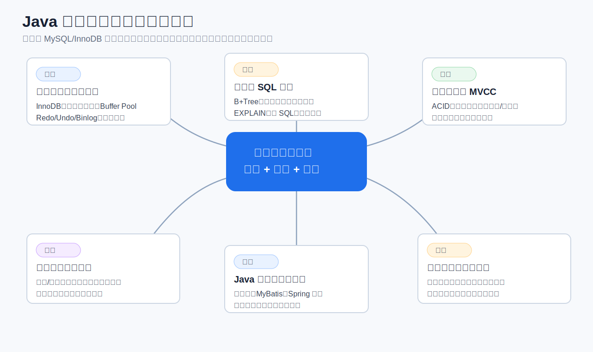

## 目录

- [1. 面试复习路线](#1-面试复习路线)
- [2. MySQL 逻辑架构](#2-mysql-逻辑架构)
- [3. InnoDB 存储结构](#3-innodb-存储结构)
- [4. Buffer Pool 与刷盘](#4-buffer-pool-与刷盘)
- [5. B+Tree 索引](#5-btree-索引)
- [6. 聚簇索引、二级索引与回表](#6-聚簇索引二级索引与回表)
- [7. 联合索引与最左前缀](#7-联合索引与最左前缀)
- [8. SQL 优化与 EXPLAIN](#8-sql-优化与-explain)
- [9. 事务 ACID](#9-事务-acid)
- [10. 隔离级别与并发异常](#10-隔离级别与并发异常)
- [11. MVCC 与 Read View](#11-mvcc-与-read-view)
- [12. InnoDB 锁体系](#12-innodb-锁体系)
- [13. 死锁排查与治理](#13-死锁排查与治理)
- [14. Redo、Undo、Binlog 与两阶段提交](#14-redoundobinlog-与两阶段提交)
- [15. 主从复制与读写分离](#15-主从复制与读写分离)
- [16. 分库分表](#16-分库分表)
- [17. 缓存与数据库一致性](#17-缓存与数据库一致性)
- [18. 表设计与数据建模](#18-表设计与数据建模)
- [19. Java 工程里的数据库能力](#19-java-工程里的数据库能力)
- [20. 高频面试题速答](#20-高频面试题速答)
- [21. 面试前 7 天冲刺计划](#21-面试前-7-天冲刺计划)

## 1. 面试复习路线

数据库面试不是孤立问答，它通常沿着这条链路展开：

```text
SQL 为什么慢
  -> 索引为什么没用上
  -> InnoDB 索引底层是什么
  -> 回表、覆盖索引、联合索引怎么设计
  -> 并发更新会不会冲突
  -> 事务隔离、MVCC、锁怎么工作
  -> 主从、缓存、分库分表后一致性怎么保证
  -> Java 代码里如何控制事务、连接池、批量写、幂等
```

四年经验的 Java 工程师，不建议只停留在“会用 SQL”。面试官更看重你是否能把问题向下追到 InnoDB，向上落到业务系统。

**推荐回答结构**

1. 先给结论：例如“这个慢 SQL 的核心问题是扫描量大和回表多”。
2. 再讲原理：B+Tree、联合索引顺序、MVCC、锁范围。
3. 再给方案：改 SQL、加索引、拆查询、归档、缓存、分片。
4. 最后讲验证：EXPLAIN、慢日志、压测、线上监控。

## 2. MySQL 逻辑架构

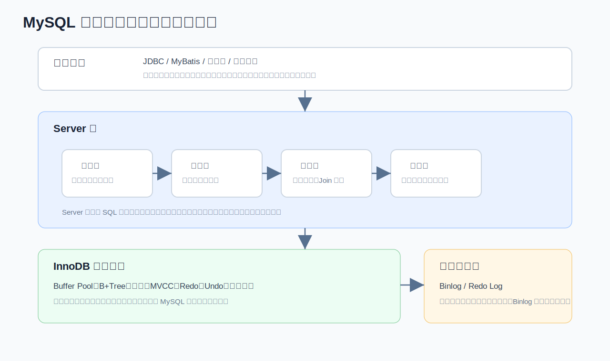

MySQL 可以粗略分为客户端层、Server 层和存储引擎层。

**客户端层**

Java 应用通过 JDBC、连接池、MyBatis/JPA 访问数据库。这里面试常追问：

- 连接池为什么不能无限大？
- 一个请求里多次 SQL 是否在同一个连接上执行？
- Spring 事务为什么必须依赖同一个连接？
- 慢 SQL 是数据库慢，还是应用拿连接慢？

**Server 层**

Server 层包括连接器、分析器、优化器、执行器。它负责 SQL 生命周期：

1. 连接器负责认证、权限、会话状态。
2. 分析器做词法和语法解析。
3. 优化器决定使用哪个索引、Join 顺序、是否改写查询。
4. 执行器调用存储引擎接口拿数据。

优化器不是神，它基于统计信息估算成本。如果统计信息不准、数据分布倾斜、条件选择性很差，就可能选错索引。

**存储引擎层**

InnoDB 是 MySQL 默认存储引擎，核心能力包括：

- 事务 ACID
- 行级锁
- MVCC
- B+Tree 索引
- Buffer Pool
- Redo Log / Undo Log
- 崩溃恢复

**面试表达**

> 一条 SQL 进入 MySQL 后先经过 Server 层解析和优化，优化器生成执行计划，再由执行器调用 InnoDB。InnoDB 负责真正的数据页访问、索引搜索、事务、锁和日志。排查慢 SQL 时，我会同时看 Server 层的执行计划和 InnoDB 层的扫描量、回表、锁等待。

## 3. InnoDB 存储结构

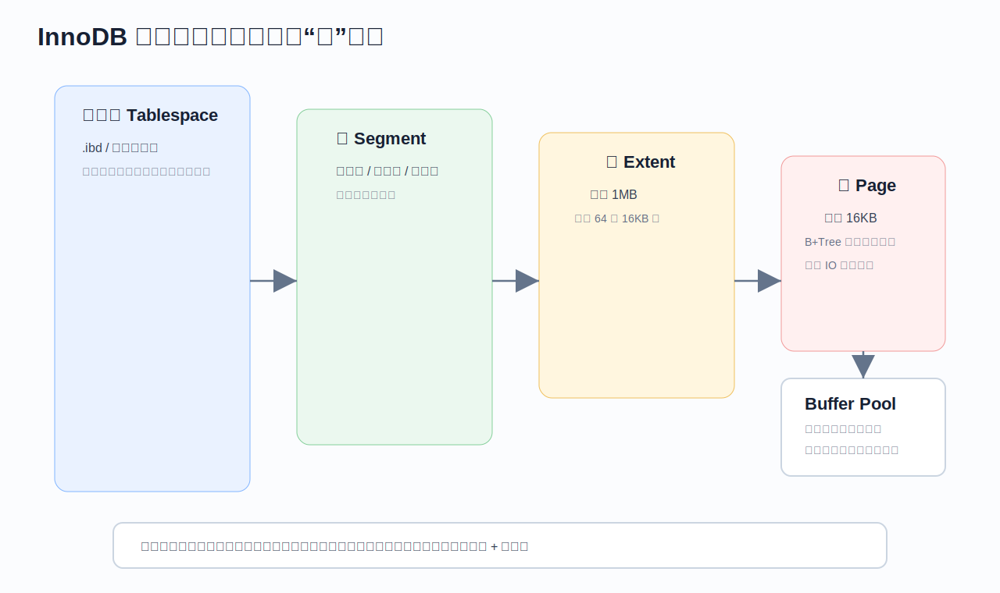

InnoDB 的逻辑层次是：

```text
表空间 Tablespace -> 段 Segment -> 区 Extent -> 页 Page -> 行 Record
```

**页 Page**

页是 InnoDB 管理数据的基本单位，默认 16KB。B+Tree 的一个节点就是一个页。无论读一行还是多行，底层通常都是把页加载到 Buffer Pool。

这解释了几个现象：

- 范围查询如果命中连续页，IO 效率高。
- 随机主键会导致页分裂和随机写。
- `select *` 会让更多页和列被读取，增加 IO 和网络开销。
- 大字段和宽表会降低单页可容纳的行数，影响缓存命中。

**区 Extent**

区默认 1MB，由 64 个连续页组成。InnoDB 用区来减少空间分配碎片。

**段 Segment**

段按用途划分，例如数据段、索引段、回滚段。聚簇索引、二级索引都对应自己的 B+Tree 结构。

**行记录**

InnoDB 行记录中除了业务字段，还有隐藏字段：

- `DB_TRX_ID`：最近修改该记录的事务 ID。
- `DB_ROLL_PTR`：指向 Undo Log 的回滚指针。
- `DB_ROW_ID`：当表没有显式主键或唯一非空索引时，InnoDB 生成隐藏行 ID。

**面试重点**

不要说“数据存在表里”就结束。更好的表达是：

> InnoDB 的数据和索引都组织成 B+Tree，B+Tree 节点是页。聚簇索引叶子页保存完整行，二级索引叶子页保存索引列和主键。SQL 性能最终会落到扫描了多少页、是否回表、是否产生随机 IO。

## 4. Buffer Pool 与刷盘

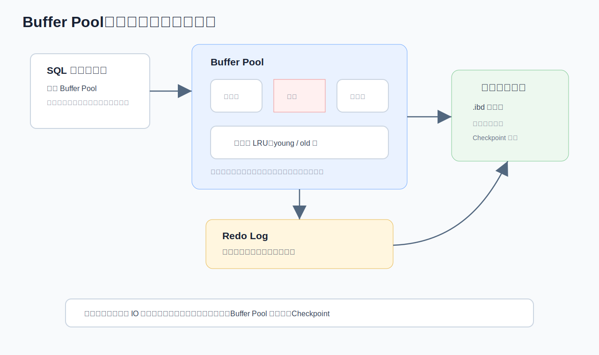

Buffer Pool 是 InnoDB 最重要的内存区域，用来缓存数据页和索引页。读写数据时不是每次都直接访问磁盘，而是优先访问 Buffer Pool。

**读流程**

1. 根据索引定位目标页。
2. 如果页在 Buffer Pool 中，直接内存读取。
3. 如果不在，从磁盘加载页到 Buffer Pool。
4. 返回记录。

**写流程**

1. 修改 Buffer Pool 中的数据页。
2. 该页变为脏页。
3. 写 Redo Log，保证崩溃后可恢复。
4. 后台线程择机把脏页刷回磁盘。

**为什么先写日志而不是直接刷数据页**

随机刷数据页成本很高，Redo Log 是顺序写，性能更好。数据库通过“先写日志，再异步刷脏页”把随机写压力转化为顺序写。

**脏页刷盘触发场景**

- Redo Log 空间快满。
- Buffer Pool 空闲页不足。
- 后台线程定期刷盘。
- MySQL 正常关闭。
- Checkpoint 推进需要。

**线上现象**

如果脏页比例太高，或者 Redo Log 压力大，可能出现写入抖动。表现为请求延迟突然升高，但 CPU 未必很高。

**排查指标**

- Buffer Pool 命中率。
- 脏页比例。
- Redo Log 写入量。
- 磁盘 IOPS 和 fsync 延迟。
- 慢日志中是否集中出现写 SQL。

## 5. B+Tree 索引

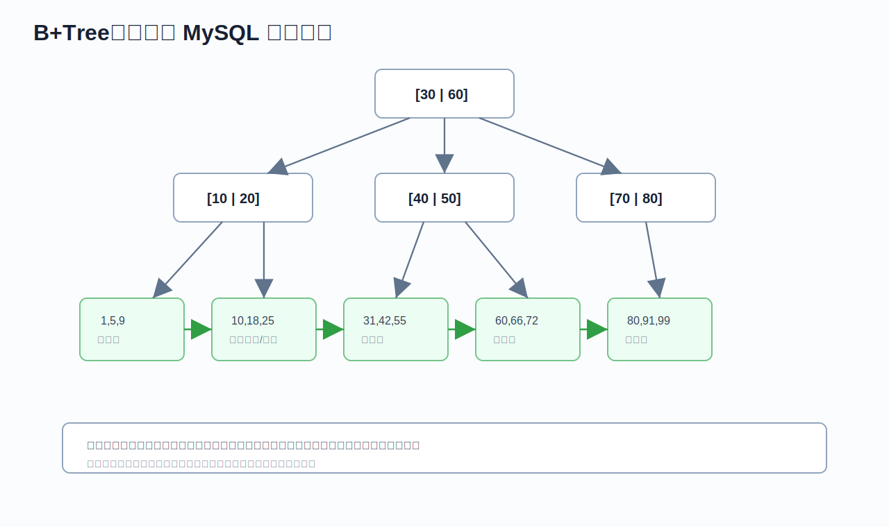

MySQL InnoDB 索引主要使用 B+Tree。它适合数据库的原因是：

- 树高低，减少磁盘 IO。
- 非叶子节点只存键和指针，扇出高。
- 叶子节点有序链表，范围查询效率高。
- 数据按索引顺序组织，支持排序和范围扫描。

**B+Tree 与 B 树区别**

| 对比项 | B 树 | B+Tree |
| --- | --- | --- |
| 数据存放 | 非叶子和叶子都可存数据 | 数据主要在叶子节点 |
| 范围查询 | 需要中序遍历 | 叶子链表顺序扫描 |
| 扇出 | 相对较低 | 更高 |
| 数据库适配 | 可用 | 更适合磁盘和范围查询 |

**为什么不用 Hash 索引**

Hash 查询等值很快，但不支持范围查询、排序、最左前缀，也不能很好地利用磁盘页局部性。数据库业务里范围查询、排序、分页很常见，所以 B+Tree 更通用。

**索引代价**

索引不是越多越好：

- 写入、更新、删除需要维护索引。
- 索引占磁盘和 Buffer Pool。
- 太多索引会增加优化器选择成本。
- 低选择性索引可能效果很差。

**高频回答**

> B+Tree 的高度通常很低，查询时通过根节点、内节点逐层定位到叶子节点。等值查询是树搜索，范围查询是先定位起点，再沿叶子节点链表向后扫描。它兼顾等值、范围、排序，所以 InnoDB 使用 B+Tree 作为主要索引结构。

## 6. 聚簇索引、二级索引与回表

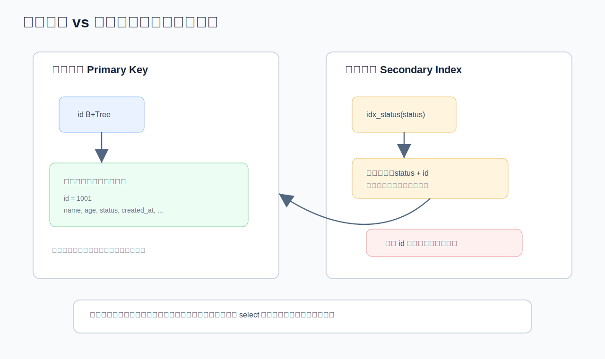

InnoDB 的表数据本身就是按聚簇索引组织的。聚簇索引通常就是主键索引。

**聚簇索引**

聚簇索引叶子节点保存完整行数据。通过主键查询，一次 B+Tree 搜索就能拿到完整记录。

```sql
select * from user where id = 1001;
```

如果 `id` 是主键，这类查询非常高效。

**二级索引**

二级索引叶子节点保存的是：

```text
二级索引列 + 主键值
```

例如：

```sql
create index idx_status on user(status);
select * from user where status = 1;
```

执行过程：

1. 在 `idx_status` 上找到 `status = 1` 的记录。
2. 拿到对应主键 ID。
3. 回到聚簇索引按 ID 查完整行。

第 3 步就是回表。

**覆盖索引**

如果查询需要的列都在二级索引中，就不需要回表。

```sql
create index idx_status_name on user(status, name);

select name
from user
where status = 1;
```

这时 `status` 用来过滤，`name` 可以直接从索引叶子节点返回。

**为什么不推荐 select ***

`select *` 容易导致：

- 无法使用覆盖索引。
- 回表次数变多。
- 读取大字段。
- 网络传输变大。
- 以后加字段可能拖慢老 SQL。

**主键设计**

推荐使用短、递增、稳定的主键。

| 主键类型 | 优点 | 风险 |
| --- | --- | --- |
| 自增 BIGINT | 插入顺序好，索引紧凑 | 分库分表需要全局 ID |
| 雪花 ID | 全局唯一，趋势递增 | 实现复杂，时钟回拨 |
| UUID | 全局唯一 | 太长、随机、页分裂严重 |
| 业务主键 | 有业务含义 | 变更困难，长度和稳定性不可控 |

## 7. 联合索引与最左前缀

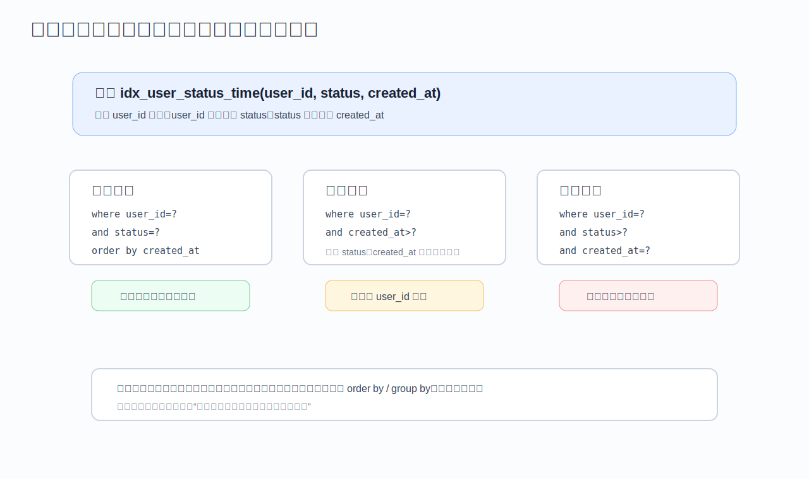

联合索引不是多个单列索引的简单叠加，它按多个字段的组合顺序排序。

例如：

```sql
create index idx_user_status_time
on orders(user_id, status, created_at);
```

索引顺序是：

```text
先按 user_id 排序
user_id 相同再按 status 排序
status 相同再按 created_at 排序
```

**可以较好使用索引的写法**

```sql
select *
from orders
where user_id = ?
  and status = ?
order by created_at desc
limit 20;
```

原因：

- `user_id` 命中第一列。
- `status` 命中第二列。
- `created_at` 可用于排序或范围。

**中间断裂**

```sql
select *
from orders
where user_id = ?
  and created_at > ?;
```

缺少 `status`，`created_at` 的有序性不能被充分利用。

**范围截断**

```sql
select *
from orders
where user_id = ?
  and status > ?
  and created_at = ?;
```

`status` 是范围条件，后面的 `created_at` 很难继续用于精确定位。

**联合索引设计原则**

- 高频查询条件优先。
- 等值条件放前面。
- 范围字段尽量放后面。
- 区分度高的字段通常更适合靠前，但要结合查询模式。
- 尽量覆盖排序字段，减少 filesort。
- 用覆盖索引减少回表。

**索引下推 ICP**

Index Condition Pushdown 可以在存储引擎层先用索引中的条件过滤，减少回表。

例如联合索引 `(name, age)`：

```sql
select *
from user
where name like '张%'
  and age = 30;
```

即使 `name like '张%'` 是范围，`age` 仍可能在索引层被进一步过滤，减少回表数量。

## 8. SQL 优化与 EXPLAIN

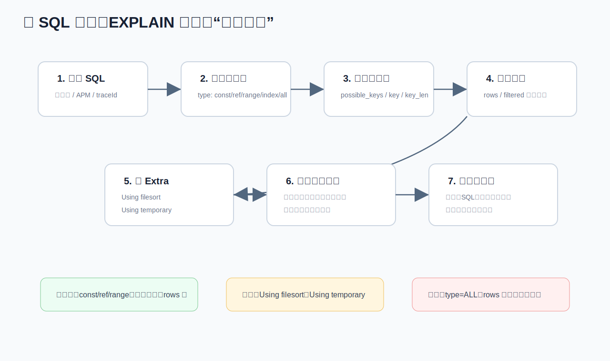

慢 SQL 优化要有方法，不要上来就说“加索引”。

**完整排查链路**

1. 定位 SQL：慢日志、APM、业务 trace、接口耗时。
2. 看执行计划：`EXPLAIN` 或 `EXPLAIN ANALYZE`。
3. 看访问类型：`type` 是否为 `ALL`、`index`、`range`、`ref`。
4. 看索引：`possible_keys`、`key`、`key_len`。
5. 看扫描量：`rows`、`filtered`。
6. 看额外动作：`Using filesort`、`Using temporary`。
7. 结合表结构、数据分布、业务条件改写。
8. 用压测或生产观测验证。

**EXPLAIN 核心字段**

| 字段 | 含义 | 重点 |
| --- | --- | --- |
| id | 查询执行顺序 | 子查询、派生表时关注 |
| select_type | 查询类型 | SIMPLE、PRIMARY、SUBQUERY、DERIVED |
| table | 当前访问表 | Join 时看驱动表 |
| type | 访问类型 | 至少争取 range/ref，避免 ALL |
| possible_keys | 可能使用的索引 | 不代表实际使用 |
| key | 实际使用索引 | 为空通常危险 |
| key_len | 使用索引长度 | 判断联合索引用到几列 |
| rows | 预估扫描行数 | 越大越要警惕 |
| filtered | 条件过滤比例 | 低说明过滤效率差 |
| Extra | 额外信息 | filesort、temporary、covering |

**type 常见等级**

从好到差大致是：

```text
system > const > eq_ref > ref > range > index > ALL
```

`index` 不是很好，它表示扫描索引树，通常比全表扫描小一些，但仍是扫描。

**常见慢 SQL 问题**

1. 没有索引或索引选择性低。
2. 联合索引不符合最左前缀。
3. 对索引列使用函数或表达式。
4. 隐式类型转换。
5. `like '%xxx'` 前缀通配。
6. 大分页 offset 太深。
7. 回表过多。
8. 排序和分组无法利用索引。
9. Join 驱动表选择不当。
10. 数据量增长后原本可接受的 SQL 退化。

**函数导致索引失效**

```sql
-- 不推荐
select *
from orders
where date(created_at) = '2026-05-06';

-- 推荐
select *
from orders
where created_at >= '2026-05-06 00:00:00'
  and created_at <  '2026-05-07 00:00:00';
```

**隐式类型转换**

```sql
-- user_id 是 varchar 时，这种写法可能导致索引失效
select * from user where user_id = 10001;

-- 推荐
select * from user where user_id = '10001';
```

**深分页优化**

```sql
-- 不推荐：offset 很大时扫描大量无用数据
select *
from orders
where user_id = ?
order by id desc
limit 100000, 20;

-- 推荐：基于上一页游标
select *
from orders
where user_id = ?
  and id < ?
order by id desc
limit 20;
```

**Join 优化**

- 小表驱动大表。
- Join 字段类型一致。
- Join 字段建立索引。
- 控制返回列，避免大字段。
- 复杂 Join 可拆成两段查询，但要评估网络和一致性。

**面试回答模板**

> 我优化慢 SQL 会先拿到具体 SQL 和执行计划，看 type、key、rows、Extra。然后结合表结构和数据分布判断是扫描量大、回表多、排序临时表、Join 顺序还是锁等待。方案可能是调整联合索引顺序、改写条件避免函数和隐式转换、用覆盖索引、改游标分页、拆查询或做冷热归档。最后必须通过 EXPLAIN 和压测验证，而不是凭感觉加索引。

## 9. 事务 ACID

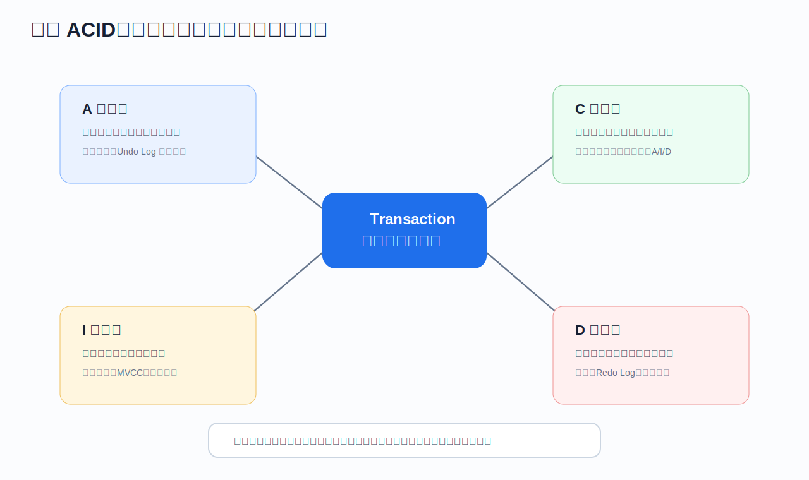

ACID 是事务的四个特性。

| 特性 | 含义 | InnoDB 支撑 |
| --- | --- | --- |
| Atomicity 原子性 | 要么全成功，要么全失败 | Undo Log |
| Consistency 一致性 | 事务前后数据满足约束 | 约束、业务校验、A/I/D |
| Isolation 隔离性 | 并发事务互相隔离 | 锁、MVCC |
| Durability 持久性 | 提交后不因宕机丢失 | Redo Log |

**一致性不是数据库单独保证的**

例如转账：

```text
A 扣 100
B 加 100
```

数据库可以保证事务提交和回滚，但“余额不能为负”“账户状态必须正常”这类业务一致性还需要业务代码、约束、幂等和补偿共同保证。

**Spring 事务常见坑**

- 同类方法内部调用导致 `@Transactional` 不生效。
- 非 public 方法事务不生效。
- 默认只对 RuntimeException 回滚。
- 异步线程不继承当前事务。
- 事务里做远程调用导致事务时间过长。
- 先查后改没有锁或乐观版本，可能并发覆盖。

**事务边界原则**

- 事务越短越好。
- 事务里只放必须一致的数据库操作。
- 不要在事务里执行慢 RPC、发 MQ、处理大文件。
- 对外部系统使用最终一致性，而不是长事务硬包。

## 10. 隔离级别与并发异常

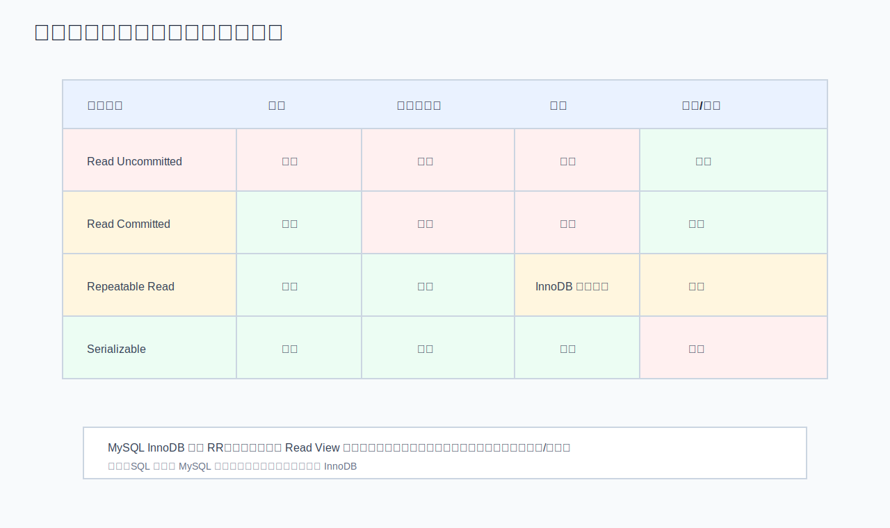

**并发异常**

| 异常 | 含义 | 示例 |
| --- | --- | --- |
| 脏读 | 读到别人未提交的数据 | T1 修改余额未提交，T2 读到了 |
| 不可重复读 | 同一事务两次读同一行结果不同 | T2 提交修改后，T1 再读变了 |
| 幻读 | 同一事务两次范围查询记录数量不同 | T2 插入新行后，T1 范围查询多了一行 |

**隔离级别**

| 隔离级别 | 脏读 | 不可重复读 | 幻读 | 说明 |
| --- | --- | --- | --- | --- |
| Read Uncommitted | 可能 | 可能 | 可能 | 基本不用 |
| Read Committed | 避免 | 可能 | 可能 | Oracle 默认，MySQL 可配置 |
| Repeatable Read | 避免 | 避免 | InnoDB 多数场景避免 | MySQL InnoDB 默认 |
| Serializable | 避免 | 避免 | 避免 | 并发最低 |

**RC 与 RR 的核心区别**

在 InnoDB 中：

- RC：每次快照读都会生成新的 Read View。
- RR：事务第一次快照读生成 Read View，后续复用。

所以 RR 下同一事务内多次普通查询看到的快照一致。

**快照读与当前读**

快照读：

```sql
select * from user where id = 1;
```

当前读：

```sql
select * from user where id = 1 for update;
update user set name = 'A' where id = 1;
delete from user where id = 1;
```

快照读主要依赖 MVCC；当前读读取最新已提交数据，并需要加锁。

**面试追问：RR 是否完全解决幻读**

要分情况：

- 普通快照读：RR 通过 Read View 保证同一事务内结果一致。
- 当前读：InnoDB 通过 Next-Key Lock 在很多范围更新场景下防止幻读。
- 如果应用混用快照读和当前读，仍可能看到“看起来像幻读”的现象。

更准确的表达：

> InnoDB 的 RR 不是简单等于 SQL 标准里的 RR。对于普通快照读，它通过 MVCC 保证可重复读；对于当前读和范围更新，它通过记录锁、间隙锁、临键锁减少幻读问题。

## 11. MVCC 与 Read View

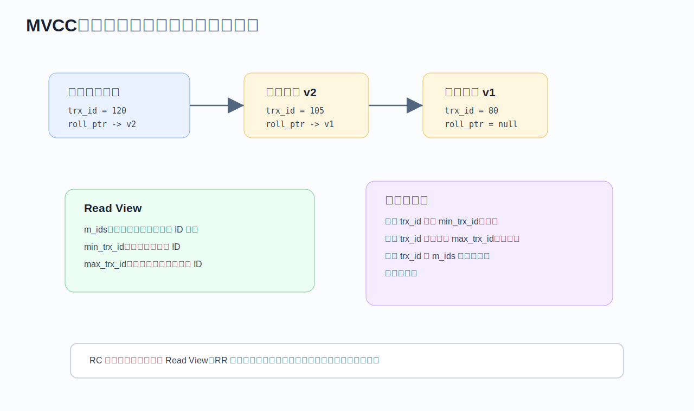

MVCC 是 Multi-Version Concurrency Control，多版本并发控制。它让读写在很多场景下不互相阻塞。

**核心组成**

- 隐藏字段 `trx_id`：记录最后修改该行的事务 ID。
- 隐藏字段 `roll_pointer`：指向 Undo Log 中的历史版本。
- Undo Log：保存旧版本。
- Read View：快照读的可见性规则。

**版本链**

每次更新记录，InnoDB 会：

1. 把旧值写入 Undo Log。
2. 当前记录的 `trx_id` 改为当前事务 ID。
3. `roll_pointer` 指向旧版本。

这样一行记录就形成版本链。

**Read View 重要字段**

- `m_ids`：生成 Read View 时活跃事务 ID 集合。
- `min_trx_id`：活跃事务中的最小 ID。
- `max_trx_id`：下一个将要分配的事务 ID。
- `creator_trx_id`：创建该 Read View 的事务 ID。

**可见性规则简化版**

对某个版本的 `trx_id`：

1. 如果是当前事务自己修改的，可见。
2. 如果小于 `min_trx_id`，说明创建快照前已提交，可见。
3. 如果大于等于 `max_trx_id`，说明创建快照后才出现，不可见。
4. 如果在 `m_ids` 中，说明创建快照时还未提交，不可见。
5. 否则可见。

**RC 与 RR**

```text
RC：每条 select 生成一个新 Read View
RR：事务内第一次 select 生成 Read View，之后复用
```

**MVCC 不能解决所有问题**

MVCC 主要服务于快照读。以下场景仍要考虑锁：

- `select ... for update`
- `update`
- `delete`
- 唯一约束冲突
- 范围更新
- 秒杀扣库存

## 12. InnoDB 锁体系

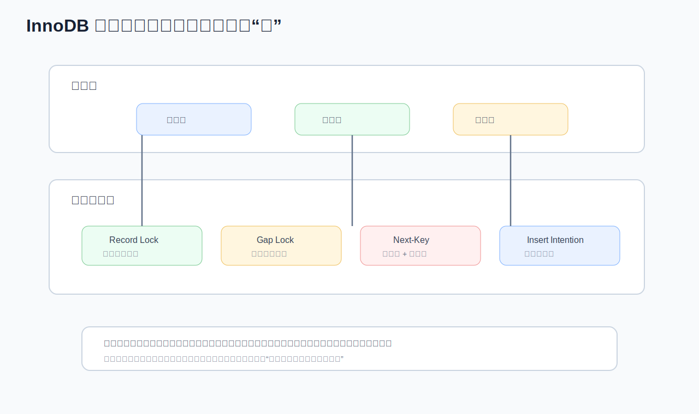

面试里问锁，不能只说“行锁、表锁”。InnoDB 的难点在于：锁通常加在索引上。

**锁分类**

按粒度：

- 表锁
- 行锁

按模式：

- 共享锁 S Lock
- 排他锁 X Lock
- 意向共享锁 IS
- 意向排他锁 IX

按范围：

- Record Lock：锁索引记录。
- Gap Lock：锁索引记录之间的间隙。
- Next-Key Lock：Record Lock + Gap Lock。
- Insert Intention Lock：插入意向锁。

**为什么说锁的是索引**

例如：

```sql
update user set status = 1 where id = 10;
```

如果 `id` 是主键，InnoDB 通过主键索引定位并锁住对应索引记录。

如果条件没有索引：

```sql
update user set status = 1 where phone = '13800000000';
```

如果 `phone` 没有索引，可能扫描大量记录并加锁，导致阻塞范围扩大。

**间隙锁**

间隙锁锁住的是两个索引值之间的范围，用来防止其他事务插入新记录造成幻读。

例如索引值为：

```text
10, 20, 30
```

范围查询：

```sql
select * from t where id between 10 and 20 for update;
```

可能锁住：

```text
(10,20] 以及相关间隙
```

具体范围与索引唯一性、查询条件、隔离级别、命中情况有关。

**唯一索引与普通索引**

等值查询命中唯一索引时，通常只需要记录锁：

```sql
select * from user where id = 10 for update;
```

普通索引因为可能有多个相同值，容易涉及间隙和范围：

```sql
select * from user where status = 1 for update;
```

**减少锁冲突的工程实践**

- 更新条件必须命中索引。
- 事务内 SQL 顺序固定。
- 小批量提交，避免大事务。
- 热点行拆分或异步化。
- 乐观锁用于低冲突场景。
- 秒杀库存使用原子条件更新。

库存扣减推荐：

```sql
update sku_stock
set stock = stock - 1
where sku_id = ?
  and stock > 0;
```

再根据影响行数判断是否成功。

## 13. 死锁排查与治理

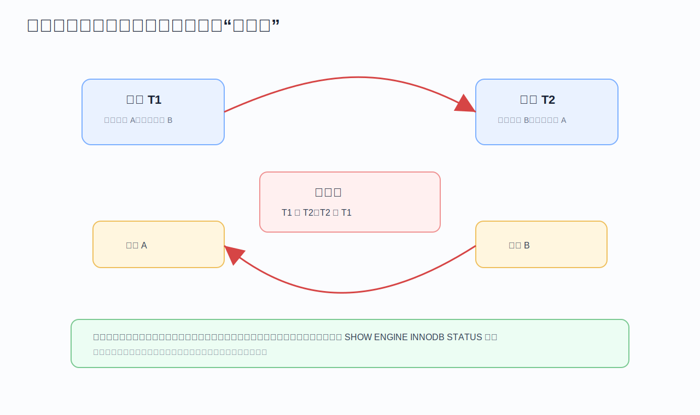

死锁是事务之间形成等待环。

典型场景：

```text
T1 锁住 A，等待 B
T2 锁住 B，等待 A
```

InnoDB 会检测死锁，主动回滚其中一个事务。

**常见死锁原因**

- 多个事务加锁顺序不一致。
- 范围更新锁范围过大。
- 没有索引导致扫描加锁。
- 批量更新顺序不固定。
- 唯一索引冲突。
- 事务太长，持锁时间过久。

**排查命令**

```sql
show engine innodb status\G
```

关注：

- LATEST DETECTED DEADLOCK
- 两个事务各自执行的 SQL
- 等待的锁
- 持有的锁
- 使用的索引

**治理手段**

1. 统一加锁顺序，例如都按 ID 从小到大更新。
2. 保证更新条件走索引。
3. 缩短事务时间。
4. 降低批量大小。
5. 对死锁异常做重试。
6. 热点数据改为队列化或分段。

**Java 重试建议**

死锁是可预期的并发异常，不应该直接让用户失败。可以对数据库死锁错误码做有限次数重试：

```java
for (int i = 0; i < 3; i++) {
    try {
        doInTransaction();
        return;
    } catch (DeadlockLoserDataAccessException e) {
        sleepBackoff(i);
    }
}
throw new BizException("系统繁忙，请稍后重试");
```

重试必须保证业务操作幂等。

## 14. Redo、Undo、Binlog 与两阶段提交

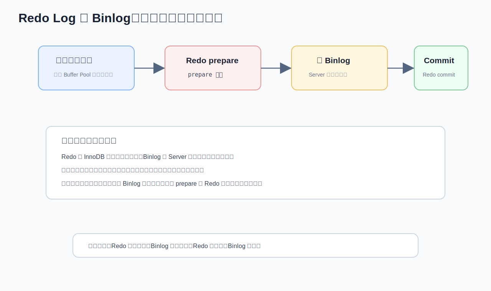

数据库日志是事务、恢复、复制的核心。

**Undo Log**

用途：

- 回滚事务。
- 构建 MVCC 历史版本。

特点：

- 逻辑日志。
- 记录修改前的旧值。
- 事务回滚时反向恢复。

**Redo Log**

用途：

- 保证持久性。
- 崩溃恢复。

特点：

- InnoDB 引擎层日志。
- 物理日志，记录页的修改。
- 循环写。
- 顺序写性能高。

**Binlog**

用途：

- 主从复制。
- 数据恢复。
- 审计和订阅。

特点：

- Server 层日志。
- 逻辑日志。
- 追加写。
- 可记录 Statement、Row、Mixed 格式。

**Redo 与 Binlog 区别**

| 对比 | Redo Log | Binlog |
| --- | --- | --- |
| 层级 | InnoDB | MySQL Server |
| 目的 | 崩溃恢复 | 复制、归档、恢复 |
| 内容 | 物理页修改 | 逻辑变更 |
| 写入方式 | 循环写 | 追加写 |
| 事务持久性 | 关键支撑 | 不是主要支撑 |

**两阶段提交**

事务提交流程简化：

1. 写 Redo Log，状态为 prepare。
2. 写 Binlog。
3. 提交 Redo Log，状态为 commit。

这样可以保证崩溃恢复时 Redo 和 Binlog 一致。

**崩溃场景**

- Redo prepare，Binlog 未写完：恢复时回滚。
- Redo prepare，Binlog 写完：恢复时提交。
- Redo commit：事务已提交。

**面试表达**

> Redo 保证 InnoDB 崩溃恢复，Binlog 保证复制和归档。为了避免一个事务在 Redo 中提交但 Binlog 缺失，MySQL 使用两阶段提交：先 Redo prepare，再写 Binlog，最后 Redo commit。恢复时根据 Binlog 是否完整判断事务提交还是回滚。

## 15. 主从复制与读写分离

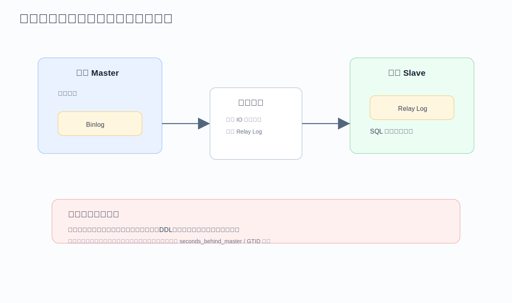

主从复制基本流程：

1. 主库提交事务并写 Binlog。
2. 从库 IO 线程拉取主库 Binlog。
3. 从库写入 Relay Log。
4. 从库 SQL 线程重放 Relay Log。

**复制模式**

- 异步复制：主库提交不等待从库，性能好但可能丢数据。
- 半同步复制：至少一个从库确认收到日志后主库再返回，可靠性更高但延迟增加。
- 组复制 / MGR：更强一致性和高可用能力，但复杂度更高。

**主从延迟原因**

- 主库写入太快，从库重放跟不上。
- 大事务导致从库长时间执行。
- 从库硬件资源不足。
- DDL 阻塞。
- 网络延迟。
- 从库并行复制配置不合理。

**读写分离问题**

读写分离不是简单把查询都打到从库。最大问题是读己之写。

例如：

```text
用户刚提交订单 -> 立刻查询订单详情
```

如果查询路由到延迟从库，可能读不到刚写入的数据。

**解决策略**

- 写后短时间读主库。
- 强一致接口读主库。
- 根据 GTID 或位点判断从库是否追上。
- 对用户维度做会话级主库路由。
- 接受最终一致的场景读从库。

**面试表达**

> 主从复制可以扩展读能力，但会引入复制延迟。读写分离要按业务一致性分级：强一致读主库，允许延迟的读从库，读己之写可以短时间走主库或基于位点判断从库是否追平。

## 16. 分库分表

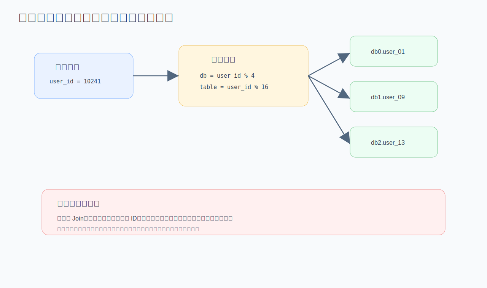

分库分表用于单表或单库容量、写入、索引维护达到瓶颈后的扩展。

**先判断是否真的需要**

在分片前，应该先尝试：

- SQL 和索引优化。
- 读写分离。
- 冷热数据分离。
- 历史数据归档。
- 垂直拆分大字段。
- 缓存热点读。
- 硬件和参数优化。

分库分表会显著增加系统复杂度，不应该过早使用。

**垂直拆分**

按业务模块拆：

```text
用户库、订单库、支付库、库存库
```

优点是业务边界清晰。缺点是跨库事务和跨库查询复杂。

**水平拆分**

按分片键拆同一张表：

```text
order_00, order_01, ..., order_15
```

常见分片键：

- `user_id`
- `order_id`
- `tenant_id`
- `shop_id`

**分片键选择**

好的分片键应该：

- 查询频率高。
- 数据分布均匀。
- 能减少跨分片查询。
- 稳定不变。
- 与业务访问路径一致。

**分片后的问题**

| 问题 | 说明 | 方案 |
| --- | --- | --- |
| 全局 ID | 自增 ID 不再全局唯一 | 雪花 ID、号段模式 |
| 跨分片 Join | 数据分散 | 应用层组装、冗余字段 |
| 分布式事务 | 本地事务失效 | TCC、Saga、最终一致 |
| 分页排序 | 多分片 merge 成本高 | 避免深分页、异步报表 |
| 扩容迁移 | 取模扩容困难 | 一致性哈希、双写迁移 |
| 热点分片 | 某个分片压力过大 | 分片键优化、热点拆散 |

**路由算法**

取模：

```text
db_index = user_id % db_count
table_index = user_id % table_count
```

优点简单，缺点是扩容迁移成本高。

范围：

```text
0 - 1000万 -> db0
1000万 - 2000万 -> db1
```

优点便于归档，缺点容易热点。

**面试表达**

> 我会把分库分表作为后置手段。先确认瓶颈是容量、写入、索引维护还是单库连接数。如果必须拆，核心是选好分片键，让大部分查询能路由到单分片，同时提前设计全局 ID、跨分片查询、扩容迁移和分布式一致性。

## 17. 缓存与数据库一致性

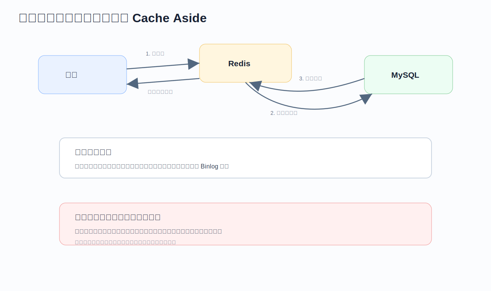

Java 后端面试非常喜欢问 Redis 和 MySQL 一致性。

**Cache Aside 读流程**

1. 先读缓存。
2. 缓存命中，直接返回。
3. 缓存未命中，读数据库。
4. 把结果写入缓存。
5. 返回结果。

**更新流程推荐**

```text
先更新数据库，再删除缓存
```

为什么不是更新缓存？

- 缓存可能有复杂结构，更新容易不完整。
- 并发更新顺序可能错乱。
- 删除缓存让下一次读取回源，更简单。

**为什么不是先删缓存再更新数据库**

可能出现：

```text
T1 删除缓存
T2 查询缓存未命中
T2 读数据库旧值
T2 回填旧值到缓存
T1 更新数据库新值
```

结果缓存里长期是旧值。

**先更新数据库再删缓存的问题**

也不是绝对无风险：

```text
T1 更新数据库成功
T1 删除缓存失败
```

缓存仍是旧值。

解决手段：

- 缓存设置过期时间。
- 删除失败重试。
- MQ 异步补偿。
- 订阅 Binlog 删除缓存。
- 对强一致场景不走缓存或加版本校验。

**延迟双删**

```text
删除缓存 -> 更新数据库 -> 延迟一段时间再删除缓存
```

它能降低并发读旧值回填的概率，但不是银弹。延迟时间难以精确设置，仍要依赖过期时间和补偿机制。

**缓存击穿、穿透、雪崩**

| 问题 | 含义 | 方案 |
| --- | --- | --- |
| 击穿 | 热点 key 过期，大量请求打到 DB | 互斥锁、逻辑过期、热点预热 |
| 穿透 | 查询不存在数据，缓存没有 | 缓存空值、布隆过滤器、参数校验 |
| 雪崩 | 大量 key 同时过期或 Redis 故障 | 过期时间随机化、多级缓存、限流降级 |

**面试表达**

> 常规缓存我会采用 Cache Aside：读缓存，未命中查库再回填；更新时先更新数据库再删除缓存。因为删除缓存失败仍可能不一致，所以要加过期时间、重试、MQ 或 Binlog 补偿。强一致场景不能只靠缓存策略，要么读主库，要么加版本校验或直接绕过缓存。

## 18. 表设计与数据建模

表设计是四年 Java 工程师很容易被低估的能力。好的表设计能减少很多后期性能问题。

**字段类型**

- 能用整数就不用字符串。
- 金额使用 `decimal`，不要用 `float/double`。
- 时间使用 `datetime` 或 `timestamp`，统一时区策略。
- 状态字段用 `tinyint/smallint`。
- 大文本、大 JSON、大 blob 尽量拆表。
- 字段尽量 `not null`，给合理默认值。

**为什么建议 not null**

- 语义清晰。
- 索引统计更简单。
- 避免三值逻辑导致 SQL 判断复杂。
- 减少应用层 NPE 和特殊分支。

**范式与反范式**

范式减少冗余，反范式提升查询性能。

订单场景里经常冗余：

- 下单时的商品名称。
- 下单时的商品价格。
- 收货人信息。
- 店铺名称。

原因是这些信息在订单历史里需要保持当时状态，不应该随着商品或用户资料变化而变化。

**索引设计检查清单**

- 每张表有主键。
- 高频查询有合适联合索引。
- 唯一业务约束落到唯一索引。
- 避免重复索引，例如 `(a)` 和 `(a,b)` 同时存在要评估。
- 避免低选择性字段单独建索引。
- 索引列尽量短。
- 大字段不进入索引。
- 关注排序和分页。

**唯一约束与幂等**

业务幂等最好落到数据库唯一约束。

例如支付回调：

```sql
create unique index uk_payment_no on payment_record(payment_no);
```

应用层先查再插不可靠，高并发下仍可能重复。唯一索引是最后防线。

**逻辑删除**

逻辑删除常用字段：

```text
deleted tinyint not null default 0
deleted_at datetime null
```

注意：

- 所有查询都要带 `deleted = 0`。
- 唯一索引要考虑逻辑删除。
- 数据量大后需要归档，不要无限堆在主表。

**冷热数据**

订单、日志、消息这类表会持续增长。设计时要考虑：

- 近 3-6 个月热数据留在线上主表。
- 历史数据归档到历史表、ES、数仓或对象存储。
- 查询入口区分实时查询和历史查询。
- 归档任务限速，避免影响线上。

## 19. Java 工程里的数据库能力

**连接池**

连接池不是越大越好。连接太多会导致：

- 数据库线程上下文切换增加。
- 锁竞争更严重。
- 内存消耗增加。
- 下游数据库被打爆。

HikariCP 常关注：

- `maximumPoolSize`
- `minimumIdle`
- `connectionTimeout`
- `idleTimeout`
- `maxLifetime`
- `leakDetectionThreshold`

排查接口慢时，要区分：

- 获取连接慢。
- SQL 执行慢。
- 结果集映射慢。
- 事务等待锁。
- 网络传输慢。

**Spring 事务传播**

常见传播行为：

| 传播行为 | 含义 |
| --- | --- |
| REQUIRED | 有事务就加入，没有就新建 |
| REQUIRES_NEW | 挂起当前事务，新建事务 |
| NESTED | 嵌套事务，依赖保存点 |
| SUPPORTS | 有事务就加入，没有也可以执行 |
| MANDATORY | 必须存在事务 |

常见问题：

```java
@Service
public class OrderService {
    public void createOrder() {
        saveOrder(); // 同类内部调用，事务可能不生效
    }

    @Transactional
    public void saveOrder() {
        // ...
    }
}
```

原因是 Spring 事务基于代理，同类内部调用没有经过代理。

**MyBatis 常见性能点**

- 批量插入不要循环单条插入。
- 大结果集要分页或流式处理。
- 动态 SQL 防止条件缺失导致全表扫描。
- `foreach` 的 `in` 列表不能无限大。
- 返回对象字段太多会增加映射成本。
- N+1 查询要改 Join、批量查询或缓存。

**批量写入**

```sql
insert into user_tag(user_id, tag_id)
values
(?, ?),
(?, ?),
(?, ?);
```

比循环单条插入更好，但单批也不能无限大。要结合 SQL 包大小、锁时间、Binlog 大小、主从延迟控制批次。

**乐观锁**

适合冲突不高的场景：

```sql
update product
set stock = stock - 1,
    version = version + 1
where id = ?
  and version = ?
  and stock > 0;
```

根据影响行数判断成功。失败可重试，但高冲突下重试成本很高。

**悲观锁**

适合冲突高、必须串行的场景：

```sql
select *
from account
where id = ?
for update;
```

注意事务要短，条件要命中索引。

**Outbox 模式**

本地事务内同时写业务表和消息表：

```text
begin
  update order set status = 'PAID'
  insert into outbox(event_type, payload, status)
commit
```

后台任务扫描 outbox 发 MQ，成功后标记已发送。它能避免“数据库提交成功但 MQ 发送失败”的不一致。

## 20. 高频面试题速答

**1. 为什么 InnoDB 使用 B+Tree？**

因为 B+Tree 扇出高、树高低、磁盘 IO 少，叶子节点有序链表支持范围查询和排序。相比 Hash，它不只适合等值查询，也适合数据库常见的范围、排序、分页场景。

**2. 什么是回表？怎么减少？**

二级索引叶子节点只保存索引列和主键，查询完整行时要回聚簇索引查一次，这叫回表。减少方式是覆盖索引、减少 select 字段、优化联合索引、避免扫描大量二级索引记录。

**3. 联合索引为什么有最左前缀？**

因为联合索引按字段顺序排序，先按第一列，再按第二列。只有左侧字段确定后，右侧字段的有序性才有意义。范围条件后面的列通常无法继续用于精确定位。

**4. RR 和 RC 有什么区别？**

InnoDB 中 RC 每次快照读生成新的 Read View，RR 在事务第一次快照读生成 Read View 后复用。因此 RR 能保证同一事务内普通查询结果一致。

**5. MVCC 解决什么问题？**

MVCC 通过 Undo Log 版本链和 Read View，让快照读可以读取符合可见性规则的历史版本，从而减少读写阻塞，提高并发。

**6. 当前读和快照读区别？**

普通 select 是快照读，读的是版本链中对当前事务可见的版本。`select for update`、`update`、`delete` 是当前读，读取最新已提交数据并加锁。

**7. 为什么 update 没索引很危险？**

InnoDB 锁加在索引上。没有索引时需要扫描大量记录，可能锁住大量行，导致阻塞、死锁和性能抖动。

**8. 死锁怎么排查？**

用 `show engine innodb status\G` 查看最近死锁，分析两个事务执行 SQL、等待锁、持有锁和使用索引。治理上统一加锁顺序、命中索引、缩短事务、批量拆小、失败重试。

**9. Redo 和 Binlog 区别？**

Redo 是 InnoDB 的物理日志，循环写，主要用于崩溃恢复和持久性。Binlog 是 Server 层逻辑日志，追加写，主要用于复制、归档和恢复。

**10. 为什么需要两阶段提交？**

为了保证 Redo 和 Binlog 一致。提交时先写 Redo prepare，再写 Binlog，最后 Redo commit。崩溃恢复时可根据 Binlog 是否完整决定提交或回滚。

**11. 慢 SQL 怎么优化？**

先定位 SQL，再看 EXPLAIN 的 type、key、rows、Extra。判断是否全表扫描、索引失效、回表多、排序临时表、Join 问题或锁等待。再做索引、SQL 改写、分页优化、拆查询、归档或缓存，并验证效果。

**12. 主从延迟怎么处理？**

强一致读走主库；读己之写短时间走主库；允许延迟的查询走从库；也可基于 GTID/位点判断从库是否追上。根因上要减少大事务、优化从库资源和并行复制。

**13. 缓存和数据库怎么保持一致？**

常用 Cache Aside：读缓存，未命中读库回填；更新时先更新数据库再删除缓存。删除失败要重试、MQ 补偿或订阅 Binlog，同时设置过期时间。强一致场景不要只靠缓存。

**14. 分库分表会带来什么问题？**

全局 ID、跨分片 Join、跨分片分页排序、分布式事务、扩容迁移、热点分片、统计报表复杂化。分片前应先确认单库单表确实成为瓶颈。

**15. Spring 事务为什么会失效？**

常见原因包括同类内部调用、非 public 方法、异常被捕获、默认不回滚受检异常、异步线程、事务方法未被 Spring 管理等。

## 21. 面试前 7 天冲刺计划

**第 1 天：索引**

- B+Tree、聚簇索引、二级索引、回表、覆盖索引。
- 手写 5 个联合索引设计题。
- 用 EXPLAIN 判断索引用到了几列。

**第 2 天：SQL 优化**

- 慢日志、EXPLAIN 字段。
- 函数、隐式转换、like、深分页、Join。
- 准备一个你真实优化过的 SQL 案例。

**第 3 天：事务与 MVCC**

- ACID、隔离级别、RC/RR。
- Read View 可见性。
- 快照读和当前读。

**第 4 天：锁与死锁**

- Record Lock、Gap Lock、Next-Key Lock。
- 唯一索引和普通索引锁范围区别。
- 死锁排查命令和治理方案。

**第 5 天：日志与复制**

- Undo、Redo、Binlog。
- 两阶段提交。
- 主从复制、读写分离、主从延迟。

**第 6 天：架构扩展**

- 缓存一致性。
- 分库分表。
- 分布式事务和最终一致。
- Outbox、Saga、TCC 的适用边界。

**第 7 天：项目表达**

准备三个故事：

1. 一个慢 SQL 优化案例。
2. 一个并发一致性或事务问题案例。
3. 一个数据量增长后的表设计或架构治理案例。

每个故事按这个结构讲：

```text
背景 -> 问题指标 -> 排查过程 -> 根因 -> 方案 -> 验证结果 -> 复盘
```

## 附录：面试官喜欢听到的关键词

- 扫描行数、回表次数、覆盖索引、索引选择性。
- Buffer Pool 命中率、脏页、Checkpoint、Redo 顺序写。
- Read View、版本链、Undo Log、快照读、当前读。
- Record Lock、Gap Lock、Next-Key Lock、锁范围。
- 两阶段提交、Redo prepare、Binlog 完整性。
- 主从延迟、读己之写、强一致读主库。
- Cache Aside、删除缓存失败补偿、Binlog 订阅。
- 全局 ID、分片键、跨分片查询、扩容迁移。

## 附录：一句话总纲

数据库面试的核心不是“我知道某个概念”，而是你能把一个线上问题沿着链路讲清楚：

```text
业务 SQL -> 执行计划 -> 索引结构 -> InnoDB 页和日志 -> 事务锁 -> Java 事务边界 -> 分布式一致性
```

能讲到这条链路，四年 Java 工程师的数据库能力就会显得很扎实。
